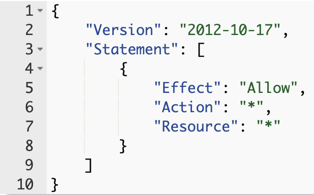

## AWS 01 - Intro to Cloud and AWS

---

### AWS sessions list

- AWS 01 AWS + Cloud Intro ⬅ _1.5hrs_
- AWS 02 AWS CLI Setup _1.5hrs_
- AWS 03 S3 Storage (Console) _1.5hrs_
- AWS 04 CloudFormation Intro + S3 Storage (IaC) _1.5hrs_
- AWS 05 Lambda Intro _1.5hrs_
- AWS 06 Lambda (IaC) _1.5hrs_
- AWS 07 Redshift (IaC) _1.5hrs_
- AWS 08 EC2 (IaC) + Grafana setup _1.5hrs_

Note the "you are here" arrow "⬅" which we will update through the related sessions.

Notes:
Learners will build a small etl project with AWS over the 8 sessions which will support their team projects as well.

---

### Overview

- What is AWS?
- AWS Console
- IAM (Identity and Access Management)

---

### Learning Objectives

- Define the role AWS plays in modern software development
- Identify the different use cases for the AWS console
- Understand how to access the AWS Console for the course
- Understand the need for regions and availability zones
- Understand the user and access management capabilities of IAM

---

### What is the cloud?

- "The cloud" refers to servers that are accessed over the Internet, and the software and databases that run on those servers
- Cloud servers are located in data centers all over the world
- By using cloud computing, users and companies do not have to manage physical servers themselves or run software applications on their own machines

Notes:
An example of software that runs on the cloud is OneDrive - cloud based file storage software provided by Microsoft. When you access OneDrive through a web browser or app, you're interacting with software hosted on Microsoft’s servers—not something installed locally on your machine. _Information about files in OneDrive are stored in cloud databases maintained by Azure (Microsoft’s cloud platform)._

Cloud computing - Cloud computing is the delivery of computing services such as servers, storage, databases, networking, software etc over the internet (the cloud) to offer flexible resources and save costs on resources. Rather than users owning and maintaining physical data centers and servers, users can rent compute services as they need them from a cloud service provider.

Ask the learners for ideas why running applications on their own machines is a bad idea.

E.g.:

- they turn it off / runs out of battery
- runs out of storage / processing capacity
- many concurrent connections

---

### AWS

---

### What is AWS?

- **Amazon Web Services** is a cloud computing platform
- Offerings encompass computing power, database storage, content delivery, logging and monitoring - if you need to do a thing, there's an AWS service for it
- At last count, there were over 200 AWS services to choose from...

Note:
Terms like "Service" and "Product" are pretty synonymous here

We'll go into specific services as the course progresses but to name a few popular AWS services:

- Compute Power (EC2)
- Database Storage (Redshift)
- Monitoring (CloudWatch)

---

### What is AWS?

One way of thinking of any Cloud provider is as a set of services we can use in our projects;

Notes:
"set of services" are compute services such as servers, storage, networks, etc.

---

### Regions

- A physical location somewhere in the world where AWS data centers are clustered
- Each group of logical data centres within a Region is called an **Availability Zone**
- Multiple geographic Regions, including North America, South America, Europe, China, Asia Pacific, South Africa, and the Middle East
- Regions have a code name, such as `eu-west-1` which represents the Irish region, or `eu-west-2`, which is London

Notes:
Availability Zones are expanded on following slides.

Another example is `eu-west-2` which is based in London.

---

### Regions

Are located all over the world:

---

### Availability Zones

- Are comprised of one (or more) discrete data center(s) in an AWS _region_
- AZs in a _region_ are physically separate, but within 100km of each other - giving us _high-bandwidth_, _low-latency_ networking
- Give customers the ability to operate production applications and databases that are more highly available, fault tolerant, and scalable than would be possible from a single data center
- If an application is partitioned across AZ's, companies are better isolated and protected from issues such as power outages, lightning strikes, tornadoes, earthquakes, and more

Notes:
Data centres are "just" enormous buildings that operate a vast amount of computer machinery, with its own cooling and power setup.

Currently 33 AWS regions, containing 105 AZs.

London (eu-west-2) has 3 AZs.

This is a useful tool to visualise it:
https://aws.amazon.com/about-aws/global-infrastructure

Example of outage: London 2022 heatwave caused data centres to power down to protect servers - https://www.protocol.com/bulletins/google-oracle-cloud-uk-heat

---

### Availability Zones

This is a useful page to visualise AZs: <https://aws.amazon.com/about-aws/global-infrastructure>.

---

### Emoji Check:

Do you feel you understand Regions and Availability Zones? Say so if not!

1. 😢 Haven't a clue, please help!
2. 🙁 I'm starting to get it but need to go over some of it please
3. 😐 Ok. With a bit of help and practice, yes
4. 🙂 Yes, with team collaboration could try it
5. 😀 Yes, enough to start working on it collaboratively

Notes:
The phrasing is such that all answers invite collaborative effort, none require solo knowledge.

The 1-5 are looking at (a) understanding of content and (b) readiness to practice the thing being covered, so:

1. 😢 Haven't a clue what's being discussed, so I certainly can't start practising it (play MC Hammer song)
2. 🙁 I'm starting to get it but need more clarity before I'm ready to begin practising it with others
3. 😐 I understand enough to begin practising it with others in a really basic way
4. 🙂 I understand a majority of what's being discussed, and I feel ready to practice this with others and begin to deepen the practice
5. 😀 I understand all (or at the majority) of what's being discussed, and I feel ready to practice this in depth with others and explore more advanced areas of the content

---

### The AWS Management Console

<!-- .element: class="centered" height="350px" -->

---

### The AWS Management Console

- The standard web-based graphical interface to AWS
- AWS make changes to it regularly, so don't be surprised if things move around in the UI every few months!
- The home page has a list of your commonly used services, account summary info, and announcements
- Always check which _region_ you are looking at!

Notes:
Worth mentioning the region selection on the page so that learners can confirm they're on the right one for the course.

---

### The AWS Management Console

- The full list of services can be accessed from the tab at the top
<!-- .element: class="centered" -->
- There are many(!) services, and each of them have been built by different teams (or even companies) around the world
- As such, many of the services have a different look and feel when using them

---

<!-- .slide: data-only="schooloftech" -->
### AWS Account Access

- Browse to the AWS console login page
    - The instructors will give you the URL
- This should log you with role `student-access-role`

Once you are logged in:

- It helps to make a bookmark for the full login URL. You will have to make a bookmark manually as of course the long URL we enter is immediately forwarded to the root console url!

Notes:
    Share the console login link with the learners - the App Id and Tennant ID are considered sensitive, so should not be shared outside the sessions
    Instructors will get a role selection page.

---

<!-- .slide: data-only="generation jlr sainsburys" -->
### Exercise - AWS Account Access

- Open your email client and find the email from no-reply@login.awsapps.com
- Click `Accept Invitation`
- Input a **strong** password which matches the ruleset (use a password manager if you can)
- You will then need to register an MFA device with your account. Select the **Authenticator app** option and hit next
- Follow the steps to complete the MFA sign-up stage and click `Assign MFA`

---

<!-- .slide: data-only="generation jlr sainsburys" -->
### Exercise - AWS Account Access

- You should get a message saying `Authenticator app registered`. Click `Done`
- Once completed, you will be redirected to a new screen. Click on the `AWS Account (1)` box so that it expands, then click on the wider box underneath.

---
<!-- .slide: data-only="generation jlr sainsburys" -->
### Exercise - AWS Account Access

 <!-- .element: class="centered" -->

- Click on `Management console` and you will be successfully signed into the AWS console

---

### Emoji Check:

Are we all logged in, and can you do it again tomorrow? Say so if not!

1. 😢 Haven't a clue, please help!
2. 🙁 I'm starting to get it but need to go over some of it please
3. 😐 Ok. With a bit of help and practice, yes
4. 🙂 Yes, with team collaboration could try it
5. 😀 Yes, enough to start working on it collaboratively

Notes:
The phrasing is such that all answers invite collaborative effort, none require solo knowledge.

The 1-5 are looking at (a) understanding of content and (b) readiness to practice the thing being covered, so:

1. 😢 Haven't a clue what's being discussed, so I certainly can't start practising it (play MC Hammer song)
2. 🙁 I'm starting to get it but need more clarity before I'm ready to begin practising it with others
3. 😐 I understand enough to begin practising it with others in a really basic way
4. 🙂 I understand a majority of what's being discussed, and I feel ready to practice this with others and begin to deepen the practice
5. 😀 I understand all (or at the majority) of what's being discussed, and I feel ready to practice this in depth with others and explore more advanced areas of the content

---

### AWS Services

Services tend to be grouped under one of several categories, including:

- File storage (e.g. `S3`)
- Compute (e.g. `EC2`, `Lambda`)
- Security & identity (e.g. `IAM`)
- Databases (e.g. `RDS`, the `Relational Database Service`)
- Data Warehousing (e.g. `Redshift`)

For now we'll focus on learning about IAM, but will cover the others in more detail later in the course.

Notes:
There's also Networking (e.g. `VPC` which provides virtual networks for compute services to communicate & `Route53` which manages and assigns web domains) although not focused on in this course it's still worth a mention.

---

### IAM

<!-- .element: class="centered" height="350px" -->

---

### IAM

- **Identity and Access Management**
- Manage _users_ and their level of access to the CLI or console
- Assign _roles_ to _users_ and _services_
- Manage _permissions_ for each _role_
- Manage authentication for users or applications accessing AWS
- Free to use - you can create as many roles as you wish

Notes:
Typically the first AWS service covered in AWS courses as its function is to control user & application access to AWS cloud resources - very important !

---

### IAM Features

- Granular permission - user or app can access service X but not service Y
- Identity Federation (login with Facebook, Google, Microsoft Active Directory, etc.)
- Controlling and enforcing MFA
- Password rotation policy
- Integrates with many different AWS services

---

### IAM Key Terms

- Users
- Groups
- Roles
- Policies

We will dive into what each means.

---

### IAM - Users

- End users such as people, employees etc.
- Accounts with a username and password
- Can define level of access to AWS services
- Manage the permissions of what the user can perform
- Manage their security credentials (MFA etc.)
- You are either the account owner (root) or an IAM user.

Notes:
Example: Each learner is an IAM user.

---

### IAM - Groups

- A collection of users, where you can define permissions for all of them in an easier way
- A group can contain many users, and a user can belong to multiple groups
- Groups can't be nested; they can contain only users, not other groups
- There's no default group that automatically includes all users in the AWS account

Notes:
Example: All learners will be in a group called Learners.

---

### IAM - Roles

- Similar to an IAM user, except a role is intended to be assumed by anyone or any service that needs it
- Provides temporary security credentials for the length of the session, as opposed to a username and password
- Specific permissions on AWS services and resources
- Policies are attached to roles to grant them access/privilege

Notes:
Example: Each learner assumes a role with their IAM user that gives them wider access to AWS services as opposed to the user itself.

---

### IAM - Policies

- You manage access in AWS by creating policies and attaching them to IAM identities (users, groups, roles) or AWS resources
- A policy is an object that, when associated with an identity/resource, defines their permissions
- These permissions determine if a request is allowed or denied
- Most policies are stored as JSON

Notes:
Example: The role/group the learners are in have policies associated to give them a certain amount of access to services.

Sample IAM policy document with policy giving the entity it is attached to access to perform all actions on all resources. Policies can be scoped to specific actions on specific resources. Policies can either be created by customers or come from AWS provided sample policy documents.

---

### IAM - Best Practices

- Create **individual** users
- Manage permissions with groups (assign users into groups)
    - e.g. "Admin", "Customers"
- Create one IAM role for each different action users need to perform
    - e.g. "run-stock-report-role", "update-basket-items-role"
- Grant **least privilege** with permissions
- Configure a **strong** password policy
- Enable (enforce) MFA for all users

---

### IAM - Best Practices

- Setup audits with AWS CloudTrail
- CloudTrail logs for exactly who did what, when, and from where
- Use IAM roles to allow users and services to share access to other services
- Rotate security credentials **regularly**
- Restrict privileged access further with conditions (for instance, only allowing a range of IPs that a request must come from)
- Reduce use of root (mostly used for billing and locking down account securely)

Notes:
An example of a 'condition' you could impose would be, for example, allowing a user to use a certain service but only Mon - Fri.

Demo the IAM dashboard.

---

### Emoji Check:

Do you feel you understand the basics of IAM? Say so if not!

1. 😢 Haven't a clue, please help!
2. 🙁 I'm starting to get it but need to go over some of it please
3. 😐 Ok. With a bit of help and practice, yes
4. 🙂 Yes, with team collaboration could try it
5. 😀 Yes, enough to start working on it collaboratively

Notes:
The phrasing is such that all answers invite collaborative effort, none require solo knowledge.

The 1-5 are looking at (a) understanding of content and (b) readiness to practice the thing being covered, so:

1. 😢 Haven't a clue what's being discussed, so I certainly can't start practising it (play MC Hammer song)
2. 🙁 I'm starting to get it but need more clarity before I'm ready to begin practising it with others
3. 😐 I understand enough to begin practising it with others in a really basic way
4. 🙂 I understand a majority of what's being discussed, and I feel ready to practice this with others and begin to deepen the practice
5. 😀 I understand all (or at the majority) of what's being discussed, and I feel ready to practice this in depth with others and explore more advanced areas of the content

---

### Quiz Time! 🤓

---

**What is an AWS Region?**

1. An AWS Infrastructure offering that's optimised for mobile edge computing applications.
1. A physical location somewhere in the world where AWS data centers are clustered.
1. A type of AWS infrastructure deployment that places AWS compute, storage, database, and other select services close to large population, industry, and IT centers.
1. One (or more) discrete data center(s) in an AWS region.

 Answer: `2`<!-- .element: class="fragment" -->

---

**What are the four main areas of AWS IAM?**

1. Groups, Permissions, Roles, Users
1. Groups, Policies. Roles, People
1. Pools, Policies, Roles, Users
1. Groups, Policies, Roles, Users
1. Groups, Policies, Requirements, Users

 Answer: `4`<!-- .element: class="fragment" -->

---

**What are policies used for in AWS IAM?**

1. An object that, when associated with an identity/resource, defines their permissions.
1. An object that provides temporary security credentials for the length of the session, as opposed to a username and password.
1. A document that is intended to be assumed by anyone or any service that needs it.
1. A document that defines a user permissions for one specific AWS service.

 Answer: `1`<!-- .element: class="fragment" -->

<!-- ---

### Terms and Definitions - recap

TODO -->

---

### Overview - recap

- What is AWS?
- AWS Console
- IAM (Identity and Access Management)

---

### Learning Objectives - recap

- Define the role AWS plays in modern software development
- Identify the different use cases for the AWS console
- Understand how to access the AWS Console for the course
- Understand the need for regions and availability zones
- Understand the user and access management capabilities of IAM

---

### Emoji Check:

On a high level, do you think you understand the main concepts of this session? Say so if not!

1. 😢 Haven't a clue, please help!
2. 🙁 I'm starting to get it but need to go over some of it please
3. 😐 Ok. With a bit of help and practice, yes
4. 🙂 Yes, with team collaboration could try it
5. 😀 Yes, enough to start working on it collaboratively

Notes:
The phrasing is such that all answers invite collaborative effort, none require solo knowledge.

The 1-5 are looking at (a) understanding of content and (b) readiness to practice the thing being covered, so:

1. 😢 Haven't a clue what's being discussed, so I certainly can't start practising it (play MC Hammer song)
2. 🙁 I'm starting to get it but need more clarity before I'm ready to begin practising it with others
3. 😐 I understand enough to begin practising it with others in a really basic way
4. 🙂 I understand a majority of what's being discussed, and I feel ready to practice this with others and begin to deepen the practice
5. 😀 I understand all (or at the majority) of what's being discussed, and I feel ready to practice this in depth with others and explore more advanced areas of the content
