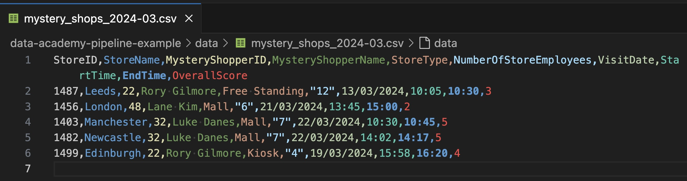
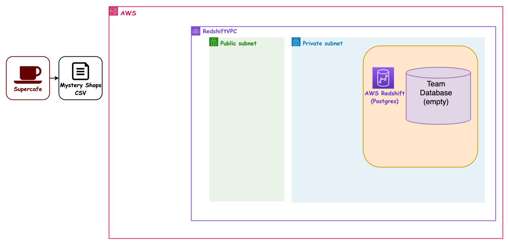
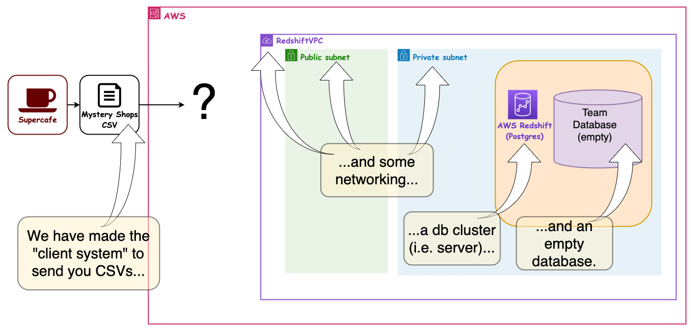
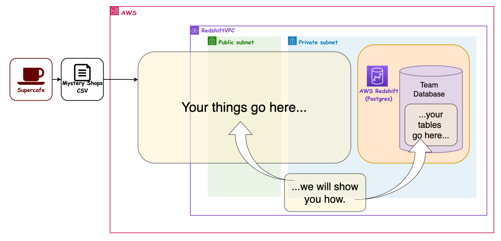
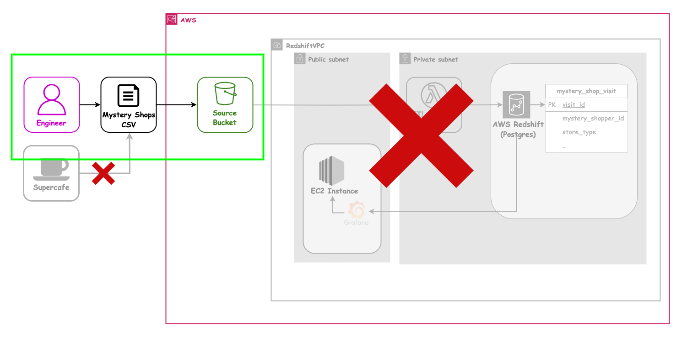
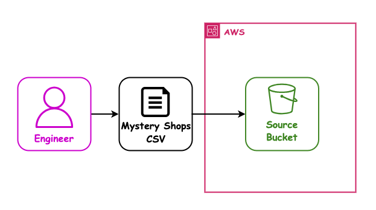

## AWS 03 - Storage in S3

---

### AWS sessions list

- AWS 01 AWS + Cloud Intro ✅ _1.5hrs_
- AWS 02 AWS CLI Setup ✅ _1.5hrs_
- AWS 03 S3 Storage (Console) ⬅ _1.5hrs_
- AWS 04 CloudFormation Intro + S3 Storage (IaC) _1.5hrs_
- AWS 05 Lambda Intro _1.5hrs_
- AWS 06 Lambda (IaC) _1.5hrs_
- AWS 07 Redshift (IaC) _1.5hrs_
- AWS 08 EC2 (IaC) + Grafana setup _1.5hrs_

---

### Overview

- S3 as a file storage solution
- S3 in the AWS Management Console
- S3 Durability
- Hosting static content

---

### Learning Objectives

- Become aware of the features S3 offers as a cloud service
- Be able to configure S3 buckets in the AWS Management Console by hand
- Understand why we need to set access controls
- Define terms like bucket, key, object and prefix
- Explain what durability means in relation to S3
- Demonstrate how to set up an S3 static website

---

### S3

 <!-- .element: class="centered" height="350px" -->

---

### The Mystery Shopper ETL

Before we migrate our final project pipelines to AWS, our client SuperCafe would like us to build a similar data pipeline focusing on mystery shop data from their branches.

> Mystery shopping is a method used by retail companies to help measure job performance and the quality of service being delivered to customers. Typically, a mystery shopper will pay a visit to a branch or store, mirroring the behaviours of a real customer and then submitting scores or feedback about their experience.

SuperCafe have identified some newly opened branches where quality of service could increase, and have introduced mystery shopping in order monitor and help improve customer experience.

---

### The Mystery Shopper ETL

Similarly to the sales pipeline we are building, SuperCafe are recording the outcomes of mystery shop visits in CSV files:

- The CSV is uploaded at the end of each month, and represents all visits for the month across all branches in the initiative
- They have provided us a sample CSV containing 5 rows

<!-- .element: class="centered" height="350px" -->

---

### The Problem

- It is time consuming to collate data manually on all branches into one CSV
- Gathering meaningful data for the company on the whole is difficult, due to the limitations of the current solution
- Visualising trends is being done manually and is prone to human error
- Integers are represented inconsistently in the data
- `VisitDate` values have to be manually re-formatted to integrate with external spreadsheet software

Notes:
For example some software might expect dates in a different format i.e. MM/DD/YYYY or DD-MM-YYYY

---

### The Solution

After an initial discovery phase, we have agreed a plan to build a small cloud-based ETL pipeline to help SuperCafe solve some of these issues.

This has been identified as a great opportunity for us to learn and grow as an engineering team before moving onto the sales pipeline for our final project!

---

### Proposed Pipeline Architecture

This is an overview of how everything might all fit together, built over all the AWS sessions:

<!-- .element: class="centered" height="500px" -->

Notes: Opt/Alt+Click to zoom diagram

---

### Shared Infrastructure - 1/3

The Instructors have set up some common networking and a shared RedShift Cluster, so in these sessions we can concentrate on the AWS Services we want to use:

<!-- .element: class="centered" height="500px" -->

_(See next slide...)_

Notes: Opt/Alt+Click to zoom diagram

---

### Shared Infrastructure - 2/3

These are the parts that are set up. There is one database per Team set up as well:

<!-- .element: class="centered" height="500px" -->

_(See next slide...)_

Notes: Opt/Alt+Click to zoom diagram

---

### Shared Infrastructure - 3/3

In this session and the following ones, we will all learn how to fill in the pieces:

<!-- .element: class="centered" height="500px" -->

Notes: Opt/Alt+Click to zoom diagram

---

### Our first user story

`As a` SuperCafe senior manager

`I want` a durable and available location to store monthly mystery shop data

`So that` access to the data is securely configured

`And` the data can be automatically integrated with a downstream ETL pipeline

---

### Our first user story - Architecture

These are the parts we need to use in this session:

<!-- .element: class="centered" height="500px" -->

Notes: Opt/Alt+Click to zoom diagram, or open in a new tab

---

### Our first user story - Architecture

So today we only need to do this bit of the whole:

<!-- .element: class="centered" height="500px" -->

Notes: Opt/Alt+Click to zoom diagram, or open in a new tab

---

### The rest of the week

Now that we have an idea of what we'll be learning to build in AWS together this week, we need to go over some theory and initial concepts about each of the services we'll use to build the mystery shopper ETL pipeline.

> Let's get started!

---

### Emoji Check:

How do you feel about the plan for the rest of AWS week? Any questions?

1. 😢 Haven't a clue, please help!
2. 🙁 I'm starting to get it but need to go over some of it please
3. 😐 Ok. With a bit of help and more explanation, yes
4. 🙂 Yes, with team collaboration could try it
5. 😀 Yes, enough to start working on it collaboratively

Notes:
The phrasing is such that all answers invite collaborative effort, none require solo knowledge.

The 1-5 are looking at (a) understanding of content and (b) readiness to practice the thing being covered, so:

1. 😢 Haven't a clue what's being discussed, so I certainly can't start practising it (play MC Hammer song)
2. 🙁 I'm starting to get it but need more clarity before I'm ready to begin practising it with others
3. 😐 I understand enough to begin practising it with others in a really basic way
4. 🙂 I understand a majority of what's being discussed, and I feel ready to practice this with others and begin to deepen the practice
5. 😀 I understand all (or at the majority) of what's being discussed, and I feel ready to practice this in depth with others and explore more advanced areas of the content

---

### S3

 <!-- .element: class="centered" height="350px" -->

---

### S3 - Simple Storage Service

- Secure, durable, highly scalable object store
- Safe place to store files
- **Object**-based storage
- Files can be from 0 bytes to 5TB in size
- **Unlimited** storage, you pay for what you use
- Files are stored in **buckets** (basically a folder)
- Globally distributed

Notes:
When it's said that Amazon S3 is highly scalable, it means that S3 can automatically and seamlessly handle increasing amounts of data, requests, and users — without requiring manual intervention

Globally distributed - S3's infrastructure is spread across multiple AWS regions and availability zones worldwide leading to: high availability, low latency, disaster resilience, global data access and replication

---

### S3 - Objects

S3 is object-based. Think of objects like files. They consist of the following:

**Key**: The name of the object. "Object" is used fairly synonymously with "file".

**Value**: The sequence of bytes containing the data. Essentially the file itself.

**Version ID**: For versioning.

**Metadata**: Data about data you're storing.

Notes:
Technically an S3 "Object" isn't just a "File", but this is the terminology that everyone uses interchangeably.

Object-based storage is a data storage architecture where data is stored as discrete units called objects, each containing:

- The data itself (the file)
- Associated metadata
- A globally unique identifier (object key)

---

### S3 Guarantee Model

- Up to 99.99% availability
- Up to 99.999999999% durability (11x 9s)

99.99% availability equates to 52.60 minutes of downtime per year.

99.999999999% durability means that if you store 10 million objects then you expect to lose a single object of your data every 10,000 years.

---

### S3 as a source

- Many systems can use S3 as a source for the data
- S3 can send an "event" to notify other AWS services when files are added, deleted or updated
    - This can include Lambda, SQS, SNS, RedShift and many others
- If those systems fail to respond, some of them will receive a retry - for example, if Lambdas are _throttled_, S3 will retry the event for up to 6 hours
- AWS EMR Clusters can save data directly in S3
- AWS Athena can run queries directly over structured files in S3
Notes:
- SNS = Simple Notification Service, messaging service that enables applications to publish messages to subscribers who can then receive those messages via various many protocols like SMS & email
- SQS = Simple Queue Service, message queuing service that enables decoupled communication between distributed applications, allowing messages to be stored temporarily until they are processed by consumers
- RedShift = Data Warehouse
- EMR = Elastic MapReduce, an AWS flavour of a Hadoop Cluster (another data warehouse)
- Athena is an interactive query service that allows users to analyze data directly in Amazon S3 using standard SQL

---

### S3 - Advanced Features

- Object versioning
- Storage class: trade durability/availability for cost
- Lifecycle policies: manage the lifetime of your files automatically
- Encryption at-rest
- MFA Delete
- Bucket policies to control who can access them

Notes:
Object Versioning - A feature that allows you to keep multiple versions of an object within the same bucket. When versioning is enabled, S3 creates a new version of an object every time it is modified or overwritten, allowing you to preserve, retrieve, and restore previous versions of an object.

Storage class examples: S3 Glacier, S3 Glacier Deep Archive which are both archive classes. Some of the lowest storage costs but retrieval can take hours (retrieval cost depends on time). There's S3 Standard-IA and S3 One Zone-IA for infrequently accessed data which comes with lower storage costs but higher retrieval costs

---

### Quiz Time! 🤓

---

**1. What is the maximum file size you can store in Amazon S3?**

1. `1TB`
2. `5TB`
3. `10TB`
4. `100GB`

Answer: `2`<!-- .element: class="fragment" -->

---

**2. What is the term used to describe the storage container for files in Amazon S3?**

1. `Cabinets`
2. `Buckets`
3. `Shelves`
4. `Boxes`

Answer: `2`<!-- .element: class="fragment" -->

---

**3. What does Amazon S3's 99.999999999% durability mean?**

1. `If you store 10 million objects, you can expect to lose one object every year.`
2. `If you store 10 million objects, you can expect to lose one object every 100 years.`
3. `If you store 10 million objects, you can expect to lose one object every 1,000 years.`
4. `If you store 10 million objects, you can expect to lose one object every 10,000 years.`

Answer: `4`<!-- .element: class="fragment" -->

---

**4. Which of the following is NOT a component of an S3 object?**

1. `Key`
2. `Value`
3. `Timestamp`
4. `Version ID`

Answer: `3`<!-- .element: class="fragment" -->

---

**5. Which of the following is an advanced feature of Amazon S3?**

1. `Object versioning`
2. `Auto-scaling`
3. `Dynamic load balancing`
4. `Event-driven computing`

Answer: `1`<!-- .element: class="fragment" -->

---

### Exercise - 30 mins

> Let's all do the exercises in the `exercises/aws-03-console-s3-exercise.md` file.

- Start with _Part 1 - Dealing with files_
- Then do _Part 2 - Setup a website in S3_
    - Useful files for `Part 2` are in the `handouts` folder.

Notes:

It works well here to split the cohort out into breakouts and do the exercise in groups

---

### Delete everything

- Please disable your CloudFront distribution
- Please delete your CloudFront distribution (requires being disabled)
- Please empty and then delete your first bucket
- Please empty and then delete your second bucket
- Please empty and then delete your third bucket

> We made things manually, so let's tidy up.

Notes: This is important - we didn't do the full suite of possible security things (there are many) so let's tidy up

---

### Our first user story - Architecture recap

What we did in this session was this, but manually:

<!-- .element: class="centered" height="500px" -->

Notes: Opt/Alt+Click to zoom diagram, or open in a new tab

---

### Our first user story - Architecture recap

What we did in this session was this, but manually:

<!-- .element: class="centered" height="500px" -->

Notes: Opt/Alt+Click to zoom diagram, or open in a new tab

---

### Emoji Check:

How did you find exercises on using S3 service in AWS?

1. 😢 Haven't a clue, please help!
2. 🙁 I'm starting to get it but need to go over some of it please
3. 😐 Ok. With a bit of help and practice, yes
4. 🙂 Yes, with team collaboration could try it
5. 😀 Yes, enough to start working on it collaboratively

Notes:
The phrasing is such that all answers invite collaborative effort, none require solo knowledge.

The 1-5 are looking at (a) understanding of content and (b) readiness to practice the thing being covered, so:

1. 😢 Haven't a clue what's being discussed, so I certainly can't start practising it (play MC Hammer song)
2. 🙁 I'm starting to get it but need more clarity before I'm ready to begin practising it with others
3. 😐 I understand enough to begin practising it with others in a really basic way
4. 🙂 I understand a majority of what's being discussed, and I feel ready to practice this with others and begin to deepen the practice
5. 😀 I understand all (or at the majority) of what's being discussed, and I feel ready to practice this in depth with others and explore more advanced areas of the content

---

### Terms and Definitions - recap

- AWS (Web) Console
- AWS CLI (Command Line Interface) tool
- S3 (Simple Storage Solution)

---

### Overview - recap

- S3 as a file storage solution
- S3 in the AWS Management Console
- S3 Durability
- Hosting static content

---

### Learning Objectives - recap

- Become aware of the features S3 offers as a cloud service
- Be able to configure S3 buckets in the AWS Management Console by hand
- Understand why we need to set access controls
- Define terms like bucket, key, object and prefix
- Explain what durability means in relation to S3
- Demonstrate how to setup up an S3 static website

---

### Delete everything - did you?

> Please do this now so you don't forget and leave things lying around costing money!

- Please delete your CloudFront distribution
- Please empty and then delete your first bucket
- Please empty and then delete your second bucket
- Please empty and then delete your third bucket

Notes: This is important - we didn't do the full suite of possible security things (there are many) so let's tidy up

---

### Emoji Check:

On a high level, do you think you understand the main concepts of this session? Say so if not!

1. 😢 Haven't a clue, please help!
2. 🙁 I'm starting to get it but need to go over some of it please
3. 😐 Ok. With a bit of help and practice, yes
4. 🙂 Yes, with team collaboration could try it
5. 😀 Yes, enough to start working on it collaboratively

Notes:
The phrasing is such that all answers invite collaborative effort, none require solo knowledge.

The 1-5 are looking at (a) understanding of content and (b) readiness to practice the thing being covered, so:

1. 😢 Haven't a clue what's being discussed, so I certainly can't start practising it (play MC Hammer song)
2. 🙁 I'm starting to get it but need more clarity before I'm ready to begin practising it with others
3. 😐 I understand enough to begin practising it with others in a really basic way
4. 🙂 I understand a majority of what's being discussed, and I feel ready to practice this with others and begin to deepen the practice
5. 😀 I understand all (or at the majority) of what's being discussed, and I feel ready to practice this in depth with others and explore more advanced areas of the content
