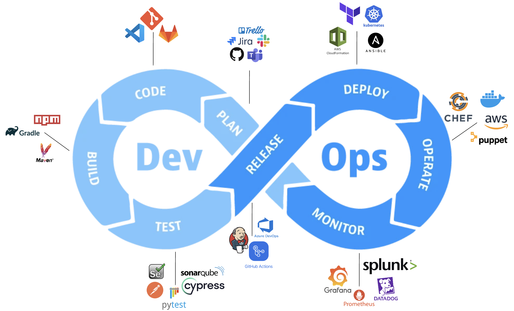
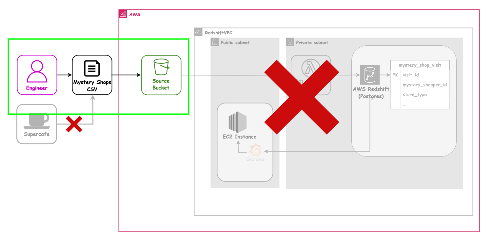
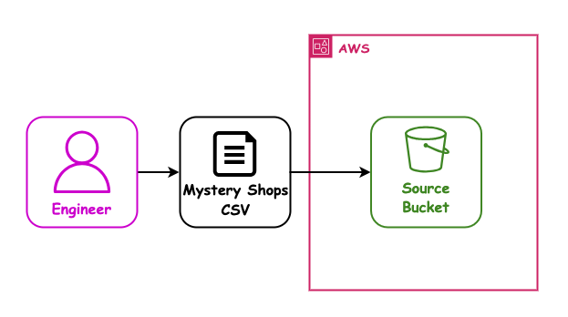
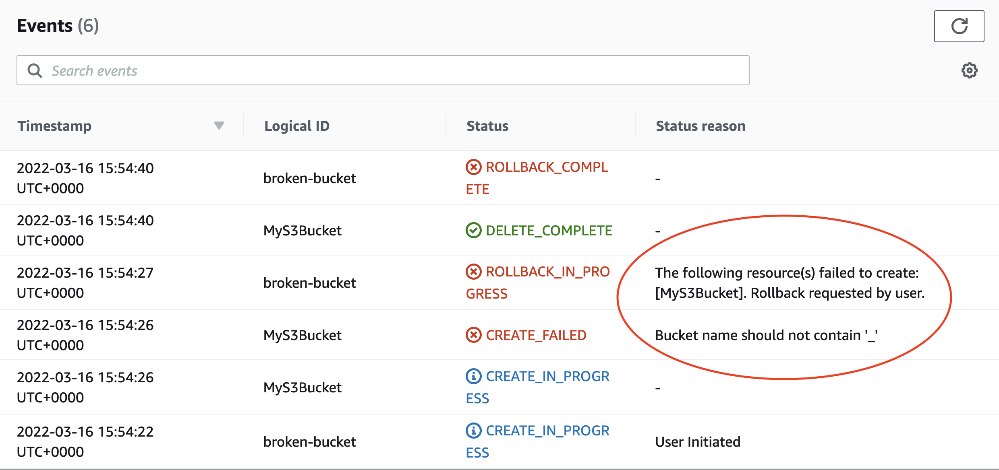
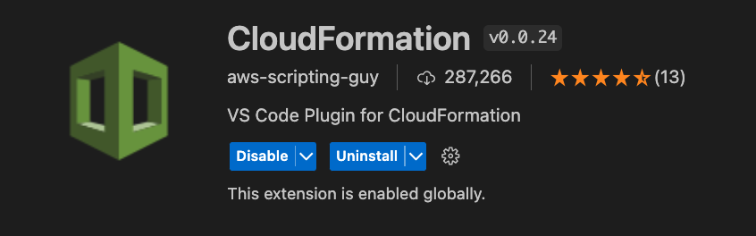

## AWS 04 - Intro to DevOps

## with CloudFormation

---

### AWS sessions list

- AWS 01 AWS + Cloud Intro ✅ _1.5hrs_
- AWS 02 AWS CLI Setup ✅ _1.5hrs_
- AWS 03 S3 Storage (Console) ✅ _1.5hrs_
- AWS 04 CloudFormation Intro + S3 Storage (IaC) ⬅ _1.5hrs_
- AWS 05 Lambda Intro _1.5hrs_
- AWS 06 Lambda (IaC) _1.5hrs_
- AWS 07 Redshift (IaC) _1.5hrs_
- AWS 08 EC2 (IaC) + Grafana setup _1.5hrs_

---

### Overview

- DevOps - _what_ it is and _why_ it is
- Infrastructure as Code (IaC)
- CloudFormation concepts
- CloudFormation syntax and features
- S3 bucket setup with Cloudformation

---

### Learning Objectives

- Explain the role DevOps plays in modern software
- Explain why Infrastructure as Code is important
- Identify the parts of a CloudFormation Template
- Be able to write and deploy CloudFormation Templates that create S3 buckets in AWS

---

### DevOps

Development and Operations


Notes:
DevOps diagram showing the merge of Development and Operations stages. Typically represented with an infinity shape to illustrate the continuous nature of the DevOps lifecycle.

Developers use tools at each stage to i.e. Jira for planning, git for code, GitHub Actions for release, AWS CloudFormation for Deploy etc.

Some of these stages we've already done at this point ! Plan, code, build, test. We will look at deploy over a couple sessions and monitoring later in the course.

---

### DevOps - A History

Developers and IT Ops professionals had separate (and often competing) objectives, department leadership, key performance indicators, and often worked on separate floors or even in separate buildings.

Developers looked after building the system, IT Ops looked after supporting and monitoring the system.

This resulted in siloed teams concerned only with their processes and releases.

These silos often meant miscommunication, delayed deliveries and strains on morale and relationships.

Notes:
To understand DevOps, we need to look at software development prior to DevOps. Traditionally developers & IT operations teams worked in silos. Once development was complete, the work was passed onto the operations team to keep the application running. These silos lead to issues such as miscommunication and delayed deliveries.

---

### What is DevOps?

A combination of **culture, practises** and **tools** that increases an organisation's ability to deliver services at high velocity.

More succinctly, it is a set of practices that combines software development (Dev) and IT operations (Ops).

Under a DevOps model, "dev" and "ops" are no longer siloed.

Both are merged into a single team where engineers work across the entire application lifecycle, from development and test to deployment to operations, and develop a range of skills not limited to a single function.

Notes:
Sometimes people focus only on the tools aspect of DevOps. However, it's important to remember that DevOps is a culture supported by practices and tools, not defined by them.

---

### DevOps Culture

- **Increased collaboration** as a team as opposed to silos
- **Share responsibility** across the whole team so no one process is looked after by specific people, thus spreading the knowledge and pain
- **No silos** between development and operations
- Give power to **autonomous teams** to enable them to make their own decisions in order to collaborate effectively, and remove convoluted decision making processes
- **Build quality into the development process**
- **Value feedback** to continuously improve ways of working
- **Automate** as much as you can

Notes:
Build quality into the development process - Test code at every stage in the development process rather than leaving it to the end. This is known as `shift left testing` where testing is done earlier in the development cycle. For example: writing unit tests during development stage.

---

### DevOps Practices

- Infrastructure as Code (IaC)
- Continuous Integration (CI)
- Continuous Delivery (CD)
- Smaller Apps and Web Servers (services) that are decoupled
- Monitoring and Logging
- Communication and Collaboration

Notes:
Continuous Integration (CI) and Continuous Deployment (CD) sessions are not specifically in the Data Engineering shorter courses by default.

- Continuous Integration (CI) is the practice of frequently merging code changes into a shared repository
- Continuous Delivery (CD) is the is the practice of automatically deploying all code changes to a staging or production-like environment after passing through CI processes. <- Need to update this.

---

### DevOps Tools

- Source Control (Git etc)
- Collaboration / communication tools (Slack, Teams)
- Issue tracking (Jira, Trello, ZenDesk, MS Planner, GitHub Projects)
- Configuration tools (Ansible, Puppet, Chef)
- CI/CD tools (GitHub Actions, AWS Code Deploy)
- And plenty more!

 <!-- .element: class="centered" height="270px" -->

Notes:
Continuous Integration (CI) and Continuous Deployment (CD) sessions are not specifically in the Data Engineering shorter courses by default.

---

### Benefits of DevOps

**Speed**: Smaller apps and and continuous delivery lets teams take ownership of services and then release updates to them quicker.

**Rapid delivery**: Increase the frequency and pace of releases so you can innovate and improve your product faster.

The quicker you can release new features and fix bugs, the faster you can respond to your customers' needs and build competitive advantage.

**Reliability**: Quality of application updates and infrastructure changes so you can reliably deliver at a faster pace while maintaining a positive experience for end users.

**Better internal culture**: DevOps practises lead to better communication, increased productivity and agility.

---

### Why does software need to change?

It changes all the time for many reasons:

- Features
- Bug fixes
- Security patches
- Contract changes
- Performance optimisations

---

### What does software need to be able to operate?

Many parts might be required;

- Server, or, somewhere to run code
- Database
- Cache
- Storage
- APIs
- Networking

---

### What software do we need?

To "do DevOps" we need tools that can setup our servers, deploy our software, create databases, and so-on.

The tool we will use today, and for the rest of our AWS sessions, is AWS CloudFormation.

---

### CloudFormation

 <!-- .element: class="centered" height="350px" -->

---

### The Mystery Shopper ETL - revisited

Before migrating our final project pipelines to AWS, our client SuperCafe would like us to build a similar data pipeline focusing on mystery shop data from their branches.

> Mystery shopping is a method used by retail companies to help measure job performance and the quality of service being delivered to customers. Typically, a mystery shopper will pay a visit to a branch or store, mirroring the behaviours of a real customer and then submitting scores or feedback about their experience.

SuperCafe have identified some newly opened branches where quality of service could increase, and have introduced mystery shopping in order monitor and help improve customer experience.

---

### The Mystery Shopper ETL - revisited

Similarly to the sales pipeline we are building, SuperCafe are recording the outcomes of mystery shop visits in CSV files:

- The CSV is uploaded at the end of each month, and represents all visits for the month across all branches in the initiative
- They have provided us a sample CSV containing 5 rows

<!-- .element: class="centered" height="350px" -->

---

### The Problem - revisited

- It is time consuming to collate data manually on all branches into one CSV
- Gathering meaningful data for the company on the whole is difficult, due to the limitations of the current solution
- Visualising trends is being done manually and is prone to human error
- Integers are represented inconsistently in the data
- `VisitDate` values have to be manually re-formatted to integrate with external spreadsheet software

---

### The Solution - revisited

After an initial discovery phase, we have agreed a plan to build a small cloud-based ETL pipeline to help SuperCafe solve some of these issues.

This has been identified as a great opportunity for us to learn and grow as an engineering team before moving onto the sales pipeline for our final project!

---

### Proposed Pipeline Architecture - revisited

<!-- .element: class="centered" height="500px" -->

Notes: Opt/Alt+Click to zoom diagram

---

### Our first user story - revisited

`As a` SuperCafe senior manager

`I want` a durable and available location to store monthly mystery shop data

`So that` access to the data is securely configured

`And` the data can be automatically integrated with a downstream ETL pipeline

---

### Our first user story - Architecture

In this session we can redo our manual work with IaC:

<!-- .element: class="centered" height="500px" -->

Notes: Opt/Alt+Click to zoom diagram, or open in a new tab

---

### Our first user story - Architecture

So today we only need to do this bit (but properly, this time with IaC):

<!-- .element: class="centered" height="500px" -->

Notes: Opt/Alt+Click to zoom diagram, or open in a new tab

---

### Infrastructure as Code (IaC)

> Question: What is Infrastructure as Code?

Notes:
IaC may already have been covered as a concept in the DevOps module.

If this was the case, ask the learners if they remember anything about IaC.

Learners may mention:

- The management of infrastructure
- Generates the exact same environment every time through a code file
- Used in conjunction with CI/CD pipeline
- Without IaC, teams must maintain the settings of all environments individually

If the learners do not recall anything, move on to the next slides where it is covered.

---

### What is Infrastructure as Code?

- The management of _infrastructure_ through version-controlled files
- Generates the exact same environment every time through a code file
- Used in conjunction with CI/CD pipeline
- Without IaC, teams must maintain the settings of all environments individually

Notes:
CI/CD pipeline - Pipeline to deploy code automatically after code is merged to a repo.
Pipeline - Series of automated steps

---

### What is "Infrastructure"?

In a traditional non-cloud context:

- Application Servers
- Virtual Machines
- Databases
- Firewalls
- etc

---

In an AWS cloud context, "Infrastructure" could be any component of any AWS service:

- S3 Buckets
- Lambda Functions
- EC2 compute instances
- Users
- Roles
- ... and much more

👉 Almost anything you can create through the AWS web console can be considered "infrastructure"!

Notes:
In AWS, almost anything can be managed easily as Infrastructure as Code. This is one of the big selling points of AWS which allows developers to work productively.

---

### Infrastructure as Code

It is an engineering principle in which we define **templates** for our **application and service infrastructure** to allow it to be created, deleted, re-created, or duplicated **consistently and predictably**

👉 There are many different IaC tools and technologies in the engineering world, but the goal and principle of IaC is always the same

---

### Infrastructure as Code

IaC lets us take a template that contains everything we need for our application, and deploy multiple instances of that application side-by-side.

We don't build our application infrastructure directly, instead we build a template which can then create that infrastructure for us when deployed.

---

### Infrastructure from Templates

 <!-- .element: class="centered" height="360px" -->

- One template can be deployed any number of times
- Deployed instances can be updated by modifying and re-deploying the template

Notes:
It may be useful to use the docker analogy with the learners; the same docker image can be used to create many docker containers that run the same software in the same way.

Typically the environment name would be passed as an argument to the resource name, config, tags, etc; then resources are created based on the environment name passed.

---

### Without Infrastructure as Code

- Each new deployment requires lots of human work to provision 😩
- There may be mistakes that aren't noticed and cause problems 😵
- The instructions to build an application can be lost or forgotten! 😱

---

### With Infrastructure as Code

- Any number of deployments created automatically with little work 😃
- Every deployment is identical, since it came from the same template 🤩
- The template is in source-control, so it can never be lost! 🎉

---

### Quiz Time! 🤓

---

### Why is Infrastructure as Code Important?

1. It reduces mistakes
1. It helps teams collaborate
1. It is automatable and repeatable
1. All of the above

Answer: `4`<!-- .element: class="fragment" -->

Notes:
All of these things

---

### When is it okay to NOT use IaC?

1. When you need to get new features added quickly on a deadline
1. When you are exploring or prototyping new functionality
1. When the client doesn't mind if you use it or don't
1. Never OK

Answer: `2 (Sometimes!)`<!-- .element: class="fragment" -->

Notes: See next slide

---

### When is it okay to NOT use IaC?

- AWS console can be used for intermittent purposes and where the created functionalities are not replicated.
- For all other scenarios IaC should be used, so that we create software that is redeployable.
- Client might not "mind", but as engineers it is OUR responsibility to recommend best-practice ways of working.
- Even for a "prototype" app it might still best to use IaC.

Notes:
We can use AWS console as long as that functionality is never intended to be part of any application, not even non production ones. For example, creating an S3 bucket via the console to store logs. Also it can be used if the application will not be replicated or deployed multiple times.
You can tear down your deployment and easily redeploy if anything goes wrong, and you can take the IaC configuration from the prototype and use it as the basis for what will become the production application.

---

### Infrastructure as Code Summary

- IaC makes deployments predictable and repeatable
- IaC makes collaborating with other people in your team on infrastructure easy
- You should **always** use IaC when building cloud apps and services

---

### Emoji Check:

Do you feel you've understood the core concepts of IaC (Infrastructure as Code)?

1. 😢 Haven't a clue, please help!
2. 🙁 I'm starting to get it but need to go over some of it please
3. 😐 Ok. With a bit of help and practice, yes
4. 🙂 Yes, with team collaboration could try it
5. 😀 Yes, enough to start working on it collaboratively

Notes:
The phrasing is such that all answers invite collaborative effort, none require solo knowledge.

The 1-5 are looking at (a) understanding of content and (b) readiness to practice the thing being covered, so:

1. 😢 Haven't a clue what's being discussed, so I certainly can't start practising it (play MC Hammer song)
2. 🙁 I'm starting to get it but need more clarity before I'm ready to begin practising it with others
3. 😐 I understand enough to begin practising it with others in a really basic way
4. 🙂 I understand a majority of what's being discussed, and I feel ready to practice this with others and begin to deepen the practice
5. 😀 I understand all (or at the majority) of what's being discussed, and I feel ready to practice this in depth with others and explore more advanced areas of the content

---

### AWS CloudFormation

- CloudFormation is an IaC tool designed by AWS for use within AWS
- It natively understands and works with (almost!) all AWS infrastructure and services
- CloudFormation runs as a service within AWS, which can orchestrate our deployments
- It is an industry-standard and popular choice for AWS development

---

### CloudFormation Key Concepts

- **Template** - A 'blueprint' for our infrastructure
- **Stack** - A deployed instance of a template
- **Resources** - Infrastructure components created inside a stack

---

### CloudFormation Key Concepts

 <!-- .element: class="centered" height="360px" -->

- When a template is deployed, it creates a stack containing the resources defined in that template

Notes:
Could demo how this comes together in AWS console.

1. Find a CloudFormation Stack
2. Show the template code used
3. Demo the Resources tab that shows resources created
4. Navigate to a resource where it's living in the AWS console i.e. S3 bucket

---

### A CloudFormation Template

```yaml
AWSTemplateFormatVersion: "2010-09-09"
Description: Template for a single S3 bucket

Resources:
  MyS3Bucket:
    Type: AWS::S3::Bucket
    Properties:
      BucketName: academy-de-example-bucket
```

The above template creates a S3 Bucket `resource` called 'academy-de-example-bucket'

Notes:
Point out that this is YAML

---

### CloudFormation Anatomy (1)

```yaml
AWSTemplateFormatVersion: "2010-09-09" # <-- Version
Description: My S3 bucket # <-- Description
Resources:
  MyS3Bucket:
    Type: AWS::S3::Bucket
    Properties:
      BucketName: academy-de-example-bucket
```

- _Version_ (Optional)
    - Always "2010-09-09" (only one version exists 🤷‍♀️)
- _Description_ (Optional)
    - Human-readable description of what this template is for

---

### CloudFormation Anatomy (2)

```yaml
AWSTemplateFormatVersion: "2010-09-09"
Description: Template for a single S3 bucket

Resources: # <-- Resources block
  MyS3Bucket:
    Type: AWS::S3::Bucket
    Properties:
      BucketName: academy-de-example-bucket
```

- _Resources_ (Required)
    - The set of infrastructure to be created by this template
    - Could be S3 buckets, EC2 instances, roles, lambda functions, or any other supported AWS resource

---

### CloudFormation Anatomy (3)

```yaml
AWSTemplateFormatVersion: "2010-09-09"
Description: Template for a single S3 bucket

Resources:
  MyS3Bucket: # <-- Resource Name (for template reference)
    Type: AWS::S3::Bucket # <-- Resource Type
    Properties:
      BucketName: academy-de-example-bucket
```

- _Resource Name_
    - A label for this resource
    - Can be anything, as long as it is unique within the template
- _Resource Type_
    - The type of infrastructure this resource represents
    - Comes from a fixed list of [possible resource types](https://docs.aws.amazon.com/AWSCloudFormation/latest/UserGuide/aws-template-resource-type-ref.html)

---

### CloudFormation Anatomy (4)

```yaml
AWSTemplateFormatVersion: "2010-09-09"
Description: Template for a single S3 bucket

Resources:
  MyS3Bucket:
    Type: AWS::S3::Bucket
    Properties:
      BucketName: my-bucket-name # <-- Resource Properties
```

- _Resource/Properties_
    - Configuration for this type of resource
    - Possible properties for a resource type can be found in the documentation
    - Some properties are required, while others are optional

Notes: See next slide

---

### CloudFormation Anatomy (4)

Possible resource properties for an S3 bucket for example may include things like the bucket name plus additional properties such as:

- Whether encryption is applied on the bucket
- Public or Private access to bucket files
- Use of the bucket to host a website

---

### CloudFormation Anatomy (5)

```yaml
Parameters:
  YourName:
    Type: String
    Description: Enter your name to customise your resource names
    Default: Alice Bloggs
```

- _Parameters_
    - A list of settings we can change
    - _Like_ a variable in programming but the value of parameters can't be changed during code execution
- _YourName_ is the name for the parameter
    - _Type_ Number, String, Boolean, etc
    - _Description_ Some free text describing the parameter
    - _Default_ The value that will be used if not overridden

Notes:
Parameter values can be replaced in the command line when deploying a CloudFormation template

---

### Points of Note

- Templates are YAML documents
- In YAML 👉 indentation is important 👈 (Just like in Python!)
- All possible AWS resource types and their possible properties can be found in the [AWS docs](https://docs.aws.amazon.com/AWSCloudFormation/latest/UserGuide/aws-template-resource-type-ref.html)

---

### The Mystery Shopper ETL

After further discussions on the solution the mystery shopper pipeline, your tech leads have stipulated that we update the original user story to include a new piece of technical acceptance criteria:

`As a` SuperCafe senior manager

`I want` a durable and available location to store monthly mystery shop data

`So that` access to the data is securely configured

`And` the data can be automatically integrated with a downstream ETL pipeline

---

### New acceptance criteria

> The S3 bucket used to store the raw mystery shop data should be managed via Infrastructure as Code, so the team can easily manage the automation of creating it in AWS and provide flexibility later if multiple development and production versions of the pipeline are needed.

> This approach also means the source code for how the bucket is defined can be committed to source control, hurrah!

---

### Final outcome

<!-- .element: class="centered" height="500px" -->

Notes: Opt/Alt+Click to zoom diagram. Remind learners that this pipeline is the end goal but today we'll focus on just the S3 part (then show next slide diagram).

---

### Today's goal

Your instructor will give you a peek of our target yaml file!

> Lets look at the [./solutions/etl-stack.yml](./solutions/etl-stack.yml) file - we will come back to this later.

Notes: Opt/Alt+Click to zoom diagram

---

### Deploying a Template

We have a Template that defines our Resources.

How do we turn that template into a stack in AWS?

There are two main options:

1. Deploy via AWS Web Console
2. Deploy via the AWS Command Line Interface (CLI)
    - _the preferred way, we can automate this!_

---

### Console Deployment

A stack can be created by uploading a template file via the Web interface, by going to:

- AWS Web Console
    - `CloudFormation` -> `Stacks` -> `Create Stack`

While a stack is deploying, the web console can be used to see what is happening.

The web console can also be used to check what resources have been created.

Notes:
Use the web console to demonstrate template deployment of the S3 bucket for the learners. You may need to change the bucket name!

Show the learners the deployment events in the console, to see what AWS is doing.

Show the learners the S3 bucket resource that has been actually created.

---

### Deployment Errors

What if the deployment doesn't work?

```yaml
Resources:
  MyS3Bucket:
    Type: AWS::S3::Bucket
    Properties:
      BucketName: academy_de_example_bucket
```

The above template has a problem. Errors in deployment can be viewed via the web console.

**Remember:** Identifying and understanding errors is a CRITICAL SKILL for an Engineer 👀

Notes:
The intent here is to prepare the learners for diagnosing errors in their own stacks.

Deploy the above template and demonstrate where to find deployment errors under the Events tab.

Bucket creation will fail because bucket names cannot contain underscores '_'

---

### Deployment Errors

<!-- .element: class="centered" -->

Reasons for failure can be determined from the 'Events' pane in the console.

Any deployment errors can also be views using CLI commands in your terminal - but for once, this is easier to see in the web.

---

### Quiz Time! 🤓

---

**In a CloudFormation Template, what does the `Resources` section define?**

1. Options that are passed into to the template
1. The set of infrastructure the template will create
1. Already-existing infrastructure that the template depends on

Answer: `2`<!-- .element: class="fragment" -->

Notes:
Options passed into the template are defined by parameters - this will be covered later in the module

---

**Which of the following is FALSE?**

1. A Template is a 'blueprint' for infrastructure
1. Templates can define one or more resources
1. A Stack is a deployed instance of a template
1. Stacks can be committed to source control

Answer: `4`<!-- .element: class="fragment" -->

Notes:
Stacks cannot be committed to source control as they are deployed instances of templates which contain actual resources.

The template is the blueprint for a stack which should be committed to source control.

---

### CLI Deployment

CloudFormation templates can also be deployed via the AWS Command Line Interface (CLI)

- Unlike the web interface, this can be easily invoked from a `shell script`
- This makes the CLI the preferred option to help automate deployments as part of a `CI/CD pipeline` 🤖

---

### CLI Deployment Process

 <!-- .element: class="centered" height="300px" -->

- S3 Deployment bucket stores the cloudformation template.
- Deployment bucket can be used to store any number of templates for different stacks.
- AWS CloudFormation is triggered to perform a deployment of the stored S3 template via the CLI.

Notes:
Learners may have difficulty understanding the purpose of the deployment bucket. (i.e. why is the template not just deployed 'directly'?)

There may also be confusion where learners think the S3 bucket created by the stack IS the deployment bucket. Reinforce that these are separate things and that the deploy bucket is created manually before any deployment activity happens.

Make it clear that the CLI itself does not "perform" or orchestrate the deployment, the CLI tells AWS CloudFormation (which runs inside AWS) to do a deployment, and where the template is found. This is why the template needs to be in a bucket, rather than on our local machine.

---

### Demo Prep

There is a handy CF plugin for VS Code that can remove some syntax errors we would otherwise get:



- Install the plugin
- Follow the steps to update your YAML editor config

---

### Demo - the deployment script

> The instructor can now show you the [./handouts/deploy.sh](./handouts/deploy.sh).

This file has been written for us to run the deployment.

---

### Demo - the blank stack file

> The instructor can now show you the starting [./handouts/etl-stack.yml](./handouts/etl-stack.yml).

This file needs filling in!

---

### Exercise prep

> Have a read through the [./exercises/aws-04-cfn-intro-exercise.md](./exercises/aws-04-cfn-intro-exercise.md) file.
>
> This file contains the steps we need to do. Each step is on the following slides.

Notes:
    Instructors can find the answers in the Solutions folder

---

### Code along - Check the parameter

> The parameter for `YourName` is already done, so no-one forgets it :-)
>
> This is passed in from the deployment script.

- `Parameters` section
    - Logical name
    - Then data `Type`, helpful `Description` and `Default` value

Notes:
    Instructors can find the answers in the Solutions folder

---

### Code along - Add bucket

> Add a bucket with a dynamic name.

- Needs a `Resources` section
- Then a logical name e.g. `ShopperRawDataBucket`, to use within the template
- Then an AWS `Type`, e.g. `AWS::S3::Bucket`, which must be a valid value from the AWS docs
- Then some `Properties`, which is a key to hold more values

_See next slide for more info._

Notes:
    Instructors can find the answers in the Solutions folder

---

### AWS Bucket properties

These match what we saw in the AWS console in the last session; They all sit under the `Properties` key:

- A globally-unique `BucketName`, so we know which one is ours
- A set of `PublicAccessBlockConfiguration`(s), for security
    - By default, deny all public access!
- A `Name` Tag with a `Key` and `Value`, so it is labelled correctly as ours

Notes:
    Instructors can find the answers in the Solutions folder

---

### Code along - Add policy

> Add a bucket policy with dynamic references.

- A logical name e.g. `ShopperRawDataBucketPolicy`, within the `Resources` section
- A specific `Type`, e.g. `AWS::S3::BucketPolicy`
- A set of `Properties`
    - With a dynamic reference back to our Bucket, e.g. `Bucket: !Ref ShopperRawDataBucket`
    - A `PolicyDocument` detailing our security rules (in this case - to make sure only secure traffic on HTTPS can be used, not HTTP)

_See next slide for more info._

Notes:
    Instructors can find the answers in the Solutions folder

---

### Policy Document Statements

These define the security rules for the Policy:

- A `Statement` block
- With an identifier `Sid`, which is like a unique human-readable name for the Statement
- Then an `Action`, to define what the rules apply to, like `s3:PutObject` or `s3:DeleteObject`, or `s3:*` for "all"
- A `Principal`, which is _who_ the rule applies to or "*" for everyone
- The `Effect`, which is `Allow` or `deny`
- A list of AWS `Resource`(s), that the rule is guarding / protecting
- Any `Condition`(s), that turn the rule on or off

Notes:
    Instructors can find the answers in the Solutions folder

---

### Code along - Log into AWS

> Make sure you are logged into AWS in your terminal
>
> `aws-azure-login --profile sot-academy`

- Windows users may need to use Powershell

---

### Demo - the Deploy script - 5 mins

> The deploy script [./handouts/deploy.sh](./handouts/deploy.sh) is done for you, so that it will reliably work.
>
> Instructor to show the file.

It does the following:

- Collect your `aws-profile` and `your-name` from the command line
- Use these to deploy a stack called `your-name-shopper-etl-pipeline`

Notes:
Briefly demo the file, show the `aws cloudformation deploy` command

---

### Code along - Deploy

> Let's all deploy our stacks. This may take some time!

- Windows users may need to do this in GitBash
- `YourName` should be entered `lower-case-with-dashes`, as it will be used in the S3 Bucket names

Run the [./handouts/deploy.sh](./handouts/deploy.sh) script like this:

```sh
./deploy.sh <aws-profile> <your-name>
# e.g.
./deploy.sh sot-academy rory-gilmore
```

---

### The results

> In the `./solutions` folder there is a completed `etl-stack.yml` with extra comments, as a refresher of what we have assembled.

_This is provided so that after the session you can cross-reference what we put together with the slides._

---

### Our first user story - Architecture recap

What we did in this session was this, but properly:

<!-- .element: class="centered" height="500px" -->

Notes: Opt/Alt+Click to zoom diagram, or open in a new tab

---

### Our first user story - Architecture recap

The bits we needed in this session were:

<!-- .element: class="centered" height="500px" -->

Notes: Opt/Alt+Click to zoom diagram, or open in a new tab

---

### Overview - recap

- Infrastructure as Code
- CloudFormation concepts
- CloudFormation syntax and features
- S3 bucket setup with Cloudformation

---

### Learning Objectives - recap

- Explain why Infrastructure as Code is important
- Identify the parts of a CloudFormation Template
- Be able to write and deploy CloudFormation Templates that create S3 buckets in AWS

---

### Further Reading

- [Cloudformation Docs](https://aws.amazon.com/cloudformation/getting-started/)
- [CloudFormation Resource Types](https://docs.aws.amazon.com/AWSCloudFormation/latest/UserGuide/aws-template-resource-type-ref.html)
- [CloudFormation Functions](https://docs.aws.amazon.com/AWSCloudFormation/latest/UserGuide/intrinsic-function-reference.html)
- [CloudFormation Deploy](https://awscli.amazonaws.com/v2/documentation/api/latest/reference/cloudformation/deploy/index.html)

---

### Emoji Check:

On a high level, do you think you understand the main concepts of this session? Say so if not!

1. 😢 Haven't a clue, please help!
2. 🙁 I'm starting to get it but need to go over some of it please
3. 😐 Ok. With a bit of help and practice, yes
4. 🙂 Yes, with team collaboration could try it
5. 😀 Yes, enough to start working on it collaboratively

Notes:
The phrasing is such that all answers invite collaborative effort, none require solo knowledge.

The 1-5 are looking at (a) understanding of content and (b) readiness to practice the thing being covered, so:

1. 😢 Haven't a clue what's being discussed, so I certainly can't start practising it (play MC Hammer song)
2. 🙁 I'm starting to get it but need more clarity before I'm ready to begin practising it with others
3. 😐 I understand enough to begin practising it with others in a really basic way
4. 🙂 I understand a majority of what's being discussed, and I feel ready to practice this with others and begin to deepen the practice
5. 😀 I understand all (or at the majority) of what's being discussed, and I feel ready to practice this in depth with others and explore more advanced areas of the content
