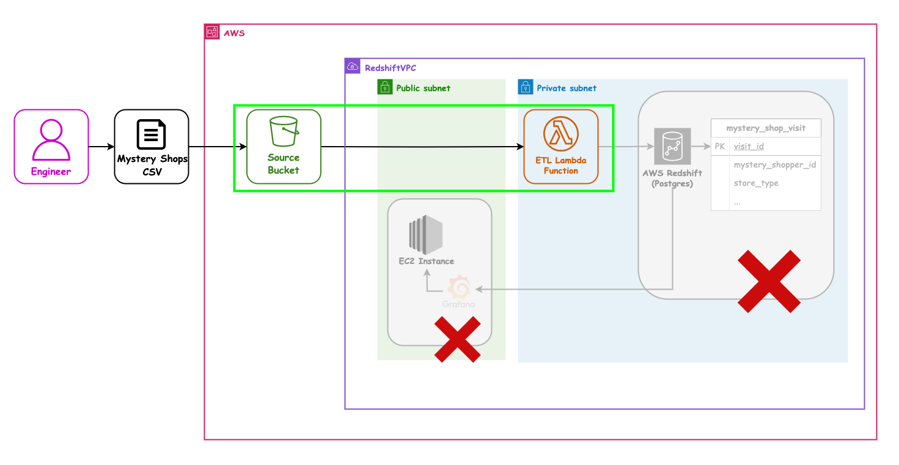
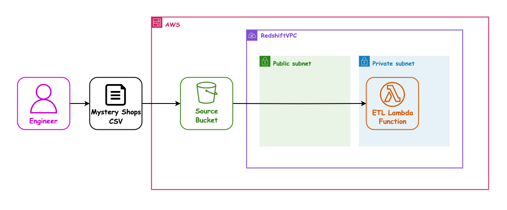

## AWS 05 - Introduction to AWS Lambda

---

### AWS sessions list

- AWS 01 AWS + Cloud Intro ✅ _1.5hrs_
- AWS 02 AWS CLI Setup ✅ _1.5hrs_
- AWS 03 S3 Storage (Console) ✅ _1.5hrs_
- AWS 04 CloudFormation Intro + S3 Storage (IaC) ✅ _1.5hrs_
- AWS 05 Lambda Intro ⬅ _1.5hrs_
- AWS 06 Lambda (IaC) _1.5hrs_
- AWS 07 Redshift (IaC) _1.5hrs_
- AWS 08 EC2 (IaC) + Grafana setup _1.5hrs_

---

### Overview

- Code running as a service
- Lambda as a form of Compute in AWS
- Creating a basic Lambda
- Event Triggers
- Testing lambdas
- Configuration including Environment Variables

---

### Learning Objectives

- What code as a service is
- What Serverless Applications are
- Python code structure in Lambdas
- How to Trigger a Lambda
- Using the Event object
- Configuration like Environment variables

---

### Lambda

 <!-- .element: class="centered" height="350px" -->

---

### Lambda

- 100% code, 0% infrastructure
- Run code without worrying about OS, patching, scaling, any physical hardware
- Never worry about capacity again
- Lambdas run in response to events such as data changes in S3, DB record being inserted
- You can even call them from through HTTP requests, SDK, or the AWS CLI

Notes:
AWS Lambda is a serverless compute service from Amazon Web Services (AWS) that lets you run code without provisioning or managing servers. You just upload your code, and Lambda runs it automatically in response to events.

Scaling is the ability of systems to handle increasing or decreasing workloads. Handled by auto-scaling groups or load balancers.

---

### Lambda Triggers

A lambda function is automatically invoked when one of its triggers is activated.

For example:

- When a record has been inserted into a DB table
- When a file has been uploaded to S3
- When a commit is pushed onto a repo hosted in CodeCommit (Git for AWS)
- When a monitoring alarm goes off

---

### Lambda Pricing Model

**Number of requests:** First 1 million requests per month are free, $0.20 per 1 million after (cheap!)

**Duration:** Calculated from the time your code begins until it terminates, up to the millisecond. The price depends on how much memory you allocate. Roughly $0.0000166667 for every GB-second used. The first 400,000 are free per month.

Example:

```text
Lambda function allocates 0.5 GB memory & runs for 2 seconds

GB-seconds = 0.5 GB × 2 seconds = 1 GB-second

So the cost is ~$0.0000166667
```

Notes:
It used to be rounded to the nearest 100ms but is now at a per 1ms basis.

GB-second - combination of memory allocated to function and amount of seconds the function runs for.

---

### Limitations

- Cold starts: Time it takes to kick off an instance (it's a container under the hood)
- Difficult to scale without understanding the concurrency execution model
- Tightly integrated to work with other AWS services so may have potential 'lock-in'
- Can be difficult to develop locally
- Unsuitable for tasks that take 15+ minutes

Notes:
The concurrency execution model refers to how many instances of a function can run at the same time (essentially how Lambda handles simultaneous invocation of the function). Each lambda instance can handle one invocation at a time. Lambda can handle up to 1000 concurrent executions per region per account by default, this limit can be increased (soft limit).

(Vendor) Lock-in is a situation where there's heavy dependency on a vendors products & services making it difficult to switch to another provider.

Local development can be difficult as lambda is designed to run in AWS environment so the resources lambdas require to run (such as the context and event objects) need to be simulated locally. Another issue here is that local execution doesn’t replicate cold starts which can matter in production environment so code performance locally vs on AWS can be different.

Context is automatically passed to your Lambda function providing runtime information about the Lambda function execution such as: metadata about the function, its environment, how it’s being triggered.

Event contains the data that triggers the Lambda function.

---

### Use Cases

- Tasks that take less than 15 minutes to complete
- Asynchronous, event-driven workloads
- Consistent level of traffic

Notes:
Default lambda timeout is 3 seconds but this can be changed to a maximum of 900 seconds (15 minutes).

15 minute timeout is a hard limit that cannot be increased.

---

### Quiz Time! 🤓

---

**Which of the following best describes AWS Lambda?**

1. `An AWS service for managing server infrastructure`
1. `A serverless compute service that runs your code in response to events`
1. `A tool for automatically scaling EC2 instances`
1. `A container orchestration service for running containerized applications`

Answer: `2`<!-- .element: class="fragment" -->

---

**After what time will an AWS Lambda function timeout?**

1. `5 minutes`
1. `10 minutes`
1. `15 minutes`
1. `30 minutes`

Answer: `3`<!-- .element: class="fragment" -->

---

**What is a potential drawback of AWS Lambda?**

1. `Limited integration with other AWS services`
1. `Difficulty in scaling without understanding the concurrency execution model`
1. `Inability to handle asynchronous, event-driven workloads`
1. `Inability to run code in response to events`

Answer: `2`<!-- .element: class="fragment" -->

---

**Which of the following is a use case for AWS Lambda?**

1. `Tasks that take more than 15 minutes to complete`
1. `Running code without worrying about underlying infrastructure`
1. `Deploying and managing containerized applications`
1. `Scaling and managing server infrastructure`

Answer: `2`<!-- .element: class="fragment" -->

---

**5. What is a "cold start" in the context of AWS Lambda?**

1. `The time it takes for a Lambda function to scale up`
1. `The time it takes to kick off an instance (container) to run a Lambda function`
1. `The process of initialising a new Lambda function`
1. `The process of stopping an unused Lambda function`

Answer: `2`<!-- .element: class="fragment" -->

---

### Proposed Pipeline Architecture

Lets revisit our Mystery Shopper target setup:

<!-- .element: class="centered" height="500px" -->

Notes: Opt/Alt+Click to zoom diagram

---

### Our next user story

`As a` SuperCafe senior manager

`I want` the Mystery Shopper data processed automatically

`So that` the data can be analysed

`And` the pipeline can run daily

---

### Our next user story - Architecture

We need to learn about how Lambda works, so that next session we can do this "properly":

<!-- .element: class="centered" height="500px" -->

> This session - we will code a Lambda, so next session we can set it up with IaC.

Notes: Opt/Alt+Click to zoom diagram, or open in a new tab

---

### Our next user story - Architecture

So this session we only need to use these parts of AWS:

<!-- .element: class="centered" height="500px" -->

Notes: Opt/Alt+Click to zoom diagram, or open in a new tab

---

### Code along - creating a lambda

> Lets have a look at how to make a Python Lambda from scratch.

_(Details on next slide)._

Notes:
If making this section a breakout room activity, remember to show learners the guide in the exercises folder `exercises/aws-05-intro-lambda`

---

### Code along - creating a lambda 1

- Find the `Lambda` service
- Ensure you are in the correct region `eu-west-1`
- Click on "Create Function"
- Select "Author from scratch"
- Enter a function name e.g. `your-name-de-demo-lambda`
- Select the most recent Python Runtime version you can
    - Notice anything about the available versions?
- More on next slide...

Notes:
Available Python runtimes in AWS lag behind the most recent releases - it takes AWS time to set them up and test them after Python.org release them. This is the same for all supported Lambda Runtimes (Node, Java, etc).

Adding a Tag called Name makes lots of the AWS (web) Console show us the logical name, which by default, lots of it does not!

---

### Code along - creating a lambda 2

- Under `Change default execution role`, select `Use an existing role` and enter `nja-lambda-execution-role`
- Create the function
- Once the function is created, go to the `Configuration` tab and select `Tags` at the side
- Add a new tag with key `Name` and value of the function name

---

### Code along - events 1

> Lets have a look at how Events work and logging them.

- Make a new test event with the `Hello-World` template
- Save it for later
- Trigger the Lambda with your test event
- Check the logs in the Lambda page
- Click through to the logs in CloudWatch

Notes:

A test event in Lambda is a sample input payload used to manually invoke a Lambda function in the AWS Console (typically for testing purposes). It allows you to simulate how your Lambda function would behave when triggered by an actual event source e.g. S3

To create a test event:

- From the Lambda function, go to the "Test" tab
- Enter an event name
- Click 'Save' to save the event
- Click 'Test' to test the event

---

### Code along - events 2

> Lets all log our `event` object.

- Add code to Log (`print()`) the event object
- (Re)deploy the lambda
- Trigger the lambda with your saved Test Event
- Check the CloudWatch logs now have more in them

Notes:
Advise learners to always (re)deploy lambda functions when code is updated or changes won't be reflected !

---

### Demo - configuration with env vars

> Lets have a look at how Environment Variables ("env vars") work.

- **Never** use these for passwords!
- Add an env var e.g. `FAVOURITE_MOVIE` with a suitable value
- Add code to import `os`
- Add code to put the env var in a variable
    - e.g. `fave_movie = os.environ['FAVOURITE_MOVIE']`
- Add code to print the variable
- (Re)deploy the lambda
- Re-Test the lambda and recheck the logs

Notes:
Discuss NEVER putting passwords in env vars!

Discuss what they might be used for in production systems. Some examples: Feature flags, runtime settings like timeouts or thresholds, handling multi-environment deployments i.e. env variables for dev, prod environments

Using an `.env` file will NOT work. To set a environment variable:

- From the lambda function go to 'Configuration' tab
- Select 'Environment variables' on the left hand side
- Click 'Edit' to add a new one

---

### Code along - configuration with env vars

> Lets all add an Environment Variable and use it in our code.

- Repeat the steps the Instructor just did for yourself
- **Never** use these for passwords!

Notes:
Discuss NEVER putting passwords in env vars!

Discuss what they might be used for in production systems.

---

### Demo - updating the return value

> The return value of a Lambda is used to indicate success/failure to the caller, and convey extra information.

- Demo making a basic Hello message JSON for the return value
- (Re)Deploy the lambda
- Re-Test the lambda
- Check the return value in the logs

Notes:
Sample in the [./handouts/sample_python_lambda.py](./handouts/sample_python_lambda.py) file.

---

### Code along - updating the return value

> Update your lambda return value to say Hello to yourself

- Repeat what the Instructor just showed you
- (Re)Deploy the lambda
- Re-Test the lambda
- Check the return value in the logs

---

### Sample handler code

A sample of what our code might now look at is in the [./handouts/sample_python_lambda.py](./handouts/sample_python_lambda.py) file.

---

### Our next user story - Architecture

We have experimented with Lambda code, so next session we can do this with IaC:

<!-- .element: class="centered" height="500px" -->

> This session - we will find out about Lambda, so next session we can set it up with IaC.

Notes: Opt/Alt+Click to zoom diagram, or open in a new tab

---

### Our next user story - Architecture

This session we used these parts of AWS, and will again next session:

<!-- .element: class="centered" height="500px" -->

> This session - we will find out about Lambda, so next session we can set it up with IaC.

Notes: Opt/Alt+Click to zoom diagram, or open in a new tab

---

### Overview - recap

- Code running as a service
- Lambda as a form of Compute in AWS
- Creating a basic Lambda
- Event Triggers
- Testing lambdas
- Configuration including Environment Variables

---

### Learning Objectives - recap

- What code as a service is
- What Serverless Applications are
- Python code structure in Lambdas
- How to Trigger an Lambda
- Using the Event object
- Configuration like Environment variables

---

<!-- .slide: data-visibility="hidden" -->
### Further Reading

- TODO

---

### Emoji Check:

On a high level, do you think you understand the main concepts of this session? Say so if not!

1. 😢 Haven't a clue, please help!
2. 🙁 I'm starting to get it but need to go over some of it please
3. 😐 Ok. With a bit of help and practice, yes
4. 🙂 Yes, with team collaboration could try it
5. 😀 Yes, enough to start working on it collaboratively

Notes:
The phrasing is such that all answers invite collaborative effort, none require solo knowledge.

The 1-5 are looking at (a) understanding of content and (b) readiness to practice the thing being covered, so:

1. 😢 Haven't a clue what's being discussed, so I certainly can't start practising it (play MC Hammer song)
2. 🙁 I'm starting to get it but need more clarity before I'm ready to begin practising it with others
3. 😐 I understand enough to begin practising it with others in a really basic way
4. 🙂 I understand a majority of what's being discussed, and I feel ready to practice this with others and begin to deepen the practice
5. 😀 I understand all (or at the majority) of what's being discussed, and I feel ready to practice this in depth with others and explore more advanced areas of the content
