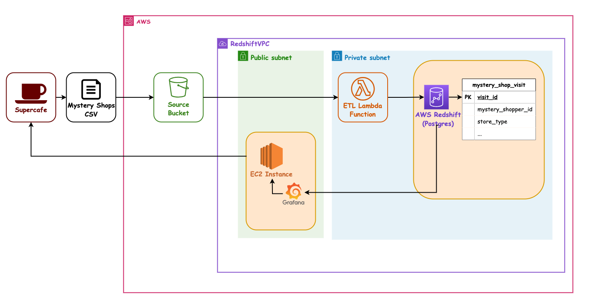
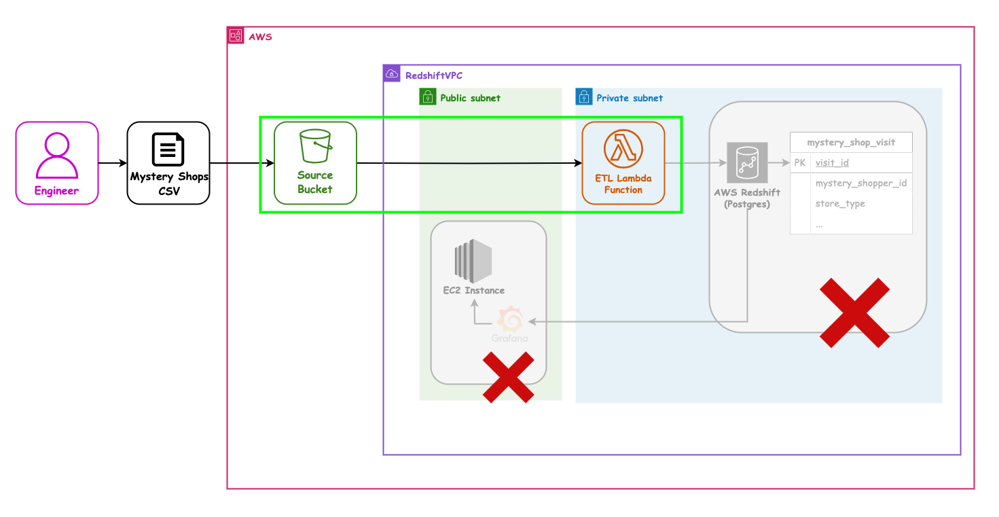
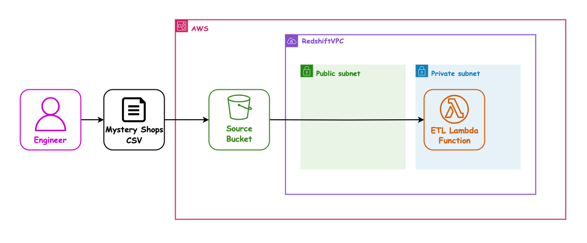
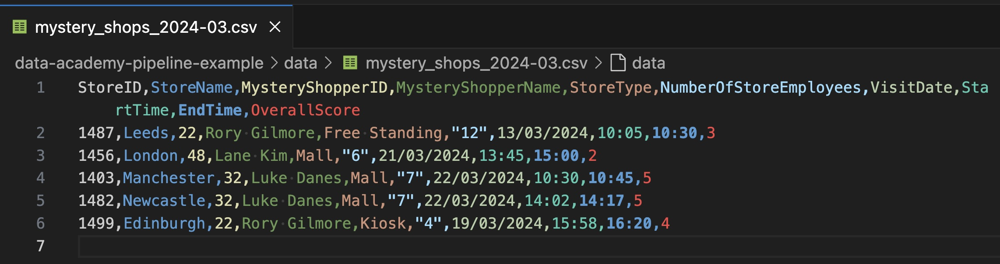

## AWS 06 - Lambda with IaC

---

### AWS sessions list

- AWS 01 AWS + Cloud Intro ✅ _1.5hrs_
- AWS 02 AWS CLI Setup ✅ _1.5hrs_
- AWS 03 S3 Storage (Console) ✅ _1.5hrs_
- AWS 04 CloudFormation Intro + S3 Storage (IaC) ✅ _1.5hrs_
- AWS 05 Lambda Intro ✅ _1.5hrs_
- AWS 06 Lambda (IaC) ⬅ _1.5hrs_
- AWS 07 Redshift (IaC) _1.5hrs_
- AWS 08 EC2 (IaC) + Grafana setup _1.5hrs_

---

### Overview

- Lambda as compute in AWS
- Packaging with CloudFormation
- Deployment with CloudFormation
- Event Triggers for Lambdas (with S3)

---

### Learning Objectives

- How to add a lambda function using CloudFormation
- How to add a trigger between the S3 bucket and the Lambda
- How to process the incoming event in your Lambda function

---

### Lambda & CloudFormation

| This... | ...and this |
|--|--|
| <!-- .element: class="centered" height="350px" --> | <!-- .element: class="centered" height="350px" --> |

Notes: We want both icons to show up side by side on the slide so used a table

---

### Proposed Pipeline Architecture

Let's revisit our Mystery Shopper target setup:

<!-- .element: class="centered" height="500px" -->

Notes: Opt/Alt+Click to zoom diagram

---

### Our next user story (same as last session)

`As a` SuperCafe senior manager

`I want` the Mystery Shopper data processed automatically

`So that` the data can be analysed

`And` the pipeline can run daily

---

### Our next user story - Architecture

Now that we know Lambda a bit, we will deploy a Lambda "properly" using IaC:

<!-- .element: class="centered" height="500px" -->

> This session - we will set it up with IaC.

Notes: Opt/Alt+Click to zoom diagram, or open in a new tab

---

### Our next user story - Architecture

These are the pieces we will need this session:

<!-- .element: class="centered" height="500px" -->

Notes: Opt/Alt+Click to zoom diagram, or open in a new tab

---

### Cloudformation Deployment

This is a complex process with a few stages:

 <!-- .element: class="centered" height="350px" -->

_Some notes on the next slides._

Notes: Opt/Alt+Click to zoom diagram

---

### Deployment Bucket

Our lambda code can get very big, especially with added dependencies.

It is common practice to do the following when deploying lambdas from IaC:

- Install any dependencies locally, into the same folder as our python code
- Zip up the Lambda code folder, including the above dependencies
- Upload the Zip to a "Deployment Bucket"
- The Lambda is then deployed from the Zip in the Deployment bucket into the Lambda service

Notes:
This process is known as a zip deployment

---

### Packaging vs Deployment

Packaging is the act of getting CloudFormation to:

- Bundle our Lambda code into Zip files,
- Upload the zip files somewhere ready to use later (S3)
- Update our template YAML files to point to the Zip, so that CF knows what to do in AWS

> We can see this in the [./handouts/deploy.sh](./handouts/deploy.sh) file.

Notes:

Getting our local code to Lambda has two stages:

1. The package stage involves zipping local code files (if the stack points to them) and uploading it to an S3 bucket

- Template must be packaged as it refers to local files that AWS can't access directly
- Packaging uploads files to S3 and copies the template file but replaces local paths with S3 URIs

2. The deployment stage involves deploying a CloudFormation stack based on the packaged template file (file that points to S3 resources URIs instead of local files)

Note that the `etl-stack.yml` file referenced in `./handouts/deploy.sh` is not complete so no local files are being packaged at the moment

---

### Our Data Bucket

In our previous session(s) we set up a _data_ bucket to put our CSV files in.

This is separate to the _Deployment_ Bucket we need to put our zips of lambda code into.

---

### Demo - Starting point

> We need to start from the partially complete file [../handouts/etl-stack.yml](../handouts/etl-stack.yml).
>
> This continues from our previous sessions.

---

### Demo - The provided Lambda

> The Lambda code to process the CSV has been written for us by our team mates - we can see this in file [./handouts/src/mystery_shop_etl_lambda.py](./handouts/src/mystery_shop_etl_lambda.py).

_This session is about using CloudFormation for Lambda, as distinct from writing the workings of a python lambda ourselves._

---

### Demo - The provided data

> A sample [mystery_shops_2024-03.csv](./handouts/data/mystery_shops_2024-03.csv) file is also provided.



---

### Code along - Parameter

> Add a parameter for Network Stack Name, so we know where to put the lambda (so that in a later session it can talk to RedShift).

- In the `Parameters` section
- With logical name `NetworkStackName`
    - With a `Type` of `String`
    - A `Default` value of `project-networking`
    - And a helpful `Description`

Notes:
Instructors can find the answers in the Solutions folder

`project-networking` is the CF stack containing networking resources to communicate with Redshift. We are setting a parameter for the network stack to reference the `project-networking` stack later.

The resources this stack creates can be found with navigating to `AWS Resource Explorer` in AWS then selecting `Tagged Resources` in the Query template. Search `project-networking` and all the resources with this tag (added from the template) will appear. Learners won't have access to Resource Explorer but could be a good thing to show.

---

### Code along - lambda

> Add a Lambda with a dynamic name (from `YourName`), so all our lambdas are unique.

- In the `Resources` section
- With a logical name like `EtlLambdaFunction`
- And a specific `Type` of `AWS::Lambda::Function`
- And many `Properties`...

_See next slide for more._

Notes:
    Instructors can find the answers in the Solutions folder

---

### AWS Lambda properties

There are many that we can set, we need at least the following:

- A unique and dynamic `FunctionName`, using `YourName`
- An up to date `Runtime`, `python3.12`
- A `Handler` to specify the file name and function name to run
- The `Code` setting, to specify which folder our source code is in e.g. `./src`
- A `Role`, to assume for security so we are allowed to talk to RedShift and the S3 bucket
- A `Timeout` value in seconds e.g. `30`, high enough for our E-T-L to run but not time out
- A `VpcConfig`, to put our lambda in the same networking as RedShift so it can see the DB
- A `Tag` with value `Name` to further identify our lambda

Notes:
    Instructors can find the answers in the Solutions folder

---

### Code along - Wake the Lambda

> Add a Notification Configuration to the CSV data bucket, so that files arriving there wake up the lambda.

We need to extend the `ShopperRawDataBucket` configuration `Properties`, like so:

- Add a new `NotificationConfiguration` property
- With a child property of `LambdaConfigurations`
    - This has a child list of Event & Function tuples
    - Add an `Event` of type `s3:ObjectCreated:*`
    - With a `Function` (lambda) reference to `!GetAtt EtlLambdaFunction.Arn`

Notes:
    Instructors can find the answers in the Solutions folder

---

### S3 as a source

As mentioned in the previous session [aws-03-console-s3](../aws-03-console-s3/), S3 can be a source of our data:

- We've set up S3 to send a notification or "event" to our Lambda to wake it
- This event will tell us the _bucket_ and _file name_ (but not the content / payload)
- If those systems fail to respond, some of them will receive a retry - for example, if Lambdas are _throttled_, S3 will retry the event for up to 6 hours

---

### Code along - Dependencies

> We will tell CloudFormation that the Bucket depends on the permissions and the lambda.

```yaml
  ShopperRawDataBucket:
    ...
    DependsOn:
      - ShopperRawDataBucketPermission
      - EtlLambdaFunction
```

Most of the time, CloudFormation will work these out for it's self. However we have found in this stack, the build order is more reliable with this hint added.

Notes:
    Instructors can find the answers in the Solutions folder

---

### Code along - Because Security

> Add a Source Bucket Permission, so the Lambda is allowed to read from in the bucket when it is invoked.

- We need a new `Resource` called `ShopperRawDataBucketPermission`
- With a `Type` of `AWS::Lambda::Permission`
- The `Properties` of it are
    - An `Action`, which is `lambda:InvokeFunction`, for when the lambda is activated
    - The `FunctionName`, by reference to our lambda, e.g. `!Ref EtlLambdaFunction`
    - For the specific `Principal` that is `s3.amazonaws.com`
    - Allowing the `SourceArn` by name so `!Sub 'arn:aws:s3:::${YourName}-shopper-raw-data'`

Notes:
    Instructors can find the answers in the Solutions folder

---

### Code along - Log into AWS

> Make sure you are logged into AWS in your terminal
>
> `aws-azure-login --profile sot-academy`

- Windows users may need to use Powershell

---

### Demo - the Deploy script - 5 mins

> The deploy script [./handouts/deploy.sh](./handouts/deploy.sh) is done for you, so that it will reliably work.
>
> Instructor to show the file.

It does the following:

- Collect your `aws-profile` and `your-name` from the command line
- Deploy a stack called `your-name-shopper-deployment-bucket`
- Install the Lambda's dependencies in the `src` folder
- Package the `your-name-shopper-etl-pipeline` stack with Lambda Zip in S3
- Deploy a stack called `your-name-shopper-etl-pipeline`

Notes:
Briefly demo the file, show the `aws cloudformation XYZ` commands

---

### Code along - Deployment

> Let's all deploy our stacks. This may take some time!

- Windows users may need to do this in GitBash
- `YourName` should be entered `lower-case-with-dashes`, as it will be used in the S3 Bucket names

Run the [./handouts/deploy.sh](./handouts/deploy.sh) script like this:

```sh
cd handouts
./deploy.sh <aws-profile> <your-name>
# e.g.
./deploy.sh sot-academy rory-gilmore
```

---

### Code along - Trigger the lambda

> Upload the sample CSV file [mystery_shops_2024-03.csv](./handouts/data/mystery_shops_2024-03.csv) into your data bucket.
>
> This should trigger your lambda.

---

### Code along - Check the logs

> Find your Log Group in CloudWatch and check the latest Log Stream.
>
> ...Do you see some nice useful logs?

---

### The results

> In the `./solutions` folder there is a completed `etl-stack.yml` with extra comments, as a refresher of what we have assembled.

_This is provided so that after the session you can cross-reference what we put together with the slides._

---

### Our next user story - Architecture

This is what we just did with IaC:

<!-- .element: class="centered" height="500px" -->

> This session - we set it up with IaC instead of manually.

Notes: Opt/Alt+Click to zoom diagram, or open in a new tab

---

### Our next user story - Architecture

These are the bits we used:

<!-- .element: class="centered" height="500px" -->

Notes: Opt/Alt+Click to zoom diagram, or open in a new tab

---

### Terms and Definitions - recap

- Lambda
- Event Driven
- Event Trigger
- Handler function
- S3
- Package
- Deployment

---

### Overview - recap

- Lambda as compute in AWS
- Packaging with CloudFormation
- Deployment with CloudFormation
- Event Triggers for Lambdas (with S3)

---

### Learning Objectives - recap

- How to add a lambda function using CloudFormation
- How to add a trigger between the S3 bucket and the Lambda
- How to process the incoming event in your lambda function

---

<!-- .slide: data-visibility="hidden" -->
### Further Reading

- TODO

---

### Emoji Check:

On a high level, do you think you understand the main concepts of this session? Say so if not!

1. 😢 Haven't a clue, please help!
2. 🙁 I'm starting to get it but need to go over some of it please
3. 😐 Ok. With a bit of help and practice, yes
4. 🙂 Yes, with team collaboration could try it
5. 😀 Yes, enough to start working on it collaboratively

Notes:
The phrasing is such that all answers invite collaborative effort, none require solo knowledge.

The 1-5 are looking at (a) understanding of content and (b) readiness to practice the thing being covered, so:

1. 😢 Haven't a clue what's being discussed, so I certainly can't start practising it (play MC Hammer song)
2. 🙁 I'm starting to get it but need more clarity before I'm ready to begin practising it with others
3. 😐 I understand enough to begin practising it with others in a really basic way
4. 🙂 I understand a majority of what's being discussed, and I feel ready to practice this with others and begin to deepen the practice
5. 😀 I understand all (or at the majority) of what's being discussed, and I feel ready to practice this in depth with others and explore more advanced areas of the content
