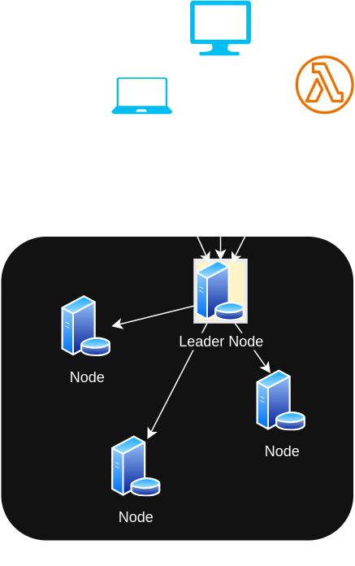
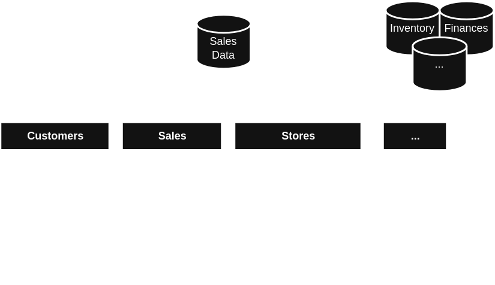
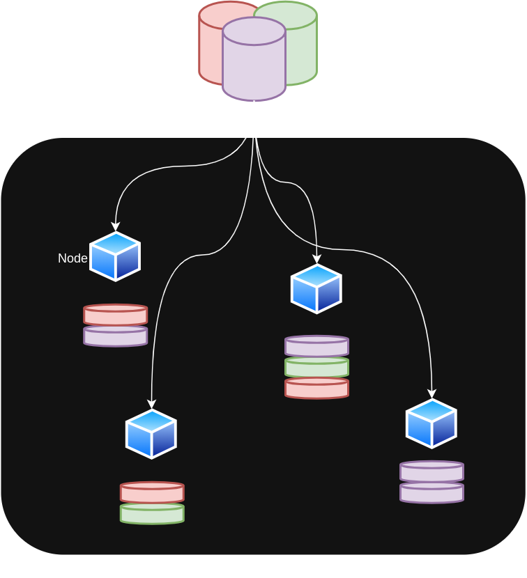
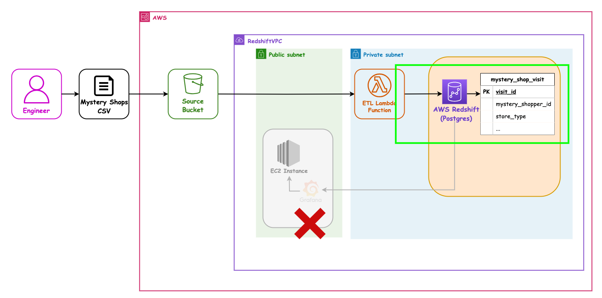
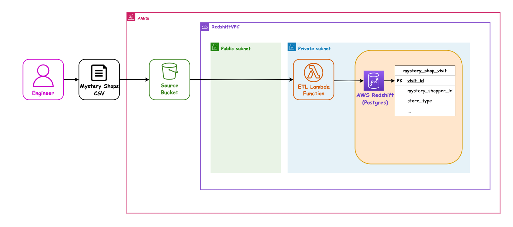

## AWS 07 - Introduction to Amazon Redshift

---

### AWS sessions list

- AWS 01 AWS + Cloud Intro ✅ _1.5hrs_
- AWS 02 AWS CLI Setup ✅ _1.5hrs_
- AWS 03 S3 Storage (Console) ✅ _1.5hrs_
- AWS 04 CloudFormation Intro + S3 Storage (IaC) ✅ _1.5hrs_
- AWS 05 Lambda Intro ✅ _1.5hrs_
- AWS 06 Lambda (IaC) ✅ _1.5hrs_
- AWS 07 Redshift (IaC) ⬅ _1.5hrs_
- AWS 08 EC2 (IaC) + Grafana setup _1.5hrs_
- AWS 09 Queues _1.5hrs_
- AWS 10 Monitoring _1.5hrs_

---

### Overview

- Before Data Warehouses
- What is a Data Warehouse?
- Why use a Data Warehouse?
- Redshift as a Data Warehouse
- Connecting from a lambda using Python

---

### Learning Objectives

- What Redshift is and can do for us
- How to connect to it using Python
- Using Parameter Store to get settings
- Never put sensitive info like passwords in code or environment variables!

---

### Amazon Redshift

 <!-- .element: class="centered" height="300px" -->

---

### Before Redshift - Traditional Data Warehouses

- Time consuming to pull data from many sources using traditional architecture
- Costly - hardware, setup, electricity, security, estate
- Maintenance costs often outweighed the benefits (upgrading systems due to more data being added)
- Performance issues
- Auto-scaling is not an easy concept

---

### Discussion (5 mins)

> What is a data warehouse?
>
> Why would we use it?

Notes:
Prompt the learners for their idea of a warehouse - what is kept in a warehouse?

Create an analogy - it's where a business typically stores the finished goods ready to be sent to other places or sold

A data warehouse is a centralized repository that stores and consolidates data from multiple sources, enabling businesses to analyze it for better decision-making and business intelligence.

---

### Data Warehousing

- It intends to be where you keep your best data - the source of truth for your business
- It has been cleaned and transformed in preparation for storage
- Highly structured data that is ready for analysis

Notes:
Keep the analogy going on how the students have already been doing this through their ETL pipeline in their team project

In a following session we will talk more on warehousing

---

### Redshift

- Massively **parallel**, **column-oriented** database
- Simple and cost-effective to analyse your data
- Manages, monitors and scales your system
- Up to 10x better performance than traditional
- Collection of compute resources which are called nodes
- These nodes, when organised into groups, become **clusters**
- Each cluster runs a Redshift engine which contains one or more DBs

Notes:
Parallel: Redshift architecture is designed as a Massively Parallel Processing (MPP) system, meaning it distributes data and workload across multiple nodes for parallel processing.

Column orientated = stores data by column rather than row. Faster to query a subset of columns versus usually less efficient at inserting data.

---

### Architecture

RedShift operates a complex model under the hood:

<!-- .element: class="centered"  -->

Notes:

The cluster that composes the redshift engine is made up of multiple nodes - a leader that is chosen to talk to the outside as an API, and compute nodes.

Opt/Alt+Click to zoom diagram on Macs

On linux Ctrl+Click

---

### Architecture

Sample data

<!-- .element: class="centered"  -->

Notes:
Our data can be composed of many databases which contain many tables

---

### Architecture

Sharding

<!-- .element: class="centered"  -->

Notes:
If we load redshift with our databases it then shards the data automatically across the many nodes for performance. (This is not something we have to worry about to configure)

---

### Clusters

- A cluster has a leader node with one or more compute nodes
- The leader node receives queries from client applications (BI, analytical software etc.)

Notes:
It develops a suitable query execution plan and coordinates parallel executions of these plans with one or more compute nodes.

Once the compute nodes finish, the leader aggregates the results from the nodes and sends back a response to the client application.

---

### Compute Nodes

- Compute resources which execute a query plan
- Transmits data among themselves to solve queries
- Nodes are further divided into (node) slices
- Each node slice receives an allocation of memory and performs operations in parallel

---

### Node types

- When you launch a (non-free tier) cluster, you need to specify the node types
- There are several types of node you can pick, including:
    - RA3
    - DC2 (Dense Compute)
    - DS2 (Dense Storage - _Legacy_)

Notes:

The node type determines the CPU, RAM, storage capacity, and storage drive type for each node.

Slides previously covered DC2 (Dense Compute) vs DS2 (Dense Storage) nodes.

However, AWS have released RA3 nodes which separates compute and storage costs, and are recommended by AWS over DS2 in all instances.

How to pick node type on next slide.

---

### Choosing the right nodes:

- **Data Quantity:** Be aware of the amount of data you want to import into your Redshift cluster
- **Complexity of queries:** Different nodes support queries with differing levels of complexity
- **Downstream systems:** What uses the results of the queries? How important is query speed?

Notes:
Current recommendation (2023):

Less than 1 TB of data -> DC2 nodes.

Most other situations -> RA3 nodes. However, you still choose number of nodes and volume of managed storage.

https://docs.aws.amazon.com/redshift/latest/mgmt/working-with-clusters.html

---

### Columnar Data Storage

- The data is still represented with rows and columns as normal
- However, the data is physically stored by column, instead of rows
- Because the data stored is the same type, you can achieve better data compression
- Number of I/O operations decreases
- Also means you can query/perform data analysis on similar types of data far quicker than row storage

---

<!-- .slide: data-visibility="hidden" -->
### Quiz Time! 🤓

- TODO

---

### Proposed Pipeline Architecture

Let's revisit our Mystery Shopper target setup:

<!-- .element: class="centered" height="500px" -->

Notes: Opt/Alt+Click to zoom diagram

---

### Our next user story

`As a` SuperCafe senior manager

`I want` the Mystery Shopper data to be analysed

`So that` we can award the friendliest most helpful store a prize each month

---

### Our next user story - Architecture

We want to check our data is going into the database, so that we can query it. We don't need the Grafana VM yet:

<!-- .element: class="centered" height="500px" -->

Notes: Opt/Alt+Click to zoom diagram, or open in a new tab

---

### Our next user story - Architecture

So for now we only need this chain of parts to be working:

<!-- .element: class="centered" height="500px" -->

Notes: Opt/Alt+Click to zoom diagram, or open in a new tab

---

### Wait, no new CF templating?

> This session does not involve new CloudFormation _per-se_ - rather, using tools already in our toolbox, we connect to RedShift, add data, and query it.
>
> The ETL Lambda python code provided in this session has been extended to talk to RedShift for us.

---

### Exercise time

Now we've learned a little bit about Amazon Redshift, let's implement loading some data from the Mystery Shopper pipeline into a database hosted on a Redshift cluster.

> Breakouts will be in each Project Team.

---

### Demo - new lambda code

We need to deploy the updated lambda code.

> Instructor to show the new lambda code.
>
> Especially important is the use of Parameter Store to get the connection details.

- See [./handouts/src/mystery_shop_etl_lambda.py](./handouts/src/mystery_shop_etl_lambda.py)
- And [./handouts/src/utils/db_utils.py](./handouts/src/utils/db_utils.py)
- And [./handouts/src/utils/sql_utils.py](./handouts/src/utils/sql_utils.py)

---

### Exercise Prep: Your team name

Your team name will be provided by the instructors. It will have dashes in it (`-`) due to limitations in AWS (esp. Bucket names).

E.g if your team name is "La Vida Mocha", your logical team name will be `la-vida-mocha`.

You will need this!

> Note the dashes!

---

### Demo - Parameter Store settings

The RedShift connection details will be in a Parameter Store param called `<team_name>_redshift_settings`, e.g.`la_vida_mocha_redshift_settings`, as Redshift likes underscores (`_`).

> Instructor to show each team their Parameter Store settings, e.g.`la_vida_mocha_redshift_settings`.

Notes:

These parameter store parameters are populated in advance by your instructor

---

### Demo - the Deploy script - 5 mins

> The deploy script [./handouts/deploy.sh](./handouts/deploy.sh) is done for you, so that it will reliably work.
>
> Instructor to show the file.

It does the following:

- Collect your `aws-profile` and `team-name` from the command line
- Deploy a stack called `team-name-shopper-deployment-bucket`
- Install the Lambda's dependencies in the `src` folder
- Package the `team-name-shopper-etl-pipeline` stack with Lambda Zip in S3
- Deploy a stack called `team-name-shopper-etl-pipeline`

Notes:
Briefly demo the file, show the `aws cloudformation XYZ` commands

---

### Exercise - Step 01 - Deploying

> 15 mins breakout
>
> Only ONE person should do this with the rest of the team watching...
> ...have a think about why!

- Follow [Exercise Step 01 - Deploying](./exercises/aws-07-cfn-redshift-breakout-steps.md)
- Deploy the new lambda code using your team name e.g. `la-vida-mocha` (lower case with dashes)
- Run `./deploy.sh <profile-name> <team-name>` to update the ETL lambda function:
    - e.g. `./deploy.sh sot-academy la-vida-mocha`

---

### Discussion - Step 01 - Deploying

> How did the deployment go?
>
> Is everyone happy they understand it?

- Why could only **ONE** person from each Team do this?

---

### Exercise - Step 02 - Trigger lambda

> 5 mins breakout

- Follow [Exercise Step 02 - Trigger lambda](./exercises/aws-07-dfn-redshift-breakout-steps.md)
- Use file [./handouts/data/mystery_shops_2024-03.csv](./handouts/data/mystery_shops_2024-03.csv)
- You can upload the same file many times, or altered copies of it
- Multiple team members can do this concurrently
    - Why is that?

---

### Discussion - Step 02 - Trigger lambda

> How did the triggering go?
>
> Is everyone happy they understand it?

- Why could multiple people do this at the same time?

---

### Demo - Step 03 - RedShift Query Editor

> The Instructor will now demo how to connect to the RedShift query editor in the AWS Console, using the Parameter Store data, e.g. `la_vida_mocha_redshift_settings`.

---

### Exercise - Step 03 - Create SQL Queries

- 20 mins breakout

> Follow [Exercise Step 03 - Create SQL Queries](./exercises/aws-07-dfn-redshift-breakout-steps.md).
>
> Use the RedShift query editor in the AWS Console.

- You can all do this concurrently (not just one person per team)
- Start with `select * from mystery_shop_visit;` and then see if you can do something more sophisticated

Notes:
    Instructors can find the answers in the Solutions folder

---

### Discussion - Step 03 - Create SQL Queries

> How did the SQL-ing go?
>
> Is everyone happy they understand the queries?

---

### Our next user story - Architecture

This is what the IaC has set up and allowed us to use:

<!-- .element: class="centered" height="500px" -->

Notes: Opt/Alt+Click to zoom diagram, or open in a new tab

---

### Our next user story - Architecture

We nearly have the whole system set up now:

<!-- .element: class="centered" height="500px" -->

Notes: Opt/Alt+Click to zoom diagram, or open in a new tab

---

<!-- .slide: data-visibility="hidden" -->
### Terms and Definitions - recap

TODO

---

### Overview - recap

- Before Data Warehouses
- Redshift as a Data Warehouse
- Connecting from a lambda using Python

---

### Learning Objectives - recap

- What Redshift is and can do for us
- How to connect to it using Python
- Using Parameter Store to get settings
- Never put sensitive info like passwords in code or environment variables!

---

### Further Reading

- **Redshift:** The AWS Data Warehouse service used to store and analyse large quantities of data
- AWS Docs - <https://aws.amazon.com/redshift/>

---

### Emoji Check:

On a high level, do you think you understand the main concepts of this session? Say so if not!

1. 😢 Haven't a clue, please help!
2. 🙁 I'm starting to get it but need to go over some of it please
3. 😐 Ok. With a bit of help and practice, yes
4. 🙂 Yes, with team collaboration could try it
5. 😀 Yes, enough to start working on it collaboratively

Notes:
The phrasing is such that all answers invite collaborative effort, none require solo knowledge.

The 1-5 are looking at (a) understanding of content and (b) readiness to practice the thing being covered, so:

1. 😢 Haven't a clue what's being discussed, so I certainly can't start practising it (play MC Hammer song)
2. 🙁 I'm starting to get it but need more clarity before I'm ready to begin practising it with others
3. 😐 I understand enough to begin practising it with others in a really basic way
4. 🙂 I understand a majority of what's being discussed, and I feel ready to practice this with others and begin to deepen the practice
5. 😀 I understand all (or at the majority) of what's being discussed, and I feel ready to practice this in depth with others and explore more advanced areas of the content
