## AWS 08 - Introduction to EC2

---

### AWS sessions list

- AWS 01 AWS + Cloud Intro ✅ _1.5hrs_
- AWS 02 AWS CLI Setup ✅ _1.5hrs_
- AWS 03 S3 Storage (Console) ✅ _1.5hrs_
- AWS 04 CloudFormation Intro + S3 Storage (IaC) ✅ _1.5hrs_
- AWS 05 Lambda Intro ✅ _1.5hrs_
- AWS 06 Lambda (IaC) ✅ _1.5hrs_
- AWS 07 Redshift (IaC) ✅ _1.5hrs_
- AWS 08 EC2 (IaC) + Grafana setup ⬅ _1.5hrs_
- AWS 09 Queues _1.5hrs_
- AWS 10 Monitoring _1.5hrs_

---

### Overview

- What is EC2
- Running a virtual server in the cloud
- Configuring the startup of an EC2
- Hosting applications inside our Servers

---

### Learning Objectives

- Add an EC2 server with CloudFormation
- Configure the User Data of the machine
- So that we can host (run) Grafana in the EC2

---

### EC2

 <!-- .element: class="centered" height="350px" -->

---

### EC2 (Elastic Compute Cloud)

- A service that allows you to rent virtual computers on which you can run your own applications
- 'Elastic' because you pay by the second for what you use!
- You get control over the geographical location of your virtual computers

Before cloud computing, you'd need to put in a request for physical hardware which could take weeks to provision, now it takes seconds, with a few clicks.

---

### EC2 Pricing Types

**On Demand**:

Allows you to pay a fixed rate by the hour/minute/second with no commitment.

**Reserved**:

Provides you with a capacity reservation and a significant discount on the hourly charge of an instance. Locked into contract terms of 1 or 3 years.

---

### EC2 Pricing Types

**Spot**:

Enables you to bid whatever price you want for instance capacity, making better savings if your applications have flexible start/end times.

**Dedicated Hosts**:

Physical EC2 server dedicated for your own use.

---

### EC2 - Concepts

**Image**: what is being used to build an instance (similar to Docker)

**Instance**: the machine you're creating

**Security**: security groups, key management, network interfaces

---

### EC2 - Concepts (cont)

- _Image_ - essentially the template that contains the software configuration required to launch your instance. Think of this as your installation DVd for your laptop :-)
- _Security Group_ - a virtual firewall for your EC2 instances, to control incoming & outgoing traffic. Default security groups allow no traffic in, and all out - we must update these!
- _Network interface_: Configuring things like port numbers and network access - we can think of this as plugging in a network cable or connecting to the wifi.

---

### EC2 & EBS

We need disks for our machine (instance) to run on - the Elastic Block Store is how we do this.

- Elastic Block Store - a high performance, highly available storage for EC2
- Block-level (organised/identified in blocks) storage that can be attached to EC2 instances
- 2 options available: SSD (Solid State Drive) or HDD (Hard Disk Drive)

Notes:
Block storage breaks up data into blocks and then stores those blocks as separate pieces, each with a unique identifier.

The SAN places those blocks of data wherever it is most efficient. That means it can store those blocks across different systems and each block can be configured (or partitioned) to work with different operating systems.

SSD - Solid State Drive
HDD - Hard Disk Drive

---

### EC2 UserData

- We usually want our servers to do something special when booting up
- To do this, we can provide a file of instructions called `userdata`
- This file has a special format
- ...but otherwise we can think of it as a special bash script that runs to set things up

There is an example at [./handouts/userdata](./handouts/userdata).

Notes:
Show the example fie to the learners and walk through what it is doing.

---

### Proposed Pipeline Architecture

Let's revisit our Mystery Shopper target setup... at the end of this session we will have it all:

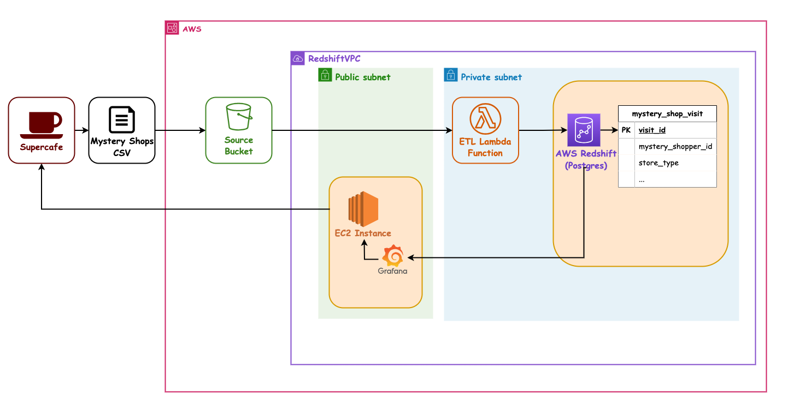<!-- .element: class="centered" height="500px" -->

Notes: Opt/Alt+Click to zoom diagram

---

### Our last user story

`As a` SuperCafe senior manager

`I want` the Mystery Shopper data to be visualised

`So that` we can award the friendliest most helpful store a prize each month

---

### Our last user story - Architecture

We want to run Grafana in an EC2 so we can visualise our Mystery Shopper data:

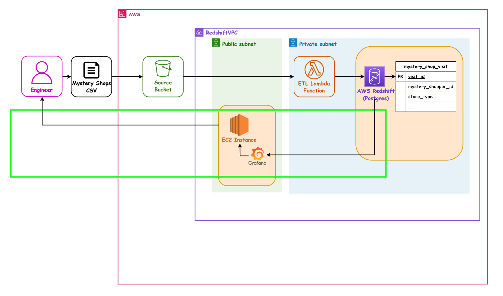<!-- .element: class="centered" height="500px" -->

Notes: Opt/Alt+Click to zoom diagram, or open in a new tab

---

### Exercise time

Now we've learned about EC2, let's run through a group code-along where we create an EC2 instance using CloudFormation.

Once it's up and running, we can use it to host a Grafana dashboard so we have a place to put Mystery Shopper data visualisations later.

---

### Demo - starting point

- We start with an initial [./handouts/etl-stack.yml](./handouts/etl-stack.yml) file
- This matches the end stage of the previous sessions
- We need to fill in some extra pieces

---

### Demo - extra fun stuff

- We have parameters for `TeamName` and `YourName` provided already
    - This session only, you need to specify both
    - So that you can have your own stack and also use your Teams shared database
- Some of the IAM and networking names have been predefined by the instructors

You can see these in the initial [./handouts/etl-stack.yml](./handouts/etl-stack.yml) file.

---

### Demo - new CF parameter 'LatestAmiId'

> We need to know what the base operating system on the virtual machine is.
>
> In the file, `LatestAmiId` uses a special CloudFormation trick to look up the latest one.

- For details see [Looking up AMI IDs with CF and SSM](https://aws.amazon.com/blogs/compute/query-for-the-latest-amazon-linux-ami-ids-using-aws-systems-manager-parameter-store/)

Notes:
    You can skip the details here and summarise as - the `Default` value is used to look up a specific value from the special public lookup `AWS::SSM::Parameter::Value<AWS::EC2::Image::Id>`

---

### Code along - Add CF Parameters

> We need a set of extra parameters to configure our instance.

- `EC2InstanceProfileRoleName`, so our EC2 can access other things
    - With `Type` of `String`
    - and `Default` value of `de-academy-ec2-role-instance-profile`
- `EC2InstanceIngressIp`, so we can allow our laptops access
    - With `Type` of `String` and _no_ `Default` property
- `EC2UserData`, so we can tell the server what to run on boot
    - With `Type` of `String` and `Default` value of `""` (empty string)

Notes:
    Instructor to take the samples from the Solutions folder

---

### Code along - Add EC2 Instance

> We need to define the EC2 resource it's self.

- We will call it `GrafanaEc2Instance`, and it needs...
    - `Type` set to `AWS::EC2::Instance`
    - `Properties`, the main settings
    - ...with `InstanceType`, for a small & cheap type of EC2
    - ...and `ImageId`, the binary template to run from
    - ...and `Tags`, so we can name it
    - ...and `NetworkInterfaces`, to link up to security and redshift
    - ...and `LaunchTemplate`, for a bunch more settings

Notes:
    Instructor to take the samples from the Solutions folder

---

### Demo - Launch Template

> We have defined a Launch Configuration to set more defaults for our instance.

- Look in your yaml file for `GrafanaEC2LaunchTemplate`
- The instructor can walk you through what it does
- `LaunchTemplateName` is, well, the name
- `VersionDescription` lets us have named versions - we will have just one

(See next slide for `LaunchTemplateData`.)

Notes:
    Instructor to walk through the parts

---

### Demo - Launch Template

- `LaunchTemplateData` does a few key things:
    - plugs in the `UserData`, the boot-up script
    - adds a `IamInstanceProfile` (IAM Role) for security restrictions,
    - and specifies the `MetadataOptions` options, a service our Grafana plugins will use
    - enables `Monitoring` for more stats in Cloud Watch
    - adds `BlockDeviceMappings` for the hard disk

Notes:
    Instructor to walk through the parts

---

### Launch Template settings - pros and cons

The EC2 settings we will use in the `GrafanaEc2Instance` has a `Version: !GetAtt` reference to the Launch Template `GrafanaEC2LaunchTemplate`, and it's `~.LatestVersionNumber`.

- This means that if in `GrafanaEC2LaunchTemplate` you change the `VersionDescription: '01'` value...
- ...then on next deployment the EC2 will be _completely destroyed and replaced afresh_

So:

- **Con:** any data you put in Grafana and don't back up (like dashboard definitions) will be lost
- **Pro:** if you forget your master Admin password for Grafana, the VM will come up clean and you can reset it

Notes:

- Some teams have lost Grafana Dashboards by not appreciating this.
- But some teams have forgotten to put the new Grafana Admin password in their Password Manager!

---

### Demo - Security Group

> We have defined a security group to limit traffic in and out, to allow only your laptop IPs specific access to your VMs.

- Look in your yaml file for `GrafanaEC2InstanceSecurityGroup`
- The instructor can walk you through what it does

(More on next slide.)

Notes:
    This is done in advance to save time. It allows only the host Ip in on port 80 for Grafana, and https access in and out for AWS services to work

---

### Demo - Security Group

Under the `Properties` it has:

- A `GroupDescription` to explain what the group is for
- A `Tags` property with a child `Key` and `Value`, to name it
- A `VpcId` property for the same networking as RedShift
- A `SecurityGroupIngress` property for incoming traffic
- A `SecurityGroupIngress` property for outgoing network traffic

Notes:
    Instructor to talk through the properties

---

### Code along - Check your IP

> Let's check our home IP addresses (IPv4) so you can limit access to your instance to only you.

- <https://whatsmyip.org>

_We do this because the Grafana UI will use http (insecure) so we can lock it down this way instead._

---

### Code along - Log into AWS

> Make sure you are logged into AWS in your terminal

- Windows users may need to use Powershell

---

### Demo - the Deploy script - 5 mins

> The deploy script [./handouts/deploy.sh](./handouts/deploy.sh) is done for you, so that it will reliably work.
>
> Instructor to show the file.

It does the following:

- Collect your `aws-profile`, `your-name` and `team-name` from the command line
- Deploy a stack called `your-name-shopper-deployment-bucket`
- Install the Lambda's dependencies in the `src` folder
- Package the `your-name-shopper-etl-pipeline` stack with Lambda Zip in S3
- Deploy a stack called `your-name-shopper-etl-pipeline`
- Configures your stack to find the `team_name_cafe_db` database

Notes:
Briefly demo the file, show the `aws cloudformation XYZ` commands

---

### Code along - Deploy

> Let's all deploy our stacks. This may take some time!

- Windows users may need to do this in GitBash
- `YourName` and `TeamName` name should be entered `lower-case-with-dashes`, as it will be used in the S3 Bucket names

Run the [./handouts/deploy.sh](./handouts/deploy.sh) script like this:

```sh
cd handouts
./deploy.sh <aws_profile> <your-name> <team-name> <your-ip>
# i.e.
./deploy.sh sot-academy rory-gilmore la-vida-mocha 12.34.56.78
```

---

### The results

> In the `./solutions` folder there is a completed `etl-stack.yml` with extra comments, as a refresher of what we have assembled.

_This is provided so that after the session you can cross-reference what we put together with the slides._

---

### Visualisations

> Now we have everything deployed, we can use Grafana to visualise our data.

---

### Code along - Log into Grafana

- Find the IP of your EC2 instance from the AWS console
- Browse to it on http
    - e.g. <http://12.34.56.78:80>
- Log in with username `admin`, password `admin`
- Change the password!
    - Make a secure one and save it in your Password Manager

> Every time your VM reboots the IP will change - make a note of your current IP so you can find the password again next time you need it

Notes:
    Instructor to make sure folks can find the password again - if it's saved in the password manager by IP, it'll be hard to find again tomorrow

---

### Connecting Grafana to Redshift

> We will use the PostgreSQL data source as it is (a) similar to the library we are using in our lambda code and (b) the official RedShift data source has proven "extremely unreliable".
>
> The settings you need are in your RedShift _parameter_ in AWS, e.g `la_vida_mocha_redshift_settings`

- In the AWS web console, open up Parameter Store in Systems manager and find your connection details

---

### Connecting Grafana to Redshift

- Using the menu navigate to `Connections / Data sources`
- Search for `Postgres` (it should be pre-installed)
- Click it to add a new data source

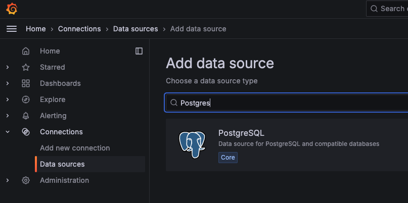

---

### Code along - Settings for data source

- Enter the host in format `server:port` e.g. `redshiftcluster.~~~.com:5439`
- Enter the DB name e.g. `la_vida_mocha_cafe_db`
- Enter the DB user e.g. `la_vida_mocha_user`
- Enter the DB password e.g. `abcdefghijk`

_(Image in next slide...)_

---

### Code along - Settings for data source

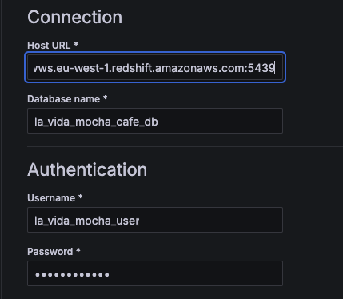

> Double check you have `server:port`
>
> e.g. `redshiftcluster.~~~.com:5439`

---

### Code along - Test data source

- Scroll to the bottom of the datasource window
- Click "Save & Test"
- A green success flash should appear

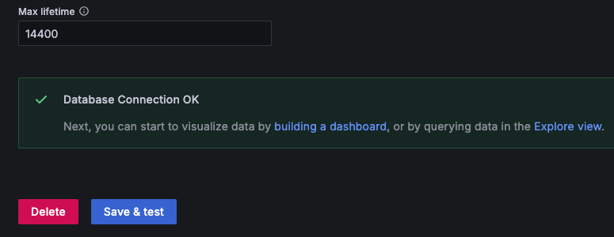

---

### Our first visualisation

We are going to add our first Dashboard, with our first Panel like so:

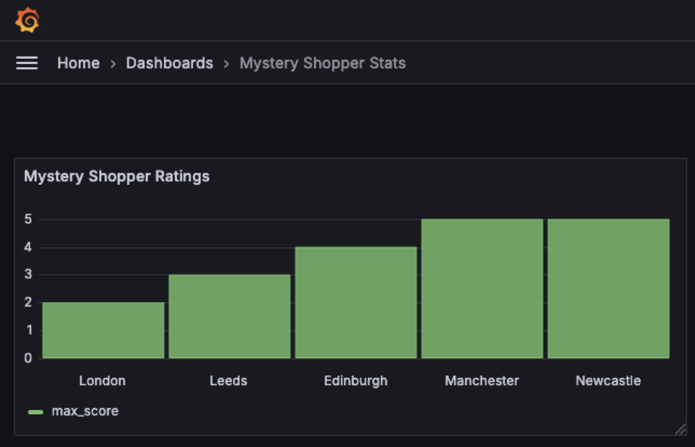

(Details on next slides.)

---

### Our First visualisation

Here's a preview of what this looks like under construction:

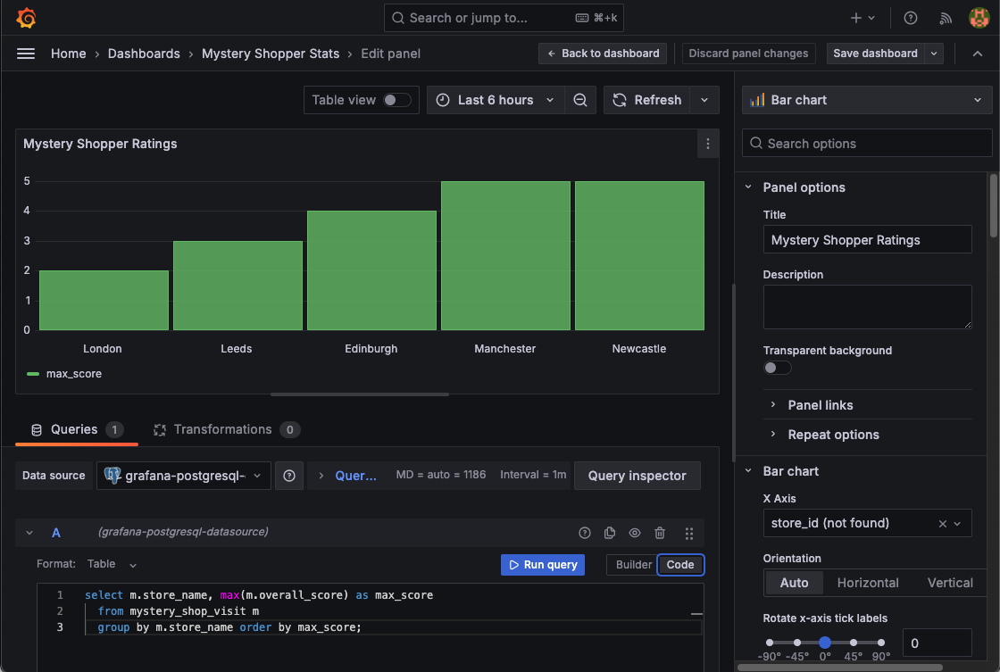

(Details on next slides.)

---

### Code along - Add a visualisation

- From the main menu, add a new Dashboard
- When prompted, select your Postgres data source
- Change the Visualisation type to `Bar Chart`

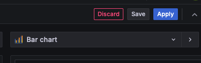

---

### Code along - Table View on

- At the top, turn on the `Table View` toggle so we can see all the data (when it comes)

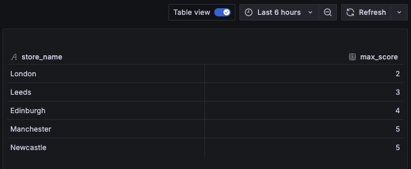

> There won't be any data (yet)!

---

### Code along - Add SQL

- Find the tiny `Code` button and click it to show the Code textbox
- Add the SQL from below

```sql
select m.store_name, max(m.overall_score) as max_score
  from mystery_shop_visit m
  group by m.store_name order by max_score;
```

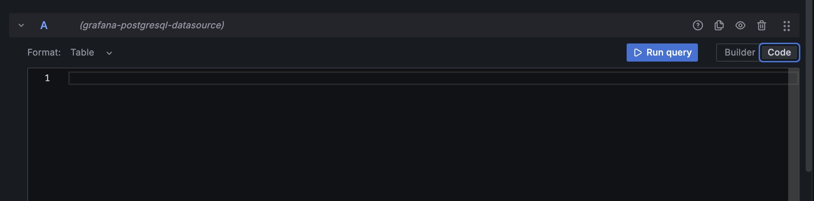

---

### Code along - Run Query

- Click `Run Query`
- This should fetch data from RedShift
- The main data panel at the top (the table View) should display our data

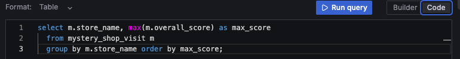

---

### Code along - Bar Chart settings

- Make sure the Visualisation type is `Bar Chart`
- Under `Panel Options`, update the Panel Title to e.g. "Mystery Shopper Ratings"
- Under `Bar Chart`, change the `X Axis` to `store_name`

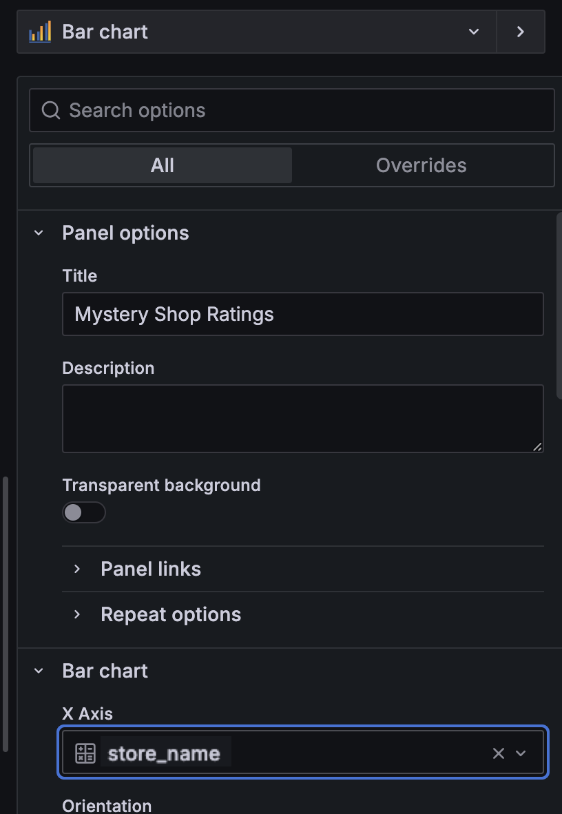

---

### Code along - Got data?

> The table view at the top should now have some data!


---

### Code along - bar chart view

- Toggle the `Table View` setting to `off`
- We should now see some data in a graph!


---

### Code along - Save the dashboard (1/2)

The UI is a bit odd here, we've made a panel but now need to save the dashboard:

- Click on the `Save` button (_not the `Apply` button_)
- Name your dashboard e.g. `Mystery Shopper Stats`
- The dashboard should now be saved


---

### Code along - Save the dashboard (2/2)

- Whoopsy: If you click `Apply` instead of `Save` then you can still save the dashboard via the little cog icon:

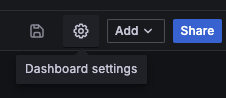

---

### All done!

> Great news, we now have a full ETL pipeline with data visualisation!!

---

### Our last user story - Architecture

This is what we just completed - our full pipeline configured in IaC!

<!-- .element: class="centered" height="350px" -->

Notes: Opt/Alt+Click to zoom diagram

---

### Final Pipeline Architecture

And finally - the diagram of "what we used this session" is now the same as the "Full Architecture Diagram"... we are _feature complete_ on Mystery Shopper!

<!-- .element: class="centered" height="350px" -->

Notes: Opt/Alt+Click to zoom diagram

---

### Tips for your team projects (offline)

> For your project time, there is a file of a few pointers and gotchas to consider.

- See [./handouts/README-team-project-considerations.md](./handouts/README-team-project-considerations.md)

---

### Terms and Definitions - recap

- EC2
- User data
- Launch Configuration
- Security Group
- IP Address
- Grafana for Visualisations
    - And in Grafana: Dashboard, Panel, Connector, Data Source

---

### Overview - recap

- What is EC2
- Running a virtual server in the cloud
- Configuring the startup of an EC2
- Hosting applications inside our Servers

---

### Learning Objectives - recap

- Add an EC2 server with CloudFormation
- Configure the User Data of the machine
- So that we can host (run) Grafana in the EC2

---

### Emoji Check:

On a high level, do you think you understand the main concepts of this session? Say so if not!

1. 😢 Haven't a clue, please help!
2. 🙁 I'm starting to get it but need to go over some of it please
3. 😐 Ok. With a bit of help and practice, yes
4. 🙂 Yes, with team collaboration could try it
5. 😀 Yes, enough to start working on it collaboratively

Notes:
The phrasing is such that all answers invite collaborative effort, none require solo knowledge.

The 1-5 are looking at (a) understanding of content and (b) readiness to practice the thing being covered, so:

1. 😢 Haven't a clue what's being discussed, so I certainly can't start practising it (play MC Hammer song)
2. 🙁 I'm starting to get it but need more clarity before I'm ready to begin practising it with others
3. 😐 I understand enough to begin practising it with others in a really basic way
4. 🙂 I understand a majority of what's being discussed, and I feel ready to practice this with others and begin to deepen the practice
5. 😀 I understand all (or at the majority) of what's being discussed, and I feel ready to practice this in depth with others and explore more advanced areas of the content
