## Message Queues with AWS

---

### AWS sessions list

This is the list of AWS sessions done so far, and the following ones:

- AWS 01 AWS + Cloud Intro ✅ _1.5hrs_
- AWS 02 AWS CLI Setup ✅ _1.5hrs_
- AWS 03 S3 Storage (Console) ✅ _1.5hrs_
- AWS 04 CloudFormation Intro + S3 Storage (IaC) ✅ _1.5hrs_
- AWS 05 Lambda Intro ✅ _1.5hrs_
- AWS 06 Lambda (IaC) ✅ _1.5hrs_
- AWS 07 Redshift (IaC) ✅ _1.5hrs_
- AWS 08 EC2 (IaC) + Grafana setup ✅ _1.5hrs_
- AWS 09 Queues ⬅ _1.5hrs_
- AWS 10 Monitoring _1.5hrs_

---

### Overview

- Message Queues
- Event Driven Design
- Pub/Sub Model and Notifications

---

### Learning Objectives

- Understand what a queue is, and its use cases
- Understand how system design can change to utilise queues
- Understand the pub/sub model, and its use cases
- Create/use a queue and a notification topic in AWS

---

### Modern Apps

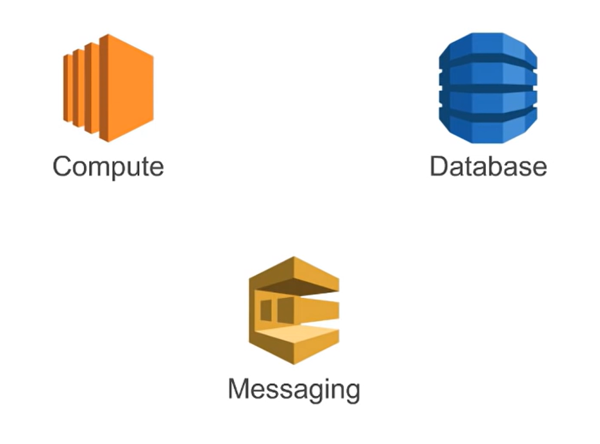<!-- .element: class="centered" -->

When you are creating modern app in the cloud, there are often three main pillars:

- Compute: ec2, lambda, ...
- Database: rds, ...
- Messaging

---

### Modern Apps

Messaging is the topic of today, and it's a kind of glue that often connects other high-performing pieces together.

When we are talking about messaging the most important thing is not just the message itself, but how it lets other components run as fast as possible by "de-coupling" them.

---

### What is a message?

A "message" is the data transported between the sender and the receiver application. It could be:

- A binary blob
- Encoded data (e.g. JSON/XML etc.)
- Can include many different attributes (key/values)
- A link to (or name of) a file, where the file is large

Notes:
'Message' is a broad definition - it can refer generally to any data sent between a sending and receiving service (or a 'producing' and 'consuming' service).

"Message" in it's essence is any data that goes from A to B!

BLOB stands for a “Binary Large Object,” a data type that stores binary data. Binary Large Objects (BLOBs) can be complex files like images or videos, unlike other data strings that only store letters and numbers.

A BLOB will hold multimedia objects to add to a database; however, not all databases support BLOB storage. Because of their complex nature, BLOBs will also not be easily readable by most databases. These file types are better comprehended by humans instead of software. The complexity of a BLOB both gives it its value, but also can make it difficult to utilise.

---

### Sample message JSON

Many systems use JSON formatted messages, for example maybe this for data delivery:

```json
{
    "type": "sale",
    "item": "Coffee",
    "total": 1.77
}
```

or this for notification of a file we could process:

```json
{
    "type": "daily-report-file",
    "location": "s3://coffee-data-bucket/sales_data.csv",
    "timestamp": "13-Jan-2025 18:00"
}
```

Notes:
Less common now is XML, but still "relatively common".

Can also be plain text, or binary (BLOBS - Binary Large OBjects).

---

### What is a message queue?

Conceptually you can think of them in the same way as a physical queue, where in most cases the items in the queue are processed in the order they joined.

<!-- .element: class="centered" -->

_A queue of people outside the original Sainsburys supermarket!_

---

### What is a message queue? (cont)

- A durable buffer for our messages
- Message queues can be used to decouple heavyweight processing, to buffer or batch work, and to smooth spiky workloads
- A message queue is a form of asynchronous service-to-service communication used in serverless and microservices architectures

---

### What is a message queue? (cont)

- Messages are stored on the queue until they are **processed** and **deleted**
- Each message is usually processed only once, by a single consumer
- A producing service will send a message to a queue, where it will 'wait' to be consumed by a consuming service. Additional messages may be sent while the first message is still waiting, and they will queue up behind it. Usually, once the first message has been consumed, it will be removed from the queue, and the next message moves to the 'front' of the queue to be consumed.

---

### Producer and Consumer Pattern

A Producer creates a message and puts it on a queue

<!-- .element: class="centered" -->

...and a Consumer takes messages off the queue to process.

Notes:

Types of message queues

- Point-to-Point (sender > potential-receiver)
- Publish/Subscribe

Messages are stored on the queue until they are processed and deleted. Usually message should be processed only once to maintain data integrity.

A message queue provides a lightweight buffer which temporarily stores messages, and endpoints that allow software components to connect to the queue in order to send and receive messages

---

### Producer and Consumer Pattern

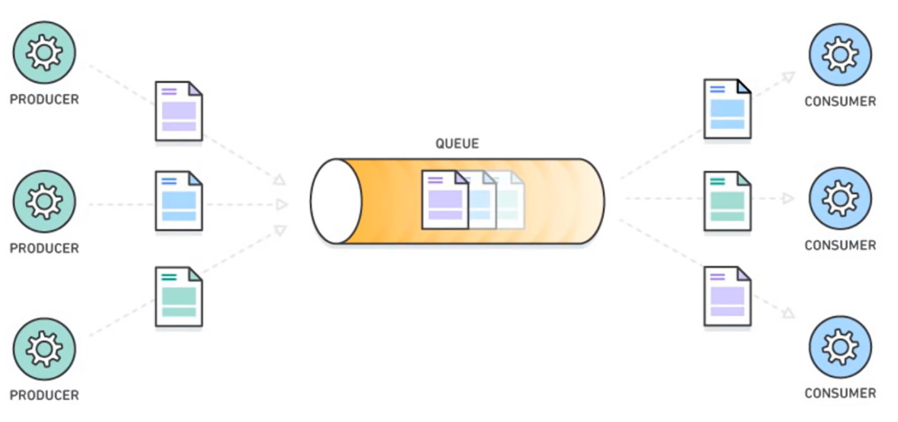<!-- .element: class="centered" -->

Notes:
Many producers and consumers can use the queue, but each message is processed only once, by a single consumer. For this reason, this messaging pattern is often called one-to-one, or point-to-point, communications. When a message needs to be processed by more than one consumer, message queues can be combined with Pub/Sub messaging in a fanout design pattern.

---

### Practice (code-along)

Create a python script named `dummy_queue.py` with the following functions - keep the FIFO (First In, First Out) principle in mind:

```py
queue = []

def produce(value):
    pass

def consume():
    pass
```

Notes:
DON'T make a file called `queue.py`, that will clash with python built in functions by name and give you weird errors.

Solution also available in [./solutions/queue_demo.py](./solutions/queue_demo.py)

---

### Practice (code-along)

Usage:

```py
queue = []

def produce(message):
    queue.append(message)
    print(f"Produced message: {message}")

def consume():
    print(f"Consumed message: {message}")
    return message

produce("Sold a coffee")
produce("Sold a latte")

consume()  # "Sold a coffee"
consume()  # "Sold a latte"
consume()  # "No message to consume."
```

Notes:
Solution also available in [./solutions/queue_demo.py](./solutions/queue_demo.py)

---

### Why do we use them?

We now know what a message and a queue are, but why are they useful?

- Indirect one way communication
- Process-intensive applications can be decoupled to prevent impact on other services
- Easier to replace services without changing dependent services

Notes:

indirect one-way communication channel between the Consumer and Producer. This can be especially useful for **decoupling heavyweight processing application** to prevent them impacting other applications in the system.

decoupling: as a producer I don't care which service is going to use this data, as a consumer I don't care who created this data

This makes it much easier to totally replace components in a system without having to amend its dependencies.

A > queue > B

A out of service

C > queue > B

B didn't even noticed (we do not change anything in B config)

Queue: help us create services **modular**

---

### Service Decoupling

Service A does not need to know anything about Service B and likewise for Service B

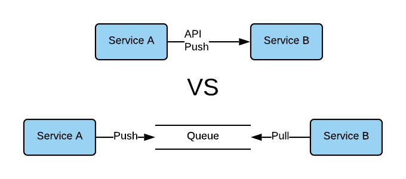<!-- .element: class="centered" -->

Decoupled service-to-service communication makes it simpler to replace components without requiring changes to other components.

Notes:

If Service A pushes to Service B directly - it needs to route to the correct **endpoint**, use proper **protocols**, **headers** etc.

Where we use a queue instead - Service A can send a message to the queue **without having to know** about these things. Service B can also consume the message from the queue without having any real knowledge of Service A.

In practice, it makes sense to maintain the **contract between services** even with a queue in the middle. If Service A changes the structure of the messages it sends to the queue, Service B will still consume these, but may not be able to process them. So the consuming Service should have some knowledge of the message format being sent by the producing service. Testing can help to make sure both stay in sync.

This design also makes it much easier to replace components - you could replace Service A with a completely new service that sends a **similarly formatted** message to the queue, and Service B would never even notice.

---

### Emoji Check:

How did you find the concept of Queues?

1. 😢 Haven't a clue, please help!
2. 🙁 I'm starting to get it but need to go over some of it please
3. 😐 Ok. With a bit of help and practice, yes
4. 🙂 Yes, with team collaboration could try it
5. 😀 Yes, enough to start working on it collaboratively

Notes:
The phrasing is such that all answers invite collaborative effort, none require solo knowledge.

The 1-5 are looking at (a) understanding of content and (b) readiness to practice the thing being covered, so:

1. 😢 Haven't a clue what's being discussed, so I certainly can't start practising it (play MC Hammer song)
2. 🙁 I'm starting to get it but need more clarity before I'm ready to begin practising it with others
3. 😐 I understand enough to begin practising it with others in a really basic way
4. 🙂 I understand a majority of what's being discussed, and I feel ready to practice this with others and begin to deepen the practice
5. 😀 I understand all (or at the majority) of what's being discussed, and I feel ready to practice this in depth with others and explore more advanced areas of the content

---

### Back to Mystery Shopper

Consider the Mystery Shopper example;

<!-- .element: class="centred" -->

Notes:
Questions on next slide

---

### Discussion - 5 mins

> Where in the Mystery Shopper architecture might we put queues?
>
> And - why would you put them there?

Notes:

- Get some suggestions.
- Between the S3 and Lambda
- Break the Lambda up into pieces
- Could even go as far as "S3 -> SQS -> Extract lambda -> SQS -> Transform lambda -> SQS -> Load lambda -> Redshift"

---

### Quiz Time! 🤓

---

**Which of the following would be a valid message to send to a queue?**

1. `"I am a message!"`
1. `{"date": "01/01/2021", "content": "I am a message!"}`
1. `11011000 10101101 10001101 100110001`
1. `All of the above`

Answer: `4`<!-- .element: class="fragment" -->

---

**A message producer will...**

1. Send a message to a queue
1. Take a message from a queue
1. Both of the above
1. Neither of the above

Answer: `1`<!-- .element: class="fragment" -->

---

### Let's create a queue

- We'll use AWS Simple Queue Service (SQS)
- We can create a queue using the AWS console
- We'll put an item onto the queue
- And we'll have a look at the items on the queue

---

### SQS Demo - code along

> A walkthrough setting up an SQS queue.

_Steps on next slides._

---

### Go to SQS in AWS

- Login to AWS
- Click on "Services" and search for "SQS"
- Select "Simple Queue Service" and then `Create Queue`

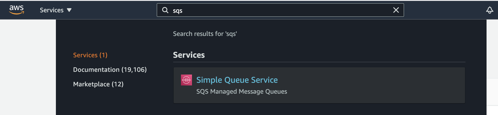<!-- .element: class="centered" height="200px" -->

---

### Create a queue

- Select "Standard Queue" as the type
- Give your queue a name (`<your-name>-coffee-sales-queue`)

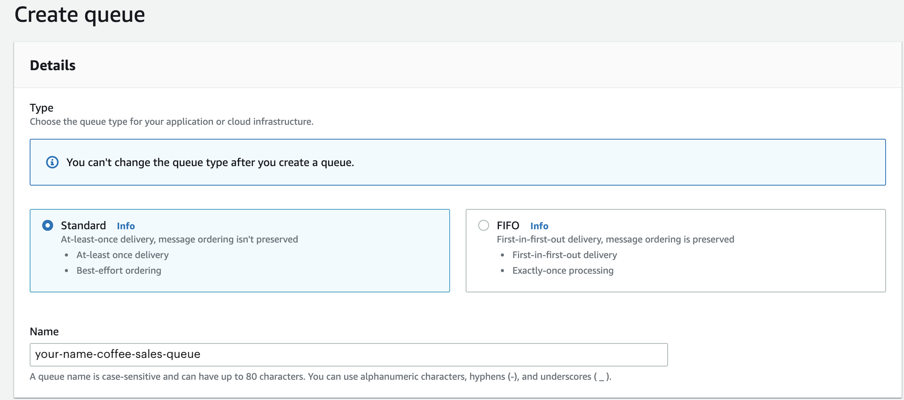<!-- .element: class="centered" height="300px" -->

---

### Create a queue

- In `Encryption`, verify `Server-side encryption` is `Enabled` (leave the other options on default)
- Leave the other standard configurations as they are
- Add a `Tag` with key `Name` and the same value as your queue name
- Finally, and select `Create Queue` at the bottom of the screen

---

### Config for later

Now the queue is created, we need to know it's url for sending it messages.

- From the console, click the "Copy URL" button

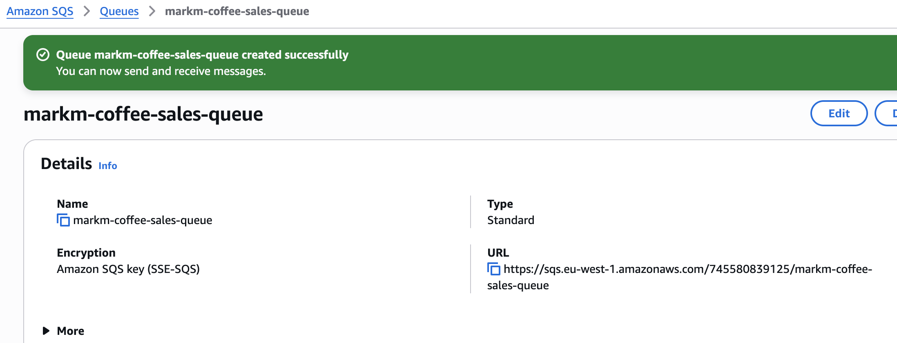

---

### Using AWS CLI

- Open a terminal
- Log into AWS using your standard alias or command

Notes:

Different login commands for School of Tech or Generation

---

### Let's put a message on the queue

- We can submit a message using the AWS CLI
- Substitute the URL of your queue from before

```sh
aws sqs send-message --queue-url <queue-url> \
    --message-body "I bought a coffee for <your-name>" \
    --profile <aws-profile>
```

You should get a reply like

```json
{
    "MD5OfMessageBody": "6a5dc09a156f2dcd3e526713093157fb",
    "MessageId": "d04b9e8d-c033-47e2-b707-f42861332ac6"
}
```

---

### We can now inspect the contents of the queue

- Go back to the SQS console
- Refresh the master list of all queues
- It should display 1 "Messages Available" next to your queue
- Click on your queue name and select "Send and receive messages"

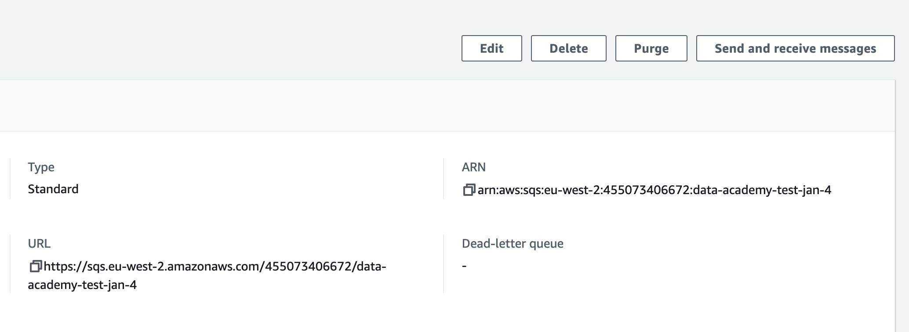<!-- .element: class="centered" height="300px" -->

---

- You may have to scroll to the bottom and click 'Poll for Messages', then it should appear in the list of messages

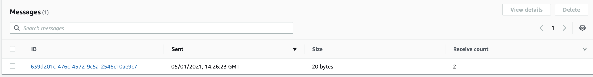<!-- .element: class="centered" height="100px" -->

- Click on the message id

---

- You should see your text

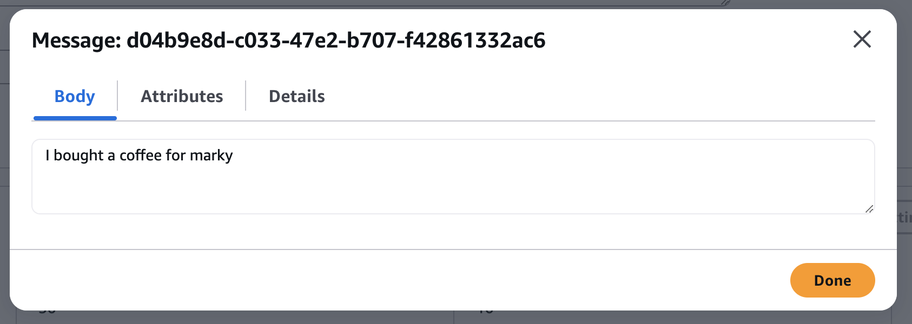<!-- .element: class="centered" -->

> Awesome! we have now consumed a message

---

### Once more with feeling

> Now we have sent a message with the CLI, lets send one with some Python code.

- Make sure you have a venv active
- Run `python3 -m pip install boto3`
    - You may need to use `python` on windows or `py` instead of `python3`

Notes:
Get everyone to do this in VSCode.

Code on next slide.

Example available in [./handouts/send_to_sqs_queue.py](./handouts/send_to_sqs_queue.py)

---

### Code along - put a message on the queue using BOTO3

```python
import boto3
import json

session = boto3.Session(profile_name='<aws-profile>')
sqs_client = session.client('sqs')

message = { "item": "latte", "price": 2.25 }
```

_continued next slide_

Notes:
Get everyone to do this in VSCode.

Example available in [./handouts/send_to_sqs_queue.py](./handouts/send_to_sqs_queue.py)

---

### Code along - put a message on the queue using BOTO3

```python
response = sqs_client.send_message(
    QueueUrl="<url-of-the-queue>",
    MessageAttributes={
        'Author': {
            'StringValue': '<your-name>',
            'DataType': 'String'
        }
    },
    MessageBody=json.dumps(message)
)

print(f'response = {response}')
```

Notes:
Get everyone to do this in VSCode.

Example available in [./handouts/send_to_sqs_queue.py](./handouts/send_to_sqs_queue.py)

---

### Code along - check sending

> Go back to the AWS SQS Console and check for your latest message.

Notes:
Check everyone has seen it.

---

### Event driven design

- Be told when something happens rather than asking
- This is more efficient than polling for changes
- Queues can form a key component of an event driven architecture
- The publisher/subscriber (pub/sub) design is also key

Notes:
Event driven design is a relatively modern idea on how to design systems.
vs. request-driven

The events that are published and consumed, processed and persisted, are the core of the system.

- **Such a system will be heavily decoupled by design**
- **scalability** (you can always add new components which work with existing events)
- **adaptability** (quite easy to independently replace components) and availability of 'real-time' data.
- Potential **drawbacks** include **difficulty to monitor** - when you don't have direct flows through the system, it can be hard to follow!

---

### Non event driven

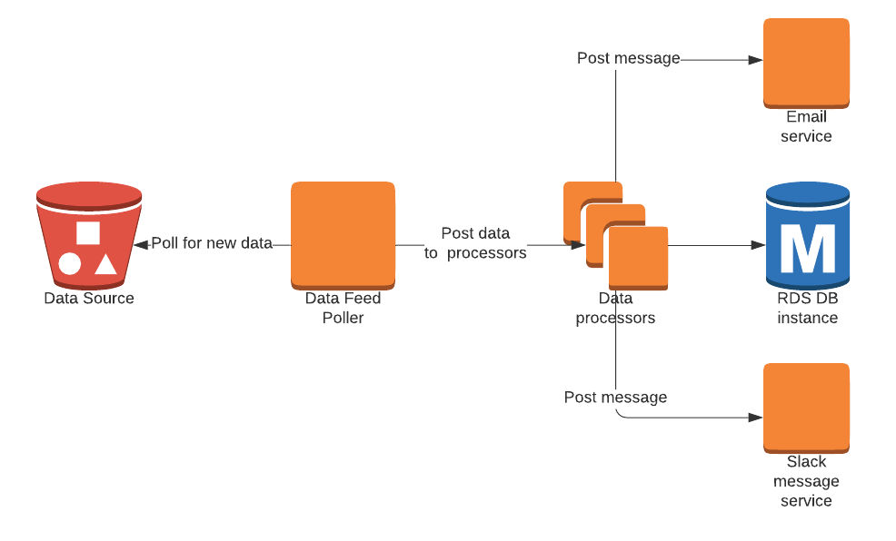<!-- .element: class="centered" -->

---

### Event driven

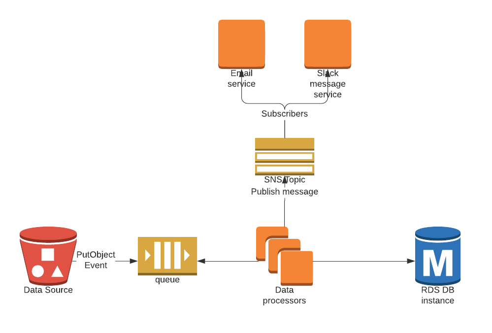<!-- .element: class="centered" -->

---

### What's the difference?

- We are notified when there is new data instead of checking all the time
- The data processor is now in control of how much data it processes
- We can add new subscribers to events dispatched from the data processor without changing the data processor

---

## Fault Tolerance

- The ability to gracefully degrade during failures in a system
- If the Consumer is unavailable, messages are not immediately lost
- Messages can be processed once the Consumer is available again

Notes:
By separating different components with message queues, you create more fault tolerance

Queues persist your data, reducing errors if parts of your system go offline

Data (messages) will be persisted inline with the retention period you have configured

---

## Traffic Smoothing

In situations where you can have sudden spikes in load to an application, using a queue you can control the rate of data processing to prevent the application becoming overloaded.

Notes:
Queues can act as a buffer, allowing the application to process data at a more consistent rate

---

## Granular Scaling

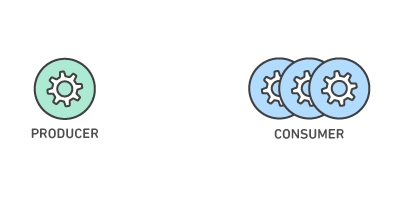<!-- .element: class="centered" -->

Depending on the demands on the system, you can scale the number of Consumers and Producers independently. These can grow and shrink as the workload requires.

Notes:
Message queues make it possible to scale precisely where you need to.

When workloads peak, multiple instances of your application can all add requests to the queue without risk of collision.

As your queues get longer with these incoming requests, you can distribute the workload across a fleet of consumers.

Producers, consumers and the queue itself can all grow and shrink on demand.

---

### Emoji Check:

How did you find the implementation of AWS SQS queues and it's implementation for event-driven system design?

1. 😢 Haven't a clue, please help!
2. 🙁 I'm starting to get it but need to go over some of it please
3. 😐 Ok. With a bit of help and practice, yes
4. 🙂 Yes, with team collaboration could try it
5. 😀 Yes, enough to start working on it collaboratively

Notes:
The phrasing is such that all answers invite collaborative effort, none require solo knowledge.

The 1-5 are looking at (a) understanding of content and (b) readiness to practice the thing being covered, so:

1. 😢 Haven't a clue what's being discussed, so I certainly can't start practising it (play MC Hammer song)
2. 🙁 I'm starting to get it but need more clarity before I'm ready to begin practising it with others
3. 😐 I understand enough to begin practising it with others in a really basic way
4. 🙂 I understand a majority of what's being discussed, and I feel ready to practice this with others and begin to deepen the practice
5. 😀 I understand all (or at the majority) of what's being discussed, and I feel ready to practice this in depth with others and explore more advanced areas of the content

---

### Handling failures

What happens if the message cannot be processed?

- Retry `n` times to process, there could be a temporary issue
- Configure a visibility timeout - how long to wait for a Consumer before making it visible on the queue again
- Configure a redrive policy - how many processing attempts per message
- Send it to a Dead Letter Queue (DLQ)

Notes:

reasons for errors might include: non-existing customer-id, badly formed json/xml, syntax error in message, failure to deserialize, and so on...

---

### Dead Letter Queues

Another queue where you can send messages that could not be processed. Useful for retaining the messages for inspection without them continuing to be processed by the consumer.

Notes:
By configuring policy (number of retries).

CloudWatch alarm on DLQ for when the number of message son it is > 0

---

### DLQ Demo - code along

> How do we set up dead letter queues?

_Steps on next slides._

---

### Create Dead Letter Queue (DLQ)

- We follow the same method as we did to create a queue above
- Use a related name to before, but append with `-dlq`
    - e.g. `<your-name>-sales-errors-dlq`
- Ensure it is encrypted at rest as before
- Add a `Name` tag as before (with the `-dlq` name)
- Accept the other standard configuration and select `Create Queue` at the bottom of the screen

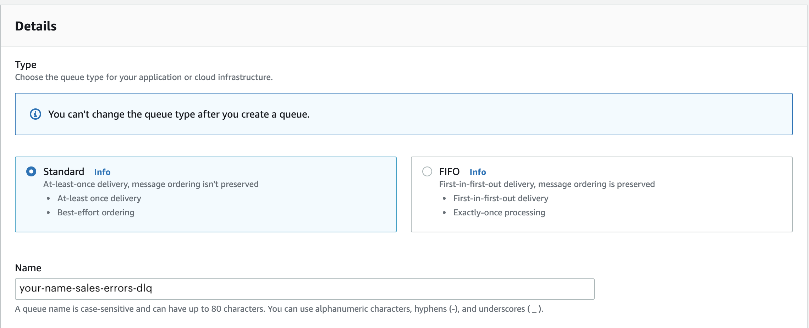<!-- .element: class="centered" height="200px" -->

---

- Open your `<your-name>-coffee-sales-queue` and select the edit button at the top right of the page
- One of the optional features is 'Dead-letter-queue'.
    - Set it to `Enabled` and choose your `-dlq` queue created earlier in the dropdown list,
- Then click `Save`
- Your `<your-name>-sales-errors-dlq` will now receive messages which could not be consumed by your `<your-name>-coffee-sales-queue`

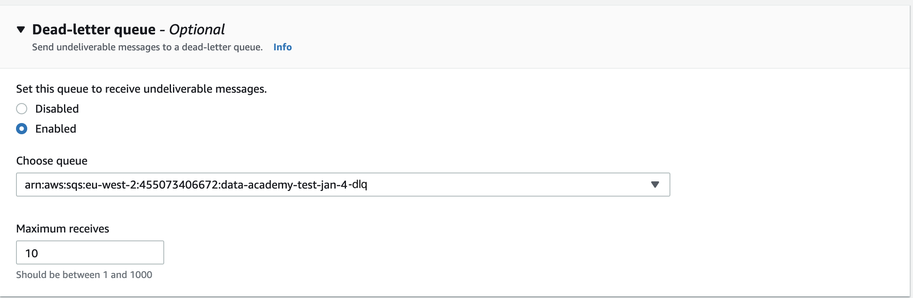<!-- .element: class="centered" height="200px" -->

Notes:

The Maximum receives value determines when a message will be sent to the DLQ. If the ReceiveCount for a message exceeds the maximum receive count for the queue, Amazon SQS moves the message to the associated DLQ (with its original message ID).

---

### Features of queues

- Different queue solutions offer different features
- Use case may dictate technology choice

Features may include:

- Visibility timeout
- Message retention period
- Delivery delay
- Best-effort ordering
- First-in-first-out delivery
- Exactly-once processing
- At-least once delivery

Notes:
Mention what these things are.

---

### Push or pull delivery

**Pull** means continuously querying the queue for new messages.

**Push** means that a consumer is notified when a message is available, this is also known as Pub/Sub messaging.

Notes:
Depends on the consumers/subscribers

---

### At least once delivery

Stores multiple copies of messages for redundancy and high availability. Messages are re-sent in the event of errors to ensure they are delivered at least once.

- High throughput
- Highly scalable as the traffic grows (few messages to 100,000 messages, same level of performance and latency)
- This elasticity comes with a cost, possible **duplication** and possibility of receiving **out of order**

Notes:
Discuss the pros and cons

---

### Exactly once delivery

When duplicates can't be tolerated, **FIFO** (first-in-first-out) message queues will make sure that each message is delivered exactly once.

Pros and cons:

- Higher latency (need to buffer to make sure there is no duplicate)
- Lower throughput
- If you want multiple workers, you need to create message groups (subscription groups - and have to add a tag to your messages)

Notes:

- receive messages in ordered fashion

---

### Emoji Check:

How did you find the concept of Queues, and it's implementation with AWS SQS?

1. 😢 Haven't a clue, please help!
2. 🙁 I'm starting to get it but need to go over some of it please
3. 😐 Ok. With a bit of help and practice, yes
4. 🙂 Yes, with team collaboration could try it
5. 😀 Yes, enough to start working on it collaboratively

Notes:
The phrasing is such that all answers invite collaborative effort, none require solo knowledge.

The 1-5 are looking at (a) understanding of content and (b) readiness to practice the thing being covered, so:

1. 😢 Haven't a clue what's being discussed, so I certainly can't start practising it (play MC Hammer song)
2. 🙁 I'm starting to get it but need more clarity before I'm ready to begin practising it with others
3. 😐 I understand enough to begin practising it with others in a really basic way
4. 🙂 I understand a majority of what's being discussed, and I feel ready to practice this with others and begin to deepen the practice
5. 😀 I understand all (or at the majority) of what's being discussed, and I feel ready to practice this in depth with others and explore more advanced areas of the content

---

## Queue vs Pub/Sub

---

### Queue

<!-- .element: class="centered" -->

---

### Pub/Sub

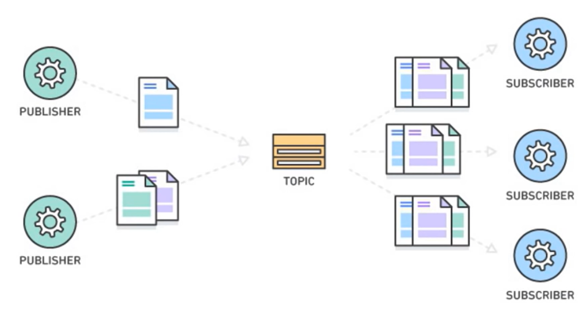<!-- .element: class="centered" -->

Notes:
Unlike message queues, which batch messages until they are retrieved, message topics transfer messages with no or very little queuing, and push them out immediately to all subscribers. All components that subscribe to the topic will receive every message that is broadcast, unless a message filtering policy is set by the subscriber.

Notification in microsoft teams: to all of us

if I get it on my phone, I should not get it in my other devices

---

### Amazon Simple Notification Service (SNS)

SQS is great, but what about when you need different patterns such as:

- Many to many messaging
- Selective routing
- Routing to multiple services

---

### SNS Topics

SNS introduces the concept of "topics" to solve these problems;

- Producers **Publish** to a topic
- Consumers **Subscribe** to that topic
- Hence the name **pub/sub**

---

### Multiple publishers

Notification queues can have multiple publishers.

> Can you think of examples where this might be useful?

Notes:
Get a few suggestions, e.g. different feeds (say, Coffee Shop Branches) all pushing data to a central Sales notification topic.

---

### Multiple Consumers

Messages sent to the topic can be subscribed to by multiple consumers:

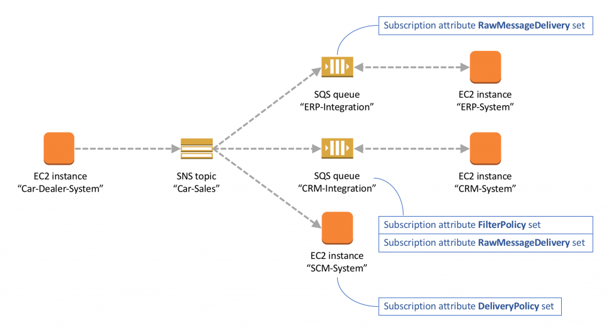<!-- .element: class="centered" -->

> Can you think of examples where this might be useful?

Notes:
We can start to see here how using the pub-sub design pattern opens up a huge amount of possibility for system design. We could publish a notification to a topic, which has various subscribers which all do different things with the message, and could have other subscribers which contribute to things like record keeping, monitoring, visualisation, notification etc.

Give the messaging example (same person with different devices)

---

### Subscriptions

Consumers can create subscriptions using a number of protocols:

- SQS
- AWS Lambda
- HTTP/S webhooks
- Email
- etc

---

### SNS Demo - code along

> A walkthrough setting up an SNS topic and pub/sub behaviour.

_Steps on next slides._

---

### Go to SNS in AWS

- Login to the AWS (Web) Console
- Click on "Services" and search for "SNS"
- ...and select "Simple Notification Service"

<!-- .element: class="centered" height="150px" -->

---

### Create a Topic 1/2

- Navigate to "Simple Notification System"
- Select "Topics"
- Select "Create Topic"

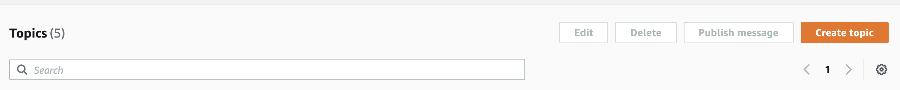<!-- .element: class="centered" height="100px" -->

---

### Create a Topic 2/2

- Choose Standard type
- Under `Encryption - optional` enable the `Encryption` option and keep the other defaults
- Enter a name e.g. `<your-name>-coffee-sales-notifications`
- Add a Tag with the key `Name` and same value as the queue name
- Click "Create"

<!-- .element: class="centered" height="200px" -->

---

### Create a Subscription

> Now we need to subscribe to our topic.

- You should now see the topic summary
- Click "Create Subscription"

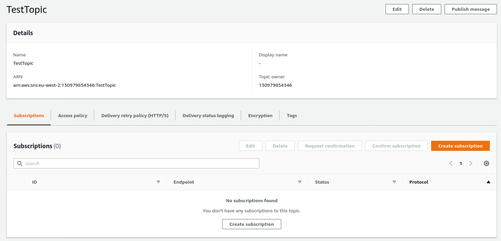<!-- .element: class="centered" height="250px" -->

---

### Create a Subscription

- The topic name should be pre-populated
- Choose "Amazon SQS" as the protocol
- For "Endpoint" select `your-name-coffee-sales-queue` that you created earlier in SQS
- Click "Create Subscription"

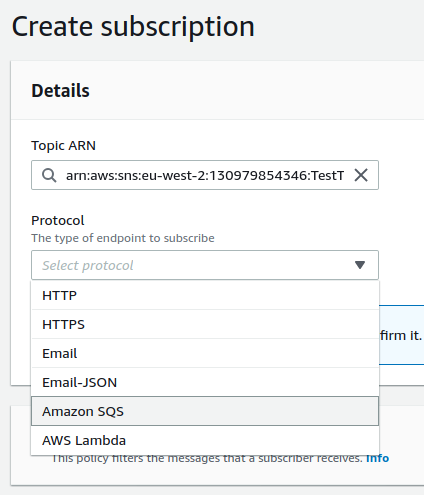<!-- .element: class="centered" height="300px" -->

---

### Send a message to the topic

- Get the ARN of your topic
- We can submit a message using the AWS CLI using, for example,

```sh
aws sns publish --topic-arn <topic-arn> \
  --message "Latte for <your-name>"
```

You should get a response like:

```json
{
    "MessageId": "54a2f084-c95d-56ab-9c42-9018e02b5f9d"
}
```

Notes:
If you get policy or access errors, see the next slide

---

### Errata: Debugging permissions

> You may need to add the `sqs:SendMessage` action to the access policy for your SQS queue. This should be set for you but does not always apply automatically.

If you do need to add it:

- Find your Queue in SQS
- Click on the "Queue Policy" tab
- Edit the JSON of the Policy
- Add a Statement to the Policy like that found in [./handouts/errata-queue-policy.json](./handouts/errata-queue-policy.json)
    - Substitute in the ARNS for your Queue and Topic
- Retry sending a Notification

Notes:
Can this be done entirely with sqs:\* IAM permissions? Will they need special IAM perms to grant permissions like this?

Edit the queue's policy

---

### Let's inspect the contents of the queue again

- Go back to the SQS console
- It should display 1 "Messages Available" next to your queue
- Click on the queue name and select "View/Delete Messages"
- You should be able to see the message you sent

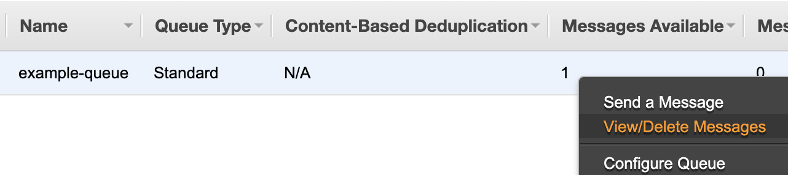<!-- .element: class="centered" height="100px" -->

---

### Success!

> Now we have sent a notification using the CLI, let is again try to use Python instead

Notes:
Example on next slide and in the [./handouts/scratch_send_to_sns_topic.py](./handouts/scratch_send_to_sns_topic.py) file

---

### Sending a message to topic with BOTO3

```python
import boto3
import json

session = boto3.Session(profile_name='<aws-profile>')
sns_client = session.client('sns')

message = { "type": "sale", "item": "coffee", "price": 1.50 }
```

_continued on next slide..._

Notes:
Example in the [./handouts/scratch_send_to_sns_topic.py](./handouts/scratch_send_to_sns_topic.py) file

---

### Sending a message to topic with BOTO3

```python
response = sns_client.publish(
    TargetArn="<topic-arn>",
    Message=json.dumps({'default': json.dumps(message)}),
    MessageStructure='json'
)

print(f'response = {response}')
```

Notes:
Example in the [./handouts/scratch_send_to_sns_topic.py](./handouts/scratch_send_to_sns_topic.py) file

---

### Going forward

By attaching other subscribers to this topic (possibly using different protocols) you can share messages out to multiple consumers.

Notes:
Show on the previous diagram that each person can have herself/himself queue

---

### Back to Mystery Shopper (again)

Consider the Mystery Shopper example;

<!-- .element: class="centred" -->

Notes:
Questions on next slide

---

### Discussion - 5 mins

> **Where** in the Mystery Shopper architecture might we put notifications queues (SNS)?
>
> And - _why_ would you put them there?
>
> What about the SQS?

Notes:

- Get some suggestions
- Between the S3 and Lambda would be standard for SNS
- Break the Lambda up into pieces
- Could even go as far as "S3 -> SNS -> Extract lambda -> SQS -> Transform lambda -> SQS -> Load lambda -> Redshift"

---

### Emoji Check:

How did you find the concept of Topics, and its implementation with AWS SNS?

1. 😢 Haven't a clue, please help!
2. 🙁 I'm starting to get it but need to go over some of it please
3. 😐 Ok. With a bit of help and practice, yes
4. 🙂 Yes, with team collaboration could try it
5. 😀 Yes, enough to start working on it collaboratively

Notes:
The phrasing is such that all answers invite collaborative effort, none require solo knowledge.

The 1-5 are looking at (a) understanding of content and (b) readiness to practice the thing being covered, so:

1. 😢 Haven't a clue what's being discussed, so I certainly can't start practising it (play MC Hammer song)
2. 🙁 I'm starting to get it but need more clarity before I'm ready to begin practising it with others
3. 😐 I understand enough to begin practising it with others in a really basic way
4. 🙂 I understand a majority of what's being discussed, and I feel ready to practice this with others and begin to deepen the practice
5. 😀 I understand all (or at the majority) of what's being discussed, and I feel ready to practice this in depth with others and explore more advanced areas of the content

---

## Things to be aware of

> There are a few extra things we need to consider in our systems is using queues...

---

### Added complexity

Using queues is more complex than just using a HTTP request to talk directly to the message consumer.

You need to determine on a case by case basis whether the additional complexity incurred is worthwhile.

---

### Duplicate Processing

- What will happen if a message is processed multiple times?
- What scenarios could cause this to happen?

Notes:
Duplicate messages could occur in cases of, for example, where a temporary issue prevents a message being properly accepted onto an SQS queue, and if there is a retry policy set then a second message is later sent. Then, for whatever, reason, the original message is successfully accepted.

(forget to acknowledge)

Touch briefly on idea of idempotency - certain requests are idempotent in that having them execute multiple times has the same results, while some do not (consider a GEt vs POST request). If a message is processed multiple times and the outcome is a non-idempotent operation, we may get into trouble. You can design your system to handle this, with various duplicate checking controls around non-idempotent actions, though this can be complex and requires a lot of foresight.

Amazon SQS can help to prevent this to an extent - using deduplication ids SQS will prevent duplicate messages within a few minutes of each other.

It is best to accept that, at some point, duplicate messages will be encountered, and plan on how to deal with this.

---

### Message Throughput

- Data messages are restricted in size (e.g. SQS messages max size is 256kb)
- If data is larger than this consider sending a reference to the file, instead of the contents
- You may be limited to a maximum number of messages per second you can process

Notes:
Depending on the message queue you are using, and the configuration of it, you may be constrained by a number of messages per second (MPS) you can add to the queue and also by a maximum individual message size.

---

### Terms and Definitions - recap

**Message**: A broad term for data passed between services. Usually, but not always, as JSON.

**Queue**: A method of service-to-service communication where the sender and receiver of a message don't interact at the same time. Messages placed on a queue stay there until consumed.

**Producer**: Service sending a message to a queue

**Consumer**: Service taking a message from a queue, to process it

---

### Terms and Definitions - recap

**Decoupling**: removing dependencies between services, e.g. by using a queue

**Fault Tolerance**: A system's ability to gracefully handle and recover from failure of a component

**Dead Letter Queue**: A queue where you can send messages that couldn't be processed, to be handled at a later time

**Pub/Sub**: a design pattern where messages are sent to a topic, and numerous services can subscribe to this topic

---

### Overview - recap

- Message Queues
- Event Driven Design
- Pub/Sub Model and Notifications

---

### Learning Objectives - recap

- Understand what a queue is, and its use cases
- Understand how system design can change to utilise queues
- Understand the pub/sub model, and its use cases
- Create/use a queue and a notification topic in AWS

---

## Further Reading

- [Intro to message queues](https://medium.com/tech-sauce/introduction-to-message-queuing-4a7ab8968b59)
- [Amazon SQS](https://aws.amazon.com/message-queue/)
- [Intro to Event Driven Architecture](https://medium.com/@cardona.root/event-driven-architecture-a-brief-introduction-bf4aaec74fd8)
- [Intro to the pub/sub design pattern](https://medium.com/@adriennedomingus/distributed-systems-an-introduction-to-publish-subscribe-pub-sub-6bc72812a995)
- [Amazon SNS](https://aws.amazon.com/sns/?whats-new-cards.sort-by=item.additionalFields.postDateTime&whats-new-cards.sort-order=desc)

---

### Emoji Check:

On a high level, do you think you understand the main concepts of this session? Say so if not!

1. 😢 Haven't a clue, please help!
2. 🙁 I'm starting to get it but need to go over some of it please
3. 😐 Ok. With a bit of help and practice, yes
4. 🙂 Yes, with team collaboration could try it
5. 😀 Yes, enough to start working on it collaboratively

Notes:
The phrasing is such that all answers invite collaborative effort, none require solo knowledge.

The 1-5 are looking at (a) understanding of content and (b) readiness to practice the thing being covered, so:

1. 😢 Haven't a clue what's being discussed, so I certainly can't start practising it (play MC Hammer song)
2. 🙁 I'm starting to get it but need more clarity before I'm ready to begin practising it with others
3. 😐 I understand enough to begin practising it with others in a really basic way
4. 🙂 I understand a majority of what's being discussed, and I feel ready to practice this with others and begin to deepen the practice
5. 😀 I understand all (or at the majority) of what's being discussed, and I feel ready to practice this in depth with others and explore more advanced areas of the content
