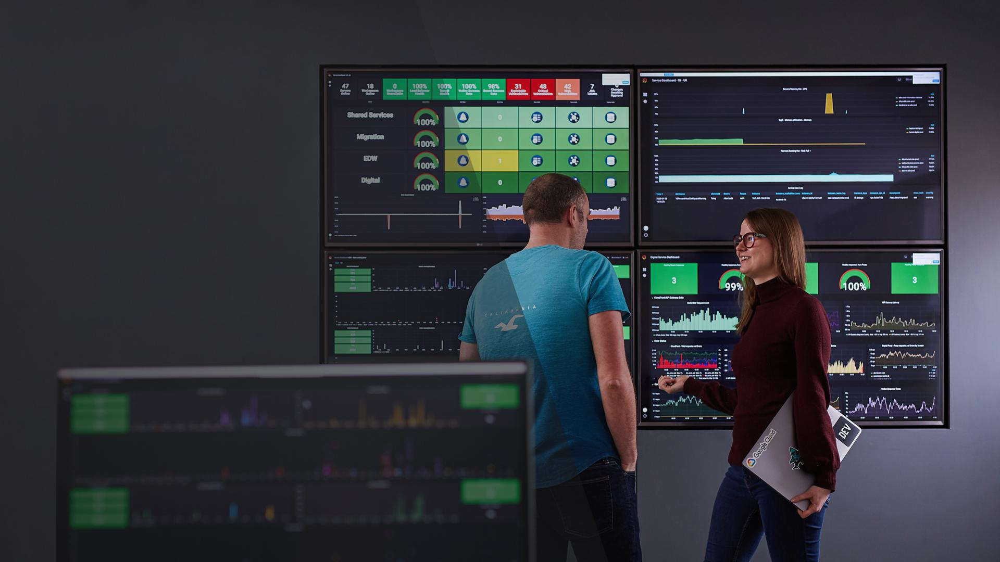
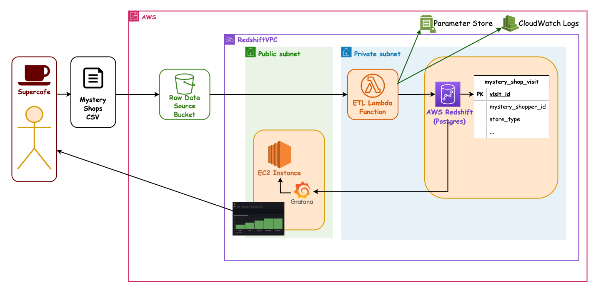
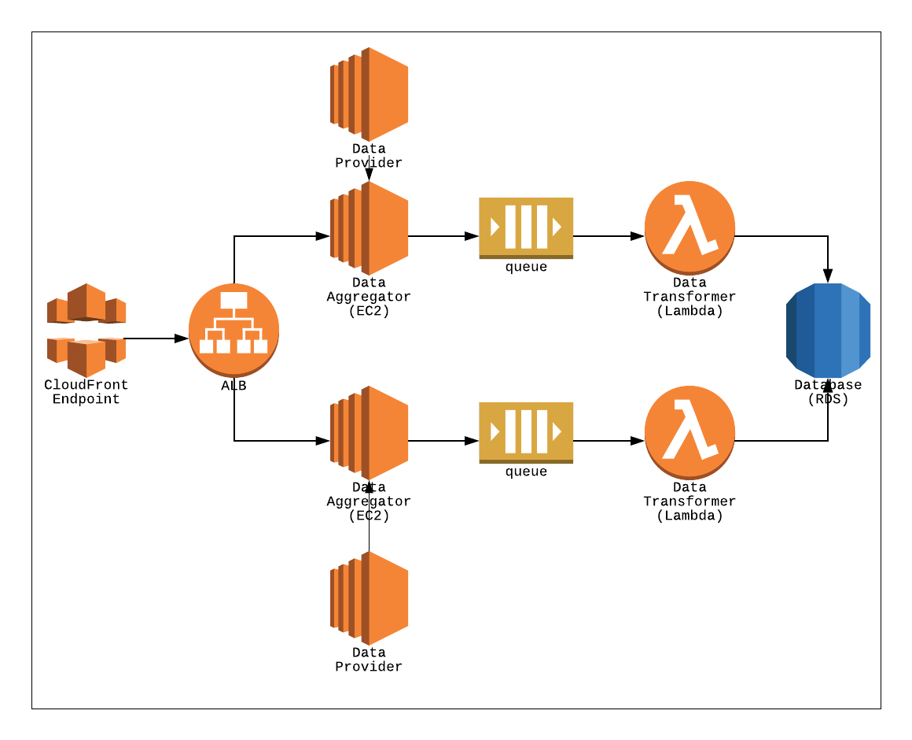
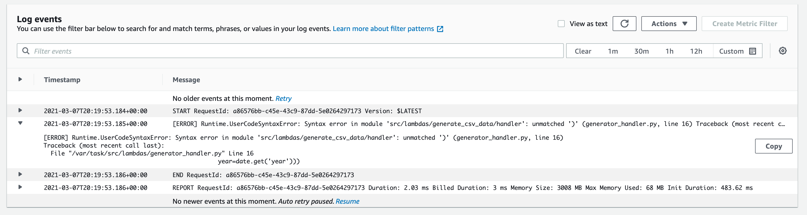
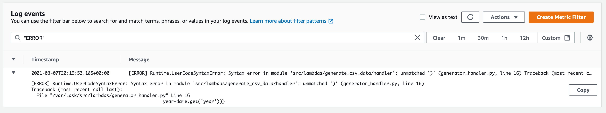
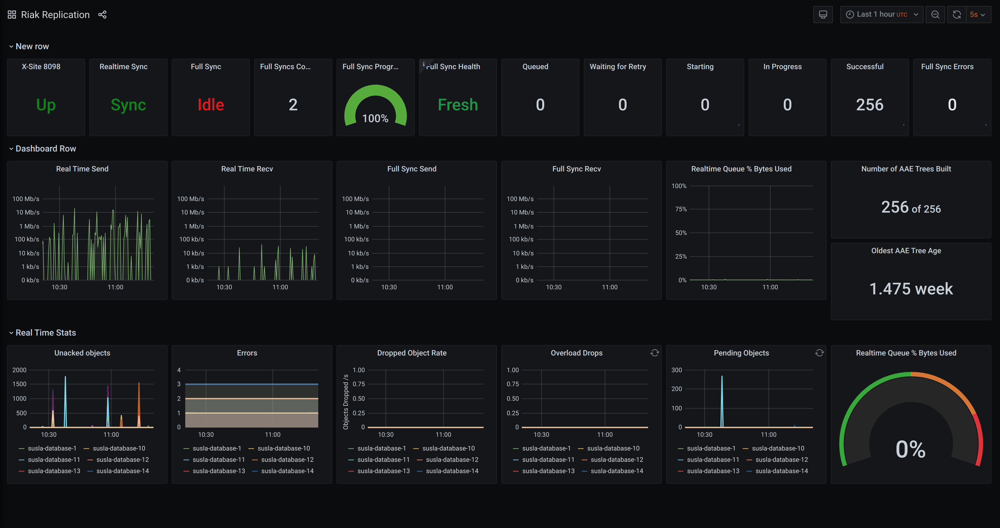
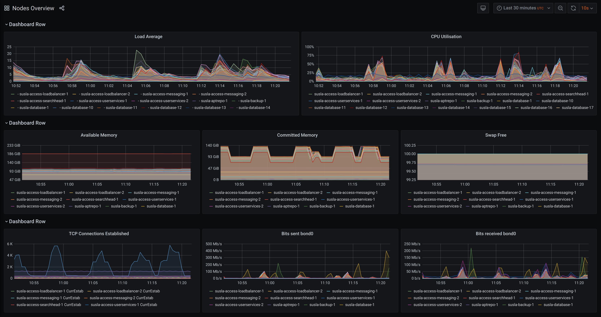

## Monitoring with AWS

---

### AWS sessions list

This is the list of AWS sessions done so far, and the following ones:

- AWS 01 AWS + Cloud Intro ✅ _1.5hrs_
- AWS 02 AWS CLI Setup ✅ _1.5hrs_
- AWS 03 S3 Storage (Console) ✅ _1.5hrs_
- AWS 04 CloudFormation Intro + S3 Storage (IaC) ✅ _1.5hrs_
- AWS 05 Lambda Intro ✅ _1.5hrs_
- AWS 06 Lambda (IaC) ✅ _1.5hrs_
- AWS 07 Redshift (IaC) ✅ _1.5hrs_
- AWS 08 EC2 (IaC) + Grafana setup ✅ _1.5hrs_
- AWS 09 Queues ✅ _1.5hrs_
- AWS 10 Monitoring ⬅ _1.5hrs_

---

### Prep for later

- Start `podman` or `docker`
- Pull the grafana image by running:

```sh
podman pull docker.io/grafana/grafana
podman pull docker.io/python:3-alpine
```

or

```sh
docker pull docker.io/grafana/grafana
docker pull docker.io/python:3-alpine
```

Notes:

- Also get everyone to stop and remove any old containers.
- Might need to run the following to check:

```sh
podman machine list
# if stopped run
podman machine start
# check running containers
podman ps -a
```

---

### Overview

- What does software monitoring consist of?
- Why do we monitor software?
- Monitoring infrastructure
- Monitoring applications

---

### Learning Objectives

- Identify the features of software monitoring
- Explain why and what we monitor
- Define logging and what logs are used for
- Detail the features of CloudWatch and Grafana

---

### Monitoring our software

Monitoring software involves continuously examining a running system with two main aspects

1. Monitoring and measuring the performance of the system
1. Monitoring and auditing events that occur within the system

<!-- .element: class="centered" -->

---

### A real monitoring picture

Here's an image form a few years ago of real monitors displaying real info. (This image was once upon a time on the landing page of the Infinity Works website):



> What sort of things might we be seeing?

Notes:
Quick 5 min discussion max.
Discuss with the cohort - what sort of things might this be showing us? What could those graphs be about, with all the different colours?

---

### What do we track?

What kind of things do we track?

- Uptime
- Resource utilisation (CPU, memory, network)
- Performance (requests/s, ops/s)
- Errors
- Business KPIs
- User interactions

Notes:
KPIs = Key Performance Indicators

These are several of things that we can monitor in a running system. Can you give any other examples of things we might track?

---

### Why do we monitor?

- To take action as soon as (or even before) things go wrong
- Understand actual application usage patterns
- Make more accurate business decisions
- Learn what normal looks like
- Assess the impact of our releases: performance degradation, regressions, downtime...
- Identify areas in our architecture to improve
- **Make on-call work humanly possible - make life easier for everyone**

Notes:

- Be proactive rather than reactive when it comes to managing the health of your application.
- As full-stack, DevOps engineers deploying stuff to prod is only the beginning.
- The service needs to be supported and managed afterwards. Identify pinch points. Also, on the release impact point, it allows us not only to smoke test our app post-release but also pre-release as we can deploy the same monitoring config to our test environments
- Regression: a software bug that makes a feature stop functioning as intended after a certain event (e.g. system upgrade)

---

### What do we monitor?

- Infrastructure
- Applications
- Component interactions

Notes:

- Component interaction monitoring is very important with distributed architectures, like micro-services. Is Service A talking to Service B?
- We won't talk about this one today, but this would be tools like X-Ray, Jaeger or service mesh built-ins, like istio & kali
- For example AWS XRAY lets you track the communication between Lambdas and see it in a diagram - see <https://aws.amazon.com/xray/>

---

### What can we monitor here?

Consider the Mystery Shopper architecture from AWS sessions 01 through 08...

<!-- .element: class="centered" -->

Notes:
Point out components of this diagram that are worthwhile monitoring in some way: s3, s3 files, s3 bytes in/out, number files triggered, number lambdas invoked, number files processed, invocation errors, lambda timeouts, amount of data saved, bytes in/out, grafana cpu usage, etc

---

### What can we monitor?

> How about on a diagram we're not familiar with? What could we monitor here?

<!-- .element: class="centered" -->

Notes:
Point out components of this diagram that are worthwhile monitoring in some way: individual elements (hardware, infra), apps running in the EC2s and Lambdas, as well as communication channels (X-Ray, etc.)

---

## Monitoring Infrastructure

---

### CloudWatch

CloudWatch is a monitoring and alerting managed service for AWS and offers the following:

- Log aggregation, retention, rotation and search
- Monitoring dashboards for AWS infrastructure out-of-the-box
- Alarms and system events

We will expand on CloudWatch shortly.

---

### SNS

This is a commonly used AWS service when we are adding monitoring. It can push out notifications to different subscribers via various channels, e.g.

- Email
- SMS
- Mobile push notifications
- Lambda

...which can be very useful when we detect errors in the system.

---

### SNS - Concepts (recap)

As a recap from our previous sessions:

- _Topic_: notification category. You or an application can subscribe to it and get notified when a new event gets pushed to it
- _Subscription_: sets the receiver of a notification and also dictates how they'll receive it - we can have many of these

**Practical application:** For example, when we detect an error, we can publish a notification to an alert _Topic_, and have several subscribers (Slack, Email, Pager, etc) all _Subscribed_ to that topic.

---

## Monitoring applications

---

### Application Logs

A **log** is a message produced by a running application capturing some noteworthy information about its state or an event taking place at that point in time.

Notes:
You can think of logs as your app's running journal

---

### Useful logs

> What sort of information should we put in log messages to make them useful?

Good logs tell the "story" of what is happening in our system.

---

### What do we use logs for?

- Obtaining failure messages when our app crashes
- Tracing application flow
- Debugging our running application
- App health monitoring
- Timing stuff precisely

Notes:

- Detecting when apps stop working or shut down
- Failure messages from your system can be generated by your log messages
- These can also be generated by the underlying system, if it encounters an error that you have not coded for
- For example error logs from your lambda will automatically go into Cloudwatch - we can monitor to make sure we don't have errors and get alerted when there are some

---

## What do we NOT log?

- Any _Data_ from the system - do not log what you loaded from a file or are inserting to a DB or are getting from a DB, and so on
- Passwords
- Secrets
- Tokens
- PII (Personally Identifiable Information)

---

### How do you log?

At it's simplest - write the message to stdout!

```py
# Python
try:
    div = 1 / 0
except Exception as e:
    print("ERROR: " + str(e))
```

Notes:
For example, any `print()` statement in our Lambda code will get logged into CloudWatch.

When running in a terminal they will be displayed in the terminal or can be sent to a file.

---

### No, really, how do you log

Most languages now have logging libraries available.

These remove much of the boilerplate and setup required to produce manageable and standardised logs.

```py
# Import the built-in logging lib
import logging

# Create an app logger
logger = logging.getLogger(__name__)

try:
  div = 1 / 0
except Exception as e:
  # Log an exception, it will go to stdout by default
  logger.exception(e) # we can also pass a message
```

Notes:
One of many examples! See next slides.

---

### Logging Levels

Logging statements are added at key areas of your codebase and can serve many different purposes

&#8505; Info: they document normal state changes in the app. They contain non-actionable information<!-- .element: style="color:green" -->

⚠ Warning: non-fatal errors, the kind of events you can leave until the next morning<!-- .element: style="color:yellow" -->

🚨 Error: fatal, the kind of events you'd be woken up in the middle of the night to resolve<!-- .element: style="color:red" -->

Notes:
Log Levels help to show how important an event is when you write your program.

When you write your programs, you may also use the DEBUG log level.

---

### Python logging

In python we can log at different levels like this:

```py
import logging
# Create an app logger
logger = logging.getLogger(__name__)

logger.debug('Tracing my function', *args, **kwargs)
logger.info('My useful message', *args, **kwargs)
logger.warning('This is unusual', *args, **kwargs)
logger.exception('Exception', *args, **kwargs)
```

Notes:
Ask what we might use each level for

---

### Where do logs go?

By default all logs will be printed to stdout and stderr (usually terminal output) and will therefore disappear after a short while.

If we want to store our logs for future reference we need to send them to some persistent storage. eg. a file or CloudWatch.

```sh
# Redirect stdout to a file
$ python app.py > app.log

# Redirect stdout and stderr to a file
$ python app.py &> app.log
```

Notes:
stdout is useful if you are working directly on a program on what to know what is happening.

stdout is not useful for long running systems where hundreds or thousands of log messages can be generated every hour, especially if there was an issue last night and you're looking at it a day later.

---

### Storing Logs

Most applications have a default location where they store their log files, although many will allow you to set the location.

On Unix systems that location is usually `/var/log`. In CloudWatch they go into _Log Streams_.

The app will keep appending logs to its log file as long as it's running.

This has a couple of downsides...

---

### Downsides of log files

- Log files will keep growing if you keep logging
- Log files sent to stdout are only available on the server that produced them
- Log files are hard to search and query

Notes:

- These are problems that occur when setting logs, although all of them have been solved. Can you come up with any ways in which that might have happened?
- Growing logs - rotating logs by hour/day.
- Local log files - log shipping to other servers.
- Hard to search - formatted log files and log parsers.
- Tools like CloudWatch, Splunk and Elasti-Search make working with our logs possible.

---

### Emoji Check:

Do you understand the concept that we need verbose and accurate logs in our applications?

1. 😢 Haven't a clue, please help!
2. 🙁 I'm starting to get it but need to go over some of it please
3. 😐 Ok. With a bit of help and practice, yes
4. 🙂 Yes, with team collaboration could try it
5. 😀 Yes, enough to start working on it collaboratively

Notes:
The phrasing is such that all answers invite collaborative effort, none require solo knowledge.

The 1-5 are looking at (a) understanding of content and (b) readiness to practice the thing being covered, so:

1. 😢 Haven't a clue what's being discussed, so I certainly can't start practising it (play MC Hammer song)
2. 🙁 I'm starting to get it but need more clarity before I'm ready to begin practising it with others
3. 😐 I understand enough to begin practising it with others in a really basic way
4. 🙂 I understand a majority of what's being discussed, and I feel ready to practice this with others and begin to deepen the practice
5. 😀 I understand all (or at the majority) of what's being discussed, and I feel ready to practice this in depth with others and explore more advanced areas of the content

---

## AWS CloudWatch

<!-- .element: class="centered" height="350px" -->

---

### What is CloudWatch?

- Allows you to monitor AWS applications in near-real-time
- Automatically configured to provide metrics on request counts, latency, and CPU usage
- Can also send your own logs and custom metrics to CloudWatch for monitoring
- Keep track of your application performance, resource use, operational issues, and constraints
- Helps organizations resolve technical issues and streamline operations

---

### CloudWatch Logs

CloudWatch can collate and store all of your logs for as long as you want so you don't have to worry about maintaining them.

Some AWS managed services, like Lambda, will forward all logs automatically to CloudWatch, where you'll be able to search and query them.

---

### CloudWatch Logs Example

Here's an example of what some default Lambda logs might look like in CloudWatch:

<!-- .element: height="250px" -->

Notes:
See next slide

---

### CloudWatch Logs - Finding them

> Do a 5 min demo in CloudWatch, get everyone to follow along for practice

E.g:

- How to find your logs for your Lambda
- Log _Groups_ contain multiple _Streams_
- Log _Streams_ may contain multiple invocations

---

### CloudWatch Logs - Simple Queries in Log Streams

CloudWatch logs can be queried by filtering on specific parameters, and it supports reg-ex ([see the AWS docs here](https://docs.aws.amazon.com/AmazonCloudWatch/latest/logs/FilterAndPatternSyntax.html)):

```text
%INFO% %starting%
```

- The above would find all logs with either of those two words in them
- You can search for multiple terms like `INFO starting file`
- You can add wildcards like `%INF%`; this would match `INFO` and `INFORMATION`
- You can exclude terms, e.g. `INFO -ERROR`; this would exclude lines with `ERROR` in them
- You can also query by dates and other factors

Notes:
See next slides

---

### CloudWatch Logs - Simple Queries

<!-- .element: height="200px" -->

Notes:
See next slide

---

### CloudWatch Logs - Simple Queries

> Do a 5 min demo in CloudWatch, get everyone to follow along for practice

E.g:

- Show how the simple query filters from the previous slides work

Notes:
Show this in CloudWatch (with an open Log Stream view)

---

### CloudWatch Logs - Insights

- CloudWatch Logs Insights is a vital part of the AWS monitoring ecosystem.
- You can use Log Insights to interact with your log data.
- It lets you query your logs and will assist in responding to operational issues.

Notes:
See slide

---

The below query demonstrates selecting few fields, applying a filter and then a sort. This is useful if you are sifting through stacks of logs.

```javascript
fields @timestamp, @message
| filter @message like /error/
| sort @timestamp desc
```

You can also count, group, group by time period with `bin()` and do other complex operations.

Notes:
Demo on next slide

---

### CloudWatch Logs - Insights

> Do a 5 min demo in CloudWatch, get everyone to follow along for practice

E.g.

- Selecting the right Log Groups
- Running insights-style queries
- Saving queries for use later

Notes:
Show this in CloudWatch

---

### CloudWatch Metrics

- Metrics are the fundamental concept in CloudWatch. A metric represents a time-ordered set of data points that are published to CloudWatch.
- Think of a metric as a variable to monitor, and the data points will be the values of that variable over time.
- For example, the CPU usage of a particular EC2 instance is one metric provided by AWS. The data points themselves can come from any application or business activity from which you collect data.

---

### CloudWatch Metrics

> Do a 5 min demo in CloudWatch, so everyone can follow along for practice

E.g:

- How to find the different metrics

Notes:
Show these in CloudWatch

---

### Emoji Check:

Do you understand that CloudWatch can be a really useful tool?

1. 😢 Haven't a clue, please help!
2. 🙁 I'm starting to get it but need to go over some of it please
3. 😐 Ok. With a bit of help and practice, yes
4. 🙂 Yes, with team collaboration could try it
5. 😀 Yes, enough to start working on it collaboratively

Notes:
The phrasing is such that all answers invite collaborative effort, none require solo knowledge.

The 1-5 are looking at (a) understanding of content and (b) readiness to practice the thing being covered, so:

1. 😢 Haven't a clue what's being discussed, so I certainly can't start practising it (play MC Hammer song)
2. 🙁 I'm starting to get it but need more clarity before I'm ready to begin practising it with others
3. 😐 I understand enough to begin practising it with others in a really basic way
4. 🙂 I understand a majority of what's being discussed, and I feel ready to practice this with others and begin to deepen the practice
5. 😀 I understand all (or at the majority) of what's being discussed, and I feel ready to practice this in depth with others and explore more advanced areas of the content

---

### Monitoring AWS Lambda

CloudWatch monitors your Lambda applications automatically since it is created. CloudWatch will start tracking metric data for it.

Some of the core metrics that it gathers on Lambda are:

- **Invocations**: The number of times your function is invoked.
- **Errors**: The number of times your function fails with an error, due to timeouts, memory issues, unhandled exceptions, or other issues.
- **Throttles**: The number of times your function is throttled. AWS limits the concurrent number of executions across all your functions. If you exceed that, your function will be throttled and won't be allowed to run.
- **Duration**: How long your function runs.

Notes:
Show these Metrics in CloudWatch Metrics

---

### Monitoring AWS Lambda

> Do a 5 min demo of Lambda metrics graphs

- Make graphs of e.g. Duration, Invocations, Errors

Notes:
Show these Metrics in CloudWatch

---

### CloudWatch Alarms

An _alarm_ watches a single metric over a specified time period, and performs one or more specified actions, based on the value of the metric relative to a threshold over time.

You can use an _alarm_ to automatically initiate _actions_ on your behalf.

An _action_ is a notification that can sent to a service like Simple Notification Service (SNS) or a monitoring dashboard.

---

### CloudWatch Alarms

Alarms invoke actions for sustained state changes only. Alarms do not invoke actions simply because they are in a particular state.

The state must have changed and been maintained for a specified number of periods. An example is the CPU usage of an EC2 instance going over 90% for 5 minutes.

---

### CloudWatch Alarms

> Do a 5 min demo of making an Alert, get everyone to follow along so they can practice

E.g:

- Lambda Duration too big
- Lambda Errors > 0 in the last hour

Notes:
Show these in CloudWatch - create a simple Alarm off a lambda Metric (like Duration too big or Errors > 0)

---

### Exercise - CloudWatch - 30 mins

> Open file `exercises/monitoring-exercises.md`
>
> Try the "CloudWatch" section

_Don't do the "Grafana" section yet._

---

### Emoji Check:

Do you feel you understand Metrics and Alarms on a high level?

1. 😢 Haven't a clue, please help!
2. 🙁 I'm starting to get it but need to go over some of it please
3. 😐 Ok. With a bit of help and practice, yes
4. 🙂 Yes, with team collaboration could try it
5. 😀 Yes, enough to start working on it collaboratively

Notes:
The phrasing is such that all answers invite collaborative effort, none require solo knowledge.

The 1-5 are looking at (a) understanding of content and (b) readiness to practice the thing being covered, so:

1. 😢 Haven't a clue what's being discussed, so I certainly can't start practising it (play MC Hammer song)
2. 🙁 I'm starting to get it but need more clarity before I'm ready to begin practising it with others
3. 😐 I understand enough to begin practising it with others in a really basic way
4. 🙂 I understand a majority of what's being discussed, and I feel ready to practice this with others and begin to deepen the practice
5. 😀 I understand all (or at the majority) of what's being discussed, and I feel ready to practice this in depth with others and explore more advanced areas of the content

---

## Grafana

<!-- .element: class="centered" -->

---

### What is Grafana?

Grafana is an open source monitoring dashboard application with lots of features which make it easy to use, flexible and very powerful.

It pulls in data from supported data sources to create dashboards including databases and CloudWatch metrics.

Notes:
Grafana can pull in data from a wide range of sources and create dashboards from them.

---

### What does it look like?

<!-- .element: class="centered" -->

---

### What does it look like?

<!-- .element: class="centered" -->

---

### Exercise - Grafana - 30 mins

> Open file `exercises/monitoring-exercises.md`
>
> Try the "Grafana" section

_Don't do the "Final Project" section._

---

### Emoji Check:

How did you get on with the Grafana exercises?

1. 😢 Haven't a clue, please help!
2. 🙁 I'm starting to get it but need to go over some of it please
3. 😐 Ok. With a bit of help and practice, yes
4. 🙂 Yes, with team collaboration could try it
5. 😀 Yes, enough to start working on it collaboratively

Notes:
The phrasing is such that all answers invite collaborative effort, none require solo knowledge.

The 1-5 are looking at (a) understanding of content and (b) readiness to practice the thing being covered, so:

1. 😢 Haven't a clue what's being discussed, so I certainly can't start practising it (play MC Hammer song)
2. 🙁 I'm starting to get it but need more clarity before I'm ready to begin practising it with others
3. 😐 I understand enough to begin practising it with others in a really basic way
4. 🙂 I understand a majority of what's being discussed, and I feel ready to practice this with others and begin to deepen the practice
5. 😀 I understand all (or at the majority) of what's being discussed, and I feel ready to practice this in depth with others and explore more advanced areas of the content

---

<!-- .slide: data-only="generation" -->
### Offline task - Final Project Grafana

> In your final projects, Grafana will be required to visualise your data.
>
> The "Final Project" section at the end of file `exercises/monitoring-exercises.md` refers to the file `./exercises/final-project-grafana-setup.md`, which has lots of information for you.

---

<!-- .slide: data-only="schooloftech" -->
### Offline task - Final Project Grafana

> In your final projects, Grafana will be required to visualise your data.
>
> The "Final Project" section at the end of file `exercises/monitoring-exercises.md` refers to the file `./exercises/final-project-grafana-setup-sot.md`, which has lots of information for you.

---

### Overview - recap

- What does software monitoring consist of?
- Why do we monitor software?
- Monitoring infrastructure
- Monitoring applications

---

### Learning Objectives - recap

- Identify the features of software monitoring
- Explain why and what we monitor
- Define logging and what logs are used for
- Detail the features of CloudWatch and Grafana

---

## Further Reading and Credits

- [CloudWatch Docs](https://docs.aws.amazon.com/cloudwatch/index.html)
- [CloudWatch Logs Insights Query Syntax](https://docs.aws.amazon.com/AmazonCloudWatch/latest/logs/CWL_QuerySyntax.html)
- [CloudWatch Logs Query Syntax](https://docs.aws.amazon.com/AmazonCloudWatch/latest/logs/FilterAndPatternSyntax.html)
- [Grafana Docs](https://grafana.com/docs/)
- [AWS X-Ray](https://aws.amazon.com/xray/)

---

### Emoji Check:

On a high level, do you think you understand the main concepts of this session? Say so if not!

1. 😢 Haven't a clue, please help!
2. 🙁 I'm starting to get it but need to go over some of it please
3. 😐 Ok. With a bit of help and practice, yes
4. 🙂 Yes, with team collaboration could try it
5. 😀 Yes, enough to start working on it collaboratively

Notes:
The phrasing is such that all answers invite collaborative effort, none require solo knowledge.

The 1-5 are looking at (a) understanding of content and (b) readiness to practice the thing being covered, so:

1. 😢 Haven't a clue what's being discussed, so I certainly can't start practising it (play MC Hammer song)
2. 🙁 I'm starting to get it but need more clarity before I'm ready to begin practising it with others
3. 😐 I understand enough to begin practising it with others in a really basic way
4. 🙂 I understand a majority of what's being discussed, and I feel ready to practice this with others and begin to deepen the practice
5. 😀 I understand all (or at the majority) of what's being discussed, and I feel ready to practice this in depth with others and explore more advanced areas of the content
