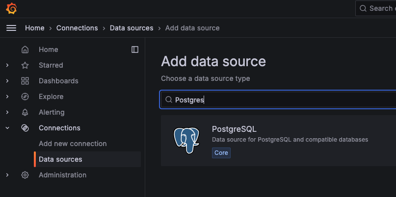
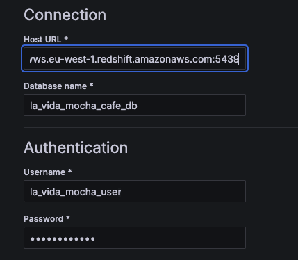
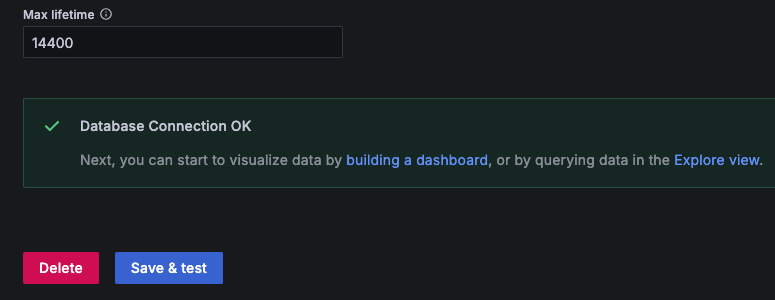

# Final Project - EC2 Launch Docker/Grafana on Startup & Save Changes

Each team will need to make a Virtual Machine (EC2) in AWS with CloudFormation - you will then set it up to run docker for you, and docker to run the Grafana image.

Read this whole file all the way through before starting any of the steps!

## EC2 Setup

For setting up an AWS Virtual Machine (EC2) running Grafana, you should follow the same steps as demonstrated in `aws-08-cfn-ec2`.

## Connecting a terminal inside the VM

You should not need to do this, but, you can from the AWS service "Systems Manager"

## Grafana setup

- Browse to it by going to the Instance's public IP address (check the EC2 page)
    - e.g <http://12.34.56.78:80> (use your IP address)
- Log into Grafana with user `admin` and password `admin`
- Change the admin password to a _secure_ one, and put it in your password manager.

### Setup Grafana users

To create a new user login for each team member, navigate to `Server Admin --> Users --> New user` and begin creating unique users with _secure passwords_.

Put these in your password manager.

### Connecting Grafana to CloudWatch

Just like in the earlier exercise, we need to connect a data source in order to generate some graphs and metrics.

1. In Grafana, navigate to `Configuration --> Data Sources`. Select `Add data source`, search for `CloudWatch` and select.
1. Give it a name, or leave as default.
1. Leave other settings as default.
    1. Do not enter an alternate role to assume - the VM will boot with the correct permissions to see CloudWatch and RedShift already
1. Set default region to `eu-west-1`.
1. Select `Save & Test`. You should see a confirmation `Data source is working`.

### Creating a Lambda metric

We can make graphs and metrics for our Lambda - e.g. how many time it ran, how long it took, how many errors there were.

1. Create a new dashboard and add a new panel.
1. Select `CloudWatch` as the query type, and `CloudWatch Metrics` as the query mode.
1. Select `AWS Lambda` as the namespace, and `Invocations` as the metric name.
1. Add a new Dimension. Select `Function name` as the resource and select the dimension value as your teams ETL lambda.
1. Update the time query to be last 24 hours or 2/7 days if you need to go back that far to see data being graphed.

You should be able to now see how many times your lambda has been invoked over the time elapsed configured for the time period. You can also choose different metric options to suit your needs. For example, you can select `Error` and `Duration` as the metric name, as well as different stats such as `Average`, `Sum`, `Min` and `Max`.

As team, think about what kind of monitoring metrics you can establish to display on your new dashboard.

### Connecting Grafana to Redshift

> We will use the PostgreSQL data source as it is (a) similar to the library we are using in our lambda code and (b) the official RedShift data source has proven "extremely unreliable".
>
> The settings you need are in your RedShift _parameter_ in AWS, e.g `la_vida_mocha_redshift_settings`

- In the AWS web console, open up Parameter Store in Systems manger and find your connection details

### Connecting Grafana to Redshift

- Using the menu navigate to `Connections / Data sources`
- Search for `Postgres` (it should be pre-installed)
- Click it to add a new data source

### Task - Settings for data source

- Enter the host in format `server:port` e.g. `redshiftcluster.~~~.com:5439`
- Enter the DB name e.g. `la_vida_mocha_cafe_db`
- Enter the DB user e.g. `la_vida_mocha_user`
- Enter the DB password e.g. `abcdefghijk`

### Task - Test data source

- Scroll to the bottom of the datasource window
- Click "Save & Test"
- A green success flash should appear

Note: this is the same setup as in the mystery shopper example from the `aws-08-cfn-ec2` module.

### Next Steps

Make a new dashboard and think about what could go on it.

As a team think about what data from Redshift you want to display, for example, revenue per day or week, number of items sold per day, number of each type of drink sold in the last week, and so on. You will have to create the SQL for this yourselves.
