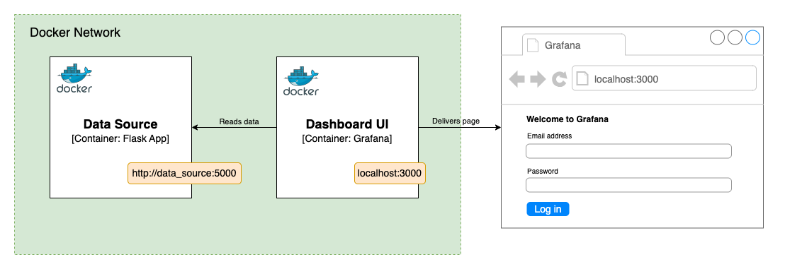

# Monitoring Exercises

## CloudWatch

### CloudWatch Logs

You will upload a Lambda in the `monitoring_lambda.zip` file which will help us generate logs that we can query. Once uploaded and run, it will generate 100 logs. You can upload it on the AWS CLI with the following commands:

- If using Powershell, replace the `\` with ``` (backticks).

```sh
# first cd into the handouts folder
cd handouts

# then upload the lambda zip
aws lambda create-function --function-name '<your-name>-cafe-monitoring' \
    --zip-file 'fileb://monitoring_lambda.zip' \
    --handler 'lambda_function.lambda_handler' --runtime 'python3.12' \
    --role arn:aws:iam::<account-id>:role/nja-lambda-execution-role \
    --profile '<your-profile>' --region 'eu-west-1' --timeout 60
```

Amend the following in the command:

- `<your-name>` - Give the lambda a unique name that you will be able to identify soon after
- `<account-id>` - Your instructor will supply your account ID
- `<your-profile>` - Your AWS CLI profile name

Now take the following steps:

1. Once uploaded, head to the AWS Lambda console
    - Find your new lambda e.g. `<your-name>-cafe-monitoring`
    - Hit the `Test` button, configure a test and run it (any test input will work)
1. Wait for the execution to finish. It may take up a few minutes
1. On the `Monitor` tab, select `View Logs in CloudWatch`
1. Select the log stream, it should be called something like this, as an example: `2021/03/15/[$LATEST]374caa61c151478d8315ae5e9ae5a769`
1. You should see 100 logs once the function has terminated successfully

For context, this Lambda establishes a new logger and loops 100 times. Within this loop, it calculates two properties that we can see in the logs. `statusCode` is randomly chosen each time as success (`200`) or failure (`500`). Elapsed time is calculated by randomly selecting a number between 0 and 1 and then sleeps for that duration in seconds. The logged time is the total time the lambda ran. Both properties are logged to CloudWatch using a logger and logged in the form of JSON. You can see the two properties bundled up in the `msg` property.

Your job now is to use the filter input to try and filter the logs in a handful of ways.

1. You can use the terms `ERROR` or `INFO` to see only the error logs, or the info logs.
1. You can filter the logs by time right down to the second by their timestamp. For instance, if you only want to see logs that happened at the time of `2021-03-14T14:25` then you can input that as a search, wrapped in quotation marks like so: `"2021-03-14T14:25"`.
1. Because the logs are in JSON format, you can filter the logs with the two properties discussed above. Try these out and see what they do:

```sh
{ $.msg.statusCode = 200 }
{ $.msg.statusCode = 500 }
{ $.msg.executionTime > 0.9 }
{ $.msg.executionTime < 0.1 }
```

The `$` sign refers to a property selector, which means we are specifying what JSON object(s) we want to check. You can find out more about filtering and syntax patterns [here](https://docs.aws.amazon.com/AmazonCloudWatch/latest/logs/FilterAndPatternSyntax.html#matching-terms-events).

### CloudWatch Logs Insights

CloudWatch Logs is a useful service for quickly looking at logs, and perhaps making a quick filter on them. This is useful for debugging, but the capabilities are very limited.

CloudWatch Logs Insights enables you to interactively search and analyze your log data in Amazon CloudWatch Logs. You can perform queries to help you more efficiently and effectively respond to operational issues. If an issue occurs, you can use CloudWatch Logs Insights to identify potential causes and validate deployed fixes.

CloudWatch Logs Insights includes a purpose-built query language with a few simple but powerful commands. CloudWatch Logs Insights provides sample queries, command descriptions, query autocompletion, and log field discovery to help you get started. Sample queries are included for several types of AWS service logs.

It also automatically discovers fields in logs from AWS services such as Amazon Route 53, AWS Lambda, AWS CloudTrail, and Amazon VPC, and any application or custom log that emits log events as JSON.

1. On the CloudWatch console, navigate to `Insights` on the left
1. Ensure that the query language selected is `"Log Groups QL"`
1. Ensure the `"Select logs groups by"` dropdown has `"Log group name"` selected
1. In the `Selection Criteria` box, type your lambda name until it is found
1. Select the log groups dropdown and pick your Lambda
1. Select `Run query`, you should see the same logs outputted. Expand one of the results and notice the slight changes from before in terms of how the log is structured

Insights provide you with a much more in-depth ability to query your logs. You can use the `Help` icon on the right to provide you with details on how to construct queries. Here are a few things you can do:

```sh
# show only statusCode
fields msg.statusCode

# show only statusCode with value of 200
fields msg.statusCode
| filter msg.statusCode = 200
```

Use this information to figure out how to find out the following:

1. The sum of how many `200` status codes there are, as well as `500`
1. The average execution time
1. How many executions had level name `ERROR` and how many `INFO`
1. How many executions were above 0.5s and how many were below
1. Sort the logs by execution time
1. What others can you come up with?

You can find more information about the syntax [here](https://docs.aws.amazon.com/AmazonCloudWatch/latest/logs/CWL_QuerySyntax.html).

---

## Grafana

This exercise will get you to start up an instance of Grafana. You will set up two data sources and display them in a dashboard on different panels.

### Container setup

1. Open a terminal in the `handouts` folder
1. Ensure Docker or Podman is running on your machine
1. To build the custom data source image, and start both containers in the same network
    1. If using podman compose in Powershell,
        1. run `./podman-compose-run.sh`
    1. If using docker compose in Powershell,
        1. run `./docker-compose-run.sh`
    1. If using podman in GitBash, Mac or Unix,
        1. run `./podman-run.sh`
    1. If using docker in GitBash, Mac or Unix,
        1. run `./docker-run.sh`
1. Confirm that you can see the Grafana dashboard by opening <http://localhost:3000> on your browser
1. You can login with the default credentials - username `admin` and password `admin`. It will ask you to choose a new password, input whatever you want here

### Data source setup

The scripts above also starts a containerised Flask app running on port `5000` which generates some dummy data for us to display in Grafana. The source code for the Flask app lives in `handouts/app.py`.

You can see this by browsing to <http://localhost:5000:/sales_stats>.

Once you have logged into the Grafana dashboard, you can tell Grafana where to look for data. We will be using a combination of the data generated from `app.py`, as well as a test database that comes with Grafana.

<!-- .element: class="centered" -->

1. Click to expand the left hand side menu, then select `Connections` - `Data Sources`
1. Select `Add data source`
1. Scroll down to the very bottom and select `Find more data source plugins` and put "Infinity" in the search box
1. Select `Infinity` from the list and click the blue `Install` button
1. Once installed, click the blue `Add new data source` button
1. The Name should have the default `yesoreyeram-infinity-datasource` displayed
1. Click the blue `Save & Test` button
1. Wait for the green `OK. Settings saved` message to be displayed

### Setting up a dashboard

Now that we have the relevant data source plugin installed, we can hook up a custom json data source to grafana in order to generate some visualisation panels for a dashboard we will put together.

#### Visualising data from a third-party API

1. Click to expand the left hand side menu, then click on `Dashboards`.
1. Click the blue `New` dropdown button on the top right and select `New dashboard`.
1. Select `+ Add visualization`,
    1. Then under `Select data source` select `yesoreyeram-infinity-datasource`.
1. Under `Table View` switch the toggle `on`
    1. Some default test data should be displayed.
1. Select the `Transform data` tab under the table view, and then `+ Add transformation`.
1. Scroll down and select the `Group by` transformation tile.
1. Next to `country` select `Group by` in the dropdown.
1. Next to `age` select `Calculate`, then `Count`.
1. A transformed view of the data should appear.
1. Under `Visualisations` on the top right select the `Bar Chart` view.
1. Under `Panel options`, set the `Title` field to be "User count by country".
1. Under `Bar Chart` on the right, find `X Axis` and change it to `country`.
1. Under `Table View` switch the toggle off.
1. Select the `Save Dashboard` blue button in the top right corner.
    1. Give it a title like "User data".
1. This will take us to our new dashboard with a generated graph.
    1. Click on "Dashboards" on te left navbar.
    1. Click on your dashboard name to display it in "view" mode.

#### Visualising data from a local custom API

Let's use the containerised data source running on port 5000 to visualise some coffee shop sales stats in grafana!

1. On the dashboard we just created, select the `Add` button on the top right and then the `Visualisation` option.
1. Under the panel view, change the URL field to `http://data_source:5000/sales_stats`.
1. Scroll down to `Parsing options & Result fields` and expand the section.
    1. Enter `stats` into the `Rows/Root` field.
1. Click the `Add columns` button;
    1. Put `recorded_date` in the `Selector` box and format as `Time`.
1. Click `Add columns` again;
    1. Put `coffee_sales` in the `Selector` box, `Coffee Sales` in the `Title` box, and format as `Number`.
1. Click `Add columns` one last time;
    1. Put `food_sales` in the `Selector` box, `Food Sales` in the `Title` box, and format as `Number`.
1. Click the refresh button in the top right corner, you will see a message that says "Data outside time range", click the `Zoom to data` button.
1. Under `panel Option`, set the `Title` to `Cafe Sales Stats`.
1. Click the blue `Save Dashboard` button to save and view the panel on your dashboard.
    1. Click on "Dashboards" on te left navbar.
    1. Click on your dashboard name to display it in "view" mode.

### Changing our data

1. Select the dropdown next to the refresh button in the top right corner. Set the option to "5s" or "10s" to set the auto refresh time.
1. In `app.py`, change the first `coffee_sales` value from `45.0` to `150.0`.
1. The `coffee_sales` line on the grafana panel should now update!
1. Stop the data source app using `docker stop data_source` or `podman stop data_source`, and see what happens to the panel. It will automagically tell us that there is no data to display.

### Changing our panels

There are plenty of ways of displaying data in Grafana. How do we change how our data is being displayed?

For the initial user data panel we set up:

1. Press the three dots to the right of `Panel Title` to bring up the menu and select `Edit`
1. Play with the options in the `Transform Data` tab and explore different visualization styles.

### Final Project

For your final project you will need to setup an EC2 instance which will use Docker to run Grafana for you. (I.e. one EC2 instance per team). This should be done using CloudFormation.

In your project time, refer to:

- For Generation: [./final-project-grafana-setup.md](./final-project-grafana-setup.md) file.
- For School of Tech: [./final-project-grafana-setup-sot.md](./final-project-grafana-setup-sot.md) file.
