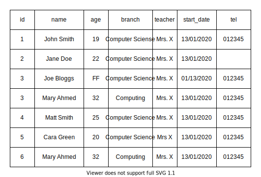
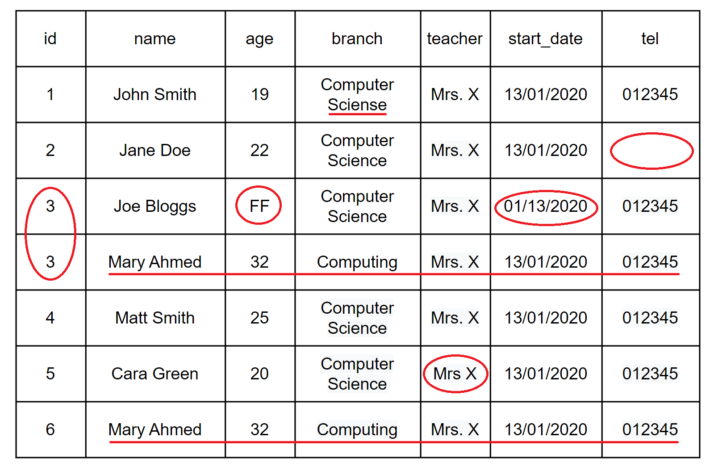

## Data Cleansing

---

### Overview

- Introduction to **Data Cleansing**
- Data quality
- Inspecting data
- How data is cleansed

---

### Learning Objectives

- Define what **Data Cleansing** is
- Explore areas to consider when assessing data quality
- Gain insight into the ways data is inspected
- Identify some approaches to cleansing data

---

### Data Cleansing

During writing, reading, storage, transmission, or processing, errors can occur which introduce unintended changes to the original data.

---

### What is Data Cleansing?

Data Cleansing is the process of detecting and correcting data quality.

You can get all sorts of data issues:

- Inaccurate data
- Corrupt data
- Duplicated data
- Irrelevant data
- Personally Identifiable Information (PII) data that needs to be removed

---

### Breakout time - 10min

**Can you spot the dirty data?**  

 <!-- .element: class="centered" -->

Notes:
Open breakout rooms for 10 minutes and invite learners to try and spot any instances of dirty data.

---

### Discussion - What did you spot?

 <!-- .element: class="centered" -->

Notes:
Ask the learners what was discussed in the breakout rooms.

Image with dirty data highlighted on the next slide.

Examples of dirty data in the image:

- Duplicate values in `id` column
- "FF" in `age` column
- Typo of "Computer Science" in `branch` column
- "Computing" vs "Computer Science" in `branch` column
- "Mrs X" vs "Mrs. X" in `teacher` column
- DD/MM/YYYY vs MM/DD/YYYY in `start_date` column
- Missing number in `tel` column
- Duplicate person "Mary Ahmed"

---

### Dirty Data

 <!-- .element: class="centered" -->

Notes:
Examples of dirty data in the image:

- Duplicate values in `id` column
- "FF" in `age` column
- Typo of "Computer Science" in `branch` column
- "Computing" vs "Computer Science" in `branch` column
- "Mrs X" vs "Mrs. X" in `teacher` column
- DD/MM/YYYY vs MM/DD/YYYY in `start_date` column
- Missing number in `tel` column
- Duplicate person "Mary Ahmed"

---

## Data Quality

When assessing data quality, consider the following:

- Validity
- Accuracy
- Consistency
- Completeness
- Uniformity

Notes:
We will be exploring each of these below.

---

### Validity

The degree to which the data conforms to defined business rules or constraints.

E.g. certain columns can't be empty, certain columns must be a particular data type such as a date.

---

### Accuracy

The degree to which the data is 'true'.

E.g. validating that a postcode actually exists.

---

### Consistency

The degree to which the data is consistent, within the same data set or across multiple data sets.

E.g. a customer has two different addresses in two different tables.

---

### Completeness

The degree to which all the data required is known.

E.g. missing data from a form that was filled in.

---

### Uniformity

Ensuring that data is using the same unit of measure.

E.g. 21/01/2020 or 01/21/2020.

---

### Emoji Check:

Do you feel you understand the pillars of Data Quality? Say so if not!

1. 😢 Haven't a clue, please help!
2. 🙁 I'm starting to get it but need to go over some of it please
3. 😐 Ok. With a bit of help and practice, yes
4. 🙂 Yes, with team collaboration could try it
5. 😀 Yes, enough to start working on it collaboratively

Notes:
The phrasing is such that all answers invite collaborative effort, none require solo knowledge.

The 1-5 are looking at (a) understanding of content and (b) readiness to practice the thing being covered, so:

1. 😢 Haven't a clue what's being discussed, so I certainly can't start practising it (play MC Hammer song)
2. 🙁 I'm starting to get it but need more clarity before I'm ready to begin practising it with others
3. 😐 I understand enough to begin practising it with others in a really basic way
4. 🙂 I understand a majority of what's being discussed, and I feel ready to practice this with others and begin to deepen the practice
5. 😀 I understand all (or at the majority) of what's being discussed, and I feel ready to practice this in depth with others and explore more advanced areas of the content

---

### Mitigating against bad data

We can follow this process to help mitigate against bad data:

1. Inspect
1. Cleanse
1. Verify
1. Report

Notes:
There are some things you won't be able to fix without going back to the original source.

But, there are some things we can do...

---

### 1. Inspect

Take a look at the data to see if there are any issues. It can be rather time-consuming, but luckily there are plenty of tools and methods to help out.

Here are some...

---

### 1. Inspect

#### How to inspect data

- **Data profiling**: How many values are missing? How many unique values in a column, and their distribution?
- **Visualisations**: By analysing and visualising the data using statistical methods such as mean, standard deviation, range, or quantiles, one can find values that are unexpected.
- **Software packages**: Packages or libraries are available that let you specify constraints and check the data for violation of these constraints.

Notes:
Couple of common software packages include python packages like Great Expectations, or dbt. Lets you define tests that check your data during processing.

---

### 2. Cleanse

The most important part of data cleansing!

The aim of cleansing data is to not only **cleanse** the data, but also bring **consistency** to the data.

---

### 2. Cleanse

#### How do we cleanse data?

There are some steps in cleansing data:

- Parse
- Correct
- Standardise
- Match
- Consolidate

Let's take a look at them...

---

### 2. Cleanse

#### Parse

Parsing data means we are breaking up the source data into smaller bits following some rules. This allows us to 'do things' with the data easily.

E.g. splitting addresses so we can use only the postcode.

---

### 2. Cleanse

#### Correct

Now the data is in smaller chunks, we can now correct bits of it.

E.g. fixing typos like "Hel.o" to "Hello".

---

### 2. Cleanse

#### Standardise

Now it's cleansed, we want to make sure the data is consistent and all looks the same.

E.g. changing a date format from 04/29/2020 to 29/04/2020.

---

### 2. Cleanse

#### Match

Now we have cleansed and standardised data, we want to match it to our data definitions, and also rule out any duplicates.

E.g. are there similar names and addresses, like Mr Andrew Smith and Mr A. Smith at the same address.

---

### 2. Cleanse

#### Consolidate

Now we find relationships between all of our data and merging them into one.

E.g. The process of combining Mr Smith's data above into one correct record.

---

### 3. Verify

Now we've cleansed the data, we need to verify (inspect) it again to make sure we haven't made it worse!

E.g. all dates are the correct format, duplicates have been removed, typos corrected etc.

---

### 4. Report

After we've verified the data, we want to take a look to understand what changes we made, and maybe consider why they occurred in the first place!

How can we avoid these issues happening again?

Notes:
Can we affect the input data? Do we need to build in some data processing?

---

### Emoji Check:

Do you feel you understand the steps of data cleansing? Say so if not!

1. 😢 Haven't a clue, please help!
2. 🙁 I'm starting to get it but need to go over some of it please
3. 😐 Ok. With a bit of help and practice, yes
4. 🙂 Yes, with team collaboration could try it
5. 😀 Yes, enough to start working on it collaboratively

Notes:
The phrasing is such that all answers invite collaborative effort, none require solo knowledge.

The 1-5 are looking at (a) understanding of content and (b) readiness to practice the thing being covered, so:

1. 😢 Haven't a clue what's being discussed, so I certainly can't start practising it (play MC Hammer song)
2. 🙁 I'm starting to get it but need more clarity before I'm ready to begin practising it with others
3. 😐 I understand enough to begin practising it with others in a really basic way
4. 🙂 I understand a majority of what's being discussed, and I feel ready to practice this with others and begin to deepen the practice
5. 😀 I understand all (or at the majority) of what's being discussed, and I feel ready to practice this in depth with others and explore more advanced areas of the content

---

### Quiz Time! 🤓

---

**What is this an example of when ensuring data quality?**

_Does this postcode exist?_

1. Validity
1. Accuracy
1. Consistency
1. Completeness
1. Uniformity

Answer: `2`<!-- .element: class="fragment" -->

---

**What is this an example of when ensuring data quality?**

_All dates should be in the format dd/mm/yyyy._

1. Validity
1. Accuracy
1. Consistency
1. Completeness
1. Uniformity

Answer: `5`<!-- .element: class="fragment" -->

---

**When mitigating against bad data, at which stage would you ask the below question?**

_How many unique values are in a specific column?_

1. Inspect
1. Clean
1. Verify
1. Report

Answer: `1`<!-- .element: class="fragment" -->

---

**When mitigating against bad data, at which stage would you ask the below question?**

_I want to be sure that all duplicate data has been removed._

1. Inspect
1. Clean
1. Verify
1. Report

Answer: `3`<!-- .element: class="fragment" -->

---

**What is this an example of when cleansing data?**

_I want to fix all typos._

1. Parse
1. Correct
1. Standardise
1. Match
1. Consolidate

Answer: `2`<!-- .element: class="fragment" -->

---

What is this an example of when cleansing data?

_How many people live at the same address?_

1. Parse
1. Correct
1. Standardise
1. Match
1. Consolidate

Answer: `4`<!-- .element: class="fragment" -->

---

### Exercise prep

> Instructor to give out the zip file of exercises for `data-cleansing`
>
> Everyone please unzip the file

---

### Exercise prep - setup container and tests

The initial steps of the exercises are (a) setting up a Postgres container like we did for previous sessions, and (b) running some failing unit tests.

> From the zip, you should have a file [./handouts/README.md](./handouts/README.md)
>
> Let's all do the preparation steps in the handouts readme.

The instructor will demo this to you now.

Notes:
This works best if you get the cohort to follow along, so you can be sure everyone's machine is ready to go for the TDD part of the exercise.

---

### Exercise time

> From the zip, you should have a file `exercises/data-cleansing-exercise.md`
>
> Let's all do the exercises included in this file

Notes:
There is also a bonus exercise which looks at using Pandas for data cleansing.

Pandas hasn't been formally introduced in the course so it's optional for learners to try it out.

---

### Discussion

> How did the TDD exercises go?
>
> Did you manage to get data inserted into your database?

We can talk though some sample solutions in file [./solutions/etl_with_cleansing_solution.py](./solutions/etl_with_cleansing_solution.py).

---

### Emoji Check:

How did the exercises go? Is Data Cleansing making more sense now?

1. 😢 Haven't a clue, please help!
2. 🙁 I'm starting to get it but need to go over some of it please
3. 😐 Ok. With a bit of help and practice, yes
4. 🙂 Yes, with team collaboration could try it
5. 😀 Yes, enough to start working on it collaboratively

Notes:
The phrasing is such that all answers invite collaborative effort, none require solo knowledge.

The 1-5 are looking at (a) understanding of content and (b) readiness to practice the thing being covered, so:

1. 😢 Haven't a clue what's being discussed, so I certainly can't start practising it (play MC Hammer song)
2. 🙁 I'm starting to get it but need more clarity before I'm ready to begin practising it with others
3. 😐 I understand enough to begin practising it with others in a really basic way
4. 🙂 I understand a majority of what's being discussed, and I feel ready to practice this with others and begin to deepen the practice
5. 😀 I understand all (or at the majority) of what's being discussed, and I feel ready to practice this in depth with others and explore more advanced areas of the content

---

### Terms and Definitions - recap

- **Data Cleansing**: Process of detecting and correcting data quality
- **Validity**: Does the data conform to defined business rules or constraints?
- **Accuracy**: The degree to which the data is 'true'
- **Consistency**: Is data consistent across datasets?

---

### Terms and Definitions - recap

- **Completeness**: Do we know all the required data?
- **Uniformity**: Is data the same format and/or unit of measurement?
- **Parse**: Breaking up the source data into smaller bits so we can use it
- **Standardise**: Make sure the data is consistent

---

### Terms and Definitions - recap

- **Match**: Match data to our data definitions
- **Consolidate**: Finding relationships and merging our data into one source
- **Verify**: Re-inspecting our data after cleansing to check it
- **Report**: What changes did we make, how can we stop these issues happening again?

---

### Overview - recap

- Introduction to **Data Cleansing**
- Data quality
- Inspecting data
- How data is cleansed

---

### Learning Objectives - recap

- Define what **Data Cleansing** is
- Explore areas to consider when assessing data quality
- Gain insight into the ways data is inspected
- Identify some approaches to cleansing data

---

### Further Reading

- [What is data cleaning - Geeks for Geeks](https://www.geeksforgeeks.org/what-is-data-cleaning/)
- [Data Cleaning In Python - Practical Examples (Video)](https://www.youtube.com/watch?v=vPaXbA_xQFQ)

---

### Emoji Check:

On a high level, do you think you understand the main concepts of this session? Say so if not!

1. 😢 Haven't a clue, please help!
2. 🙁 I'm starting to get it but need to go over some of it please
3. 😐 Ok. With a bit of help and practice, yes
4. 🙂 Yes, with team collaboration could try it
5. 😀 Yes, enough to start working on it collaboratively

Notes:
The phrasing is such that all answers invite collaborative effort, none require solo knowledge.

The 1-5 are looking at (a) understanding of content and (b) readiness to practice the thing being covered, so:

1. 😢 Haven't a clue what's being discussed, so I certainly can't start practising it (play MC Hammer song)
2. 🙁 I'm starting to get it but need more clarity before I'm ready to begin practising it with others
3. 😐 I understand enough to begin practising it with others in a really basic way
4. 🙂 I understand a majority of what's being discussed, and I feel ready to practice this with others and begin to deepen the practice
5. 😀 I understand all (or at the majority) of what's being discussed, and I feel ready to practice this in depth with others and explore more advanced areas of the content
