## Data Normalisation

---

### Overview

- An introduction to data normalisation
- Advantages and disadvantages
- Normal Forms

---

### Learning Objectives

- Be able to explain what data normalisation is
- Understand some of the problems that normalisation helps to fix
- Practice implementing the steps to reach first, second and third normal form
- List some of the Pros and Cons of normalisation

---

### What is Data Normalisation?

- **Formally**: The process of structuring a relational database in accordance with a series of defined **normal forms** in order to reduce data **redundancy** and increase data **integrity**
- **Informally**: Organising our data to make it easy to work with, reduce duplication, and increase accuracy

Notes:
We will revisit what redundancy and integrity mean later in the module.

---

### Why do we Normalise data?

The need to normalise is best seen by looking at the problems we might encounter when data is **not normalised!**

---

### Unnormalised Data - Example

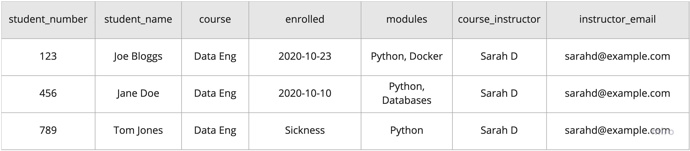<!-- .element: class="centered" width="80%" -->

- What looks strange about this data? What possible problems can we see?

Notes:

ASK learners if they can identify any issues and discuss.

The learners may not have enough experience to see many problems yet - Detail of issues is on subsequent slide.

---

#### Unnormalised Data - Problems

<!-- .element: class="centered" width="80%" -->

- Duplicate data - extra storage is used and updates need to be made in multiple places when something is changed<!-- .element: class="fragment" -->
- Multiple values in a single column - we cannot easily work with that data when searching or querying<!-- .element: class="fragment" -->
- Different data types in a single column - we cannot predict what data will be held for a given row<!-- .element: class="fragment" -->
- Data about different entities (Student, Course and Instructor) in the same row - can lead to unintentional loss of data when rows are removed <!-- .element: class="fragment" -->

Notes:
Some of these issues are formal 'Anomalies' which we are going to cover next.

---

### Anomalies

An `Anomaly` is a data problem caused by insufficient normalisation in our table, which can occur when we try to change the data that table holds. 

#### Three formal anomalies:

1. Insertion Anomaly
1. Update Anomaly
1. Deletion Anomaly

---

### Insertion Anomaly

- An inability to add data due to dependence on other data

Example scenario: A new Course Instructor starts work, but does not have any students enrolled yet

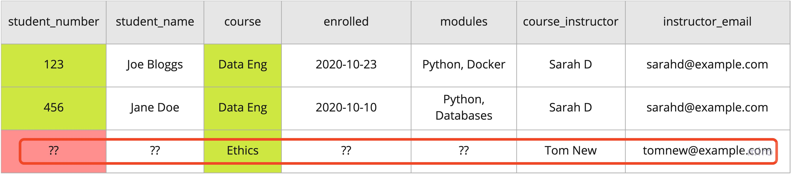<!-- .element: class="centered" width="80%" -->
 

- Trying to add this data would result in empty (`null`) values for student fields
- Student number and course are both required in this table to uniquely identify a row as its `composite key`
- Adding the instructor is blocked until they have a student

Notes:
Composite keys have not yet been mentioned in the course so far.

student_number and course fields are in this case two values that in conjunction form a composite key to uniquely identify a given row of data.

If we try to add instructor data without any student number, this constraint is violated.

Course itself is not enough to make the data unique because the same course can appear in the table multiple times.

---

### Update Anomaly

- Inconsistency caused when duplicated data is only partially changed

Example scenario: An instructor updates their email address

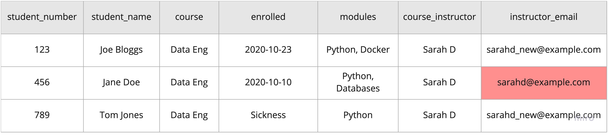<!-- .element: class="centered" width="80%" -->

- The email address must change in many records, but it is possible some of these records may be missed
- There are now two **different values** in the database for the same instructor's email

---

### Deletion Anomaly

- Unintended loss of data when other unrelated data is removed

Example scenario: When a student's course ends, their row is deleted from the database

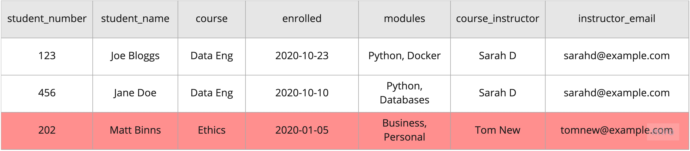<!-- .element: class="centered" width="80%" -->
 

- If all students for a particular instructor are removed, there will be no copies of that instructor's name or email left, and that data has then been lost
- When `Matt Binns` is removed, we also delete information about `Tom New`

---

### Emoji Check:

Do you feel you understand the three anomalies? Say so if not!

1. 😢 Haven't a clue, please help!
2. 🙁 I'm starting to get it but need to go over some of it please
3. 😐 Ok. With a bit of help and practice, yes
4. 🙂 Yes, with team collaboration could try it
5. 😀 Yes, enough to start working on it collaboratively

Notes:
The phrasing is such that all answers invite collaborative effort, none require solo knowledge.

The 1-5 are looking at (a) understanding of content and (b) readiness to practice the thing being covered, so:

1. 😢 Haven't a clue what's being discussed, so I certainly can't start practising it (play MC Hammer song)
2. 🙁 I'm starting to get it but need more clarity before I'm ready to begin practising it with others
3. 😐 I understand enough to begin practising it with others in a really basic way
4. 🙂 I understand a majority of what's being discussed, and I feel ready to practice this with others and begin to deepen the practice
5. 😀 I understand all (or at the majority) of what's being discussed, and I feel ready to practice this in depth with others and explore more advanced areas of the content

---

### Normalisation to the Rescue! 🎉

We can solve these problems with `Data Normalisation.`

After normalising:

- Redundant data (duplicate data) is eliminated<!-- .element: class="fragment" -->
- Changes to data values are always consistent (because there is no duplication!)<!-- .element: class="fragment" -->
    - Update Anomaly Fixed ✅<!-- .element: class="fragment" -->
- Unintended removal of unrelated data is prevented<!-- .element: class="fragment" -->
    - Deletion Anomaly Fixed ✅<!-- .element: class="fragment" -->
- New data is always able to be added without inappropriately depending on other data<!-- .element: class="fragment" -->
    - Insertion Anomaly Fixed ✅<!-- .element: class="fragment" -->

---

### Further Benefits of Normalisation

- **Storage space** on disk is reduced
- **Ordering** can be added to the data with `indexing` to speed up searching and access
- Data is **grouped together logically** in related tables, in a way that is easy for humans to understand and write code for

Notes:
Indexing is a way of performing quick and efficient sorting on a given field in our data, without having to read all database records when searching.

Index data for a field (or multiple fields) is held in a separate data structure in the database and pre-sorted ahead of time, so that fast lookups can be performed on it (Binary search)

---

### Quiz Time! 🤓

---

**Which of the below best describes 'Data Normalisation' ?**

1. Removing all unnecessary data from a database.
1. Organising fields from one or more tables into smaller tables.
1. Organising data to remove duplicates and increase data accuracy.
1. Making sure all tables have unique primary keys.

Answer: `3`<!-- .element: class="fragment" -->

Notes:
(2) and (4) might be things that happen part of normalisation, but is not normalisation itself.

---

**Which of these is NOT a database anomaly?**

1. Deletion Anomaly
1. Read Anomaly
1. Update Anomaly
1. Insert Anomaly

Answer: `2`<!-- .element: class="fragment" -->

Notes:
Ask for explanations or recap to the learners on what each of the the anomalies are.

---

#### The Normalisation Process

How do we Normalise?

---

#### The Normalisation Process

- Starting from an Unnormalised data set (UNF) we can proceed through each `normal form` applying rules at each stage until we reach Third Normal Form (3NF).

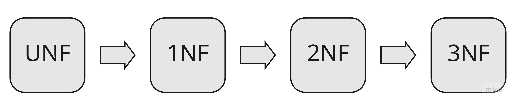<!-- .element: class="centered" width="80%" -->

- If data already meets the rules for a given normal form, we may not need to do anything and can simply move to the next form!

Notes:
Experienced designers may model data directly in 3NF, however we will work through each of the forms in turn.

---

#### The Normalisation Process

Normalisation is usually an **"on-paper"** exercise - it doesn't happen in the database!  

The **output** from normalisation will be the information needed to technically implement a database structure in the correct way:

- Required `Tables`
- Data `Fields` each table should store
- `Primary keys` and `Foreign keys` that relate those tables together

---

#### Rules for First Normal Form (1NF)

For a table to be in 1NF then:

1. **Unique name for attributes/columns**: Each column should have a unique name
1. **Order doesn't matter**: The order in which columns or rows appear should not affect the data
1. **Attribute Domain should not change**: Values stored in a column must represent the same sort of information for all rows/records
1. **Single Valued Attributes**: Each column in the table should hold a single value. (Formal term is to be `atomic`)

Notes:
Examples with images are given for rules 3 and 4 in following slides.

---

#### Applying 1NF

1. **Unique name for attributes/columns**
1. **Data order doesn't matter**

These requirements are usually trivial and we won't need to think about them much.

- The database software will prevent us from creating any tables that have duplicate column names.
- The database software will also always allow columns to be in any order or for rows to be retrieved based on queries, no matter the order those rows actually appear.

Let's move on to the next requirements.

---

#### Applying 1NF

<!-- markdownlint-disable-next-line MD029 -->
3. **Attribute Domain should not change**: Values stored in a column must represent the same sort of information for all rows/records

<!-- .element: class="centered" width="80%" -->
 

Is the rule violated?

Notes:
ASK: Is the rule violated? Where?

ASK: How do you think we can fix it?

Violated because enrolled column holds both a date of student enrolment in the course, and also (presumably!) a reason why they were not able to enrol - that the column can't accurately describe what the data actually represents is a big part of the problem - we need to infer it from the value!

---

#### Applying 1NF

**Violation:** Mixed information for enrolled column
 

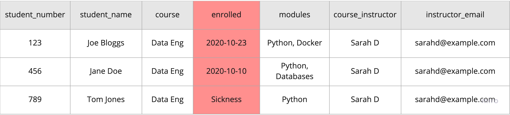<!-- .element: class="centered" width="80%" -->
 

What's the solution?

Notes:
Specific purpose columns allow columns to be named ambiguously so we can tell what they are for

Data type for each column is now consistent. Where there is no data for a given column, it will be null-valued.

---

#### Applying 1NF

**Violation:** Mixed information for enrolled column

<!-- .element: class="centered" width="80%" -->
 

**Solution:** Separate columns for separate purposes

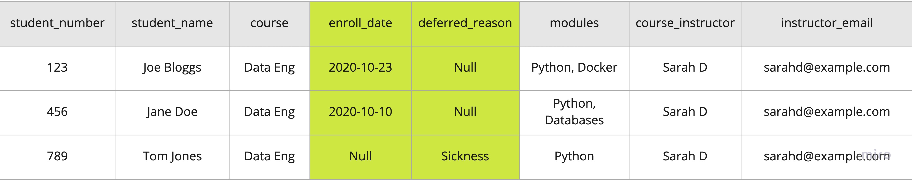<!-- .element: class="centered" width="80%" -->

Notes:
Specific purpose columns allow columns to be named ambiguously so we can tell what they are for

Data type for each column is now consistent. Where there is no data for a given column, it will be null-valued.

---

#### Applying 1NF

<!-- markdownlint-disable-next-line MD029 -->
4. **Single Valued Attributes**: Each column in the table should hold a single value.

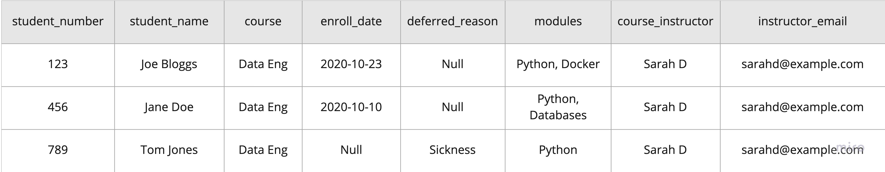<!-- .element: class="centered" width="80%" -->
 

Is the rule violated?

Notes:
ASK: Is the rule violated? Where?

ASK: How do you think we can fix it?

Violated because modules the students are taking for a given course are held as multi-value attributes

---

#### Applying 1NF

**Violation:** Module column stores multiple modules
  

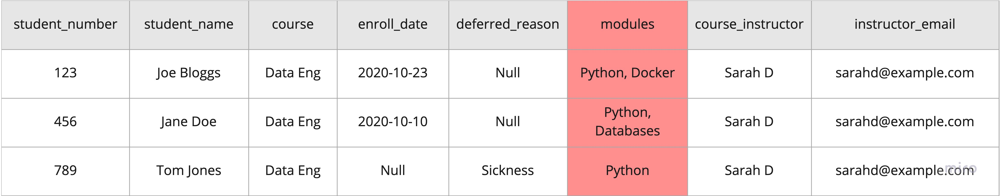<!-- .element: class="centered" width="80%" -->
 

What's the solution?

Notes:

N/A

---

#### Applying 1NF

**Violation:** Module column stores multiple modules

<!-- .element: class="centered" width="80%" -->
 

**Solution:** Duplicate other row data to allow single value for module

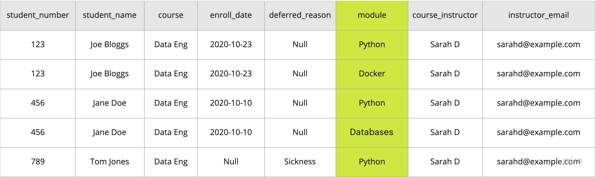<!-- .element: class="centered" width="80%" -->

Notes:
In this case our composite key has now become THREE items (student_number, course, module) to allow us to uniquely reference a single row.

---

#### Applying 1NF

<!-- .element: class="centered" width="80%" -->
 

Applying 1NF has increased the `redundancy` (bad!) but decreased the `complexity` and made the data more structured and easier to work with.

Notes:
After the violations are fixed we have a lot more data repetition, which is not great, but we've got rid of the violations!

Carrying on further with the normalisation will help us get rid of repeated data.

---

### Emoji Check:

Do you feel you understand First Normal Form? Say so if not!

1. 😢 Haven't a clue, please help!
2. 🙁 I'm starting to get it but need to go over some of it please
3. 😐 Ok. With a bit of help and practice, yes
4. 🙂 Yes, with team collaboration could try it
5. 😀 Yes, enough to start working on it collaboratively

Notes:
The phrasing is such that all answers invite collaborative effort, none require solo knowledge.

The 1-5 are looking at (a) understanding of content and (b) readiness to practice the thing being covered, so:

1. 😢 Haven't a clue what's being discussed, so I certainly can't start practising it (play MC Hammer song)
2. 🙁 I'm starting to get it but need more clarity before I'm ready to begin practising it with others
3. 😐 I understand enough to begin practising it with others in a really basic way
4. 🙂 I understand a majority of what's being discussed, and I feel ready to practice this with others and begin to deepen the practice
5. 😀 I understand all (or at the majority) of what's being discussed, and I feel ready to practice this in depth with others and explore more advanced areas of the content

---

### Exercise prep

> Instructor to give out the zip file of exercises for `data-normalisation`
>
> Everyone please unzip the file

---

### Exercise time

> From the zip, you should have a file `exercises/data-normalisation-exercise.md`
>
> Let's all split into breakouts and do `Exercise 1 - 1NF` included in this file

---

#### Rules for Second Normal Form (2NF)

For a table to be in 2NF then:

1. The table should already be in `1NF`
1. The table should have **no** `Partial Dependency`

(For simplicity, we will no longer consider course 'modules' in our example table)

---

#### Dependency

- Let's understand `Dependency` before discussing `Partial Dependency`
- Now that `modules` have been removed, `student_number` and `course` are the columns which allow us to uniquely identify a row. These together are the table's `composite key`

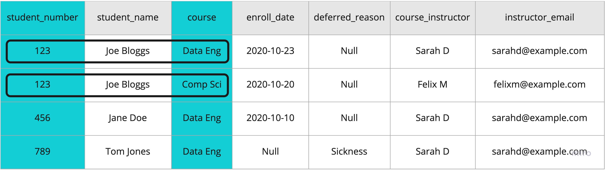<!-- .element: class="centered" width="80%" -->

Notes:
Remind learners that either student number by itself or course by itself are not sufficient to identify a record.

Same student takes more than one course, and same course is taken by multiple students so we need both.

---

#### Dependency

Table properties are `dependent` on the **whole key** if they need **all parts** of the key to be determined.

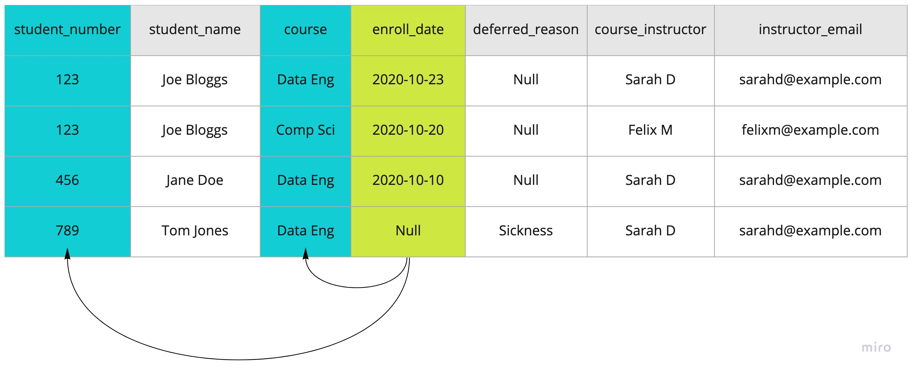<!-- .element: class="centered" width="80%" --> 

- `enroll_date` is the date when a particular student enrolled on a particular course. It does not relate only to the course or the student, but to **both**
- `enroll_date` is therefore `dependent` on the **whole key**

Notes:
The same is true for deferred_reason.

deferred_reason is a reason for a particular student not to start on a particular course

---

#### Partial Dependency

Table properties are `Partially Dependent` when they relate only to **part** of the key.

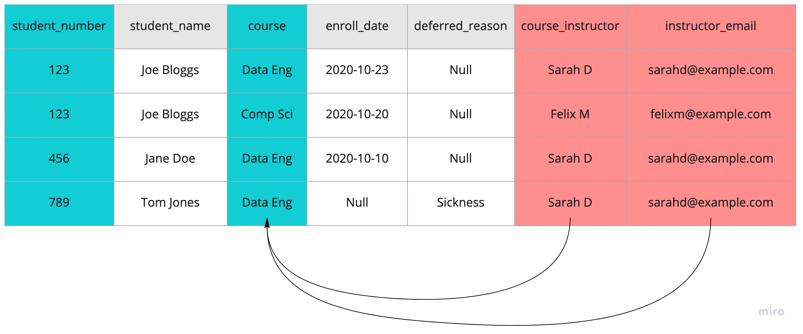<!-- .element: class="centered" width="80%" -->
 

- A course always has the same instructor
- This means `course_instructor` and `instructor_email` can be determined by `course` **only**, and do not need `student_number` at all
- These properties are `partially dependent`

Notes:
There is another partial dependency in this table which the learners may spot, but we aren't covering it now (student name depends only on student number, not course)

---

#### Applying 2NF

**Violation:** Instructor information is `Partially Dependent` on `course`
  

**Solution:** Split things that depend on `course` out to a new table 👌

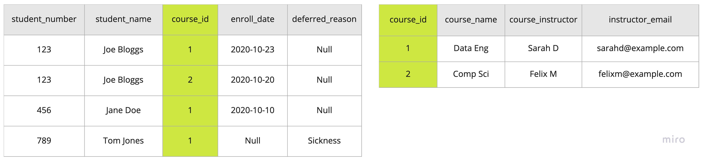<!-- .element: class="centered" width="100%" -->

- We will give the new course table a unique number-based `course_id` at the same time, to avoid duplicating the course name between tables
- Records in the student table can refer to the new course table using the `course_id` as a `foreign key`

Notes:

The columns in the new table are now wholly dependent on the `course_id` primary key.

Highlight that by adding a numeric ID for courses, it allows us to be able to update a course name in only 1 location if needed, rather than in every row in the student table. Also, IDs are far less likely to change than a name might.

---

### Emoji Check:

Do you feel you understand Second Normal Form? Say so if not!

1. 😢 Haven't a clue, please help!
2. 🙁 I'm starting to get it but need to go over some of it please
3. 😐 Ok. With a bit of help and practice, yes
4. 🙂 Yes, with team collaboration could try it
5. 😀 Yes, enough to start working on it collaboratively

Notes:
The phrasing is such that all answers invite collaborative effort, none require solo knowledge.

The 1-5 are looking at (a) understanding of content and (b) readiness to practice the thing being covered, so:

1. 😢 Haven't a clue what's being discussed, so I certainly can't start practising it (play MC Hammer song)
2. 🙁 I'm starting to get it but need more clarity before I'm ready to begin practising it with others
3. 😐 I understand enough to begin practising it with others in a really basic way
4. 🙂 I understand a majority of what's being discussed, and I feel ready to practice this with others and begin to deepen the practice
5. 😀 I understand all (or at the majority) of what's being discussed, and I feel ready to practice this in depth with others and explore more advanced areas of the content

---

### Exercise time

> Let's all split into breakouts and do `Exercise 2 - 2NF` included in the `data-normalisation-exercise.md` file

---

#### Third Normal Form - 3NF

For a table to be in 3NF, then:

1. The table should already be in `2NF`
2. There should be **no** `Transitive Dependency`

---

#### Transitive Dependency

- A non-key column in a table has `Transitive Dependency` if it depends on some other non-key column, rather than depending on the key.
- **Reminder:** A column 'A' is dependent on another column 'B' if when the value of B changes, A should change too.

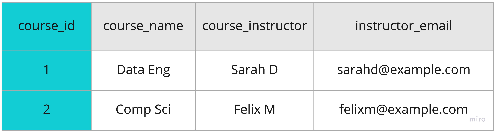<!-- .element: class="centered" width="80%" -->
 

Given `course_id` is the table key, does the new Course table have any transitive dependency?

Notes:
Go through the properties one by one if the learners are not sure what each depends on. Course name and instructor depend on course_id (which is a sort of proxy for name) but instructor email does not.

Instructor email is dependant more closely on the instructor, rather than directly on the course_id. If the instructor changes to a different person, the email would need to change too.

---

#### Applying 3NF

If the instructor for a course changes to a new person, then the instructor email is also going to need to change.

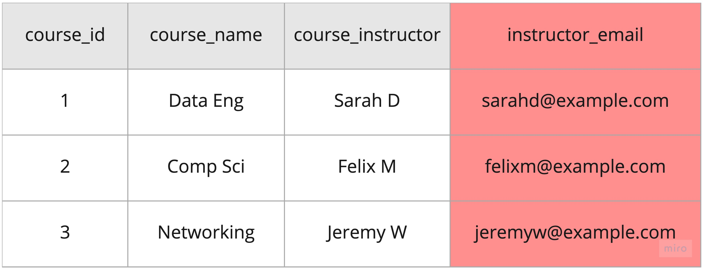<!-- .element: class="centered" width="80%" -->

- This shows that `instructor_email` depends on `course_instructor` and **not** on the key `course_id`
- `instructor_email` is therefore `Transitively Dependent`

---

#### Applying 3NF

**Violation:** `instructor_email` is `Transitively Dependent` on `course_instructor`
  

**Solution:** Split things that depend on `course_instructor` out to a new table 👌

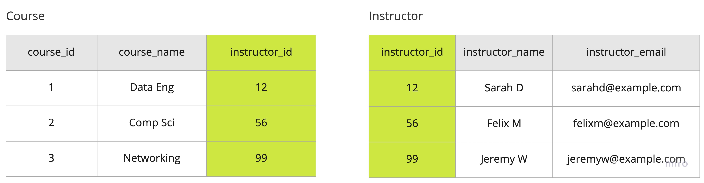<!-- .element: class="centered" width="80%" -->
 

We will also assign a new `instructor_id` numeric identifier. Records in the course table can refer to the instructor by this ID.

Notes:
The use of a numeric identifier is again to prevent data redundancy across tables. Even if the same instructor changes name (e.g. gets married, other legal name change) then we only need to update one place in the database, even if the instructor is assigned to many courses.

---

#### Final 3NF Design

Let's see what that looks like!

---

#### Final 3NF Design 👏

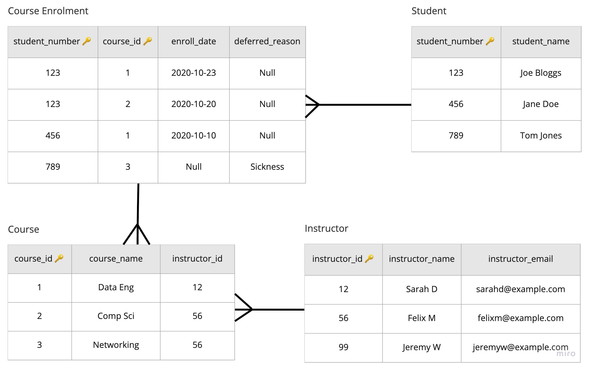<!-- .element: class="centered"-->

- Another new table has been created for `student` because `student_name` was also partially dependant on `student_number`

Notes:
Each student can enrol in many courses, and each course can be enrolled in by many students.

Our big starting table has had things pushed out of it by normalisation until it eventually became the "course enrolment" table to model this many-to-many relationship.

Each course has just one instructor assigned to it, but each instructor can teach many courses. This is a one-to-many relationship.

---

#### Final 3NF Design

What can we learn about **Good Normalisation** from the final design?

- Columns all store the **same sort of data**, with **single values** per field
- Related data is grouped together in a table **named after the entity** it belongs to (instructor, course, student, enrolment)
- Data in each table **depends only on that table's key**, not on any other data in the table
- When one table links to another, it's good practice to link it with **IDs** instead of using data that might change, such as names

---

### Emoji Check:

Do you feel you understand Third Normal Form? Say so if not!

1. 😢 Haven't a clue, please help!
2. 🙁 I'm starting to get it but need to go over some of it please
3. 😐 Ok. With a bit of help and practice, yes
4. 🙂 Yes, with team collaboration could try it
5. 😀 Yes, enough to start working on it collaboratively

Notes:
The phrasing is such that all answers invite collaborative effort, none require solo knowledge.

The 1-5 are looking at (a) understanding of content and (b) readiness to practice the thing being covered, so:

1. 😢 Haven't a clue what's being discussed, so I certainly can't start practising it (play MC Hammer song)
2. 🙁 I'm starting to get it but need more clarity before I'm ready to begin practising it with others
3. 😐 I understand enough to begin practising it with others in a really basic way
4. 🙂 I understand a majority of what's being discussed, and I feel ready to practice this with others and begin to deepen the practice
5. 😀 I understand all (or at the majority) of what's being discussed, and I feel ready to practice this in depth with others and explore more advanced areas of the content

---

### Exercise time

> Let's all split into breakouts and do `Exercise 3 - 3NF` included in the `data-normalisation-exercise.md` file

---

### Quiz Time! 🤓

---

**Tables in First Normal Form (1NF) must not have any _______?**

1. Partial dependencies
1. Multi-valued fields
1. Null values in primary key fields
1. Functional dependencies

Answer: `2`<!-- .element: class="fragment" -->

Notes:
1 is true for 2NF not 1NF

2 is correct

3 is technically correct because not having null values in primary key fields is a critical requirement for any table, whether it is at all normalised or not.

4 is incorrect because any non-random table in 1NF should have at least one functional dependency (at least one bit of data that depends on the key)

---

**A table is in Second Normal Form (2NF) if the table is in 1NF and what other condition is met?**

1. The type of data stored in a column does not change across different records
1. There are no composite primary keys
1. Columns have unique names
1. There are no partial dependencies

Answer: `4`<!-- .element: class="fragment" -->

Notes:
1 is already required for 1NF so not true here. This is "Attribute domain should not change"

2 is false, composite keys are entirely permissible

3 is already required for 1NF

4 is correct

---

**A table is in Third Normal Form (3NF) if the table is in 2NF and what other condition is met?**

1. The table primary key must be a number
1. There are no transitive dependencies
1. Order of data in the table doesn't matter
1. There are no commutative dependencies

Answer: `2`<!-- .element: class="fragment" -->

Notes:
1 is not true, a unique or auto-generated key for a record is a good idea but it doesn't need to be numeric. (could be string, GUID, etc)

2 is correct

3 Is already required for 1NF

4 is an entirely bogus answer

---

### Further Normalisation

- For most database normalisation requirements, stopping after achieving **Third Normal Form (3NF)** is enough
- It satisfies good relationship rules and will greatly improve your data structure in comparison to no normalisation 🤩
- There are further steps after third normal form that are optional. If you're interested, read about BCNF, 4NF, 5NF, ETNF and DKNF! 🤯

---

### Pros and Cons of Normalisation

- Normalisation is a great tool, but it may not always be the *right* choice
- In some cases, we may choose to intentionally not normalise depending on whether normalisation is suitable for the type of data processing

---

## Pros

- Querying for **individual** data records can be faster as we benefit from multiple smaller tables with well-designed indexes
- Better and more logical database organisation makes it easier to build new functionality to the application
- Reduces redundant data
- Improves data consistency
- The database design itself enforces good data, and prevents inconsistencies, or `orphans`

For **Transactional** workloads like a shopping cart or a booking system where data INTEGRITY is critical, normalisation is a great choice.

Notes:

"Orphans" referencing records that have been left in the database that no longer relate to other pieces of data.

---

### Cons

- Processing **all** data as a batch can be slower, due to the need to join between tables
- Table joins are needed on reading data which increases complexity of query operations
- Overly normalised data can be difficult to correctly join and put together without domain knowledge of its layout

For **Analytical** workloads like bulk data processing where SPEED is critical, allowing some amount of denormalisation may sometimes be preferred!

Notes:

Can mention here that we will be looking at data warehouses later in the course, during which we'll introduce some other approaches to database design that stray away from normalisation to make it easier to analyse large amounts of data.

---

### Terms and Definitions - recap

- **Data Normalisation**: The process of structuring a relational database in accordance with a series of so-called normal forms in order to reduce data redundancy and improve data integrity
- **Normal Form**: Steps used to eliminate or reduce redundancy in database tables

---

### Terms and Definitions - recap

- **Functional Dependency**: A relationship between two attributes, typically between the primary key and other non-key attributes within a table
- **Partial Dependency**: A relationship where an attribute of a table depends only on part of that table's composite key
- **Transitive Dependency**: A relationship where an attribute of a table depends on some other attribute which is not part of the table's key

---

### Overview - recap

- An introduction to data normalisation
- Advantages and Disadvantages
- Normal Forms

---

### Learning Objectives - recap

- Be able to explain what data normalisation is
- Understand some of the problems that normalisation helps to fix
- Practice implementing the steps to reach first, second and third normal form
- List some of the Pros and Cons of normalisation

---

### Further Reading

- [Another Normalisation Walk-through](https://www.studytonight.com/dbms/database-normalization.php)

---

### Emoji Check:

On a high level, do you think you understand the main concepts of this session? Say so if not!

1. 😢 Haven't a clue, please help!
2. 🙁 I'm starting to get it but need to go over some of it please
3. 😐 Ok. With a bit of help and practice, yes
4. 🙂 Yes, with team collaboration could try it
5. 😀 Yes, enough to start working on it collaboratively

Notes:
The phrasing is such that all answers invite collaborative effort, none require solo knowledge.

The 1-5 are looking at (a) understanding of content and (b) readiness to practice the thing being covered, so:

1. 😢 Haven't a clue what's being discussed, so I certainly can't start practising it (play MC Hammer song)
2. 🙁 I'm starting to get it but need more clarity before I'm ready to begin practising it with others
3. 😐 I understand enough to begin practising it with others in a really basic way
4. 🙂 I understand a majority of what's being discussed, and I feel ready to practice this with others and begin to deepen the practice
5. 😀 I understand all (or at the majority) of what's being discussed, and I feel ready to practice this in depth with others and explore more advanced areas of the content
