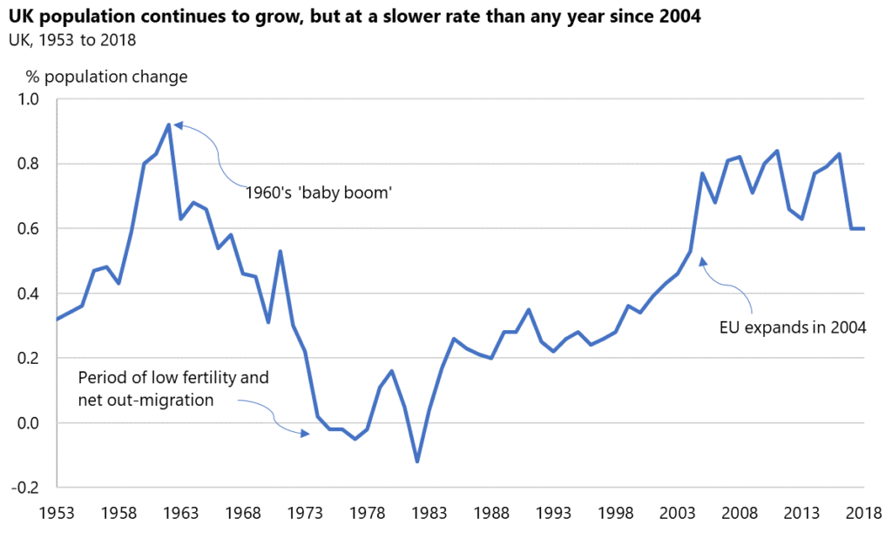
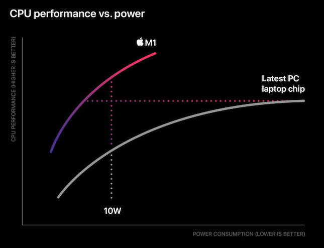
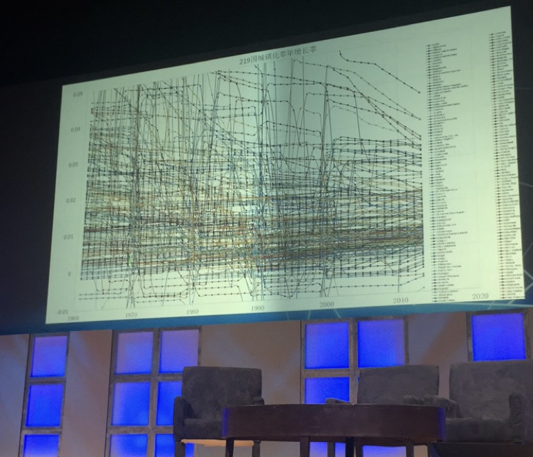
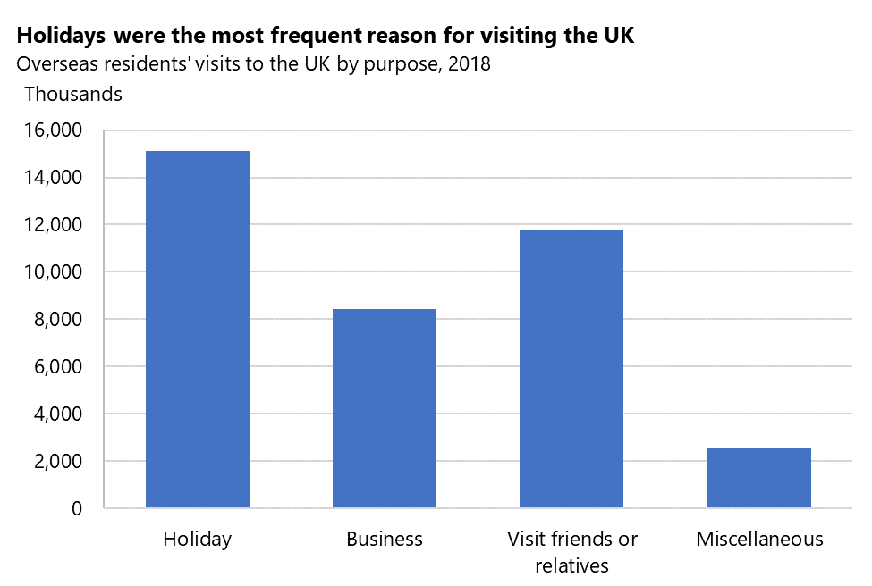
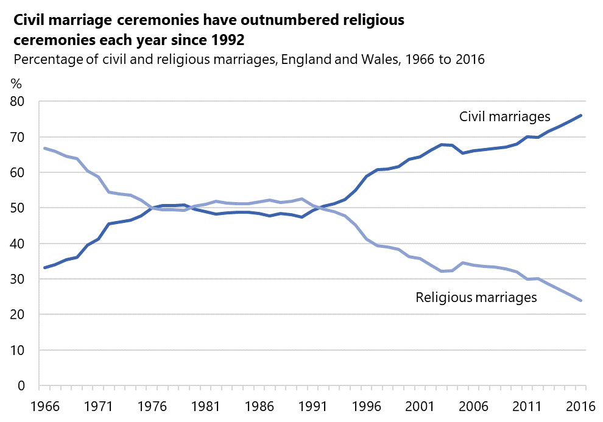
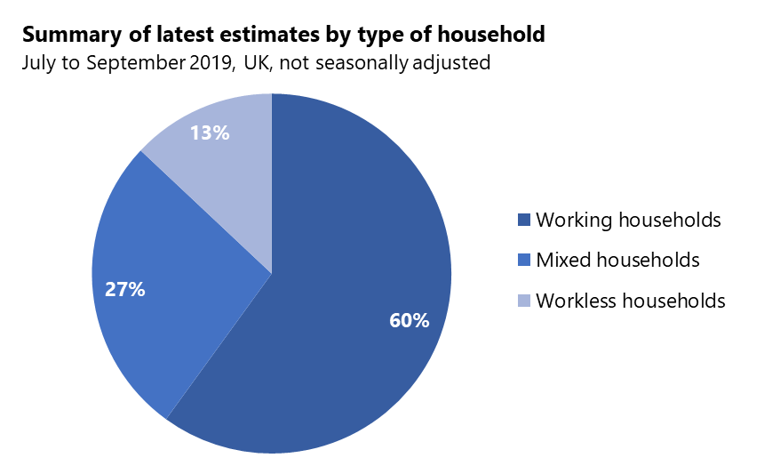
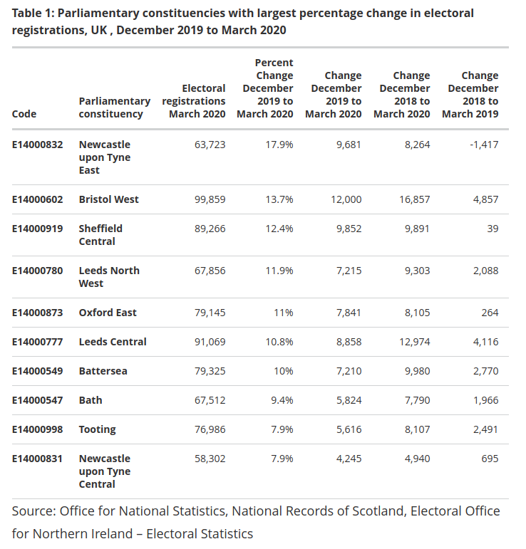
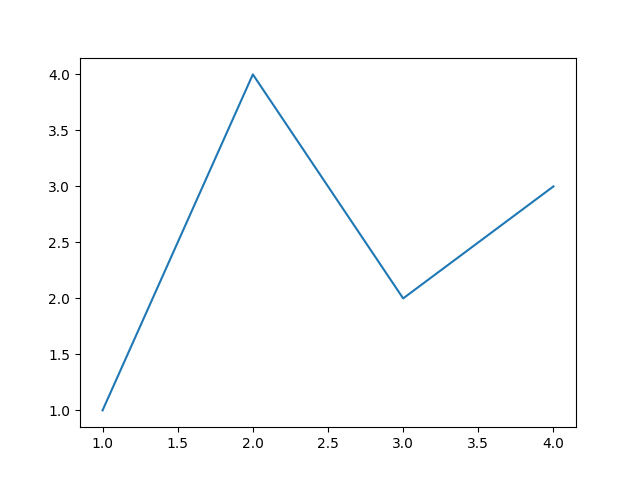
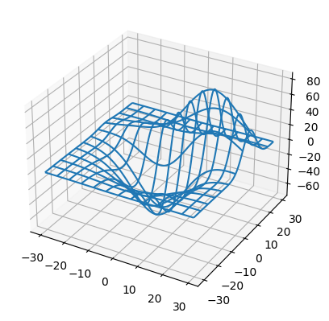

<!-- markdownlint-disable no-emphasis-as-heading -->
## Data Visualisation

---

### Overview

- Data Visualisation overview
- Chart types
- Jupyter Notebooks
- matplotlib

---

### Learning Objectives

- Understand what data visualisation is and when to use it
- Identify some data visualisation tools
- Discover some data visualisation techniques
- Gain insight into when to use Jupyter Notebook
- Implement visualisations using Jupyter and matplotlib

---

### What is Data Visualisation?

- A graphical representation of any data or information
- Visual elements such as charts, graphs, tables and maps are some tools that provide viewers with an easy and accessible way of understanding information
- Assists in understanding patterns or trends in data that otherwise wouldn't be spotted in raw data
- Used in all aspects of industries

---

### Why is it important?

- Easy to digest large quantities of information in a small space
- Establishes relationships between data
- Easy to share (image, web page, git repo etc.)
- Can be interactive with clicks, zoom and expanded areas
- Much more intuitive than raw data

---

### Data Viz Tools

There are many tools out there to help us create visualisations. Some popular ones include:

- Tableau: A business intelligence tool for visualisations
- Microsoft Power BI: Another business intelligence tool
- MatLab: A data analysis tool with an easy-to-use tool interface and graphical options

---

### Data Viz Tools

We'll be using two tools.

The first is called `Jupyter Notebook`, an open-source web-based interactive computational environment. We will be utilising a `VSCode` extension for running these.

The second is called `matplotlib`, a plotting library in Python to generate visualisations from code.

You can use `matplotlib` on its own in Python or use it alongside `Jupyter`.

Notes:
For fun, Jupyter is a portmanteau of the programming languages - Julia, Python and R.

---

### Data Viz Techniques

- Know the audience / who is going to be viewing it
- Set goals for what you want to convey through the viz
- Choose a relevant chart type that best represents the data
- Use a colour scheme that represents different aspects of the data
- Use the best tools for the job

Notes:
For point 3, we will be looking at different chart types.

---

### Data Viz in Business

Data visualisations are not just for scientific research, we see them everywhere in life and business.

- Reports
- Displays
- Operation alerting
- Business growth / financial objectives
- Many more!

---

## Chart Types

<!-- .element: class="centered" -->

_[Look at this graph! - Nickelback](https://www.youtube.com/watch?v=oMRgdpXLElE)_

---

### Graphs

- Used when you want to show patterns, trends and relationships in the numbers
- An excellent way to tell a story or to summarise something complex
- Can reveal insights that would otherwise be hidden
- Great for spotting errors or outliers in the data

---

### Components of Effective Graphs...

Not all components outlined in the following slides must be included in every graph. However, it's essential to consider them when designing your graph. The primary question you should be asking is...

> **Does this element make my graph easier to understand and interpret?**

---

### Components of Effective Graphs...

- **Title**: Provide a concise and descriptive title that summarizes the main message
- **Axes**: Label each axis clearly, indicating what is plotted on both axes of the graph. Include relevant units, if applicable. For self-explanatory axes, such as years, labels may be optional
- **Scale**: Choose an appropriate scale for both axes to ensure that the data is displayed clearly and accurately. Consider using logarithmic scales if necessary

---

### Components of Effective Graphs...

- **Annotations**: Incorporate annotations to emphasize key areas, guide the viewer's attention
- **Legend**: Include a legend if multiple data series or points are represented by different colors, symbols, or line styles. Ensure the legend is clear, concise, and easy to read
- **Data visualization type**: Select the most appropriate type of graph for your data, such as bar graphs, line charts, scatter plots, or pie charts, based on the data you want to present

---

### Components of Effective Graphs...

- **Consistent formatting**: Use consistent formatting for elements like fonts, colors, and line styles to make your graph aesthetically pleasing and easy to understand
- **Grid lines**: Consider adding grid lines to improve readability, especially when dealing with large datasets or complex graphs. However, avoid cluttering the graph with too many lines
- **Citing data sources**: If you are using data from external sources, provide proper attribution and citations at the bottom of your graph or in the accompanying notes

---

### Example of a good graph

<!-- .element: class="centered" -->

_Source: Office for National Statistics_

---

### Example of a bad graph

<!-- .element: class="centered" -->

_Source: Apple_

Notes:
Can anyone think of why this is a bad graph?

Are the Axis linear?

What is Power measured in? Horse Power?

What is CPU Performance measured in?

What is the latest PC laptop chip?

Axis values? Do they start at zero or other value?

What do the dotted lines show? Not immediately clear!

---

### Worst graph I have ever seen

<!-- .element: class="centered" -->

_Source: Dmitry Leyko taken at GGCS_

Notes:
Dmitry Leyko was at a Global Grand Challenges Summit in 2017 in Washington DC.

The presenter was talking about global warming and showed this graph for 10 minutes whilst explaining it.

Can't see the Legend...

What is the title and the units on the y-axis...

Title is in Chinese, so not everyone can read it...

Too congested, can not tell anything from this graph...

---

### Bar Graphs

- Work well for comparing the magnitude of different categories
- Can also be used to show time-series, deviation and distributions
- Have either horizontal or vertical bars

Notes:
Deviation is a measure of difference between the observed value of a variable and some other value, often that variable's mean.

Probability distribution is the mathematical function that gives the probabilities of occurrence of different possible outcomes for an experiment.

We won't be delving into statistics so don't worry.

---

### Example

<!-- .element: class="centered" -->

_Source: Office for National Statistics - International Passenger Survey_

---

### Line Graphs

- Displays information as a series of points connected by straight line segments
- Often used to visualise a trend in data over a time series

---

### Example

<!-- .element: class="centered" -->

_Source: Office for National Statistics - Marriages in England and Wales_

---

### Pie/Donut Chart

- Work well for clearly showing part-to-whole relationships (how the distinct categories 'parts' contribute to the 'whole')
- Effective at conveying dominant categories, when one category significantly outweighs others
- Donut charts differ slightly to pie - the centre is a convenient place to show the total value for the sum of the parts

Use one if:

- There are five or fewer categories
- Categories are sufficiently related
- You need to break up a page of bar graphs

---

### Example

<!-- .element: class="centered" -->

_Source: Office for National Statistics - Household Labour Force Survey_

Notes:

If the percentage split between these categories was similar e.g. 60%/21%/19% we might consider a bar chart for easier comparison

---

### Tables

- Used to present numbers in a clear and systematic way
- Harder for viewers to see patterns in a table than a graph
- Use a table to show multiple unrelated values at once. However, if the values are related then a graph would be more appropriate

A table is better if:

- You ask the viewer to compare individual values
- You want to include summary statistics such as means or totals
- You want to include values and measures such as percentages
- There is no trend / pattern / relationship between the values

---

### Example

<!-- .element: class="centered" -->

_Source: Office for National Statistics - Parliamentary constituencies with largest percentage change in electoral registrations_

---

### Finding the Right Balance

Ultimately, the best graphing technique depends on your unique context and goals.

Consider the following when choosing a graph type:

- Purpose and audience
- Data type and story

> Remember: Use the graphing medium that best represents your data!

---

## Jupyter

<!-- .element: class="centered" -->

No, not _that_!

---

### Jupyter Notebook

- An open-source web-based interactive computational environment that allows you to create live code, equations, visualisations, explanatory text and more
- A VSCode extension is available to take advantage of Notebooks

It can be used for:

- Data visualisation
- Data cleaning / transformation
- Statistical modelling
- Machine Learning
- And more!

---

### When to use Jupyter Notebooks?

Jupyter Notebook offers unique features compared to standard Python scripts. Consider using it:

- For remote execution on servers or in Docker containers
- During presentations with real-time data analysis
- To combine code and markdown documentation
- To utilise built-in features, e.g. magic commands (`%sql`)
- For exploratory coding with line-by-line execution
- To facilitate collaboration and sharing of code/results

Choose Jupyter Notebook when it enhances your workflow and presentation.

---

### Installing Jupyter Extension in VSCode

Set up the Jupyter extension in Visual Studio Code:

1. In VSCode, click on the **Extensions** view icon in the Activity Bar
1. Search for `Jupyter`
1. Find the Microsoft extension
1. Click **Install**

<!-- .element: class="centered" -->

With the Jupyter extension installed, we can work with Jupyter Notebooks directly in VSCode.

---

### Exercise Prep 1/3

> Everyone open the exercise file: `exercises/data-visualisation-exercise.md`.

Don't anything else yet!

---

### Exercise Prep 2/3

> Let's all do **Part 1.0 - Venv and libs**

This is preparation, don't do the exercises yet!

---

### Exercise Prep 3/3

> Let's all do **Part 1.1 Checking the Notebook is working**

This is preparation, don't do the exercises yet!

---

### Emoji Check:

How did you find creating and running the Jupyter Notebook file in VSCode?

1. 😢 Haven't a clue, please help!
2. 🙁 I'm starting to get it but need to go over some of it please
3. 😐 Ok. With a bit of help and practice, yes
4. 🙂 Yes, with team collaboration could try it
5. 😀 Yes, enough to start working on it collaboratively

Notes:
The phrasing is such that all answers invite collaborative effort, none require solo knowledge.

The 1-5 are looking at (a) understanding of content and (b) readiness to practice the thing being covered, so:

1. 😢 Haven't a clue what's being discussed, so I certainly can't start practising it (play MC Hammer song)
2. 🙁 I'm starting to get it but need more clarity before I'm ready to begin practising it with others
3. 😐 I understand enough to begin practising it with others in a really basic way
4. 🙂 I understand a majority of what's being discussed, and I feel ready to practice this with others and begin to deepen the practice
5. 😀 I understand all (or at the majority) of what's being discussed, and I feel ready to practice this in depth with others and explore more advanced areas of the content

---

### MatPlotlib

- Is an open-source plotting library for Python
- Provides an API for embedding plots into applications
- Is widely used for creating static, animated, and interactive visualizations

---

### MatPlotlib Example 1

Matplotlib can plot your data on [figures](https://matplotlib.org/stable/api/figure_api.html#). The simplest way of creating a figure is using `pyplot.plot` to plot a graph and `pyplot.show`.

Add a python code block in your notebook and run this:

```py
import matplotlib.pyplot as plt
# Create a figure containing a single axis
plt.plot([1, 2, 3, 4], [1, 4, 2, 3])
# Display the plot
plt.show()
```

---

### MatPlotlib Output 1

<!-- .element: class="centered" -->

---

### MatPlotlib Example 2

[pyplot](https://matplotlib.org/api/pyplot_api.html) supports most data representations, including pie, bar, line, 3D, subplots, scattergrams and more. This example creates a 3D graph by adding a 3D projection sub plot with `add_subplot` and plotting to it with `plot_wireframe`.

Add a python code block in your notebook and run this:

```py
from mpl_toolkits.mplot3d import axes3d
import matplotlib.pyplot as plt # same as before

fig = plt.figure() # Create a new figure
ax = fig.add_subplot(111, projection="3d") # Add a 2D Axis
X, Y, Z = axes3d.get_test_data(0.05) # Add test data
# Plot a the 3D wireframe. Stride defines the wire mesh size.
ax.plot_wireframe(X, Y, Z, rstride=10, cstride=10)
# Show the plot to the user.
plt.show()
```

---

### Matplotlib Output 2

<!-- .element: class="centered" -->

---

### Quiz Time! 🤓

---

**Which data visualisation would be best for showing a trend in data over a time series?**

1. Bar chart
1. Line graph
1. Pie chart
1. Table

Answer: `2`<!-- .element: class="fragment" -->

---

**Which data visualisation would be best for when there is no clear trend or pattern in the data?**

1. Bar chart
1. Line graph
1. Pie chart
1. Table

Answer: `4`<!-- .element: class="fragment" -->

---

### Exercise - 30 mins

> Let's continue with the exercises in `exercises/data-visualisation-exercise.md` **Parts 2 - 6**
>
> Utilise the `handouts/titanic-data.csv` file for the exercise.

Notes:
This is the creating of graphs by first loading the data.

---

### Emoji Check:

How did you find exercises on using matplotlib library for creating graphs with Python?

1. 😢 Haven't a clue, please help!
2. 🙁 I'm starting to get it but need to go over some of it please
3. 😐 Ok. With a bit of help and practice, yes
4. 🙂 Yes, with team collaboration could try it
5. 😀 Yes, enough to start working on it collaboratively

Notes:
The phrasing is such that all answers invite collaborative effort, none require solo knowledge.

The 1-5 are looking at (a) understanding of content and (b) readiness to practice the thing being covered, so:

1. 😢 Haven't a clue what's being discussed, so I certainly can't start practising it (play MC Hammer song)
2. 🙁 I'm starting to get it but need more clarity before I'm ready to begin practising it with others
3. 😐 I understand enough to begin practising it with others in a really basic way
4. 🙂 I understand a majority of what's being discussed, and I feel ready to practice this with others and begin to deepen the practice
5. 😀 I understand all (or at the majority) of what's being discussed, and I feel ready to practice this in depth with others and explore more advanced areas of the content

---

### Terms and Definitions - recap

**Data Visualisation**: An interdisciplinary field that deals with the graphic representation of data.

**Chart**: A graphical representation of data, in which the data is represented by symbols, such as bars in a bar chart, lines in a line chart, or slices in a pie chart. A chart can represent tabular numeric data, functions or some kinds of quality structure and provides different information.

---

### Overview - recap

- Data Visualisation overview
- Chart types
- Jupyter Notebooks
- matplotlib

---

### Learning Objectives - recap

- Understand what data visualisation is and when to use it
- Identify some data visualisation tools
- Discover some data visualisation techniques
- Gain insight into when to use Jupyter Notebook
- Implement visualisations using Jupyter and matplotlib

---

## Further Reading

- [Jupyter Official Website](https://jupyter.org/)
- [matplotlib Official Website](https://matplotlib.org/)
- [matplotlib Guide](https://realpython.com/python-matplotlib-guide/)

---

### Emoji Check:

On a high level, do you think you understand the main concepts of this session? Say so if not!

1. 😢 Haven't a clue, please help!
2. 🙁 I'm starting to get it but need to go over some of it please
3. 😐 Ok. With a bit of help and practice, yes
4. 🙂 Yes, with team collaboration could try it
5. 😀 Yes, enough to start working on it collaboratively

Notes:
The phrasing is such that all answers invite collaborative effort, none require solo knowledge.

The 1-5 are looking at (a) understanding of content and (b) readiness to practice the thing being covered, so:

1. 😢 Haven't a clue what's being discussed, so I certainly can't start practising it (play MC Hammer song)
2. 🙁 I'm starting to get it but need more clarity before I'm ready to begin practising it with others
3. 😐 I understand enough to begin practising it with others in a really basic way
4. 🙂 I understand a majority of what's being discussed, and I feel ready to practice this with others and begin to deepen the practice
5. 😀 I understand all (or at the majority) of what's being discussed, and I feel ready to practice this in depth with others and explore more advanced areas of the content
