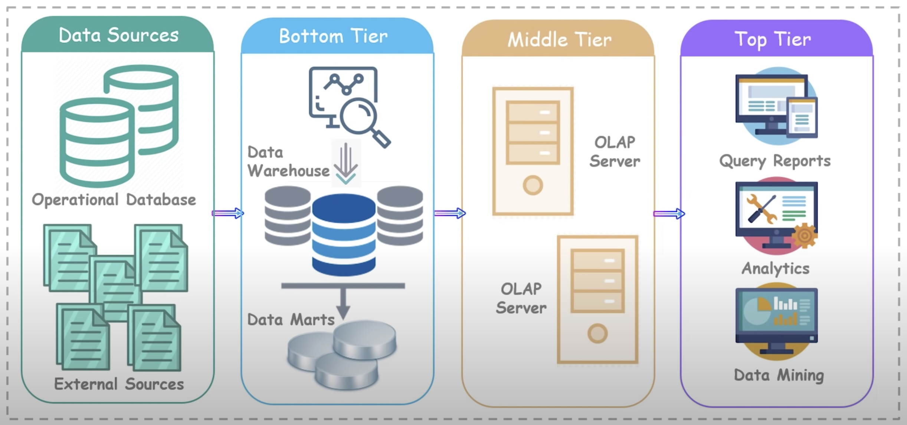
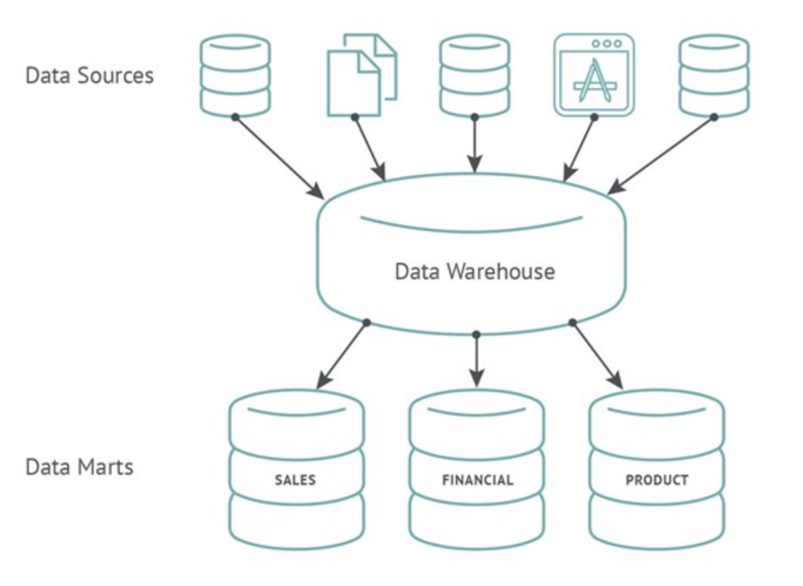
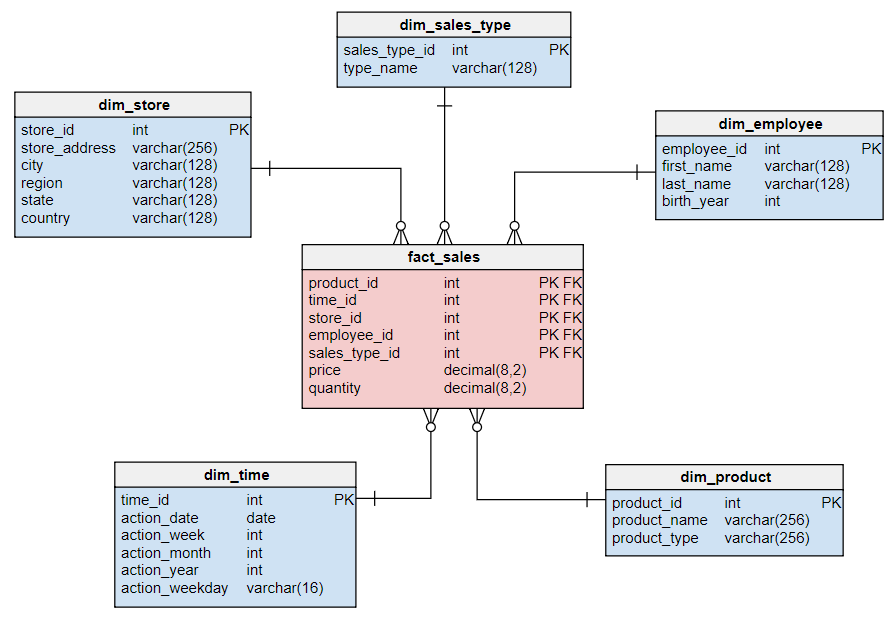
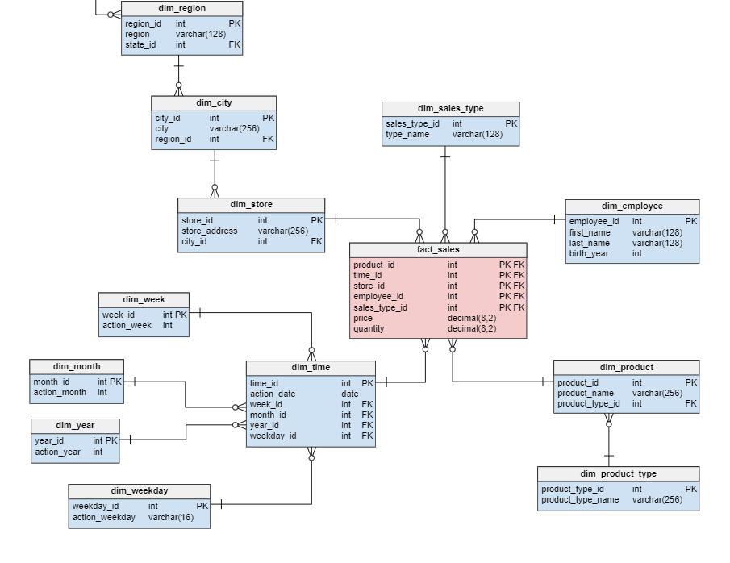
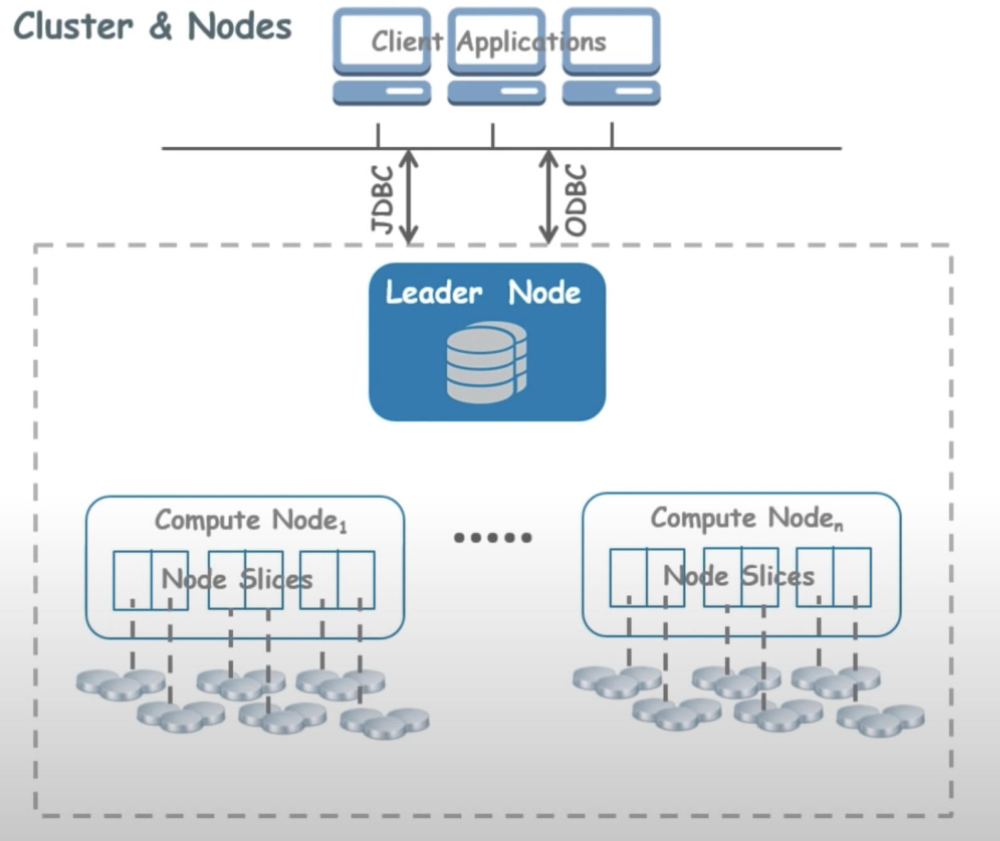

## Data Warehousing

So like a database but bigger?

---

<!-- .slide: data-only="generation jlr sainsburys" -->
### Overview

- History of data warehousing
- Data warehousing techniques
- AWS Redshift

---

<!-- .slide: data-only="schooloftech" -->
### Overview

- History of data warehousing
- Data warehousing techniques

---

<!-- .slide: data-only="generation jlr sainsburys" -->
### Learning Objectives

- Clarify the difference between Databases and Data Warehouses
- Identify the different Data Warehouse schema types
- Explain how AWS Redshift works

---

<!-- .slide: data-only="schooloftech" -->
### Learning Objectives

- Clarify the difference between Databases and Data Warehouses
- Identify the different Data Warehouse schema types

---

### OLTP vs. OLAP

- **OLTP (Database):** Online Transaction Processing Information systems facilitates and manages transaction-oriented applications
- **OLAP (Data Warehouse):** Online Analytical Processing is an approach to answer multi-dimensional analytical queries swiftly

<!-- .element: class="centered" height="350px" -->

---

### Traditional (Relational) Database

- Stores data in tables
- Uses Online Transactional Processing (OLTP)
- Row based data with high integrity
- Helps perform the fundamental operations of a business
- Generally normalised - with complex schema / table joins

Notes:
In OLTP, systems typically facilitate & manage (database) transaction-oriented applications. High throughput and are insert- or update-intensive.

Business operations such as payments, orders, customer data etc.

---

## Data Warehouse

- A system that aggregates data from multiple sources into a single, central and consistent data store
- Helps prepare data for data analytics, business intelligence (BI), data mining, visualisation tools, and other forms of advanced analytics

---

## Data Warehouse

<!-- .element: class="centered" height="400px" -->

---

### Data Warehouse Architecture

**Data Sources:**

- Internal sources such as wages, personnel, or maintenance databases
- External sources are not being generated from within the organisation like markets, competitors, or demographics

**Bottom Tier:**

- Warehouse Database Server
- Typically, _Column_-based storage
- Uses various backing tools to extract data from different sources
- Cleanses data and transforms it before loading into a Data Warehouse

<aside class="notes">
Ask about how we think this architecture might relate to the team
project (maybe show previous slide diagram again)
</aside>

---

### Data Warehouse Architecture cont.

**Middle Tier:**

- OLAP Server (**Online Analytical Processing**)
- Performs multi-dimensional analysis of business data
- Transforms the data into a format that we can perform complex calculations and data modelling on

**Top Tier:**

- Like a front-end client layer
- Holds different types of querying and reporting tools for which client applications can perform data analysis

Notes:
OLAP is more about complex queries, smaller volumes, business intelligence or reporting. Optimised for read only queries.

Denormalisation (leaving redundancy in) will serve to improve read performance (at expense of write performance).

With data warehousing, data is united from many tables into one.

---

### Emoji Check:

Do you feel you understand the difference between OLTP and OLAP? Say so if not!

1. 😢 Haven't a clue, please help!
2. 🙁 I'm starting to get it but need to go over some of it please
3. 😐 Ok. With a bit of help and practice, yes
4. 🙂 Yes, with team collaboration could try it
5. 😀 Yes, enough to start working on it collaboratively

Notes:
The phrasing is such that all answers invite collaborative effort, none require solo knowledge.

The 1-5 are looking at (a) understanding of content and (b) readiness to practice the thing being covered, so:

1. 😢 Haven't a clue what's being discussed, so I certainly can't start practising it (play MC Hammer song)
2. 🙁 I'm starting to get it but need more clarity before I'm ready to begin practising it with others
3. 😐 I understand enough to begin practising it with others in a really basic way
4. 🙂 I understand a majority of what's being discussed, and I feel ready to practice this with others and begin to deepen the practice
5. 😀 I understand all (or at the majority) of what's being discussed, and I feel ready to practice this in depth with others and explore more advanced areas of the content

---

### Business Intelligence (BI)

> What do you think it means?

<aside class="notes">
    Ask the class if anyone can explain what Business Intelligence means
</aside>

---

### Business Intelligence

> Business intelligence (BI) is software that ingests business data and presents it in user-friendly views such as reports, dashboards, charts and graphs. Analysing this data helps businesses gain actionable insights and inform decision-making.
>
> BI tools enable business users to access different types of data — historical and current, third-party and in-house, as well as semi-structured data and unstructured data like social media. Users can analyze this information to gain insights into how the business is performing.

Source: [ibm.com/topics/business-intelligence](ibm.com/topics/business-intelligence)

---

### Why Business Intelligence?

- Marketing
- Commercial Strategy
- Development Metrics... i.e. A/B Testing

---

Can you think of any others and examples?

<!-- .element: class="centered" -->

Notes:
e.g. Market Conditions, setting business objectives, identifying opportunities etc

---

### Observations and Trends

- Data sources can be pretty varied
- Data tends to be imported into staging tables as soon as possible for processing
    - **Staging tables:** Temporary tables containing data before it has been processed
- Often long chains of events that rely on previous stages completing exist
- Can you think of any potential issues occurring?

Notes:
Chain of events:
Ruth subscribes to a popular food delivery service.

Externally the service relies on a food supply chain, the system needs to forecast what will be available for her to choose from next week. Relying on data from third parties - the food suppliers.

Internally, every week when her order is dispatched the system relies on her address and payment details being available before the order is dispatched.

---

### Emoji Check:

Do you feel you understand the basics of Business Intelligence? Say so if not!

1. 😢 Haven't a clue, please help!
2. 🙁 I'm starting to get it but need to go over some of it please
3. 😐 Ok. With a bit of help and practice, yes
4. 🙂 Yes, with team collaboration could try it
5. 😀 Yes, enough to start working on it collaboratively

Notes:
The phrasing is such that all answers invite collaborative effort, none require solo knowledge.

The 1-5 are looking at (a) understanding of content and (b) readiness to practice the thing being covered, so:

1. 😢 Haven't a clue what's being discussed, so I certainly can't start practising it (play MC Hammer song)
2. 🙁 I'm starting to get it but need more clarity before I'm ready to begin practising it with others
3. 😐 I understand enough to begin practising it with others in a really basic way
4. 🙂 I understand a majority of what's being discussed, and I feel ready to practice this with others and begin to deepen the practice
5. 😀 I understand all (or at the majority) of what's being discussed, and I feel ready to practice this in depth with others and explore more advanced areas of the content

---

### Data Marts

- A condensed and more focused version of a data warehouse
- Each "Mart" contains a subset of the data warehouse, specifically oriented to a business sector or team (e.g. only Sales, or only Stock levels by week)
- They protect the data warehouse by decreasing the number of users directly accessing the main data
- Data Marts are intended to be **Read Only**

Notes:
Data marts are essentially more condensed and more specialised versions of data warehouses that reflect the process specifications of each business unit (accounting, marketing, sales etc) within an organisation.

Data marts can also be dedicated to specific regions.

The subset of data may still span across all of an enterprise's areas.

---

### Data Marts

<!-- .element: class="centered" -->

---

### Organising Our Data

- There are two common schemas for storing data within Data Warehouses/Marts:
    - Star Schema
    - Snowflake Schema

---

### Star Schema

- Introduced by Ralph Kimball in 1996
- Fact tables can refer to any number of Dimension Tables
- Tables are usually denormalised, allowing for writing simpler queries, involving less joins
- Because of this denormalisation, data integrity is relaxed, which may allow for data anomalies

---

### Star Schema

<!-- .element: class="centered" -->

Notes:
Read through:

One or more 'fact tables' can refer to any number of 'dimension tables'

Fact tables might contain measurements, metrics or facts of a business process

Where as the Dimension tables will try to categorise facts and measures to enable users in answering business questions like providing filtering, grouping and labelling

---

### Snowflake Schema

- The fact tables are connected to multiple dimensions
- More complex approach based on Star Schema
- It strips out low cardinality attributes (unique values) and forms separate tables
- Dimensions are normalized into multiple related tables
- Queries can become complex with a number of joins needed to retrieve all data
- Stricter data integrity leads to less anomalies like duplication, or missing relation data

---

### Snowflake Schema

<!-- .element: class="centered" -->

Notes:
The principle behind snowflaking is normalization of the dimension tables by removing low cardinality attributes and forming separate tables.

- More complex approach based on Star Schema
- The fact tables are connected to multiple dimensions
- Dimensions are normalised into multiple related tables
- Queries can become complex with a number of joins needed to retrieve all data
- Stricter data integrity leads to less anomalies like duplication, or missing relation data

---

### Emoji Check:

Do you feel you understand the basics of Star and Snowflake schemas? Say so if not!

1. 😢 Haven't a clue, please help!
2. 🙁 I'm starting to get it but need to go over some of it please
3. 😐 Ok. With a bit of help and practice, yes
4. 🙂 Yes, with team collaboration could try it
5. 😀 Yes, enough to start working on it collaboratively

Notes:
The phrasing is such that all answers invite collaborative effort, none require solo knowledge.

The 1-5 are looking at (a) understanding of content and (b) readiness to practice the thing being covered, so:

1. 😢 Haven't a clue what's being discussed, so I certainly can't start practising it (play MC Hammer song)
2. 🙁 I'm starting to get it but need more clarity before I'm ready to begin practising it with others
3. 😐 I understand enough to begin practising it with others in a really basic way
4. 🙂 I understand a majority of what's being discussed, and I feel ready to practice this with others and begin to deepen the practice
5. 😀 I understand all (or at the majority) of what's being discussed, and I feel ready to practice this in depth with others and explore more advanced areas of the content

---

### Quiz Time! 🤓

---

**What data processing system does a traditional database use?**

1. OLAP
1. OLTA
1. OLTP
1. OLAT

Answer: `3`<!-- .element: class="fragment" -->

Bonus point if you can remember what it stands for!<!-- .element: class="fragment" -->

---

**What data processing system does a data warehouse use?**

1. OLAP
1. OLTA
1. OLTP
1. OLAT

Answer: `1`<!-- .element: class="fragment" -->

Bonus point if you can remember what it stands for!<!-- .element: class="fragment" -->

---

**Which tier in a traditional data warehouse architecture would this be in**?

_Cleanse data and transform it before loading into the data warehouse._

1. Data Sources
2. Bottom Tier
3. Middle Tier
4. Top Tier

Answer: `2`<!-- .element: class="fragment" -->

Notes:
The extraction/cleansing/transformation and loading of the data happens in the bottom tier

---

<!-- .slide: data-only="generation jlr sainsburys" -->
## AWS Redshift

<!-- TODO: need to split this deck out to sot and gen version -->
 <!-- .element: class="centered" height="300px" -->

---

<!-- .slide: data-only="generation jlr sainsburys" -->
### Before Redshift - Traditional Data Warehouses

- Time consuming to pull data from the large warehouses using traditional architecture
- Costly - hardware, setup, electricity, security, estate
- Maintenance costs often outweighed the benefits (upgrading systems due to more data being added)
- Performance issues
- Auto-scaling is not an easy concept

---

<!-- .slide: data-only="generation jlr sainsburys" -->
### Redshift

- Massively **parallel**, **column-oriented** database
- Simple and cost-effective to analyse your data
- Manages, monitors and scales your system
- Up to 10x better performance than traditional
- Collection of compute resources which are called nodes
- These nodes, when organised into groups, become **clusters**
- Each cluster runs a Redshift engine which contains one or more DBs

Notes:
Column orientated -> stores data by column rather than row. Faster to query a subset of columns versus usually less efficient at inserting data.

---

<!-- .slide: data-only="generation jlr sainsburys" -->
### Architecture

<!-- .element: class="centered"  -->

---

<!-- .slide: data-only="generation jlr sainsburys" -->
### Clusters

- A cluster has a leader node with one or more compute nodes
- The leader node receives queries from client applications (BI, analytical software etc.)

Notes:
It develops a suitable query execution plan and coordinates parallel executions of these plans with one or more compute nodes.

Once the compute nodes finish, the leader aggregates the results from the nodes and sends back a response to the client application.

---

<!-- .slide: data-only="generation jlr sainsburys" -->
### Compute Nodes

- Compute resources which execute a query plan
- Transmits data among themselves to solve queries
- Nodes are further divided into (node) slices
- Each node slice receives an allocation of memory and performs operations in parallel

---

<!-- .slide: data-only="generation jlr sainsburys" -->
### Node types

- When you launch a (non-free tier) cluster, you need to specify the node types
- There are several types of node you can pick, including:
    - RA3
    - DC2 (Dense Compute)
    - DS2 (Dense Storage - _Legacy_)

Notes:
Slides previously covered DC2 (Dense Compute) vs DS2 (Dense Storage) nodes.

However, AWS have released RA3 nodes which separates compute and storage costs, and are recommended by AWS over DS2 in all instances.

How to pick node type on next slide.

---

<!-- .slide: data-only="generation jlr sainsburys" -->
### Choosing the right nodes:

- **Data Quantity:** Be aware of the amount of data you want to import into your Redshift cluster
- **Complexity of queries:** Different nodes support queries with differing levels of complexity
- **Downstream systems:** What uses the results of the queries? How important is query speed?

Notes:
Current recommendation (2023):

Less than 1 TB of data -> DC2 nodes.

Most other situations -> RA3 nodes. However, you still choose number of nodes and volume of managed storage.

https://docs.aws.amazon.com/redshift/latest/mgmt/working-with-clusters.html

---

<!-- .slide: data-only="generation jlr sainsburys" -->
### Columnar Data Storage

- The data is still represented with rows and columns as normal
- However, the data is physically stored by column, instead of rows
- Because the data stored is the same type, you can achieve better data compression
- Number of I/O operations decreases
- Also means you can query/perform data analysis on similar types of data far quicker than row storage

---

<!-- .slide: data-only="generation jlr sainsburys" -->
### Quiz Time! 🤓

**What is a Data Warehouse?**

1. A database used to support transactions made by a web application
1. A database used to integrate data from one or more sources to support BI and analytics
1. A building containing many servers used to store large volumes of data
1. A tool used to visualise data for business intelligence

Answer: `2`<!-- .element: class="fragment" -->

---

### Tips for your team projects (offline)

(This is repeated from the final AWS session, [../aws-08-cfn-ec2](../aws-08-cfn-ec2).)

> For your project time, there is a file of a few pointers and gotchas to consider.

- See [../aws-08-cfn-ec2/handouts/README-team-project-considerations.md](../aws-08-cfn-ec2/handouts/README-team-project-considerations.md)

---

<!-- .slide: data-only="generation jlr sainsburys" -->
### Terms and Definitions - recap

- **OLAP:** Answers multi-dimensional analytical queries swiftly
- **Business Intelligence:** Applying data analytics to business practice
- **Data Marts:** Condensed, more focused version of a data warehouse
- **Star Schema:** One or more 'fact tables', referencing any number of 'dimension tables'
- **Snowflake Schema:** Normalised data in multiple related tables, whereas the star schema's dimensions are denormalised
- **Redshift:** The AWS Data Warehouse service used to store and analyse large quantities of data

---

<!-- .slide: data-only="schooloftech" -->
### Terms and Definitions - recap

- **OLAP:** Answers multi-dimensional analytical queries swiftly
- **Business Intelligence:** Applying data analytics to business practice
- **Data Marts:** Condensed, more focused version of a data warehouse
- **Star Schema:** One or more 'fact tables', referencing any number of 'dimension tables'
- **Snowflake Schema:** Normalised data in multiple related tables, whereas the star schema's dimensions are denormalised

---

<!-- .slide: data-only="generation jlr sainsburys" -->
### Overview - recap

- History of data warehousing
- Data warehousing techniques
- AWS Redshift

---

<!-- .slide: data-only="schooloftech" -->
### Overview - recap

- History of data warehousing
- Data warehousing techniques

---

<!-- .slide: data-only="generation jlr sainsburys" -->
### Learning Objectives - recap

- Clarify the difference between Databases and Data Warehouses
- Identify the different Data Warehouse schema types
- Explain how AWS Redshift works

---

<!-- .slide: data-only="schooloftech" -->
### Learning Objectives - recap

- Clarify the difference between Databases and Data Warehouses
- Identify the different Data Warehouse schema types

---

<!-- .slide: data-only="generation jlr sainsburys" -->
### References and Further Reading

- [Explain By Example: OLTP vs. OLAP](https://medium.com/@michelle.xie/explain-by-example-oltp-vs-olap-d5603ac2038b)
- [AWS Redshift clusters and nodes](https://docs.aws.amazon.com/redshift/latest/mgmt/working-with-clusters.html)
- [Dimensional Modelling by Kimball](https://www.kimballgroup.com/data-warehouse-business-intelligence-resources/kimball-techniques/dimensional-modeling-techniques/)
- [Introduction to Data Vault Modelling](https://adatis.co.uk/a-gentle-introduction-to-data-vault/)

---

<!-- .slide: data-only="schooloftech" -->
### References and Further Reading

- [Explain By Example: OLTP vs. OLAP](https://www.youtube.com/watch?v=aRT8E0nD_LE)
- [Dimensional Modelling by Kimball](https://www.kimballgroup.com/data-warehouse-business-intelligence-resources/kimball-techniques/dimensional-modeling-techniques/)
- [Introduction to Data Vault Modelling](https://adatis.co.uk/a-gentle-introduction-to-data-vault/)

---

### Emoji Check:

On a high level, do you think you understand the main concepts of this session? Say so if not!

1. 😢 Haven't a clue, please help!
2. 🙁 I'm starting to get it but need to go over some of it please
3. 😐 Ok. With a bit of help and practice, yes
4. 🙂 Yes, with team collaboration could try it
5. 😀 Yes, enough to start working on it collaboratively

Notes:
The phrasing is such that all answers invite collaborative effort, none require solo knowledge.

The 1-5 are looking at (a) understanding of content and (b) readiness to practice the thing being covered, so:

1. 😢 Haven't a clue what's being discussed, so I certainly can't start practising it (play MC Hammer song)
2. 🙁 I'm starting to get it but need more clarity before I'm ready to begin practising it with others
3. 😐 I understand enough to begin practising it with others in a really basic way
4. 🙂 I understand a majority of what's being discussed, and I feel ready to practice this with others and begin to deepen the practice
5. 😀 I understand all (or at the majority) of what's being discussed, and I feel ready to practice this in depth with others and explore more advanced areas of the content
