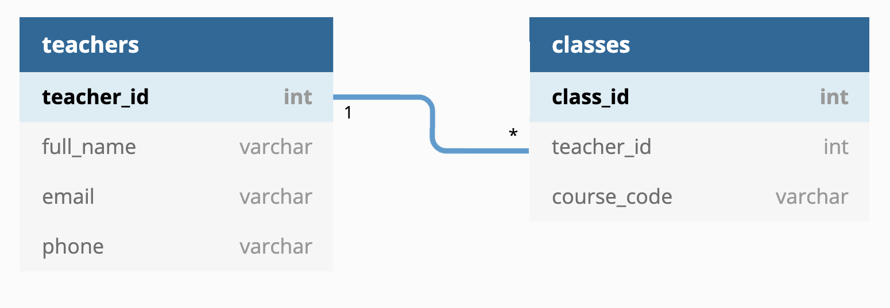

# Databases

Notes:
Create breakouts of 3-4 learners per room and use these same breakouts all day.

---

### Overview

- What is a database?
- SQL
- DDL and DML
- Using DDL SQL statements
- Using DML SQL statements
- Connecting to a database and using SQL using Python

Notes:
SQL = Structured Query Language

DDL = Data Definition Language for schemas, part of SQL

DML = Data Manipulation Language for data, part of SQL

---

### Learning Objectives

- Learn the features of a database
- Learn why we need databases
- Get introduced to the differences between relational and non-relational databases
- See some examples of SQL and learn about DDL and DML
- Learn, and practice using, SQL commands to interact with a database
- Learn, and practice using, Python to interact with a database

Notes:
SQL = Structured Query Language

DDL = Data Definition Language for schemas, part of SQL

DML = Data Manipulation Language for data, part of SQL

---

### What is a Database?

<span>A collection of structured information or data organised for convenient access.</span><!-- .element: class="fragment" -->

Notes:
N/A

---

Databases typically follow a client-server architecture:

<!-- .element: class="centered" -->

The client might be:

- A command line tool
- GUI tool
- A library for a programming language!

Notes:
Meaning the client sends SQL queries to the database server.

The database server processes those queries, performs actions (like fetching or updating data), and returns the result to the client.

---

### Aspects of data

<span>Table - holds a collection of columns and rows.</span><!-- .element: class="fragment" -->

<span>Column - hold different types of data.</span><!-- .element: class="fragment" -->

<span>Row - an individual entry in the table.</span><!-- .element: class="fragment" -->

<span>Constraints - automatically restrict what data can appear in a column.</span><!-- .element: class="fragment" -->

<span>Schema - the information about the structure of the database and any constraints it has.</span><!-- .element: class="fragment" -->

Notes:
N/A

---

### Example table

#### Student

```text
| student_id | first_name | last_name | birth_date | mentor_id |
|------------|------------|-----------|------------|-----------|
| 001        | Bernard    | Matthews  | 19700101   | 123       |
| 002        | Josh       | Leeds     | 19410709   | 123       |
| 003        | Vince      | Levis     | 19930430   | 420       |
```

Notes:
An example

---

### Why do we need a database?

<span>Storing data in memory risks data loss.</span><!-- .element: class="fragment" -->

<span>Big files are slow to read and write.</span><!-- .element: class="fragment" -->

<span>Small files adds complexity to your application.</span><!-- .element: class="fragment" -->

<span>Integrity of data is easier to maintain.</span><!-- .element: class="fragment" -->

<span>Data security is easier to manage.</span><!-- .element: class="fragment" -->

Notes:
ask for suggestions from cohort

---

### Relational vs Non-relational

What is a relation?

A relation is a set of tuples (rows) that share the same attributes (columns). Essentially - a table.

Tables in relational databases can have a connection.

Notes:
Two types of databases - relational and non-relational.

More information if anyone is curious: It comes from relational algebra, the mathematical foundation of relational databases.In relational algebra, data is thought of as a collection of sets (similar to sets in math), and we use operations (like adding, joining, or filtering) to manipulate those sets. These operations allow us to work with data in a structured and formal way, just like we work with numbers and shapes in math. This is what relational databases like SQL is based on.

---

### Database Relationship

In databases, a _relationship_ is a connection between two or more records in different tables, usually established through a shared ID, like `user_id`.

``` text
User table

| user_id | name  |
|---------|-------|
| 1       | Alice |
```

``` text
Order table

| order_id | user_id | item   |
|----------|---------|--------|
| 101      | 1       | Laptop |
```

---

### Non-relational

Anything that does not rely on relations between records.

Most can be broadly put into one of these categories:

- **Key-value** stores (like a Dictionary)
- **Graph** stores (like a mind-map structure)
- **Column** stores (as opposed to Row stores - potentially faster for analytics)
- **Document** stores (eg JSON files)

Notes:
Can call out examples of each:

Key-value: Redis, AWS DynamoDB
Column stores: Cassandra,HBase
GraphDB: Neo4j, JanusGraph, AWS Neptune
Document DB: Elasticsearch, MongoDB, CouchDB

---

### Using relations

Different kinds of relationships can exist between records:

- One-to-one
- One-to-many
- Many-to-many

Notes:
N/A

---

### One to One

<!-- .element: class="centered" -->

Notes:
In a one-to-one relationship, each record in one table is linked to one record in another table. In this case each student in the Students table has one matching contact record (row) in the contact_info table.

This is used when you want to separate data that logically belongs together but is stored in different tables.
This kind of relationship is useful when to split rarely used or sensitive data into a separate table — like storing contact details, addresses, or login credentials separately from the main student information.

---

### One to Many

- Is also Many-to-one

<!-- .element: class="centered" -->

Notes:
In a one-to-many relationship, a single record in one table can be related to many records in another table. In this case, each teacher in the teachers table can be linked to many classes in the classes table.

---

### Many to Many

<!-- .element: class="centered" -->

Notes:
In a many-to-many relationship, records in one table can relate to multiple records in another table, and vice versa. For example, students can enrol in many courses, and each course can have many students. This type of relationship requires a third table (called a junction or linking table) to manage the connections.

This third table is required as relational databases can't directly link many records in a table to many records in another table so a third table is needed to manage the connection.

Example:

Students table:

```text
| student_id | name     |
|------------|----------|
| 1          | Alice    |
| 2          | Bob      |
| 3          | Charlie  |
```

```text
Courses table:
| course_id | course_name       |
|-----------|-------------------|
| 101       | Math              |
| 102       | History           |
| 103       | Computer Science  |
```

```text
student_course_enrollment (Junction Table)
| student_id | course_id |
|------------|-----------|
| 1          | 101       |  ← Alice is enrolled in Math
| 1          | 103       |  ← Alice is enrolled in CS
| 2          | 101       |  ← Bob is enrolled in Math
| 2          | 102       |  ← Bob is enrolled in History
| 3          | 103       |  ← Charlie is enrolled in CS
```

---

### Pros of Relational stores:

- Reduced data duplication
- Allows our database to enforce integrity for us
- Mature tooling
- How we access the data doesn't matter so much, SQL is very flexible

Notes:

- **Reduced data duplication** - Relational databases minimize redundancy by storing data in separate tables and linking them using foreign keys. This ensures that data like a customer’s address is only stored once, reducing storage needs and the risk of inconsistent data.
- **Allows our database to enforce integrity for us** - Integrity ensures that data is accurate and consistent by using primary and foreign keys, along with rules to automatically prevent invalid data from being entered into the database.
- **Mature tooling** - Relational databases come with reliable and well-tested tools for managing, querying, and maintaining data, such as performance analysis, backups, and monitoring utilities, all supported by a large community.
- **Flexibility** - SQL syntax remains mostly consistent across different relational databases (like MySQL, PostgreSQL, and SQL Server), making it easy to query and work across various platforms.

---

### Cons of relational stores:

- Rigid schemas are hard to change
- Not all problems map well to relations
- Harder to scale
- Big-Data complex reports or analytics can be faster in Column based stores

Notes:

- **Rigid schemas are hard to change** - Relational databases require a predefined schema with tables, columns, and relationships defined before data is inserted. If you need to change the structure of the database, such as adding a new column or modifying a table, it can be complex and disruptive.
- **Not all problems map well to relations** - Relational databases work well with structured data in tables, but they struggle with hierarchical or unstructured data, like organizational charts or social media posts. Modelling such data often requires complex and inefficient designs. In these cases, non-relational databases are often more flexible and suitable.
- **Harder to scale** - Relational databases typically scale vertically, meaning you need to upgrade the server hardware to handle more data or users. This can be expensive and less efficient for large-scale systems. As the database grows, issues like locking, slow queries, and server limitations can arise.

---

### So, how can we utilise it?

<span>**`(R)DBMS`**</span><!-- .element: class="fragment" -->

<span>(Relational) Database Management System.</span><!-- .element: class="fragment" -->

<span>Works with tables and the relationships between them.</span><!-- .element: class="fragment" -->

<span>Create custom views on our data.</span><!-- .element: class="fragment" -->

<span>Program custom scripts (Stored Procedures) to query and manipulate our data.</span><!-- .element: class="fragment" -->

Notes:
How can we use relational databases.

**RDBMS** - An RDBMS (Relational Database Management System) is software that stores and manages data in tables, following the relational model. It uses SQL to query and manipulate data. Database Instances will be hosted on a server and RDBMS can connect to that instance then allow users to manage the system. Examples include: MySQL, PostgreSQL, and Oracle Database, which are widely used for managing structured data in applications.

Can do the following `<read from slides>`

---

### Some relational databases you may have heard of...

- Oracle
- MySQL
- PostgreSQL
- Microsoft SQL Server
- Microsoft Access (sort of)
- SQLite

Notes:
SQLite is built into the standard Python libraries.

---

### Emoji Check:

On a high level how do you feel about the use of databases?

1. 😢 Haven't a clue, please help!
2. 🙁 I'm starting to get it but need to go over some of it please
3. 😐 Ok. With a bit of help and practice, yes
4. 🙂 Yes, with team collaboration could try it
5. 😀 Yes, enough to start working on it collaboratively

Notes:
The phrasing is such that all answers invite collaborative effort, none require solo knowledge.

The 1-5 are looking at (a) understanding of content and (b) readiness to practice the thing being covered, so:

1. 😢 Haven't a clue what's being discussed, so I certainly can't start practising it (play MC Hammer song)
2. 🙁 I'm starting to get it but need more clarity before I'm ready to begin practising it with others
3. 😐 I understand enough to begin practising it with others in a really basic way
4. 🙂 I understand a majority of what's being discussed, and I feel ready to practice this with others and begin to deepen the practice
5. 😀 I understand all (or at the majority) of what's being discussed, and I feel ready to practice this in depth with others and explore more advanced areas of the content

---

### Task - 10 mins

- In groups try and come up with a design for a database for a school
- Think about what data needs storing and the relationships between that data
- Draw out your design and we'll share them shortly

Notes:
Create breakouts of 3-4 learners per room and use these same breakouts all day.

---

### SQL

_Structured Query Language_ (SQL)

THE language for querying relational databases.

Declarative, not imperative (i.e tell it what to do, not how to do it).

Notes:
N/A

---

### DDL vs DML

Data _Definition_ Language:<!-- .element: class="fragment" -->

- Create, alter and drop tables to create a schema<!-- .element: class="fragment" -->

Data _Manipulation_ Language:<!-- .element: class="fragment" -->

- Working with the data in your tables<!-- .element: class="fragment" -->

Notes:
SQL = Structured Query Language

DDL = Data Definition Language for schemas, part of SQL

DML = Data Manipulation Language for data, part of SQL

DDL commands are used to define and modify the structure of database objects like tables.

DML commands are used to manage the data inside the database tables.
Common DML commands:

- SELECT – Retrieves data from one or more tables.
- INSERT – Adds new data into a table.
- UPDATE – Modifies existing data.
- DELETE – Removes data from a table.

---

### DDL

Structure

```sql
CREATE TABLE <table_name> (
column1 <type>,
column2 <type>,
.
.
);
```

Notes:
N/A

---

### Table Example

```sql
CREATE TABLE person_details (
   person_id INTEGER GENERATED ALWAYS AS IDENTITY,
   first_name VARCHAR(100) NOT NULL,
   last_name VARCHAR(100) NOT NULL,
   age INTEGER,
   PRIMARY KEY(person_id)
);
```

- `GENERATED ALWAYS AS IDENTITY` is an auto-incrementing number
- `PRIMARY KEY` tells us what is unique for each row
- `VARCHAR` is a variable-length text field.

Notes:
Picture of the example table is in the next slide

---

### Table Example

<!-- .element: class="centered" -->

Notes:
An index in SQL is a tool used to quickly identify rows with specific column values. If there were no indexes, the SQL server would have to start with the first row and then go through the entire table until it discovers the relevant rows. When you create an index on a column the database builds a special lookup table (like a sorted list or a tree) that tells it exactly where each row in the column is stored. i.e. if looking for a row where `email = alice@example.com`. This helps the database find that matching row faster in queries without having to check every row one by one.

---

### Tables and linking data

What if we want a second table that _references_ the first? For example, contact info that is tied to a person?

Then we create the the second table and link back with a _Constraint_.

We must create the matched columns in both tables i.e. `person_id`, then link them with a `FOREIGN KEY CONSTRAINT`.

Notes:
Point out the CONSTRAINT does not define the COLUMNS, only enforce the relationship.

---

### Foreign Keys example

```sql
CREATE TABLE contact_info (
   info_id INTEGER GENERATED ALWAYS AS IDENTITY,
   person_id INT,
   phone VARCHAR(15),
   email VARCHAR(100),
   PRIMARY KEY(info_id),
   CONSTRAINT fk_person
     FOREIGN KEY(person_id)
     REFERENCES person(person_id)
);
```

- The `CONSTRAINT` clause requires the `FOREIGN KEY` and `REFERENCES` parts too

Notes:
Point out the CONSTRAINT does not define the COLUMNS, only enforce the relationship

Can use https://www.db-fiddle.com/ to do a code-along (don't forget to switch the db to postgres - scroll down in the dropdown on the top left), or use the `./exec-into-postgres-podman.sh` script to exec into the container.

The foreign key constraint named fk_person means that the person_id in the contact_info table must match a person_id that already exists in the person table. This prevents invalid data — for example, it won't allow you to insert a contact info row for a person_id that doesn't exist in the person table.

---

### Table Example

<!-- .element: class="centered" -->

---

### ALTER TABLE

We can manipulate the structure of existing tables;

```sql
ALTER TABLE person_details ADD date_of_birth DATE;
```

We can add and remove whole columns, and add and remove constraints.

<!-- .element: class="centered" -->

Notes:
N/A

---

### DROP TABLE

We can remove existing tables:

```sql
DROP TABLE contact_info;
```

<span>(We're not expecting the use of 'DROP TABLE' often)</span><!-- .element: class="fragment" -->

Notes:
N/A

---

### Emoji Check:

How do you feel about using SQL to create tables?

1. 😢 Haven't a clue, please help!
2. 🙁 I'm starting to get it but need to go over some of it please
3. 😐 Ok. With a bit of help and practice, yes
4. 🙂 Yes, with team collaboration could try it
5. 😀 Yes, enough to start working on it collaboratively

Notes:
The phrasing is such that all answers invite collaborative effort, none require solo knowledge.

The 1-5 are looking at (a) understanding of content and (b) readiness to practice the thing being covered, so:

1. 😢 Haven't a clue what's being discussed, so I certainly can't start practising it (play MC Hammer song)
2. 🙁 I'm starting to get it but need more clarity before I'm ready to begin practising it with others
3. 😐 I understand enough to begin practising it with others in a really basic way
4. 🙂 I understand a majority of what's being discussed, and I feel ready to practice this with others and begin to deepen the practice
5. 😀 I understand all (or at the majority) of what's being discussed, and I feel ready to practice this in depth with others and explore more advanced areas of the content

---

### Using Podman/Docker to run PostgreSQL

> We are going to now setup a PostgreSQL container running via Podman/Docker.
>
> We are using this as a tool to all get the same db running, we can go into how containerisation works another time.

<!-- .element: class="centered" height="350px" -->

Notes:

- Tell everyone "we are using this as a tool to get a db running, we do not need to know the details for now"

---

### Setting up the database container - 10 mins

> Follow the steps in the [./exercises/README.md](./exercises/README.md) file to get your

You will either use _Podman_ or _Docker_ to do so.

Notes:
Demo and make sure everyone follows along.
This can also be done in breakouts.

---

### Check postgres is running

Run the following:

```sh
podman ps -a
```

...it should show you that PostgreSQL and Adminer are running.

---

### Discussion

> Does everyone have a running database container now?

---

### Connect to your server

There are two ways to do this in general:

- Via a shell in the postgres container
- Install some psql tools locally and use those

> We will use containers

_Details on following slides._

Notes:
Some machines randomly fail to install the psql tools properly, esp Windows users in WSL/Ubuntu, which is why we use containers.

---

### Task - connect via the container

In your terminal run this:

```sh
podman exec -it my-postgres su postgres
# or
docker exec -it my-postgres su postgres
```

...which will open a shell inside the postgres container as the `postgres` user.

You should see a prompt like `postgres@15d1a0c1a577:/$`:


Notes:
Check everyone sees this

There are also scripts for this as detailed in [./exercises/README.md](./exercises/README.md)

---

### Task - run the interactive PSQL tool

Then, run the `psql` tool from within the container:

```sh
psql
```

You should see a prompt like `psql=#` or `postgres=#`


Notes:
Check everyone sees this

---

### Running SQL in PSQL

When we run SQL in the PSQL interactive tool, e.g. `SELECT * FROM person;` you should see output a bit like this:


Notes:
Check everyone sees this

Reminder: There is a `person` table pre-loaded in the container with sample data in it. This is done via a volume mount of the *.sql files in the `exercises/db-scripts` folder.

---

### List databases and tables

Some Postgres handy commands can be found on [postgrescheatsheet.com](https://postgrescheatsheet.com/)

For now at our psql prompt we can:

- List the databases with `\l` or `\list` (there will only be the default ones)
- List your tables with the _describe tables_ command `\dt`
    - the default database it uses is `postgres`

Notes:
Good excuse here to demonstrate that the person table already exists due to the setup with `./db-scripts:/docker-entrypoint-initdb.d`.

We could also manually demonstrate creating another table to show how it's done in either adminer or psql.

---

### Who loves a semi-colon?

> Databases do!

Statements in sql need finishing like this;

Each semicolon; Makes a separate statement;

<span>The commands like `\dt` are postgres-only commands, not SQL, so don't need one.</span><!-- .element: class="fragment" -->

Notes:
Note this to the Academites - it will be important later

---

### Task - groups - 15 mins

- Working in your groups create tables matching your design
- Warning: every statement must end with a `;`
- Make a file named e.g. `create_<table_name>.sql` in VSCode and write your SQL in there - this will show you context highlighting
- When done, copy-and-paste the SQL into PSQL to check it works
- Share the files with your group afterwards

Notes:
Create breakouts of 3-4 learners per room and use these same breakouts all day.

---

### Emoji Check:

How do you feel about writing SQL statements?

1. 😢 Haven't a clue, please help!
2. 🙁 I'm starting to get it but need to go over some of it please
3. 😐 Ok. With a bit of help and practice, yes
4. 🙂 Yes, with team collaboration could try it
5. 😀 Yes, enough to start working on it collaboratively

Notes:
The phrasing is such that all answers invite collaborative effort, none require solo knowledge.

The 1-5 are looking at (a) understanding of content and (b) readiness to practice the thing being covered, so:

1. 😢 Haven't a clue what's being discussed, so I certainly can't start practising it (play MC Hammer song)
2. 🙁 I'm starting to get it but need more clarity before I'm ready to begin practising it with others
3. 😐 I understand enough to begin practising it with others in a really basic way
4. 🙂 I understand a majority of what's being discussed, and I feel ready to practice this with others and begin to deepen the practice
5. 😀 I understand all (or at the majority) of what's being discussed, and I feel ready to practice this in depth with others and explore more advanced areas of the content

---

### School Example Teacher table

```sql
CREATE TABLE teacher (
   teacher_id INTEGER GENERATED ALWAYS AS IDENTITY,
   first_name VARCHAR(100) NOT NULL,
   last_name VARCHAR(100) NOT NULL,
   PRIMARY KEY(teacher_id)
);
```

Notes:
Check how everyone is doing

---

### School Example Course table

```sql
CREATE TABLE course(
   course_id INTEGER GENERATED ALWAYS AS IDENTITY,
   teacher_id INT,
   course_name VARCHAR(255),
   course_length VARCHAR(100),
   PRIMARY KEY(course_id),
   CONSTRAINT fk_person
      FOREIGN KEY(teacher_id)
     REFERENCES teacher(teacher_id)
);
```

Notes:
Recommend learners to add constraints & `GENERATED ALWAYS AS IDENTITY` to primary keys if they haven't already to make things easier as they go on with their databases.

---

### Who loves a single-quote?

> Postgres does!

DML Statements in PostgreSQL need single quotes `'`, not double-quotes `"`!

<div>
E.g.
<code>INSERT INTO person (first_name, last_name, age)
    VALUES ('Mike', 'Goddard', 28);</code>
</div><!-- .element: class="fragment" -->

Notes:
Note this to the Academites - it will be important later

---

### INSERTing Data

As you would expect, this _inserts_ (adds) a row into your table

```sql
INSERT INTO person (first_name, last_name, age)
    VALUES ('Mike', 'Goddard', 28);
INSERT INTO person (first_name, last_name, age)
    VALUES ('Emily', 'Birch', 52);
```

```sql
INSERT INTO contact_info (person_id, email)
    VALUES (1, 'mike@dummy.com');
INSERT INTO contact_info (person_id, email)
    VALUES (null, 'edward@dummy.com');
```

Any non-null fields are required as a value.

Any field not provided with a value will default to null.

Notes:
N/A

---

### INSERT with RETURNING

We can get back the id that the server created with the `RETURNING` keyword:

```sql
INSERT INTO person (first_name, last_name)
    VALUES ('Oscar', 'Cooper') RETURNING person_id;
```

This is especially useful when writing code (like python) that is adding the data for us.

Notes:
N/A

---

### Bulk INSERT clause (aka "multi-values")

You can insert multiple rows at once, which is very efficient. Here is an example;

```sql
INSERT INTO drink (name, type, temperature)
    VALUES
        ('americano', 'coffee', 'hot'),
        ('iced latte', 'coffee', 'cold'),
        ('filter', 'coffee', 'hot');
```

You can also use `RETURNING` with this syntax.

---

### Task - groups - 10 mins

- Working in your groups, have a go at inserting some data into your tables
    - `INSERT` as single row
    - `INSERT` multiple rows at once
- Use the `RETURNING` keyword (with one or more columns)
- Make a file named e.g. `insert_<table_name>.sql` in VSCode and write your SQL in there - this will show you context highlighting
- When done, copy-and-paste the SQL into PSQL to check it works
- Share the files with your group

Notes:
Create breakouts of 3-4 learners per room and use these same breakouts all day.

---

### Emoji Check:

How do you feel about inserting data?

1. 😢 Haven't a clue, please help!
2. 🙁 I'm starting to get it but need to go over some of it please
3. 😐 Ok. With a bit of help and practice, yes
4. 🙂 Yes, with team collaboration could try it
5. 😀 Yes, enough to start working on it collaboratively

Notes:
The phrasing is such that all answers invite collaborative effort, none require solo knowledge.

The 1-5 are looking at (a) understanding of content and (b) readiness to practice the thing being covered, so:

1. 😢 Haven't a clue what's being discussed, so I certainly can't start practising it (play MC Hammer song)
2. 🙁 I'm starting to get it but need more clarity before I'm ready to begin practising it with others
3. 😐 I understand enough to begin practising it with others in a really basic way
4. 🙂 I understand a majority of what's being discussed, and I feel ready to practice this with others and begin to deepen the practice
5. 😀 I understand all (or at the majority) of what's being discussed, and I feel ready to practice this in depth with others and explore more advanced areas of the content

---

### School Examples

```sql
INSERT INTO teacher(first_name, last_name)
    VALUES ('Gatsby', 'Woodhead') RETURNING teacher_id;
INSERT INTO teacher(first_name, last_name)
    VALUES ('Wiggins', 'Pickering') RETURNING teacher_id;

SELECT * FROM teacher; /* shows us the ids */

INSERT INTO course(teacher_id, course_name, course_length)
    VALUES (1, 'Physics', '3 Years') RETURNING course_id;
INSERT INTO course(teacher_id, course_name, course_length)
    VALUES (2, 'Philosophy', '4 Years') RETURNING course_id;
```

Notes:
Check how everyone is doing

---

### SELECTing Data

This is how we get our data back out;

<span>SELECT</span><!-- .element: class="fragment" -->

<span>FROM</span><!-- .element: class="fragment" -->

<span>WHERE</span><!-- .element: class="fragment" -->

<span>ORDER BY</span><!-- .element: class="fragment" -->

<span>LIMIT</span><!-- .element: class="fragment" -->

Notes:
N/A

---

### SELECT

Specifies which fields to return, and any criteria for the rows.

Takes a comma-separated list of field names:

```sql
SELECT person_id, first_name, last_name, age
```

`*` represents everything (all fields):

```sql
SELECT *
```

Notes:
N/A

---

### FROM

Specifying which table you're querying against

```sql
SELECT person_id, first_name FROM person;
```

Notes:
N/A

---

### WHERE

Specifying a predicate that evaluates whether a row should be returned

```sql
SELECT * FROM person WHERE first_name = 'Mike';
```

<div>

<span>Can take in wildcard matching</span>

```sql
SELECT * FROM person WHERE first_name like '%ily%';
```

</div><!-- .element: class="fragment" -->

Notes:
N/A

---

### Complex WHERE

You can build where clauses that use boolean operators

You can compound the boolean operators for even more fun!

```sql
SELECT * FROM person
    WHERE first_name = 'Mike'
    AND (last_name = 'Goddard' OR age >= 20);
```

Notes:
N/A

---

### ORDER BY

Specifying the order in which the data is returned

Optionally, the direction of the order can be appended

Can add multiple columns on which to order - this is like a primary and secondary sort (and so on)

```sql
SELECT * FROM contact_info
    ORDER BY email DESC, phone_number ASC;
```

Notes:

- Primary sort: The results are sorted by the email column in descending order (Z → A).
- Secondary sort: If two or more rows have the same email, then those rows are sorted by the phone_number column in ascending order (0 → 9 or A → Z).

---

### LIMIT

The number of results can be limited

```sql
SELECT * FROM contact_info
WHERE first_name = 'Mike'
ORDER BY last_name ASC
LIMIT 1;
```

Notes:
N/A

---

### Task - groups - 5 mins

- Use `SELECT` to pull the data back out of your tables to check the `INSERT` worked correctly
- Make a file named e.g. `select_<table_name>.sql` in VSCode and write your SQL in there - this will show you context highlighting
- When done, copy-and-paste the SQL into PSQL to check it works
- Share the files with your group

Notes:
Create breakouts of 3-4 learners per room and use these same breakouts all day.

---

### Emoji Check:

How do you feel about selecting data?

1. 😢 Haven't a clue, please help!
2. 🙁 I'm starting to get it but need to go over some of it please
3. 😐 Ok. With a bit of help and practice, yes
4. 🙂 Yes, with team collaboration could try it
5. 😀 Yes, enough to start working on it collaboratively

Notes:
The phrasing is such that all answers invite collaborative effort, none require solo knowledge.

The 1-5 are looking at (a) understanding of content and (b) readiness to practice the thing being covered, so:

1. 😢 Haven't a clue what's being discussed, so I certainly can't start practising it (play MC Hammer song)
2. 🙁 I'm starting to get it but need more clarity before I'm ready to begin practising it with others
3. 😐 I understand enough to begin practising it with others in a really basic way
4. 🙂 I understand a majority of what's being discussed, and I feel ready to practice this with others and begin to deepen the practice
5. 😀 I understand all (or at the majority) of what's being discussed, and I feel ready to practice this in depth with others and explore more advanced areas of the content

---

### Modifying Data

Notes:
N/A

---

### UPDATE

A way to change a row that is already stored:

```sql
UPDATE person SET age = 25 WHERE first_name = 'Mike';
```

Best practice is to update by the primary key id(s):

```sql
UPDATE person SET age = 25 WHERE person_id = 123;
```

Notes:
N/A

---

### Question: UPDATE

> What happens if we miss off the `WHERE`?

```sql
UPDATE person SET age = 25;
```

<span>Answer: We change everyone at once!</span><!-- .element: class="fragment" -->

Notes:
N/A

---

### DELETE

As you'd expect, delete a row given certain conditions:

```sql
DELETE FROM person WHERE first_name = 'Emily';
```

Best practice is to delete by the primary key id(s):

```sql
DELETE FROM person WHERE person_id = 456;
```

Notes:
N/A

---

### Question: DELETE

> What happens if we miss off the `WHERE`?

```sql
DELETE FROM person;
```

<span>Answer: We delete everyone at once! Possibly a P45 too!</span><!-- .element: class="fragment" -->

Notes:
N/A

---

### Task - groups - 10 mins

- Use UPDATE to update a row
- Use DELETE to delete a row
- Make a file named e.g. `<command>_<table_name>.sql` in VSCode and write your SQL in there - this will show you context highlighting
- When done, copy-and-paste the SQL into PSQL to check it works
- Share the files with your group

Notes:
Create breakouts of 3-4 learners per room and use these same breakouts all day.

---

### Emoji Check:

How do you feel about updating and deleting data?

1. 😢 Haven't a clue, please help!
2. 🙁 I'm starting to get it but need to go over some of it please
3. 😐 Ok. With a bit of help and practice, yes
4. 🙂 Yes, with team collaboration could try it
5. 😀 Yes, enough to start working on it collaboratively

Notes:
The phrasing is such that all answers invite collaborative effort, none require solo knowledge.

The 1-5 are looking at (a) understanding of content and (b) readiness to practice the thing being covered, so:

1. 😢 Haven't a clue what's being discussed, so I certainly can't start practising it (play MC Hammer song)
2. 🙁 I'm starting to get it but need more clarity before I'm ready to begin practising it with others
3. 😐 I understand enough to begin practising it with others in a really basic way
4. 🙂 I understand a majority of what's being discussed, and I feel ready to practice this with others and begin to deepen the practice
5. 😀 I understand all (or at the majority) of what's being discussed, and I feel ready to practice this in depth with others and explore more advanced areas of the content

---

### Discussion - 2 mins

Did anyone run into problems?

Notes:
Pre-empt the next slides on Referential Integrity :-)

---

### Referential Integrity

If you try and delete a row that is linked by a _foreign key_ Postgres will complain. It's enforcing _data integrity_ for us!

```sql
DELETE FROM person WHERE person_id = 1;

ERROR: update or delete on table "person" violates
    foreign key constraint "fk_person" on table "contact_info"
DETAIL:  Key (person_id)=(1) is still referenced from
    table "contact_info".
```

Notes:
N/A

---

### Cascade deletes

These tell Postgres we want to delete child records if we delete the parent.

We can't alter constraints so we will need to delete the existing constraint first and then add a new one that will cascade deletes:

```sql
ALTER TABLE contact_info DROP CONSTRAINT fk_person;

ALTER TABLE contact_info
ADD CONSTRAINT fk_person
FOREIGN KEY(person_id)
REFERENCES person(person_id)
ON DELETE CASCADE;

DELETE FROM person WHERE person_id = 1;
```

Notes:
Use with extreme caution!

What if the cascade runs through several tables? How much might we lose? (Lots!)

---

### Emoji Check:

How do you feel about concept of referential integrity and cascading deletes?

1. 😢 Haven't a clue, please help!
2. 🙁 I'm starting to get it but need to go over some of it please
3. 😐 Ok. With a bit of help and practice, yes
4. 🙂 Yes, with team collaboration could try it
5. 😀 Yes, enough to start working on it collaboratively

Notes:
The phrasing is such that all answers invite collaborative effort, none require solo knowledge.

The 1-5 are looking at (a) understanding of content and (b) readiness to practice the thing being covered, so:

1. 😢 Haven't a clue what's being discussed, so I certainly can't start practising it (play MC Hammer song)
2. 🙁 I'm starting to get it but need more clarity before I'm ready to begin practising it with others
3. 😐 I understand enough to begin practising it with others in a really basic way
4. 🙂 I understand a majority of what's being discussed, and I feel ready to practice this with others and begin to deepen the practice
5. 😀 I understand all (or at the majority) of what's being discussed, and I feel ready to practice this in depth with others and explore more advanced areas of the content

---

### JOINS

As you'd expect, we can join two or more tables in our query to get combined results.

Notes:
N/A

---

### JOINS

Let's pretend we have some data in tables like this:

**Person:**

```text
person_id | first_name
----------+-----------
 1        | Mike
 2        | Emily # no contact record
```

**Contact:**

```text
contact_id | person_id | email
-----------+---------------------------
 1         | 1         | mike@dummy.com
 2         | 3         | edward@dummy.com
```

Notes:
    Emily has no Contact record, Edward has email but no Person record

---

### INNER JOIN

Rows matching the condition of the join will be returned:

<!-- .element: class="centered" -->

Notes:
Returns only the rows that have matching values in both tables.
If there's no match, the row is excluded from the result.
It's the most common type of join used to find related data across tables.

---

### INNER JOIN - Example

```sql
SELECT p.first_name, c.email
FROM person p
JOIN contact_info c ON p.person_id = c.person_id;
```

If we ran that on the sample data on the previous slide, what might we get?

Notes:
N/A

---

### Answer

Only rows with matching ids in both tables are returned:

```text
 first_name | email
------------+-----------------
 Mike       | mike@dummy.com
```

Notes:
To break this down:

- The query selects the first_name column field from the person table and the email field from the contact_info field
- Inner join is done between person and contact_info (default JOIN = INNER JOIN) so the query can use both tables
- The ON clause defines the condition that links two tables together during a JOIN. (If ON is not used, this causes a Cartesian product — SQL will join every row from person with every row from contact_info, regardless of matching IDs !)
- Then only records that have matching values in a column in BOTH tables are returned i.e. In this case, only rows where the person_id exists (and has the same value) in both tables will be included in the result.

---

### LEFT OUTER JOIN

Returns all the data from A, as well as the matching data in B:

<!-- .element: class="centered" -->

Notes:
N/A

---

### What will this return?

Given some of the sample data we saw on previous slides, what does this give us?

```sql
SELECT p.first_name, c.email
FROM person p
LEFT JOIN contact_info c ON p.person_id = c.person_id;
```

Notes:
    Answer on next slide

---

It gives us the full set of people, with blanks where the contacts don't match, and no Edward as he only has Contact info:

```text
 first_name | email
------------+-----------------
 Mike       | mike@dummy.com
 Emily      |
```

Notes:
The first part of the command is similar to before. The difference here is that all rows from the person table will be returned. From the contact_info table; only rows with a person_id that matches one in the person table will be included.
For people who don’t have matching contact info, the fields from contact_info will be NULL (blank).

---

### How about this?

Given some of the sample data we saw on previous slides, what does this give us?

```sql
SELECT p.first_name, c.email
FROM person p
RIGHT JOIN contact_info c ON p.person_id = c.person_id;
```

Notes:
Answer on next slide

---

### RIGHT OUTER JOIN

It gives us everything from the RHS (contact_info) with blanks from missing People (so no Emily):

```text
 first_name | email
------------+------------------
 Mike       | mike@dummy.com
            | edward@dummy.com
```

Notes:
The first part of the command is similar to before. The difference here is that all rows from the contact_info table will be returned. From the person table; only rows where the person_id matches one in the contact_info table will be included in the result.
For emails that don’t have a matching person, the fields from the person table will be NULL (blank).

---

### FULL OUTER JOIN

Returns everything from both tables, regardless of if they match:

<!-- .element: class="centered" -->

Notes:
N/A

---

Given some of the sample data we saw on previous slides, what does this give us?

```sql
SELECT p.first_name, c.email
FROM person p
FULL OUTER JOIN contact_info c ON p.person_id = c.person_id;
```

Notes:
Answer on next slide

---

It gives us all the rows with blanks inserted where there are no matches:

```text
 first_name | email
------------+-------------------
 Mike       | mike@dummy.com
            | edward@dummy.com
 Emily      |
```

Notes:
The first part of the command is similar to before.
The difference here is that all rows from both the person and contact_info tables will be returned.
If a row in one table doesn’t have a matching row in the other, the missing side's fields will be NULL (blank).
This means you'll get every person, every email, and also see where there's no match between them.

Why ON clause is still needed with full outer join (if anyone asks):

The ON clause tells SQL how to match rows between the two tables. Even though FULL OUTER JOIN returns all rows from both tables, it still needs to know: Which rows should be matched together and which ones don’t have a match, so it can fill those with NULL. Without the ON clause, SQL wouldn’t know which values to compare it would just see two tables and have no idea what the “connection” is.

In our case:

SQL uses person_id to match related rows.
If person_id = 1 exists in both tables → combined row
If person_id = 2 is only in person → still shown, with NULL for contact_info
If person_id = 4 is only in contact_info → also shown, with NULL for person

---

### Task - 10 mins

- Use some JOINs to get data out of your database from more than one table at a time
- Make a file named e.g. `join_<table_name>.sql` in VSCode and write your SQL in there - this will show you context highlighting
- When done, copy-and-paste the SQL into PSQL to check it works
- Share the files with your group

Notes:
Create breakouts of 3-4 learners per room and use these same breakouts all day.

---

### Emoji Check:

How do you feel about writing JOIN statements in SQL?

1. 😢 Haven't a clue, please help!
2. 🙁 I'm starting to get it but need to go over some of it please
3. 😐 Ok. With a bit of help and practice, yes
4. 🙂 Yes, with team collaboration could try it
5. 😀 Yes, enough to start working on it collaboratively

Notes:
The phrasing is such that all answers invite collaborative effort, none require solo knowledge.

The 1-5 are looking at (a) understanding of content and (b) readiness to practice the thing being covered, so:

1. 😢 Haven't a clue what's being discussed, so I certainly can't start practising it (play MC Hammer song)
2. 🙁 I'm starting to get it but need more clarity before I'm ready to begin practising it with others
3. 😐 I understand enough to begin practising it with others in a really basic way
4. 🙂 I understand a majority of what's being discussed, and I feel ready to practice this with others and begin to deepen the practice
5. 😀 I understand all (or at the majority) of what's being discussed, and I feel ready to practice this in depth with others and explore more advanced areas of the content

---

### Functions

Many built-in functions exist for each RDBMS you're using.

Some useful functions you may want to use:

- `SUBSTRING`
- `AVERAGE`, `MIN`, `MAX`
- `CURRENT_DATE`
- `COUNT`
- `UPPER`
- `LOWER`

Notes:

- **SUBSTRING** - Extracts a part of a string starting from a specific position for a given length.
- **AVERAGE, MIN, MAX** - Average: Calculates the mean of numeric values, Min: Finds the smallest value in a column, Max: Finds the largest value in a column
- **CURRENT_DATE** - Returns the current system date.
- **COUNT** - Counts the number of rows or non-null values in a column.
- **UPPER** - Converts a string to uppercase.
- **LOWER** - Converts a string to lowercase.

Encourage learners to lookup syntax for these functions.

---

### Some examples

```sql
SELECT substring(first_name, 1, 3) FROM person;

SELECT substring(first_name FROM 1 FOR 3) FROM person;
```

Gives us:

```text
 substring
-----------
 Mik
 Emi
```

Notes:
The two queries above do the same thing

---

### Task - groups - 5 mins

- Use SUBSTRING in a query
- Use UPPER or LOWER in the same query as the SUBSTRING

Notes:
Create breakouts of 3-4 learners per room and use these same breakouts all day.

---

### Emoji Check:

How do you feel about functions in _SQL_?

1. 😢 Haven't a clue, please help!
2. 🙁 I'm starting to get it but need to go over some of it please
3. 😐 Ok. With a bit of help and practice, yes
4. 🙂 Yes, with team collaboration could try it
5. 😀 Yes, enough to start working on it collaboratively

Notes:
The phrasing is such that all answers invite collaborative effort, none require solo knowledge.

The 1-5 are looking at (a) understanding of content and (b) readiness to practice the thing being covered, so:

1. 😢 Haven't a clue what's being discussed, so I certainly can't start practising it (play MC Hammer song)
2. 🙁 I'm starting to get it but need more clarity before I'm ready to begin practising it with others
3. 😐 I understand enough to begin practising it with others in a really basic way
4. 🙂 I understand a majority of what's being discussed, and I feel ready to practice this with others and begin to deepen the practice
5. 😀 I understand all (or at the majority) of what's being discussed, and I feel ready to practice this in depth with others and explore more advanced areas of the content

---

### Task: Getting the Python exercise files

> For this part we will use the `exercises`, `handouts` and `solutions` folders.
>
> Please check you have them all.

Notes:
N/A

---

### Connecting to Postgres from Python

We will need our python code to:

- Make a connection to the database
- Query the data from it with a `SELECT` statement (or, later, `INSERT`, or `UPDATE`)
- Present the results to us on-screen

Notes:
This is a simplified list!

---

### Connecting postgres from Python

> What data might the python code need in order to connect to the database?

- Address of the server<!-- .element: class="fragment" -->
- Port of the server<!-- .element: class="fragment" -->
- Name of the database<!-- .element: class="fragment" -->
- Optionally - the name of the table<!-- .element: class="fragment" -->

These are usually passed in as environment variables, so that sensitive information is never saved in our code repository.<!-- .element: class="fragment" -->

Notes:
This is a simplified list

---

### SQL in Python

The library [`Psycopg`](https://www.psycopg.org) is a pure-Python PostgreSQL client library - we can use it to connect and run our SQL, i.e. allow us to interact with a PostgreSQL database purely through Python.

We do not need install this separately, it is in the `"requirements.txt"` file already.

Notes:
We do not need install this separately, it is in the "requirements.txt" file already!

---

### Sample requirements.txt

A sample is pre-prepared for us.

> Let's look inside `exercises/requirements.txt`

This contains a sample set of useful libraries we will use.

_The binary version is included in case anyone's machine has issues with the raw version._

Notes:
Show this to everyone

---

### Code-along - requirements

- Open a terminal in folder `exercises`
- Activate an existing venv or new virtual env
    - (see the "python-ecosystem" session for details)
- Install the dependencies from `requirements.txt` with:
    - `python3 -m pip install -r requirements.txt` (MacOS / Unix / GitBash)
    - `python -m pip install -r requirements.txt` (Windows)

Notes:
We can also have a single venv for the whole course, or per session - per session is more pythonic, but, one for the course saves a lot of time of installs on slow machines.

---

### Using env vars

> We do not want sensitive information like connection details or passwords in our python files!
>
> Nor in our Git repositories in any other files!

A special file called `.env` can be made with dummy values for our testing, which will have real values in production systems. We then `.gitignore` this file.

In production systems, these values can be created without them ever being saved in our code.

Notes:
N/A

---

### Using env vars

A standard way to write our code is use the `dotenv` utility to load them from the `.env` file. They can then be accessed in our application like so:

```py
import os
from dotenv import load_dotenv

# Load environment variables from .env file
load_dotenv()
host_name = os.environ.get("POSTGRES_HOST")
database_name = os.environ.get("POSTGRES_DB")
user_name = os.environ.get("POSTGRES_USER")
user_password = os.environ.get("POSTGRES_PASSWORD")
```

Notes:
Make sure everyone does this ok

---

### Making a connection

The `psycopg` utility has a `connect()` function for creating a connection, which takes a formatted string, like so:

```py
import psycopg2 as psycopg
# Other imports
connection = psycopg.connect(f"""
    host={host_name}
    dbname={database_name}
    user={user_name}
    password={user_password}
    """)
```

(This code assumes we have the variables `host_name, database_name, user_name, user_password` from the previous slide.)

Notes:
Note that this is the simple form - on the next slide we use a Context, which is preferred

---

### Making a connection "properly"

We should use a _context_ for the connection, like so:

```py
import psycopg2 as psycopg
# Other imports
try:
    with psycopg.connect(f"""
        host={host_name}
        dbname={database_name}
        user={user_name}
        password={user_password}
        """) as connection:
        # More code here
        ...

        # The connection will automatically close here
except Exception as ex:
    print('Failed to:', ex)
```

Notes:
This is the "neat" way to do it.

The exception message will print something useful if/when the code fails.

---

### Opening a cursor

A cursor is an object that lets us manipulate the database, in the context of a database operation:

The function to create one is on the `connection` object, like so:

```py
cursor = connection.cursor()
```

We can use this to run queries (SQL) on the database.

Notes:
N/A

---

### An insert query

For inserting data, we give the `execute()` function some SQL with placeholders in it, and a tuple of all the data, like so:

```py
sql = """
    INSERT INTO table_name (column_1, column_2, numeric_3)
    VALUES (%s, %s, %s)
    RETURNING primary_id
"""
data_values = ('value_1', 'value_2', 1234)

cursor.execute(sql, data_values)
```

The `execute()` function will do string substitutions for us in order - but we need to match the correct number of columns in the INSERT clause, VALUES clause, and tuple.

Notes:
N/A

---

### A bulk insert query

For this we have to use an optional extra from the psycopg2 library called ['execute_values()'](https://www.psycopg.org/docs/extras.html#psycopg2.extras.execute_values); It works a little differently:

```py
from psycopg2.extras import execute_values

insert_sql = 'INSERT INTO pets (name) VALUES %s;'
list_of_tuples = [ ('Fido',), ('Catto',)]

execute_values(cursor, insert_sql, list_of_tuples, page_size=100);
```

Note that the SQL has a single placeholder `%s` for the whole list.

Notes:
Instead of running individual insert commands like the below sql we can batch the inserts then use execute_values function (rather than execute) to execute the sql. execute_values takes the following arguments: a cursor, sql command, list of tuples/list containing data to be inserted, and page_size (optional) which defines how many rows to insert in each batch.

- Useful for optimizing performance with large datasets (e.g. 100 rows per batch). If we give it 500 rows, and page_size=100, it will: Break them into chunks of 100 and run 5 INSERT INTO ... VALUES (...) queries (each with 100 values inside). It’s very efficient for bulk inserts.

```sql
INSERT INTO pets (name) VALUES ('Fido');
INSERT INTO pets (name) VALUES ('Catto');
```

There is `executemany()` which runs the same SQL command multiple times (once for each set of parameters in your input list), but this can be slow as sql is ran for each row whereas `execute_values` runs sql per batch of rows. The latter is ok for inserting small amounts of data, but bad for huge amounts of data.

---

### Logging the RETURNed value

If we execute a cursor and have used the RETURNING keyword in the SQL, we can find the data that is sent back to us:

```py
...
cursor.execute(sql, data_values)
rows = cursor.fetchall()
print('insert result ids = ', rows[0])
```

Notes:
`fetchall()` retrieves all the rows returned by a SQL query that that's just been executed using the cursor. It returns a list of tuples where each tuple is a row in the query.

---

### Committing the data

"Committing" in database terms means "save any updates".

In code we need to do this ourselves, like so:

```py
connection.commit()
```

Notes:
If we don’t use `connection.commit()`:

- Our changes live in a transaction.
- They are not visible to other users/sessions.
- If the program crashes or exits unexpectedly, changes will be rolled back.
- Some drivers (like psycopg2) automatically roll back uncommitted transactions when the connection is closed.

Best to use to be on the safe side !

---

### Selecting data

To select data we also use a cursor. This will return all the matching data to us:

```py
cursor.execute('SELECT column_1, column_2, numeric_1 FROM table_name')
rows = cursor.fetchall()
```

We can also use any other valid clauses like `WHERE`, `ORDER BY`, `LIMIT`, and SQL functions.

Notes:
N/A

---

### Select results

The result we get (`rows` here) will be an array with an entry per row.

Each row will be a tuple of the column values, e.g:

```py
rows = [
    ('Jane', 'Bloggs', 32),
    ('Alice', 'Babbs', 45),
]
```

...and so on. The data types in the tuple will depend on that of the columns (i.e. strings, numbers, booleans).

Notes:
N/A

---

### Tidying up

When we are done with a cursor or connection, we need to close each of them to release the resources they are holding onto:

```py
# Closes the cursor so it will be unusable from this point
cursor.close()
```

We only need to manually close the connection if we didn't use a context:

```py
# Closes the connection to the DB, ALWAYS do this
connection.close()
```

Notes:

Cursors can also be put inside contexts as well so we don't have to worry about closing the cursor. For example:

```python
with connection.cursor() as cursor:
    cursor.execute(...)
```

---

### Demo time - standard table

> There are some SQL files pre-loaded into your databases - these can be found at `exercises/db-scripts/*.sql`

- These create a table called `person`
- And some sample data INSERTed
- And a SELECT statement to show us the data

**If** you **don't** have a table matching this from when we started your postgres database, please run all this sql in the `adminer_container` we also started up. Browse to <http://localhost:8080> and ask your instructor for the credentials to log in.

Notes:
Make sure everyone has the standard "person" table created and knows their database name (`postgres`).

Else, they can use the Adminer container to run in the SQL files.

---

### Demo time - skeleton file

> The instructor will show you the file

- A template file `exercises/my_db_app.py` is provided
    - It already has the imports
    - It already loads the environment variables from an `.env` file
- The file doesn't do anything... yet!
    - It won't compile until it is filled in
    - It contains some `TODO` sections for you to complete

Notes:
Make sure everyone has found the file - show them it and walk through it

---

### Exercise - groups: Connect to DB - 10 mins

> Connect to the database

- Edit the `my_db_app.py` file
    - Find the line `# TODO Establish a database connection`
    - Create a connection with a context block
- Run your file to test it, e.g.:
    - `python3 -m my_db_app` (MacOS / Unix / GitBash)
    - `python -m my_db_app` (Windows)

Notes:
Remind them to use a context!

---

### Discussion

> How did you get on connecting to the database?

Notes:
Check everyone got on all right

---

### Exercise - groups: Open cursor - 5 mins

> Create a cursor

- Edit the `my_db_app.py` file
    - Find the line `# TODO Add code here to open a cursor`
    - Create a cursor
- Run your file to test it, e.g.:
    - `python3 -m my_db_app` (MacOS / Unix / GitBash)
    - `python -m my_db_app` (Windows)

Notes:
Make sure everyone has a connection

---

### Discussion

> How did you get on creating a cursor?

Notes:
Check everyone got on all right

---

### Exercise - groups: INSERT data - 10 mins

> INSERT some data

- Edit the `my_db_app.py` file
    - Find the line `# TODO Add code here to insert a new record (use RETURNING)`
    - Execute a statement to add some data
    - Try to log the ID that is returned
    - Also find line `# TODO Add code here to commit the INSERT`
    - commit the cursor
- Run your file to test it, e.g.:
    - `python3 -m my_db_app` (MacOS / Unix / GitBash)
    - `python -m my_db_app` (Windows)

Notes:
N/A

---

### Discussion

> How did you get on inserting some data?

Notes:
Check everyone got on all right

---

### Exercise - groups: SELECT all data - 10 mins

> SELECT all data

- Edit the `my_db_app.py` file
    - Find the line `# TODO Add code here to select all the records`
    - Execute a statement to select all data
- Run your file to test it, e.g.:
    - `python3 -m my_db_app` (MacOS / Unix / GitBash)
    - `python -m my_db_app` (Windows)

Notes:
N/A

---

### Discussion

> How did you get on selecting some data?

Notes:
Check everyone got on all right

---

### Exercise - groups: Print all data - 5 mins

> Print out all data

- Edit the `my_db_app.py` file
    - Find the line `# TODO Add code here to print out all the records`
    - Iterate the rows of data and log each one
- Run your file to test it, e.g.:
    - `python3 -m my_db_app` (MacOS / Unix / GitBash)
    - `python -m my_db_app` (Windows)

Notes:
N/A

---

### Discussion

> How did you get on displaying the data?

Notes:
Check everyone got on all right

---

### Exercise - groups: Tidy up - 5 mins

> Close the cursor

- Edit the `my_db_app.py` file
    - Find the line `# TODO close the cursor`
    - Close the cursor
- Run your file to test it, e.g.:
    - `python3 -m my_db_app` (MacOS / Unix / GitBash)
    - `python -m my_db_app` (Windows)

Notes:
Create breakouts of 3-4 learners at the start of the day, and use these same breakouts all day

---

### Discussion

> How did you get on closing the cursor?

Notes:
Check everyone got on all right

---

### Optional extra task

> In your own project / exercise time, change your code to do a bulk insert with ['execute_values()'](https://www.psycopg.org/docs/extras.html#fast-execution-helpers).

---

### Terms and Definitions - recap

**Database**: An organised collection of data, generally stored and accessed electronically from a computer system.

**Relational Database**: A digital database based on the relational model of data.

**SQL**: A domain-specific language used in programming and designed for managing data held in a relational database management system.

**Query**: A precise request for information retrieval with database and information system.

---

### Terms and Definitions - recap

**DDL**: A data description language is a syntax for creating and modifying database objects such as tables, indexes, and users.

**DML**: A data manipulation language is a computer programming language used for inserting, deleting, and updating data in a database.

**Primary Key**: A specific choice of a minimal set of attributes (columns) that uniquely specify a tuple (row) in a relation (table).

**Foreign Key**: A set of attributes in a table that refers to the primary key of another table.

---

### Learning Objectives - recap

- Learnt about the features of a database
- Learnt why we need databases
- Got introduced to the differences between relational and non-relational
- Saw some examples of SQL and learn about DDL and DML
- Learned, and practiced using, SQL commands to interact with a database
- Learned, and practiced using, Python to interact with a database

Notes:
N/A

---

### Emoji Check:

On a high level, do you think you understand the main concepts of this session? Say so if not!

1. 😢 Haven't a clue, please help!
2. 🙁 I'm starting to get it but need to go over some of it please
3. 😐 Ok. With a bit of help and practice, yes
4. 🙂 Yes, with team collaboration could try it
5. 😀 Yes, enough to start working on it collaboratively

Notes:
The phrasing is such that all answers invite collaborative effort, none require solo knowledge.

The 1-5 are looking at (a) understanding of content and (b) readiness to practice the thing being covered, so:

1. 😢 Haven't a clue what's being discussed, so I certainly can't start practising it (play MC Hammer song)
2. 🙁 I'm starting to get it but need more clarity before I'm ready to begin practising it with others
3. 😐 I understand enough to begin practising it with others in a really basic way
4. 🙂 I understand a majority of what's being discussed, and I feel ready to practice this with others and begin to deepen the practice
5. 😀 I understand all (or at the majority) of what's being discussed, and I feel ready to practice this in depth with others and explore more advanced areas of the content
