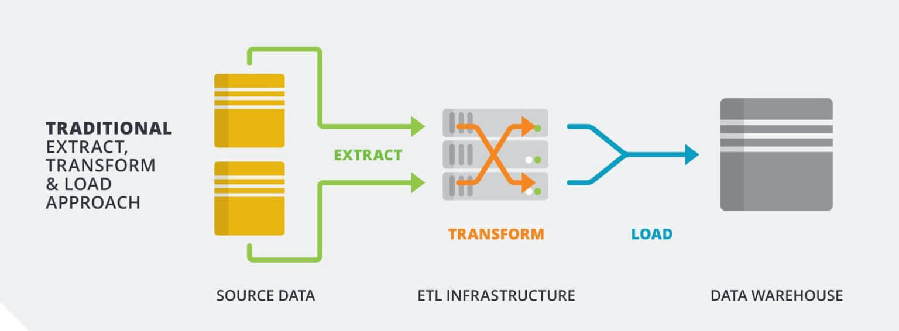

## ETL

---

## Overview

- High level definition of ETL
- What problems can ETL solve?
- What happens in each stage?
- ETL vs ELT

---

### Learning Objectives

- Understand what happens in the extract, load and transform phases
- Implement an ETL pipeline using Python and SQL
- Understand when you might want to use ETL or ELT

---

## What is ETL?

- **Extract, Transform and Load**
- A way to move data from multiple sources and save it in a single target location
- Extract: Data is pulled from the relevant sources
- Transform: The data is changed to make it suitable for the target system
- Load: The transformed data is then saved into the target system

---

### Problems with data

Often keeping track of data across many systems is complex when...

- Events occur at different times
- Data formats vary
- There's too much data to process when extracting
- Systems are separated logically or physically
- Unpredictable extra load affects the source system

Notes:
Possible examples:

Events occur at different times:

- One source sends data by the minute, another aggregates data and sends it hourly
- Data from events may not arrive in the order that they happened and so will need reconciliation later

Data formats vary:

- The logs from the backend come in CSV and the logs from the front end come in JSON but you want to make direct comparisons, only run the same query once etc.

There's too much data to process when extracting:

- This will only occur with big data (can be solved with out of the box solutions e.g. AWS Firehose)

Systems are separated logically or physically:

- You take data from the logs generated by your backend, which is hosted on AWS and you also take data from a third-party API. You want to bring the data from these sources into one place so they can back end queried together.

Unpredictable extra load affects the source system:

- If this happens, source system could become slow or inconsistent meaning the data you're extracting could have become stale or even faulty. Shows importance of monitoring and alerting in your ETL pipeline.

Other problems:

- APIs change over time, and not always with advanced warning.

---

### Consequences

This can lead to unreliable systems and therefore unreliable data.

How many possible consequences of unreliable data could you think of as a group?

---

### Consequences

Some possible consequences of unreliable data:

- Financial institutions: incorrect balances, lost transactions
- Scientific research: false conclusions
- Retail: lost orders and deliveries
- Loss of reputation

Notes:
Possible examples:

- Financial transactions - there need to be systems in place to warn if information is not up to date or if data has become corrupted. People's bank balances depend on this!

- Scientific research - might be less time sensitive but just as important that data is not lost and, if it is, there are alerts in place. A researcher's theories become harder to prove or disprove without this. Research often informs public policy on vital areas e.g. health, law, trade and education. Incorrect data could have a negative knock-on effect, creating policies informed by bad data.

- Retail orders - needs to accommodate rapidly changing usage patterns (e.g. online supermarkets after an announcement of lockdown) and keep track of people's orders - or at least be alerted if people's orders have got lost. This is especially important for those shielding or with other vulnerabilities as they rely more heavily on being able to make online purchases for delivery.

---

## The ETL Stages

<!-- .element: class="centered" -->

---

### Emoji Check:

Do you feel you understand the basics of ETL Pipelines? Say so if not!

1. 😢 Haven't a clue, please help!
2. 🙁 I'm starting to get it but need to go over some of it please
3. 😐 Ok. With a bit of help and practice, yes
4. 🙂 Yes, with team collaboration could try it
5. 😀 Yes, enough to start working on it collaboratively

Notes:
The phrasing is such that all answers invite collaborative effort, none require solo knowledge.

The 1-5 are looking at (a) understanding of content and (b) readiness to practice the thing being covered, so:

1. 😢 Haven't a clue what's being discussed, so I certainly can't start practising it (play MC Hammer song)
2. 🙁 I'm starting to get it but need more clarity before I'm ready to begin practising it with others
3. 😐 I understand enough to begin practising it with others in a really basic way
4. 🙂 I understand a majority of what's being discussed, and I feel ready to practice this with others and begin to deepen the practice
5. 😀 I understand all (or at the majority) of what's being discussed, and I feel ready to practice this in depth with others and explore more advanced areas of the content

---

### Extract: Where does the data come from?

Data is sourced from one or more systems, for example:

- Server logs
- Third parties
- Another database

---

### Extract: What format will the data be in?

This data will come in a variety of formats:

- JSON
- XML
- CSV
- Parquet (a column-oriented data storage format)
- Databases
- Other formats such as log files

Notes:
Parquet: Parquet files have greater compression than csv files, and because of its column-based structure there are many instances where querying is faster that row based formats like csv. Why can column-based formats achieve this extra speed? By being column-based, processes are going to run along data-types of the same type, rather than row-based where you're traversing different data types. This means that the processes can be highly optimised and tailored to a single data-type, therefore making them more efficient. (the data warehousing module also touches on this)

---

### Extract: When will the data be extracted?

This usually happens when...

- A timed event occurs i.e. daily, hourly etc
- A database trigger event occurs
- A manual process is run

Notes:
What other events might cause the need for extraction?

- A transaction (think apps like Monzo that send a notification right after you've made a purchase)

- A news event (think the automatic trading algorithms that process news feeds to decide whether to buy or sell)

- natural environment changes - so if data from earthquake sensors, dam pressure sensors and the like go above a particular threshold

---

### Extract: How do you extract the data?

You can extract the data using different transfer methods, for example:

- Secure File Transfer Protocol (SFTP) is a network protocol that provides file access, transfer and management.
- Network Shares are when a computer resource is made available from one host to other hosts on a network
- Object Stores like Amazon S3

---

### Extract: How do you know the data is formatted correctly?

During extraction it is important to validate that this data is acceptable for passing to the transformation stage.

We can do this by matching predictable patterns, schemas or by running hash functions against the data.

If the data is invalid then appropriate alerting and/or metrics should be produced to inform customers and downstream systems.

---

### Transform

Rules or functions are applied to the extracted data to perform any of the following

- Normalisation
- Cleaning the data to a specific format or encoding
- Selecting specific columns/fields
- Performing calculations on fields e.g. 1000ms to 1s

Notes:
Cleaning:

- Removing rows with null values in cells that you care about

Selecting specific columns:

- Time based exclusions, for tax reporting you only care about data between particular windows

Performing calculations:

- Maybe you want to find the average of a particular column, let's say average goals scored per season by a particular player over a season

---

### More transformations...

- Sorting
- Deduplicating data
- Grouping or Aggregating
- Joining data together with other datasets

Are there any other useful transformations you can think of?

Notes:
Sorting

- An international newspaper might want to sort their subscription information to have a visual rundown of where most subscribers live, from highest to lowest

Grouping / aggregating:

- Counting customers by gender

Joining:

- Mapping relationship between flooding data sets and crop yield data sets

---

### Load

Load the data into the target storage solution, often another relational database system.

Often existing data is overwritten or updated with cumulative information on a daily, weekly, or monthly basis.

Complex systems can maintain a history and audit trail of all changes to the data loaded in the data warehouse.

---

### Emoji Check:

Do you feel you understand the purpose behind the building blocks of of ETL Pipelines? Say so if not!

1. 😢 Haven't a clue, please help!
2. 🙁 I'm starting to get it but need to go over some of it please
3. 😐 Ok. With a bit of help and practice, yes
4. 🙂 Yes, with team collaboration could try it
5. 😀 Yes, enough to start working on it collaboratively

Notes:
The phrasing is such that all answers invite collaborative effort, none require solo knowledge.

The 1-5 are looking at (a) understanding of content and (b) readiness to practice the thing being covered, so:

1. 😢 Haven't a clue what's being discussed, so I certainly can't start practising it (play MC Hammer song)
2. 🙁 I'm starting to get it but need more clarity before I'm ready to begin practising it with others
3. 😐 I understand enough to begin practising it with others in a really basic way
4. 🙂 I understand a majority of what's being discussed, and I feel ready to practice this with others and begin to deepen the practice
5. 😀 I understand all (or at the majority) of what's being discussed, and I feel ready to practice this in depth with others and explore more advanced areas of the content

---

## ETL vs ELT

---

### What is ELT?

- ELT stands for Extract, Load, Transform
- The processes are the same, but their order has changed

Notes:
Little question for engagement re the second bullet point

Q: Now that the order has changed, what does this mean for the Transform stage's location?
  Answer: Now happens once it's been loaded and is inside the target system

---

## Advantages of ELT

- More flexibility in querying source data
- Easier to understand relationship between raw and transformed data
- Potential cost savings

Notes:
Flexibility
What happens if you want to run a different transformation (e.g. new SQL query) on your source data with an ETL pipeline?
You'd have to write the new query and then extract _all_ of the source data again in order to perform the new transformation and get your insights. With a massive system this could be very expensive in both time and cost.
In an ELT system you already have all your raw source data available, no need to extract it, so you just run the new query and get your results

Transparency
ELT can make it easier for everyone to understand the relationship between the extracted and transformed data as it's all in once place. In an ETL pipeline the source data is in a different system, which reduces the ease of access and ability to compare with transformed data.

- Business analysts e.g.
For example let's say a business analyst wants to delve deeper into why they're getting a particular set of results. It's much easier for them to make comparisons between the raw source data with the transformed data when they're in the same place.
- Data Engineer e.g.
Similarly, it's easier for an engineer to get see how the data that flows through their pipeline is being used and potentially make improvements, fix bugs etc.

Savings
Typically in an ELT pipeline the 'Load' location is in the cloud.
This means that the computing power required for the transform stage can be scaled up and down according to a businesses needs.
E.g.
A highly seasonal tourist business can just pay for what they need, when they need it, rather than having to invest in an on-premises fixed size system that they're not using to its full capacity most of the time

---

## Advantages of ETL

- Data protection - removing sensitive data before loading
- Can save on storage costs - removing large unused files before loading

Notes:
Data protection
If an industry has tight regulations on what sensitive data can be stored where, it's likely an ETL pipeline is preferable as it's easier to guarantee that sensitive information from raw data can be scrubbed during the transform stage, before it's loaded into the target system

Potential storage savings
If your source data contains large files (e.g. images) that you know you're never going to need, then it makes sense to not pay to store them in your target system - with ETL you can just ignore these files during the transform phase.

---

### Emoji Check:

Do you feel you understand the differences between ETL & ELT Pipelines? Say so if not!

1. 😢 Haven't a clue, please help!
2. 🙁 I'm starting to get it but need to go over some of it please
3. 😐 Ok. With a bit of help and practice, yes
4. 🙂 Yes, with team collaboration could try it
5. 😀 Yes, enough to start working on it collaboratively

Notes:
The phrasing is such that all answers invite collaborative effort, none require solo knowledge.

The 1-5 are looking at (a) understanding of content and (b) readiness to practice the thing being covered, so:

1. 😢 Haven't a clue what's being discussed, so I certainly can't start practising it (play MC Hammer song)
2. 🙁 I'm starting to get it but need more clarity before I'm ready to begin practising it with others
3. 😐 I understand enough to begin practising it with others in a really basic way
4. 🙂 I understand a majority of what's being discussed, and I feel ready to practice this with others and begin to deepen the practice
5. 😀 I understand all (or at the majority) of what's being discussed, and I feel ready to practice this in depth with others and explore more advanced areas of the content

---

## Examples

---

### ETL Example

A real estate property company allows users to search for houses.

Each house can be accessed via their website using the path `/property-12345`.

Every time a page is accessed a record is stored in the `property_view` table against the `property_id` .

---

### ETL Example

That table looks something like this...

```javascript
+-------------+---------------+---------+---------------+
| property_id |   timestamp   | browser |  ip_address   |
+-------------+---------------+---------+---------------+
|       12345 | 1580894343687 | Chrome  | 182.22.109.13 |
+-------------+---------------+---------+---------------+
```

---

### ETL Example

Once per day the property page view counts for the previous day are extracted from the main application database, and inserted into a staging table in the data warehouse.

The query looks something like this...

```sql
TRUNCATE TABLE warehouse_db.property_view_stage;

INSERT INTO warehouse_db.property_view_stage
SELECT * FROM main_db.property_view
WHERE timestamp >= 1580860800000
AND timestamp <= 1580947200000;
```

Notes:
Possible question to engage learners: why do we truncate first?
If staging data is permanently stored elsewhere, then it's just wasted space storing it here as well as in the target system

Stretch: Where do these numbers come from? Is someone having to update them manually? Would it be better if they were automated and calculated, then could just refer to them as variables.
Could introduce concept of magic numbers Currently looks like magic numbers no variables, so are they inserted manually?...
https://en.wikipedia.org/wiki/Magic_number_(programming)#Unnamed_numerical_constants

---

### ETL Example

The data is transformed using a `GROUP BY` aggregation and inserted into another staging table.

The query looks something like this...

```sql
TRUNCATE TABLE warehouse_db.page_view_daily_aggregation_stage;

INSERT INTO warehouse_db.page_view_daily_aggregation_stage
SELECT DATE(FROM_UNIXTIME(timestamp/1000)) as property_view_date,
property_id, COUNT(1) as property_view_count
FROM warehouse_db.property_view_stage
GROUP BY property_view_date, property_id;
```

---

### ETL Example

That table looks something like this...

```javascript
+--------------------+-------------+---------------------+
| property_view_date | property_id | property_view_count |
+--------------------+-------------+---------------------+
| 2020-02-05         |       12345 |                  32 |
| 2020-02-05         |       67890 |                  21 |
+--------------------+-------------+---------------------+
```

---

### ETL Example

This data is then loaded to the final location where it can be used in reports by estate agents to their customers.

The query looks something like this...

```sql
INSERT INTO warehouse_db.page_view_daily_aggregation
SELECT * FROM warehouse_db.page_view_daily_aggregation_stage
```

---

### ETL Example

The final aggregated data looking something like this...

```javascript
+--------------------+-------------+---------------------+
| property_view_date | property_id | property_view_count |
+--------------------+-------------+---------------------+
| 2020-02-05         |       12345 |                  32 |
| 2020-02-06         |       12345 |                  15 |
| 2020-02-05         |       67890 |                  32 |
| 2020-02-06         |       67890 |                  21 |
+--------------------+-------------+---------------------+
```

---

### ETL Example

This data could be further aggregated or used to produce insightful customer reports...

Can you think of any other examples of how this data could provide insight?

Notes:
Property view rate

- If the amount of times your property is viewed is below the average, you could look at what keywords you're using to describe it and think about some search engine optimisation measures

Click through rate:

- If this is below average you might want to think about things like what profile image you're using for the property, whether you would want to add more information like floor plans or simply increase the number of photographs

A user could tweak these things one by one to see if their numbers start to change

If all of a user's metrics are above average but the property still isn't selling, then they could start to think about what's not being recorded with the current system and whether that might provide some more insight into the behaviour they're seeing..

For example:

- There's no current way to record if visitors think the price is reasonable
- There's no comparison of larger trends outside of page views - e.g. does the time of year impact on how many properties are sold vs. when people are more window-shopping? Is there a national slump in purchases that relates to wider economic conditions?

---

### Emoji Check:

Do you feel you understand the ETL Pipeline example? Say so if not!

1. 😢 Haven't a clue, please help!
2. 🙁 I'm starting to get it but need to go over some of it please
3. 😐 Ok. With a bit of help and practice, yes
4. 🙂 Yes, with team collaboration could try it
5. 😀 Yes, enough to start working on it collaboratively

Notes:
The phrasing is such that all answers invite collaborative effort, none require solo knowledge.

The 1-5 are looking at (a) understanding of content and (b) readiness to practice the thing being covered, so:

1. 😢 Haven't a clue what's being discussed, so I certainly can't start practising it (play MC Hammer song)
2. 🙁 I'm starting to get it but need more clarity before I'm ready to begin practising it with others
3. 😐 I understand enough to begin practising it with others in a really basic way
4. 🙂 I understand a majority of what's being discussed, and I feel ready to practice this with others and begin to deepen the practice
5. 😀 I understand all (or at the majority) of what's being discussed, and I feel ready to practice this in depth with others and explore more advanced areas of the content

---

### Quiz Time! 🤓

---

**Extract is the process of...**

1. Pulling in data from one or more source systems, with no manipulation of the data.
1. Moving the source data directly to an end target, such as a data warehouse.
1. Pulling in data from one or more source systems, cleaning it in the process.
1. Aggregating multiple sources into one easily digestible set of data.

Answer: `1`<!-- .element: class="fragment" -->

Notes:
2 is incorrect as it's describing something with a load-type step - extract is only concerned with the initial collection of data.
3 is incorrect as we perform data cleansing in the transform step.
4 is incorrect as it's not definitive that we have to aggregate multiple pieces of data into one data set.

---

**Transform is the process of...**

1. Moving the source data directly to an end target, such as a data warehouse.
1. Removing columns of data we don't need, as well as aggregating data where needed.
1. Manipulating the extracted data to conform to business rules.
1. Applying a series of rules to the extracted data in order to prepare it for the end target.

Answer: `4`<!-- .element: class="fragment" -->

Notes:

1) Yes the transform step does contribute to getting data to the end target, but this is not the whole picture.
2) We can do this, but it isn't always necessary.
3) Again, not wrong but doesn't paint the whole picture.

---

**Load is the process of...**

1. Moving the transformed data into data analysis software.
1. Reviewing data in the database.
1. Moving the transformed data into the end target.
1. Overwriting existing data in a staging table.

Answer: `3`<!-- .element: class="fragment" -->

Notes:
1 is incorrect as this step is both optional and not totally necessary in ETL.
2 is incorrect as we are not reviewing existing data.
4 is incorrect as it isn't true.

---

### Exercise Prep

> Distribute exercise file [./exercises/etl-exercise.md](./exercises/etl-exercise.md) and the [./handouts/](./handouts/) folder.

---

### Exercise Prep - Setup - 5 mins

> Do the "Prep" step of setting up a postgres container from the [./exercises/etl-exercise.md](./exercises/etl-exercise.md) file.
>
> The files you need are in the [./handouts/](./handouts/) folder.

---

### Discussion

> Does everyone have a running database container now?

---

### Exercise - Overview

> The full exercise is in three main parts - write Extract code (load a CSV), write Transform code (of the CSV data), and write Load code (to save the data in Postgres). This is designed to bring together the building-blocks of several previous sessions.

There is also a fourth part to do some analysis of the acquired data.

---

### Exercise Task 1 - Extract - 10 mins

> Do the **"Task 1 - Extract"** step to load the CSV file from the [./exercises/etl-exercise.md](./exercises/etl-exercise.md) file.
>
> The files you need are in the [./handouts/](./handouts/) folder.

---

### Discussion

> Does everyone have a the extract code running?

---

### Exercise Task 2 - Transform - 20 mins

> Do the **"Task 2 - Transform"** step from the [./exercises/etl-exercise.md](./exercises/etl-exercise.md) file, to manipulate your data.
>
> The files you need are in the [./handouts/](./handouts/) folder.

---

### Discussion

> Does everyone have a the transform code running?

---

### Exercise Task 3 - Load - 20 mins

> Do the **"Task 3 - Load"** step from the [./exercises/etl-exercise.md](./exercises/etl-exercise.md) file, to insert the data into the database.
>
> The files you need are in the [./handouts/](./handouts/) folder.

---

### Discussion

> Does everyone have a the load code running?

---

### Exercise Task 4 - Analysis - 10 mins

> Do the **"Task 4 - Analysis"** step from the [./exercises/etl-exercise.md](./exercises/etl-exercise.md) file, analyse your data.
>
> The files you need are in the [./handouts/](./handouts/) folder.

---

### Discussion

> Does everyone have a the load code running?

---

### Emoji Check:

How did you find exercises on ETL Pipelines?

1. 😢 Haven't a clue, please help!
2. 🙁 I'm starting to get it but need to go over some of it please
3. 😐 Ok. With a bit of help and practice, yes
4. 🙂 Yes, with team collaboration could try it
5. 😀 Yes, enough to start working on it collaboratively

Notes:
The phrasing is such that all answers invite collaborative effort, none require solo knowledge.

The 1-5 are looking at (a) understanding of content and (b) readiness to practice the thing being covered, so:

1. 😢 Haven't a clue what's being discussed, so I certainly can't start practising it (play MC Hammer song)
2. 🙁 I'm starting to get it but need more clarity before I'm ready to begin practising it with others
3. 😐 I understand enough to begin practising it with others in a really basic way
4. 🙂 I understand a majority of what's being discussed, and I feel ready to practice this with others and begin to deepen the practice
5. 😀 I understand all (or at the majority) of what's being discussed, and I feel ready to practice this in depth with others and explore more advanced areas of the content

---

### Terms and Definitions - recap

**Extract**: Extract the data from a source.

**Transform**: Carry out operations on the data eg. cleaning it, adding meta data.

**Load**: Storing the transformed data, usually in a database.

---

## Overview - recap

- High level definition of ETL
- What problems can ETL solve?
- What happens in each stage?
- ETL vs ELT

---

### Learning Objectives - recap

- Understand what happens in the extract, load and transform phases
- Implement an ETL pipeline using Python and SQL
- Understand when you might want to use ETL or ELT

---

### Further Reading

- [ETL best practices](https://www.timmitchell.net/etl-best-practices/)
- [Anatomy of ETL](https://techcommunity.microsoft.com/t5/system-center-blog/data-warehouse-8211-anatomy-of-extract-transform-load-etl/ba-p/340759)
- [ETL vs ELT](https://www.softwareadvice.com/resources/etl-vs-elt-for-your-data-warehouse/)
- [Another good comparison of ETL and ELT](https://dataform.co/blog/etl-vs-elt)

---

### Emoji Check:

On a high level, do you think you understand the main concepts of this session? Say so if not!

1. 😢 Haven't a clue, please help!
2. 🙁 I'm starting to get it but need to go over some of it please
3. 😐 Ok. With a bit of help and practice, yes
4. 🙂 Yes, with team collaboration could try it
5. 😀 Yes, enough to start working on it collaboratively

Notes:
The phrasing is such that all answers invite collaborative effort, none require solo knowledge.

The 1-5 are looking at (a) understanding of content and (b) readiness to practice the thing being covered, so:

1. 😢 Haven't a clue what's being discussed, so I certainly can't start practising it (play MC Hammer song)
2. 🙁 I'm starting to get it but need more clarity before I'm ready to begin practising it with others
3. 😐 I understand enough to begin practising it with others in a really basic way
4. 🙂 I understand a majority of what's being discussed, and I feel ready to practice this with others and begin to deepen the practice
5. 😀 I understand all (or at the majority) of what's being discussed, and I feel ready to practice this in depth with others and explore more advanced areas of the content
