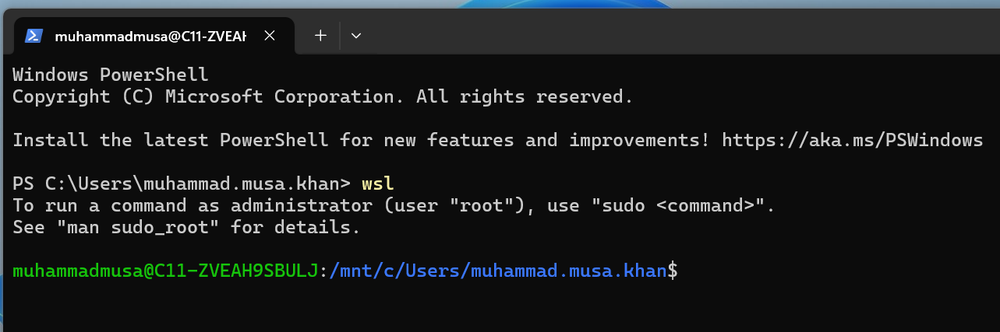
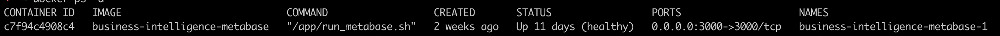

## Laptop Setup

Notes:
This is a mostly hands-on session with a lot of help required for the Academites

---

## Overview

- Getting our laptops course-ready for the next few weeks
- Setting up a password manager
- Setting up a Ubuntu WSL v2 VM
- Setting up podman to run container
- Configuring github access

Notes:
N/A

---

## Objectives

- Have the right software needed to be a consultant
- Have two-factor-authentication (2FA) enabled on GitHub
- Be able to sign into your Accenture email addresses

Notes:
N/A

---

### Disclaimer

Tech is unpredictable, and often enjoys throwing us curveballs! If something looks wrong then please shout up, we can't help you unless we know there is a problem 😄

This session can be relatively dry, but bear with us as this setup session allows us to do all the fun stuff going forward!

Notes:
N/A

---

### Software - Password Manager

You _must_ use a password manager. As an engineer you will likely be generating new passwords for websites and services all the time, which would be impossible to remember. As well as this, password managers are by far the most secure way of remembering passwords.

- See Accenture's [Password Managers](https://in.accenture.com/protectingaccenture/stay-secure/storing-information/password-managers/) page
    - [Last pass](https://support.lastpass.com/s/?language=en_US) is a recommended app
    - [Dash Lane](https://www.dashlane.com/) is a recommended app
    - [Keeper](https://www.keepersecurity.com/en_GB/) is a recommended app
- [Bitwarden](https://bitwarden.com/) is also very good

> **Important**: You _must_ us a different logon or account for your work vs personal security - do not mix them up.

Notes:
N/A

---

### Software - Password Manager

Further notes:

- Again - you must not mix work and personal details in any ways, Have separate accounts
- Do get the Browser plugin for the browser of your choice
- Do get the desktop app for your OS as well

Notes:
N/A

---

### Software - Password Manager

We highly recommend a password manager if you don’t already have one. As an engineer you will likely be generating new passwords for websites and services all the time, which would be impossible to remember. As well as this, password managers are by far the most secure way of remembering passwords.

- [Bitwarden](https://bitwarden.com/) is the recommended app
- Feel free to use an existing password manager if you're already using one

Notes:
N/A

---

### MFA (Multi-Factor Authentication)

An MFA app is used in conjunction with passwords for websites and services to increase the number of authentication checks from one (just the password) to two, using MFA. The application generates a new 6 digit code on your application every 30 seconds which you need to input after your password. This increases the level of security for whatever you are accessing.

- [Microsoft Authenticator](https://www.microsoft.com/en-gb/p/microsoft-authenticator/9nblgggzmcj6?activetab=pivot:overviewtab) is the recommended app.
- [Android](https://play.google.com/store/apps/details?id=com.azure.authenticator)
- [iOS](https://apps.apple.com/gb/app/microsoft-authenticator/id983156458)

But wait, there's an easier way to install these 🙂

Notes:
We are going to use Podman as it doesn't require an enterprise license

---

### Emoji Check:

Is your password manager and MFA set up and working?

1. 😢 Haven't a clue, please help!
2. 🙁 I'm starting to get it but need to go over some of it please
3. 😐 Ok. With a bit of help and practice, yes
4. 🙂 Yes, with team collaboration could try it
5. 😀 Yes, enough to start working on it collaboratively

Notes:
The phrasing is such that all answers invite collaborative effort, none require solo knowledge.

The 1-5 are looking at (a) understanding of content and (b) readiness to practice the thing being covered, so:

1. 😢 Haven't a clue what's being discussed, so I certainly can't start practising it (play MC Hammer song)
2. 🙁 I'm starting to get it but need more clarity before I'm ready to begin practising it with others
3. 😐 I understand enough to begin practising it with others in a really basic way
4. 🙂 I understand a majority of what's being discussed, and I feel ready to practice this with others and begin to deepen the practice
5. 😀 I understand all (or at the majority) of what's being discussed, and I feel ready to practice this in depth with others and explore more advanced areas of the content

---

### Windows features settings

Before working with WSL, we need to turn on some Windows services:

1. Go to `Settings > (search) Turn Windows features on or off`
    1. If either `Windows Hypervisor Platform` or `Virtual Machine Platform` is unchecked, please check them
    1. If either `Windows Hypervisor Platform` or `Virtual Machine Platform` is already checked, please uncheck and re-check them
1. Reboot your laptop

---

### Windows WSL v2

_Windows Subsystem for Linux_ lets you run a native Ubuntu distribution - we recommend using this for the whole course:

- Open a Windows Powershell terminal with Admin Privileges
- Run `wsl --set-default-version 2`
- Run `wsl --install -d Ubuntu`
- Reboot your machine

The [Microsoft WSL guide](https://learn.microsoft.com/en-us/windows/wsl/install) contains troubleshooting tips, but do not use it without further help from your instructors.

Notes:
N/A

---

### Windows WSL v2

Once your machine has rebooted, a new terminal window will automatically start, prompting you to enter a new Ubuntu username and password for use with WSL.

<!-- spell-checker: disable-next-line -->
- We recommend setting your username in the format `firstnamelastname`, eg. `bettyjones`.
- The password is unique to your Ubuntu WSL login, please keep note of this in your password manager.

The terminal window should then close.

<aside class="notes">
  N/A
</aside>

---

### Windows WSL v2

Now re-open a new Windows Powershell terminal, and type `wsl` to start the Ubuntu VM. You should see something like this:

<!-- .element: class="centered" -->

Notes:
N/A

---

### Troubleshooting common WSL problems (i)

#### Setting the default linux distribution

- Ubuntu should be the default linux distribution installed by wsl
- Check the default distribution: `wsl --list`
- `(Default)` should show after Ubuntu
<!-- spell-checker: disable-next-line -->
- If it doesn't, set the default distribution: `wsl --setdefault Ubuntu`
- Run `wsl --list` again to check Ubuntu is now the default

---

### Troubleshooting WSL common problems (ii)

#### Setting a default Ubuntu user

- We expect `wsl --install` to set up a default non-root user
- If this isn't configured correctly, we can rectify this by creating a new one
<!-- spell-checker: disable-next-line -->
- Run `wsl -u root` to shell into Ubuntu as root, then run `adduser {USERNAME}`
- Type the password twice that you wish to use for this Ubuntu user, you can leave the rest of the config blank. When typing your password, you won't see it on screen.
- Type `exit` to return to Windows, and set your user as the default: `ubuntu config --default-user {USERNAME}`
<!-- spell-checker: disable-next-line -->
- Enter wsl as root: `wsl -u root` and run `sudo adduser {USERNAME} sudo`, then `exit` to return to Windows
- You should now be able to run `wsl` and it will use your new user by default

---

### Troubleshooting WSL common problems (iii)

#### 'Logon failure' Error

There are a few things we can check to fix if the `wsl` command hangs and eventually results in this error:

```bash
Logon failure: the user has not been granted the requested logon type at this computer.
Error code: Wsl/Service/CreateInstance/CreateVm/HCS/0x80070569
```

The first step to troubleshoot this issue is to confirm the "Virtual Machine Platform" and "Windows Hypervisor" options are checked in Windows features.

---

### Troubleshooting WSL common problems (iv)

#### 'Logon failure' Error

1. Go to `Settings > (search) Turn Windows features on or off`
    1. If either `Windows Hypervisor Platform` or `Virtual Machine Platform` is unchecked, please check them
    1. If either `Windows Hypervisor Platform` or `Virtual Machine Platform` is already checked, please uncheck and re-check them
1. Reboot your laptop
1. Open the Windows terminal, and run `wsl -l -v`. This should return the status of the linux subsystem and the name/version of the OS (usually Ubuntu).

---

### Troubleshooting WSL common problems (v)

#### 'Logon failure' Error

If you have already performed the previous steps to no avail, a couple of other commands may help get the `wsl` command unstuck.

Ensure all WSL terminal sessions are closed and run the below on Windows in a Powershell with admin privileges:

```bash
taskkill /f /im wslservice.exe
Get-Service vmcompute | Restart-Service
```

Now try running `wsl` in a newly opened terminal window without admin privileges.

---

### Troubleshooting WSL common problems (vi)

#### 'VS Code Server for WSL closed unexpectedly' Error

- Shut down VSCode
- Open a PowerShell with admin privileges
- Type `wsl` in the PowerShell window to connect
- Run `rm -rf ~/.vscode-server`
- Remain inside WSL in a PowerShell window, then run `code ~`, this re-installs the VSCode remote extension
- Restart VSCode, connect to WSL via the remote extension

---

### Package manager (Windows)

We need to install a package manager called `chocolatey` for your machine:

- Navigate to [https://chocolatey.org/install](https://chocolatey.org/install)
- Scroll to the 'Install Chocolatey for Individual Use` section
- Follow the instructions to install
    - Make sure you use a Powershell terminal with Admin Privileges

---

### Confirming the installation

After running the command, we want to check the installation has been successful

- To do this we can run `choco --version`

The installed version should be displayed in your terminal, indicating the installation was a success

Now let's try installing `nano`, a commonly used text editor:

- `choco install -y nano`

<aside class="notes">
  N/A
</aside>

---

### Containerisation

A containerisation solution is required for some of the work on the course. The two best options are:

- [Docker for Ubuntu](https://docs.docker.com/engine/install/ubuntu/)
- and [Podman for Windows or Mac](https://podman.io/docs/installation)

But wait, there's an easier way to install these 🙂

<aside class="notes">
  We are going to use Podman as it doesn't require an enterprise license
</aside>

---

### Installing Podman Desktop & CLI

> Remember chocolatey, the package manager we just downloaded? Let's use that to download Podman.

Run these commands, one at a time:

```sh
choco install podman-desktop --version 1.8.0
# wait for that to finish, then run
choco install podman-cli --version 4.9.3
```

We are using `cli v4.9.3` as the latest one `v5.0.0` is not compatible with the latest Desktop app yet.

<aside class="notes">
  N/A
</aside>

---

### Installing Podman through the desktop

Now we have Podman desktop installed we can open the application through the desktop.

- Open the app
    - You can do this by searching "podman" in Windows Start
- Click the button to "Initialise and Start" a podman machine
- To do this we may be asked to "let Podman make changes on our device" - you can press yes to allow.

<aside class="notes">
  N/A
</aside>

---

### Run a podman container in the Desktop app

We can now run containers via the Desktop app.

- In the App you can run the default container

<aside class="notes">
  N/A
</aside>

---

### Run a podman container in a Terminal

We can now run containers via terminal commands.

- Open an Admin Powershell terminal
- Run `podman run hello-world`
- You should see it run and print out some ASCII art

<aside class="notes">
  N/A
</aside>

---

### Checking the container is running

- Open a powershell with admin privileges,
- Run `podman ps -a`
- You should see a list of recent containers in a table that looks something like this...

<!-- .element: class="centered" -->

Notes:
N/A

---

### Emoji Check:

Have you been able to run some containers successfully??

1. 😢 Haven't a clue, please help!
2. 🙁 I'm starting to get it but need to go over some of it please
3. 😐 Ok. With a bit of help and practice, yes
4. 🙂 Yes, with team collaboration could try it
5. 😀 Yes, enough to start working on it collaboratively

Notes:
The phrasing is such that all answers invite collaborative effort, none require solo knowledge.

The 1-5 are looking at (a) understanding of content and (b) readiness to practice the thing being covered, so:

1. 😢 Haven't a clue what's being discussed, so I certainly can't start practising it (play MC Hammer song)
2. 🙁 I'm starting to get it but need more clarity before I'm ready to begin practising it with others
3. 😐 I understand enough to begin practising it with others in a really basic way
4. 🙂 I understand a majority of what's being discussed, and I feel ready to practice this with others and begin to deepen the practice
5. 😀 I understand all (or at the majority) of what's being discussed, and I feel ready to practice this in depth with others and explore more advanced areas of the content

---

### Software - GitHub

- Set up a [GitHub](https://github.com/) account (or choose to use existing one)
- This has to be your Accenture email to get the SSO to work.
- You can still have a personal email on your account but the primary one needs to be something that matches your SSO principal.
- After you have joined IW-Academy, then you can change the primary to your personal one.

Then

- We will invite you all to the [Accenture School Of Tech github org](https://github.com/IW-Academy)

<!-- .element: class="centered" -->

Notes:
N/A

---

## GitHub: Security and Sensitive info

The course contains sensitive and proprietary material, so;

> All individual repos and Team projects _must_ go in the [Accenture School of Tech github org](https://github.com/IW-Academy) only
>
> No use of 'personal' github repos is allowed, _at all_, for anything related to work.
>
> You can use a personal repo for other non-work things of course.

<!-- .element: class="centered" -->

Notes:
Emphasise the is TOTALLY MANDATORY.

  The course contains sensitive and proprietary material.

---

### Exercise - GitHub Credentials

Inside a normal terminal run `wsl` - this will put you into your Ubuntu shell.

- Set up an SSH key for GitHub
    - Follow the _Generating a new SSH key_ instructions [here](https://docs.github.com/en/authentication/connecting-to-github-with-ssh/generating-a-new-ssh-key-and-adding-it-to-the-ssh-agent?platform=linux)
    - Then follow the _Adding a new SSH key to your GitHub account_ instructions [here](https://docs.github.com/en/authentication/connecting-to-github-with-ssh/adding-a-new-ssh-key-to-your-github-account?platform=linux&tool=webui)
    - Setup [Multi-Factor Authentication (MFA)](https://github.com/settings/security) on your GitHub Account

Notes:
This will likely take awhile for all learners to be setup. It's a good idea to run through the SSH setup as this will be difficult to understand for most.

---

### SSH config snippet

- It should look like this in your `.ssh/config` file

```text
# GitHub work
Host *
  AddKeysToAgent yes
  UseKeychain yes
  IdentityFile ~/.ssh/id_ed25519
```

Notes:
N/A

---

### GitHub (cont)

- Send the instructor your GitHub username, so we can get you added to the correct organisation

Notes:
Compile a list of GitHub usernames, send to IT

---

### Emoji Check:

How do you feel about the progress so far?

1. 😢 Haven't a clue, please help!
2. 🙁 I'm starting to get it but need to go over some of it please
3. 😐 Ok. With a bit of help and practice, yes
4. 🙂 Yes, with team collaboration could try it
5. 😀 Yes, enough to start working on it collaboratively

Notes:
The phrasing is such that all answers invite collaborative effort, none require solo knowledge.

The 1-5 are looking at (a) understanding of content and (b) readiness to practice the thing being covered, so:

1. 😢 Haven't a clue what's being discussed, so I certainly can't start practising it (play MC Hammer song)
2. 🙁 I'm starting to get it but need more clarity before I'm ready to begin practising it with others
3. 😐 I understand enough to begin practising it with others in a really basic way
4. 🙂 I understand a majority of what's being discussed, and I feel ready to practice this with others and begin to deepen the practice
5. 😀 I understand all (or at the majority) of what's being discussed, and I feel ready to practice this in depth with others and explore more advanced areas of the content

---

### Software - VSCode

- Install [VSCode](https://code.visualstudio.com/download)
- Sign into VSCode with your GitHub account (we use this for LiveShare)
- We will cover VSCode tips & tricks in the Remote Tools session.

Notes:
N/A

---

### VSCode setup

Install the following plugins:

1. `open in browser` for easily viewing html files etc
1. `Code Runner` for running files without the terminal
1. `live server` for code sharing
1. `Live Share` for code sharing
1. `vscode-pdf` for viewing PDF files inside VSCode
1. `Docker` for syntax highlights in files

Notes:
N/A

---

### VSCode - Additional Configuration

Open `File > Preferences > Settings` and configure these settings:

- `Search "auto save", change the drop down value to "afterDelay"`
- `Search "insert final newline", turn on "Files: Insert Final Newline"`
<!-- spell-checker: disable-next-line -->
- `Search "bracket pair", turn on "Editor > Bracket Pair Colorization: Enabled"`

Notes:
N/A

---

### Emoji Check:

How do you feel about the progress so far?

1. 😢 Haven't a clue, please help!
2. 🙁 I'm starting to get it but need to go over some of it please
3. 😐 Ok. With a bit of help and practice, yes
4. 🙂 Yes, with team collaboration could try it
5. 😀 Yes, enough to start working on it collaboratively

Notes:
The phrasing is such that all answers invite collaborative effort, none require solo knowledge.

The 1-5 are looking at (a) understanding of content and (b) readiness to practice the thing being covered, so:

1. 😢 Haven't a clue what's being discussed, so I certainly can't start practising it (play MC Hammer song)
2. 🙁 I'm starting to get it but need more clarity before I'm ready to begin practising it with others
3. 😐 I understand enough to begin practising it with others in a really basic way
4. 🙂 I understand a majority of what's being discussed, and I feel ready to practice this with others and begin to deepen the practice
5. 😀 I understand all (or at the majority) of what's being discussed, and I feel ready to practice this in depth with others and explore more advanced areas of the content

---

<!-- ### Standard installs

TBC slide for our `choco_brewfile_example_tbc.sh`

Notes:
For Windows WSL2 this is at least a useful list of things to get from apt. There is also a Windows equivalent in progress see (./examples/choco_brewfile_example_tbc.sh)

--- -->
### Accenture VPN Setup - instructions

- This should be pre-installed
- Launch the Accenture Global Protect VPN application installed on your computer
- Enter your Accenture credentials

Notes:
N/A

---

### Required environment variables

> The instructors will get the list for you and show you how to save them.

- We need some environment variables saved in our `~/.bashrc` file
- Open a terminal and run `wsl` to use Ubuntu
- We recommend using `vi ~/.bashrc`

> In the vi editor, press `i` on your keyboard to enter insert mode - then paste in the variables the instructor gives you.
>
> To exit vi, you will need to input `:x` to save your changes _or_ `:q` to abandon your changes.

Instructors: This is is from the outputs of [academy-core-infra](https://github.com/infinityworks/academy-core-infra) - run the cdk up to date with `make cdk-all-and-vars` and then share [env-vars.txt](https://github.com/infinityworks/academy-core-infra/blob/main/cdk/env-vars.txt)

- All: Verify with `echo $MY_NAME` in a _new_ terminal

Notes:
These are the env vars produced as of 30/01/2024

export MY_NAME={TYPE_YOUR_NAME_HERE}
export AWS_DEFAULT_REGION=eu-west-1
export AWS_REGION=eu-west-1
export AWS_ACCOUNT={THE_INSTRUCTOR_WILL_PROVIDE_THIS_SECRET_NUMBER}
export AWS_PROFILE={THE_INSTRUCTOR_WILL_PROVIDE}

alias docker=podman
alias aws-logon='aws-azure-login --profile sot'
alias aws-logon-gui='aws-azure-login --profile sot --mode gui'
alias aws-logon-cli='aws-azure-login --profile sot --mode cli'

---

#### Node & NPM

We need at least Node v20+ to run some of our AWS tools.

If `node` and `npm` are not already installed on your machine, follow the instructions to [install node](https://nodejs.org/en/download) for your platform. Note that some systems (Ubuntu for example) have a default installation of a very old version of node by default.

If you are on Unix, a Mac or WSLv2 Ubuntu, you may find it useful to install and use [NVM (Node Version Manager)](https://github.com/nvm-sh/nvm?tab=readme-ov-file#node-version-manager---) to control which version of Node you have installed and active.

---

### AWS Cloud Practitioner Exam

#### Self-paced learning

- Dedicated training day during the course to start looking at the e-learning materials
- Anything not completed that day, learners should continue to work on after they complete course
- No hard expectation for learners to have completed the exam by the end of the course, but learners are encouraged to continue study after graduating and to get the exam booked in in their own time when it makes sense
- Please open `Documents > General > Welcome > AWS Cloud Practitioner Self-paced learning` in Teams and following the instructions to sign up for the e-learning platform now.

Notes:

N/A

---

## Overview - recap

- Are you happy that your laptop is course-ready?
- Getting our laptops course-ready for the next few weeks
- Setting up a password manager
- Setting up a Ubuntu WSL v2 VM
- Setting up podman to run containers
- Configuring github access

Notes:
N/A

---

## Objectives - recap

- You now have the right software needed to be a consultant
- You have two-factor-authentication (2FA) enabled on your GitHub
- You can sign into your Accenture email addresses

Notes:
N/A

---

### Emoji Check:

On a high level, do you think you understand the main concepts of this session? Say so if not!

1. 😢 Haven't a clue, please help!
2. 🙁 I'm starting to get it but need to go over some of it please
3. 😐 Ok. With a bit of help and practice, yes
4. 🙂 Yes, with team collaboration could try it
5. 😀 Yes, enough to start working on it collaboratively

Notes:
The phrasing is such that all answers invite collaborative effort, none require solo knowledge.

The 1-5 are looking at (a) understanding of content and (b) readiness to practice the thing being covered, so:

1. 😢 Haven't a clue what's being discussed, so I certainly can't start practising it (play MC Hammer song)
2. 🙁 I'm starting to get it but need more clarity before I'm ready to begin practising it with others
3. 😐 I understand enough to begin practising it with others in a really basic way
4. 🙂 I understand a majority of what's being discussed, and I feel ready to practice this with others and begin to deepen the practice
5. 😀 I understand all (or at the majority) of what's being discussed, and I feel ready to practice this in depth with others and explore more advanced areas of the content
