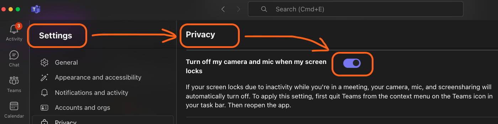
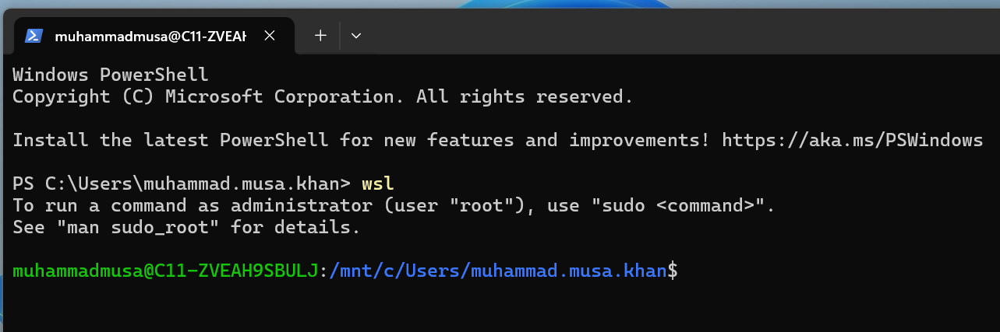
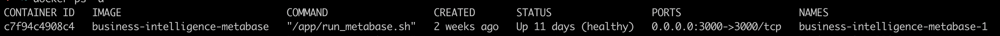
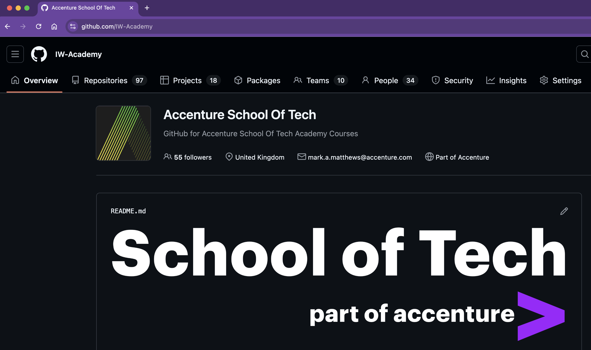
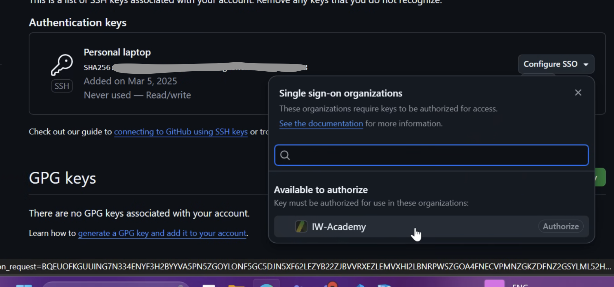
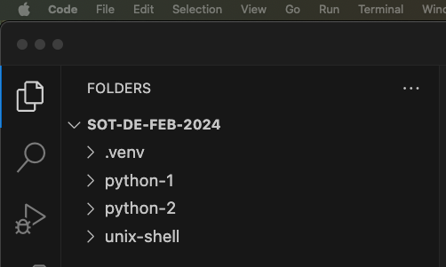

## Laptop Setup

### For School of Tech

Notes:
This is a mostly hands-on session with a lot of help required for the Academites

---

## Overview

- Getting our laptops course-ready for the next few weeks
- Setting up a password manager
- Setting up GitBash to use as a Unix shell
- Setting up podman to run containers
- Podman uses WSL, so we need that too
- Configuring github access

Notes:
N/A

---

## Objectives

- Have the right software needed to be a consultant
- Have two-factor-authentication (2FA) enabled on GitHub
- Be able to sign into your Accenture email addresses

Notes:
N/A

---

### Disclaimer

Tech is unpredictable, and often enjoys throwing us curveballs! If something looks wrong then please shout up, we can't help you unless we know there is a problem 😄

This session can be relatively dry, but bear with us as this setup session allows us to do all the fun stuff going forward!

Notes:
N/A

---

### Personal vs Work info

An important tip, that is covered in Accenture training already, but we like to remind you:

> Don't mix up work vs personal information

- Don't put anything related to work on personal devices - that includes all the course material
- Don't email work things to personal accounts
- Don't use your work computer for anything personal
- Don't use personal computers, laptops or phones for work things
- You can put Teams on a personal phone **if** is supports a Work Profile - follow the policy guidance

Notes:
This should not need clarifying, but always does! There is a Fair Use Policy in Accenture, but it's very restrictive. Best to be safe!

---

### Software - Password Manager (1/2)

You _must_ use a password manager. As an engineer you will likely be generating new passwords for websites and services all the time, which would be impossible to remember. As well as this, password managers are by far the most secure way of remembering passwords.

> **Important**: You _must_ use a different logon & account for your work vs personal security - do not mix them up.

_More on next slide._

Notes:
N/A

---

### Software - Password Manager (2/2)

> The Accenture pages mention other managers - Please only use Last Pass.

- See Accenture's [Password Managers](https://in.accenture.com/protectingaccenture/stay-secure/storing-information/password-managers/) page
- Get a work Last Pass subscription via Accenture from here:
    - In the page above is a link to [Enterprise Password Management Solution page](https://in.accenture.com/protectingaccenture/stay-secure/storing-information/password-managers-old/enterprise-password-manager-solution/)
    - There you apply for a licence to use the Accenture Enterprise instance of Last Pass
    - It also gives you a Personal Licence for use at home, to keep you secure there too - see the "Families as a Benefit" section

Notes:
N/A

---

### Software - Password Manager

Further notes:

- Again - you must not mix work and personal details in any ways, make sure you have separate accounts
- Do get the Browser Plugin for the browser of your choice
- Do get the desktop app for your OS as well

Notes:
N/A

---

### MFA (Multi-Factor Authentication)

An MFA app is used in conjunction with passwords for websites and services to increase the number of authentication checks from one (just the password) to two, using MFA. The application generates a new 6 digit code on your application every 30 seconds which you need to input after your password. This increases the level of security for whatever you are accessing.

- [Microsoft Authenticator](https://www.microsoft.com/en-gb/p/microsoft-authenticator/9nblgggzmcj6?activetab=pivot:overviewtab) is the recommended app.
- [Android MS Authenticator](https://play.google.com/store/apps/details?id=com.azure.authenticator)
- [iOS MS Authenticator](https://apps.apple.com/gb/app/microsoft-authenticator/id983156458)

Notes:
Make sure everyone has this set up.

---

### Emoji Check:

Is your password manager and MFA set up and working?

1. 😢 Haven't a clue, please help!
2. 🙁 I'm starting to get it but need to go over some of it please
3. 😐 Ok. With a bit of help and practice, yes
4. 🙂 Yes, with team collaboration could try it
5. 😀 Yes, enough to start working on it collaboratively

Notes:
The phrasing is such that all answers invite collaborative effort, none require solo knowledge.

The 1-5 are looking at (a) understanding of content and (b) readiness to practice the thing being covered, so:

1. 😢 Haven't a clue what's being discussed, so I certainly can't start practising it (play MC Hammer song)
2. 🙁 I'm starting to get it but need more clarity before I'm ready to begin practising it with others
3. 😐 I understand enough to begin practising it with others in a really basic way
4. 🙂 I understand a majority of what's being discussed, and I feel ready to practice this with others and begin to deepen the practice
5. 😀 I understand all (or at the majority) of what's being discussed, and I feel ready to practice this in depth with others and explore more advanced areas of the content

---

### Teams - because security

Teams can turn your camera, mic and sharing off when you lock your machine - this is a good security feature.

Please find this settings and turn it on, then restart Teams;



---

### Secure WiFi? Possibly not...

When not working at home (where you can trust the wifi) or in the office (ditto), all WiFi should be treated as suspect, and you must use either (a) your phone to tether, as you can trust this, or (b) connect but also use the Accenture VPN.

This is all in the Accenture Security Policies.

See here: <https://in.accenture.com/connectivitysecurity/vpn-home/> for how to get access to the Accenture VPN.

In the form, for **Primary Owner** put your EID, for **Exec Sponsor** put the current head of TAG, and for **Justification** put "Remote working on Accenture School of Tech".

---

### Windows features settings

Before working with WSL (as Podman requires it), we need to turn on some Windows services:

1. Go to `Settings > (search) Turn Windows features on or off`
    1. If either `Windows Hypervisor Platform` or `Virtual Machine Platform` is unchecked, please check them
    1. If either `Windows Hypervisor Platform` or `Virtual Machine Platform` is already checked, please uncheck and re-check them
1. Reboot your laptop

---

### Windows WSL v2

_Windows Subsystem for Linux_ lets you run a native Ubuntu distribution - we recommend using this for the whole course:

- Open a Windows Powershell terminal with Admin Privileges
- Run `wsl --install -d Ubuntu`
- Run `wsl --set-default-version 2`
- Reboot your machine

The [Microsoft WSL guide](https://learn.microsoft.com/en-us/windows/wsl/install) contains troubleshooting tips, but do not use it without further help from your instructors.

Notes:
N/A

---

### Windows WSL v2

Once your machine has rebooted, a new terminal window will automatically start, prompting you to enter a new Ubuntu username and password for use with WSL.

<!-- spell-checker: disable-next-line -->
- We recommend setting your username in the format `firstnamelastname`, eg. `bettyjones`.
- The password is unique to your Ubuntu WSL login, please keep note of this in your password manager.

The terminal window should then close.

<aside class="notes">
  N/A
</aside>

---

### Windows WSL v2

Now re-open a new Windows Powershell terminal, and type `wsl` to start the Ubuntu VM. You should see something like this:

<!-- .element: class="centered" -->

Notes:
N/A

---

### Troubleshooting common WSL problems (i)

#### Setting the default linux distribution

- Ubuntu should be the default linux distribution installed by wsl
- Check the default distribution: `wsl --list`
- `(Default)` should show after Ubuntu
<!-- spell-checker: disable-next-line -->
- If it doesn't, set the default distribution: `wsl --setdefault Ubuntu`
- Run `wsl --list` again to check Ubuntu is now the default

---

### Troubleshooting WSL common problems (ii)

#### Setting a default Ubuntu user

- We expect `wsl --install` to set up a default non-root user
- If this isn't configured correctly, we can rectify this by creating a new one
<!-- spell-checker: disable-next-line -->
- Run `wsl -u root` to shell into Ubuntu as root, then run `adduser {USERNAME}`
- Type the password twice that you wish to use for this Ubuntu user, you can leave the rest of the config blank. When typing your password, you won't see it on screen.
- Type `exit` to return to Windows, and set your user as the default: `ubuntu config --default-user {USERNAME}`
<!-- spell-checker: disable-next-line -->
- Enter wsl as root: `wsl -u root` and run `sudo adduser {USERNAME} sudo`, then `exit` to return to Windows
- You should now be able to run `wsl` and it will use your new user by default

---

### Troubleshooting WSL common problems (iii)

#### 'Logon failure' Error

There are a few things we can check to fix if the `wsl` command hangs and eventually results in this error:

```bash
Logon failure: the user has not been granted the requested logon type at this computer.
Error code: Wsl/Service/CreateInstance/CreateVm/HCS/0x80070569
```

The first step to troubleshoot this issue is to confirm the "Virtual Machine Platform" and "Windows Hypervisor" options are checked in Windows features.

---

### Troubleshooting WSL common problems (iv)

#### 'Logon failure' Error

1. Go to `Settings > (search) Turn Windows features on or off`
    1. If either `Windows Hypervisor Platform` or `Virtual Machine Platform` is unchecked, please check them
    1. If either `Windows Hypervisor Platform` or `Virtual Machine Platform` is already checked, please uncheck and re-check them
1. Reboot your laptop
1. Open the Windows terminal, and run `wsl -l -v`. This should return the status of the linux subsystem and the name/version of the OS (usually Ubuntu)

---

### Troubleshooting WSL common problems (v)

#### 'Logon failure' Error

If you have already performed the previous steps to no avail, a couple of other commands may help get the `wsl` command unstuck.

Ensure all WSL terminal sessions are closed and run the below on Windows in a Powershell with admin privileges:

```bash
taskkill /f /im wslservice.exe
Get-Service vmcompute | Restart-Service
```

Now try running `wsl` in a newly opened terminal window without admin privileges.

---

### Troubleshooting WSL common problems (vi)

#### 'VS Code Server for WSL closed unexpectedly' Error

- Shut down VSCode
- Open a PowerShell with admin privileges
- Type `wsl` in the PowerShell window to connect
- Run `rm -rf ~/.vscode-server`
- Remain inside WSL in a PowerShell window, then run `code ~`, this re-installs the VSCode remote extension
- Restart VSCode, connect to WSL via the remote extension

---

### Package manager (Windows)

We need to install a package manager called `chocolatey` for your machine:

- Navigate to [https://chocolatey.org/install](https://chocolatey.org/install)
- Scroll to the 'Install Chocolatey for Individual Use` section
- Follow the instructions to install
    - Make sure you use a Powershell terminal with Admin Privileges

..we will use this to install some other tools.

---

### Confirming the installation

After running the command, we want to check the installation has been successful

- To do this we can run `choco --version`

The installed version should be displayed in your terminal, indicating the installation was a success

Now let's try installing `nano`, a commonly used text editor:

- `choco install -y nano`

<aside class="notes">
  N/A
</aside>

---

### Containerisation

A containerisation solution is required for some of the work on the course. The two best options are:

- We will use [Podman for Windows or Mac](https://podman.io/docs/installation)

But wait, there's an easier way to install this 🙂

<aside class="notes">
  We are going to use Podman as it doesn't require an enterprise license
</aside>

---

### Installing Podman Desktop & CLI

> Remember chocolatey, the package manager we just downloaded? Let's use that to download Podman.

Run these commands, one at a time:

```sh
choco install podman-desktop --version 1.8.0
```

wait for that to finish, then run:

```sh
choco install podman-cli --version 4.9.3
```

We are using `cli v4.9.3` as the latest one `v5.0.0` is not compatible with the latest Desktop app yet.

<aside class="notes">
  N/A
</aside>

---

### Initialising Podman

Run the following, in a Admin Powershell terminal, one at a time;

```sh
podman machine init
```

then

```sh
podman machine start
```

<aside class="notes">
  N/A
</aside>

---

### Run a podman container in a Terminal

We can now run containers via terminal commands.

- Open an Admin Powershell terminal
- Run `podman run hello-world`
- You should see it run and print out some ASCII art

<aside class="notes">
  N/A
</aside>

---

### Checking the container is running

- Open a powershell with admin privileges,
- Run `podman ps -a`
- You should see a list of recent containers in a table that looks something like this...

<!-- .element: class="centered" -->

Notes:
N/A

---

### Emoji Check:

Have you been able to run some containers successfully??

1. 😢 Haven't a clue, please help!
2. 🙁 I'm starting to get it but need to go over some of it please
3. 😐 Ok. With a bit of help and practice, yes
4. 🙂 Yes, with team collaboration could try it
5. 😀 Yes, enough to start working on it collaboratively

Notes:
The phrasing is such that all answers invite collaborative effort, none require solo knowledge.

The 1-5 are looking at (a) understanding of content and (b) readiness to practice the thing being covered, so:

1. 😢 Haven't a clue what's being discussed, so I certainly can't start practising it (play MC Hammer song)
2. 🙁 I'm starting to get it but need more clarity before I'm ready to begin practising it with others
3. 😐 I understand enough to begin practising it with others in a really basic way
4. 🙂 I understand a majority of what's being discussed, and I feel ready to practice this with others and begin to deepen the practice
5. 😀 I understand all (or at the majority) of what's being discussed, and I feel ready to practice this in depth with others and explore more advanced areas of the content

---

### Office WiFi 1/3

The default office Wi-Fi blocks port 22, that we need to use GitHub. Other office Wi-Fis may allow it (try them) but one the definitely does is `WiFi-IoT`.

- For `WiFi-IoT` You will need the MAC (hardware) address of your physical Wifi card in your Accenture laptop
- For Windows, in powershell run `ipconfig /all`, and look for the network adapter called `Wireless LAN adapter Wi-Fi`
    - Copy the "Physical Address" value which looks like `A1-B2-C3-D4-E5-F6`
- For Mac, in terminal run `ifconfig`, look for the adapter called `en0`
    - Copy the `ether` value which looks like `A1:B2:C3:D4:E5:F6`
- Use that in the form (see next slide), the MAC address needs formatting keeping the hyphens like `A1-B2-C3-D4-E5-F6`

---

### Office WiFi 2/3

Follow [Steps to Submit New IoT Device Registration Request | Connectivity and Security (accenture.com)](https://in.accenture.com/connectivitysecurity/steps-to-submit-new-iot-device-registration-request/)

- Most fields can be defaulted
- Enter the MAC address in format `A1-B2-C3-D4-E5-F6` (with dashes)
- For "Do you need to assign the device to a Dedicated Project Segment" put "No"
- For Device Type put "Accenture Managed PC"
- For Description put e.g. "Mark's Accenture laptop"
- Submit the form

---

### Office WiFi 3/3

After the form is complete you should (usually within minutes) get an email with a password.

- Email Subject: `Device registration information`
- The email body will contain a "WiFi Pre-Shared Key (PSK)" e.g. `aBcDeFgHiJkLmN`
- Use this to sign in to `Wi-Fi IoT` in the office
- Make sure you don't copy any phantom spaces when you do :-)

---

### Software - GitHub

- Set up a [GitHub](https://github.com/) account (or choose to use existing one)
    - Setup [Multi-Factor Authentication (MFA)](https://github.com/settings/security) on your GitHub Account
- This has to be your Accenture email to get the SSO to work.
- You can still have a personal email on your account but the primary one needs to be something that matches your SSO principal.

Then

- We will invite you all to the [Accenture School Of Tech github org](https://github.com/IW-Academy)

<!-- .element: class="centered" -->

Notes:
N/A

---

## GitHub: Sensitive info

The course contains sensitive and proprietary material, so;

- All individual repos and Team projects _must_ go in the [Accenture School of Tech github org](https://github.com/IW-Academy) only
- No use of 'personal' github repos is allowed, _at all_, for anything related to work
- You can _only_ use a personal repo only for _non-work_ things

<!-- .element: class="centered" -->

Notes:
Emphasise this is TOTALLY MANDATORY.

The course contains sensitive and proprietary material.

---

### Software - GitHub for Windows using GitBash

Setup Git for Windows:

- Git for Windows/Mac/Linux: <https://git-scm.com/downloads/>

If you are on Windows, this gives you a useful unix-lite terminal:

- GitBash for Windows: <https://gitforwindows.org/>

---

### Exercise - GitHub Credentials

- Set up an SSH key for GitHub
    - Follow the _Generating a new SSH key_ instructions [here](https://docs.github.com/en/authentication/connecting-to-github-with-ssh/generating-a-new-ssh-key-and-adding-it-to-the-ssh-agent?platform=windows)
    - Check the tab matches your operating system!
    - Then follow the _Adding a new SSH key to your GitHub account_ instructions [here](https://docs.github.com/en/authentication/connecting-to-github-with-ssh/adding-a-new-ssh-key-to-your-github-account?platform=windows&tool=webui)

Notes:
This will likely take awhile for all learners to be setup. It's a good idea to run through the SSH setup as this will be difficult to understand for most.

---

### SSH config snippet

- It should look something like this in your `.ssh/config` file (Unix/Mac) or `%userprofile%\.ssh\config` (Windows)

```text
# GitHub work
Host *
  AddKeysToAgent yes
  UseKeychain yes
  IdentityFile ~/.ssh/id_ed25519
```

Notes:
N/A

---

### Checking we can reach GitHub on port 22

In a Bash or GitBash window run this:

```sh
ssh -T git@github.com
```

You should see something like this, which indicates success:


If you don't, you may ned to check your home router or the office WiFi.

Notes:
Some home internet providers block port 22 (SSH) as it is not commonly used.

---

### GitHub (cont)

> Instructor to invite cohort by email address

---

### GitHub (cont)

> Learner to accept the email invite

---

### GitHub (cont)

> To allow access to our organisation via SSH in the terminal, we have to enable the SSH key for SSO for the Organisation.
>
> Follow [these instructions](https://docs.github.com/en/enterprise-cloud@latest/authentication/authenticating-with-saml-single-sign-on/authorizing-an-ssh-key-for-use-with-saml-single-sign-on), which should take you to a view like below where you can authorise the organisation.

<!-- .element: class="centered" -->

---

### Emoji Check:

How do you feel about getting GitHub access set up?

1. 😢 Haven't a clue, please help!
2. 🙁 I'm starting to get it but need to go over some of it please
3. 😐 Ok. With a bit of help and practice, yes
4. 🙂 Yes, with team collaboration could try it
5. 😀 Yes, enough to start working on it collaboratively

Notes:
The phrasing is such that all answers invite collaborative effort, none require solo knowledge.

The 1-5 are looking at (a) understanding of content and (b) readiness to practice the thing being covered, so:

1. 😢 Haven't a clue what's being discussed, so I certainly can't start practising it (play MC Hammer song)
2. 🙁 I'm starting to get it but need more clarity before I'm ready to begin practising it with others
3. 😐 I understand enough to begin practising it with others in a really basic way
4. 🙂 I understand a majority of what's being discussed, and I feel ready to practice this with others and begin to deepen the practice
5. 😀 I understand all (or at the majority) of what's being discussed, and I feel ready to practice this in depth with others and explore more advanced areas of the content

---

### Software - Python3 (Windows)

> For Windows users, you need the latest Python3.

- Open Windows Store
- Install the latest "Python 3.x.y" version

Notes:
N/A

---

### Software - VSCode

- Install [VSCode](https://code.visualstudio.com/download)
    - Make sure you get the "System" version
- Sign into VSCode with your GitHub account (we use this for LiveShare)
- We will cover VSCode tips & tricks in the Remote Tools session.

Notes:
N/A

---

### VSCode setup

Install the following plugins:

1. `Python` for the course
1. `open in browser` for easily viewing html files etc
1. `Code Runner` for running files without the terminal
1. `live server` for code sharing
1. `Live Share` for code sharing
1. `vscode-pdf` for viewing PDF files inside VSCode
1. `Docker` for syntax highlights in files (useful for `Podman` too)

Notes:
N/A

---

### VSCode - Additional Configuration

Open `File > Preferences > Settings` and configure these settings:

- Search for `"auto save"`, change the drop down value to `"afterDelay"`
- Search for `"insert final newline"`, turn on `"Files: Insert Final Newline"`
- Search for `"bracket pair"`, turn on `"Editor > Bracket Pair Colorization: Enabled"`

Notes:
N/A

---

### Emoji Check:

How do you feel about the progress so far?

1. 😢 Haven't a clue, please help!
2. 🙁 I'm starting to get it but need to go over some of it please
3. 😐 Ok. With a bit of help and practice, yes
4. 🙂 Yes, with team collaboration could try it
5. 😀 Yes, enough to start working on it collaboratively

Notes:
The phrasing is such that all answers invite collaborative effort, none require solo knowledge.

The 1-5 are looking at (a) understanding of content and (b) readiness to practice the thing being covered, so:

1. 😢 Haven't a clue what's being discussed, so I certainly can't start practising it (play MC Hammer song)
2. 🙁 I'm starting to get it but need more clarity before I'm ready to begin practising it with others
3. 😐 I understand enough to begin practising it with others in a really basic way
4. 🙂 I understand a majority of what's being discussed, and I feel ready to practice this with others and begin to deepen the practice
5. 😀 I understand all (or at the majority) of what's being discussed, and I feel ready to practice this in depth with others and explore more advanced areas of the content

---

### Common folder for sessions

We get everyone to have the same folder structure on all your laptops, which helps us all help each other.

- In Windows Explorer, Create a folder in the root of your `C:\` drive named for your cohort e.g. `sot-de-<month>-<year>`
    - E.g. `C:\sot-de-oct-2024`
- In VS Code, use "File | Open Folder" to load your folder

> All the sessions we do, like `python-1`, should be downloaded into your `C:\sot-de-<month>-<year>` folder; for example see below.



Notes:
Instructors should all do the same.

Any Instructors on Mac/Unix should make a folder in their Home folder e.g. `~\sot-de-oct-2024`.

And **also** open it in VSCode.

This is also where (later) learners can make a course-wide VENV.

---

<!-- ### Standard installs

TBC slide for our `choco_brewfile_example_tbc.sh`

Notes:
For Windows WSL2 this is at least a useful list of things to get from apt. There is also a Windows equivalent in progress see (./examples/choco_brewfile_example_tbc.sh)

--- -->
### Accenture VPN Setup - instructions

- This should be pre-installed
- Launch the Accenture Global Protect VPN application installed on your computer
- Enter your Accenture credentials

Notes:
N/A

---

#### Node & NPM

We need at least Node v20+ to run some of our AWS tools.

If `node` and `npm` are not already installed on your machine, follow the instructions to [install node](https://nodejs.org/en/download) for your platform. Note that some systems (Ubuntu for example) have a default installation of a very old version of node by default.

If you are on Unix, a Mac or WSLv2 Ubuntu, you may find it useful to install and use [NVM (Node Version Manager)](https://github.com/nvm-sh/nvm?tab=readme-ov-file#node-version-manager---) to control which version of Node you have installed and active.

---

### AWS Cloud Practitioner Exam

#### Self-paced learning

- Dedicated training day during the course to start looking at the e-learning materials
- Anything not completed that day, learners should continue to work on after they complete course
- No hard expectation for learners to have completed the exam by the end of the course, but learners are encouraged to continue study after graduating and to get the exam booked in in their own time when it makes sense
- Please open `Documents > General > Welcome > AWS Cloud Practitioner Self-paced learning` in Teams and following the instructions to sign up for the e-learning platform now.

Notes:

N/A

---

## Overview - recap

- Are you happy that your laptop is course-ready?
- Getting our laptops course-ready for the next few weeks
- Setting up a password manager
- Setting up a Ubuntu WSL v2 VM
- Setting up podman to run containers
- Configuring github access

Notes:
N/A

---

## Objectives - recap

- You now have the right software needed to be a consultant
- You have two-factor-authentication (2FA) enabled on your GitHub
- You can sign into your Accenture email addresses

Notes:
N/A

---

### Emoji Check:

On a high level, do you think you understand the main concepts of this session? Say so if not!

1. 😢 Haven't a clue, please help!
2. 🙁 I'm starting to get it but need to go over some of it please
3. 😐 Ok. With a bit of help and practice, yes
4. 🙂 Yes, with team collaboration could try it
5. 😀 Yes, enough to start working on it collaboratively

Notes:
The phrasing is such that all answers invite collaborative effort, none require solo knowledge.

The 1-5 are looking at (a) understanding of content and (b) readiness to practice the thing being covered, so:

1. 😢 Haven't a clue what's being discussed, so I certainly can't start practising it (play MC Hammer song)
2. 🙁 I'm starting to get it but need more clarity before I'm ready to begin practising it with others
3. 😐 I understand enough to begin practising it with others in a really basic way
4. 🙂 I understand a majority of what's being discussed, and I feel ready to practice this with others and begin to deepen the practice
5. 😀 I understand all (or at the majority) of what's being discussed, and I feel ready to practice this in depth with others and explore more advanced areas of the content
