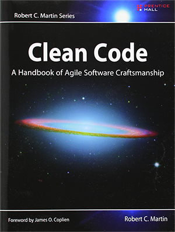

## Programming Practices

---

## Overview

- Introduction to Programming Practices
- The Importance of Documentation
- Tech Debt and How to Reduce it

---

## Learning Objectives

- Discover the features of clean, well written code
- Identify why documentation is important
- Explain what refactoring is
- Define what tech debt is and learn how to reduce it
- Discover the importance of code reviews

---

### Writing code like a pro

> Programs must be written for people to read, and only incidentally for machines to execute. -- **Harold Abelson**

and

> You know you are working on clean code when each routine you read turns out to be pretty much what you expected. -- **Ward Cunningham**

Notes:
Harold "Hal" Abelson - MIT Professor and involved in the free software movement

Ward Cunningham - Developed the first Wiki (The software which is the basis of Wikipedia) and co-authored the manifesto for agile software development

Read the quotes and ask the learners what they think about them. Do they know of clean practices?

---

### Clean code is easier to...

- Understand
- Reuse
- Test
- Refactor
- Extend

Notes:
We will see how all of these apply to clean code throughout the module.

Ask the learners if they can appreciate why each of those things is good, and what the term means

Understand - how easy it is to parse and comprehend

Extend - to add more to the project or module function, to add new features

Reuse - how easy it is to use existing modules and functions

Test - to unit test, integration test, or manually extend

Refactor - to change the shape / function definitions / layout later, so that we can add new features

---

## Key Ideas

**Functionality**: does it work?

**Testability**: are you sure it works?

**Readability**: can everyone understand how it works?

Notes:
Ask the learners, are any more important than the other? Try to generate a discussion.

---

**Bad code** tries to do too much; it is often muddled and ambiguous.

**Clean code** is focused. Each function, class, and module does a single, clear, obvious thing.

---

## The Acronyms of Clean Code

- KISS
- DRY
- YAGNI
- RTFM

Notes:
Ask the learners if they know any.

What do they mean?

Keep It Simple Stupid. (Obvious code is better than obfuscated code which is abstracted and seems clever, but is hard to follow.)

Don't Repeat Yourself. (Don't write code to perform an identical task multiple times, prefer re-use.)

You Ain't Gonna Need It. (Don't add functionality until required, e.g. don't add capability for integrating your app with multiple types of database just in case you need to do that - likelihood is you probably won't.)

Read The F'ng Manual. (Probably best not to swear!) - You can discover a lot about how to best use the tools in your toolbox by checking their docs and looking at examples, rather than guessing at their functionalities.

---

## Programming Practices

<!-- .element: class="centered" height="300px" -->

Much like the humble piano player, it takes time to refine our abilities to practice clean code practices.

Notes:
Even when you're been programming for a long time, there's always more to learn and every team has it's own variation of rules and styles to apply!

---

## Code Layout

- Indentation is essential
- Whitespace is free
- Keep your lines short
- Keep related elements together
- Remove dead code **aggressively**

Notes:
Discuss what each of these points means

---

### Is this good code?

Open the example code snippets provided in `handouts/bad-code.py`.

> Discuss: What do we think about these examples?

Notes:
Ask students how they would improve it.

Distribute good-code.py when done.

---

### Is this good code?

Open the example code snippets provided in `handouts/good-code.py`.

> Discuss: Are these better? If so, why?

Notes:
Ask students the *why*.

---

### Emoji Check:

Has looking at the bad and then good examples helped? Say so if not!

1. 😢 Haven't a clue, please help!
2. 🙁 I'm starting to get it but need to go over some of it please
3. 😐 Ok. With a bit of help and practice, yes
4. 🙂 Yes, with team collaboration could try it
5. 😀 Yes, enough to start working on it collaboratively

Notes:
The phrasing is such that all answers invite collaborative effort, none require solo knowledge.

The 1-5 are looking at (a) understanding of content and (b) readiness to practice the thing being covered, so:

1. 😢 Haven't a clue what's being discussed, so I certainly can't start practising it (play MC Hammer song)
2. 🙁 I'm starting to get it but need more clarity before I'm ready to begin practising it with others
3. 😐 I understand enough to begin practising it with others in a really basic way
4. 🙂 I understand a majority of what's being discussed, and I feel ready to practice this with others and begin to deepen the practice
5. 😀 I understand all (or at the majority) of what's being discussed, and I feel ready to practice this in depth with others and explore more advanced areas of the content

---

## Variables

- Avoid global variables
- Use intention-revealing names
- Longer names are not bad if they're meaningful (but don't overdo it)
- If you feel the need to have a really long variable name, your variable is probably trying to do too much.
- Immutable variables make for applications which are easier to follow and test

Notes:
Immutable meaning variables that don't change value once assigned

- Variables cannot be reassigned in functions when passed into that function as a parameter (which encourages those functions to not side-effect)
- Note that while variables cannot be reassigned, the object that a variable points to can be modified in place for many types (e.g. lists, dictionaries, custom objects) - This may also be best avoided.

---

### Discussion - 5m

Say we have some code running a `for` loop over a list of animals.

> Can we think of some bad variable names?
>
> How about some good ones?

Notes:
Bad: Vague, so x, y, z, a, b, c, "number", "item"

Good: Specific, so counter_index, animal_name, "animal"

---

## Functions

- Keep them small
- Functions should only do **one** thing
- Functions should have no side effects
- Function names should be verbs
- Should not affect the state of the application directly

Notes:
The less it does, the easier it is to test!

'One thing' means one conceptual task - if a function's name can't succinctly describe what it does then it might be too big

Smaller functions make for more testable chunks of code.

Verbs - tell us what it is doing or will do.

---

### Discussion - 5m

Say we have a function to add up two numbers, or multiply them together.

> Can we think of some bad function names? How bad can you make them?
>
> How about some good ones?

Notes:
Bad: Vague, so "maths()", "thing()", "stuff()"

Good: Specific, so "add_numbers", "add", "multiply_numbers", "multiply", etc

---

### Emoji Check:

Do you feel you have some idea about naming variables and functions now? Say so if not!

1. 😢 Haven't a clue, please help!
2. 🙁 I'm starting to get it but need to go over some of it please
3. 😐 Ok. With a bit of help and practice, yes
4. 🙂 Yes, with team collaboration could try it
5. 😀 Yes, enough to start working on it collaboratively

Notes:
The phrasing is such that all answers invite collaborative effort, none require solo knowledge.

The 1-5 are looking at (a) understanding of content and (b) readiness to practice the thing being covered, so:

1. 😢 Haven't a clue what's being discussed, so I certainly can't start practising it (play MC Hammer song)
2. 🙁 I'm starting to get it but need more clarity before I'm ready to begin practising it with others
3. 😐 I understand enough to begin practising it with others in a really basic way
4. 🙂 I understand a majority of what's being discussed, and I feel ready to practice this with others and begin to deepen the practice
5. 😀 I understand all (or at the majority) of what's being discussed, and I feel ready to practice this in depth with others and explore more advanced areas of the content

---

### Function Side-Effects

A function has "side effects" if it makes an observable change to the application state other than just providing its return value.

Side effects tend to muddy the waters when it comes to ease of testing and ease of understanding, so they're usually avoided as far as possible.

---

### Necessary Side-Effects

Sometimes, side effects are necessary.

Can we think of any?

- Accepting user input<!-- .element: class="fragment" -->
- Rendering to the screen (or terminal)<!-- .element: class="fragment" -->
- Reading and writing Files<!-- .element: class="fragment" -->
- Database access<!-- .element: class="fragment" -->
- API Calls<!-- .element: class="fragment" -->

Notes:
A program with zero side effects would be technically useless, as it could neither take input, nor produce output.

Side-effects can be necessary, but by limiting where they happen we can make our application cleaner and more testable.

---

### Emoji Check:

Do you feel you know what "side effects" are and why we try and avoid them?

1. 😢 Haven't a clue, please help!
2. 🙁 I'm starting to get it but need to go over some of it please
3. 😐 Ok. With a bit of help and practice, yes
4. 🙂 Yes, with team collaboration could try it
5. 😀 Yes, enough to start working on it collaboratively

Notes:
The phrasing is such that all answers invite collaborative effort, none require solo knowledge.

The 1-5 are looking at (a) understanding of content and (b) readiness to practice the thing being covered, so:

1. 😢 Haven't a clue what's being discussed, so I certainly can't start practising it (play MC Hammer song)
2. 🙁 I'm starting to get it but need more clarity before I'm ready to begin practising it with others
3. 😐 I understand enough to begin practising it with others in a really basic way
4. 🙂 I understand a majority of what's being discussed, and I feel ready to practice this with others and begin to deepen the practice
5. 😀 I understand all (or at the majority) of what's being discussed, and I feel ready to practice this in depth with others and explore more advanced areas of the content

---

### Documentation

- Include what adds value for understanding
- Code comments are good, but also lean towards self-documenting code
- Include a README. Tell people how to install, set up, use, and (where applicable) contribute code to your application

---

### Self-Documenting Code

Is this self-documenting?

```py
g = 9.81
t = 5
d = 0.5*g*t**2
```

Notes:
** is the mathematical power operator

---

### Self-Documenting Code

Is this better? If so, how?

```py
gravitational_acceleration = 9.81
time = 5
distance = 0.5 * gravitational_acceleration * (time**2)
```

---

### Self-Documenting Code

Is this even better? If so, how?

```py
def calculate_free_fall_distance(time):
    gravitational_acceleration = 9.81
    distance_meters = 0.5 * gravitational_acceleration * (time ** 2)
    return distance_meters
```

---

### Quiz Time! 🤓

---

**Which of these statements about variables is false?**

1. Global variables should be avoided
1. Variables should have intention-revealing names
1. Longer variable names are fine if they're meaningful
1. Mutable variables make for applications which are easier to follow and test

Answer: `4`<!-- .element: class="fragment" -->

Notes:
(1) Global variables encourage side-effecting functions.

(4) True for immutable variables, as opposed to mutable.

---

**Which of these statements about functions is false?**

1. Functions should be small
1. Functions should only do one thing
1. Functions should have side effects
1. Function names should be verbs

Answer: `3`<!-- .element: class="fragment" -->

Notes:
Functions should NOT have side effects.

---

### Refactoring

When we start working on a new feature and identify issues in the code we're going to be working on, it's a good idea to refactor the code first and develop the feature after.

Good test coverage is essential to refactoring confidently and effectively. Otherwise, welcome to regression hell...

---

We **refactor** code when we improve the way our code is written without affecting the end result.

Refactoring is a gradual process. Do it as required.

---

### A Short List Of Dangerous Things to Do In Life:

1. Cliff jumping
2. Shark diving
3. Refactoring without good test coverage

Notes:
Perhaps in programming terms we can think of the first two as:

- "Cliff jumping" is diving into a program without a spec
- "Shark Diving" is sending your code to senior devs and hoping for the best

---

### Technical Debt (aka Tech Debt)

Deadlines and priorities will sometimes force us to take shortcuts and implement quick-and-dirty solutions for our problems.

**Tech debt** reflects the implied cost of additional rework caused by choosing an easy (limited) solution now instead of using a better approach that would take longer.

Every time we take one of these shortcuts, we increase our tech debt.

---

### Why Is Tech Debt Bad?

- Introduces uncertainty
- Balloons time and effort estimates
- Slows down development
- Increases likelihood of regressions

---

Much like regular debt, tech debt accrues "interest" in the form of slowing down other development.

Tech debt should be recorded as and when it's noticed - unknown or untracked tech debt is even worse for causing unexpected delays.

---

### Causes of Tech Debt

- Lack of documentation
- Delayed refactoring
- Business pressures causing rush
- Lack of technical understanding
- Lack of collaboration - knowledge isn't being shared around
- Many many more! https://en.wikipedia.org/wiki/Technical\_debt#Causes

---

## Ensuring Code Quality

<!-- .element: class="centered" height="300px" -->

---

### Coding Standards

How do you enforce coding standards?

- Team consensus
- Document them (or follow a public style guide)
- Code reviews
- Linters
- Consistency, consistency, CONSISTENCY!

Notes:
https://pylint.pycqa.org/en/latest/user_guide/options.html

Linters can check for variable and function naming standards (snake_case, camelCase etc) correct formatting, indentation and whitespace, enforce documentation comments on functions and more

---

### Code Reviews

- Reviewing some code written by a peer to ensure it meets the team's quality standards
- Concentrate on the important stuff, let the tools pick up on the minutiae
- Does the code appear to do what it's supposed to do?
Code structure? Is the code readable? Are the tests good? Is the test coverage good?

---

Quiz Time!

---

**What is refactoring?**

1. Improving the way our code is written which affects the end result.
1. Improving the way our code is written without affecting the end result.
1. Improving our ability to ensure tech debt is kept to a minimum.
1. The implied cost of additional rework.

Answer: `2`<!-- .element: class="fragment" -->

Notes:
(1) "affects the end result" would be more Extending your code / adding features

---

**Which comment is best?**

```py
# comment to go here
date_config = get_date_config(event)
for target in targets:
    target['date'] = date_config
```

1. Update targets.
1. Attach the date configuration to each target.
1. Here we are getting the date config for a particular event. As we iterate through each target, we assign a key-value pair, with `date` being the key, and the date config being the value.
1. None. It's self-documenting.

Answer: `2`<!-- .element: class="fragment" -->

Notes:
3 is way too verbose and descriptive. We should be able to understand what is happening in comment 2, which is more concise.

Self-documenting code is better than code littered with comments, and that adding a comment should only be done when you're needing to warn other developers about something out of the ordinary, or contextualise an unusual decision.

---

### Terms and Definitions - recap

**Documentation**: Any communicable material that is used to describe, explain or instruct.

**Tech Debt**: Reflects the implied cost of additional rework caused by choosing an easy (limited) solution now instead of using a better approach that would take longer.

---

### Terms and Definitions - recap

**Linting**: Analysis of your code to find inconsistencies.

**Code Review**: Reviewing some code written by a peer to ensure it meets the team's quality standards.

---

### Further Reading

<!-- .element: class="centered" -->

---

## Overview - recap

- Introduction to Programming Practices
- The Importance of Documentation
- Tech Debt and How to Reduce it

---

## Learning Objectives - recap

- Discover the features of clean, well written code
- Identify why documentation is important
- Explain what refactoring is
- Define what tech debt is and learn how to reduce it
- Discover the importance of code reviews

---

### Emoji Check:

On a high level, do you think you understand the main concepts of this session? Say so if not!

1. 😢 Haven't a clue, please help!
2. 🙁 I'm starting to get it but need to go over some of it please
3. 😐 Ok. With a bit of help and practice, yes
4. 🙂 Yes, with team collaboration could try it
5. 😀 Yes, enough to start working on it collaboratively

Notes:
The phrasing is such that all answers invite collaborative effort, none require solo knowledge.

The 1-5 are looking at (a) understanding of content and (b) readiness to practice the thing being covered, so:

1. 😢 Haven't a clue what's being discussed, so I certainly can't start practising it (play MC Hammer song)
2. 🙁 I'm starting to get it but need more clarity before I'm ready to begin practising it with others
3. 😐 I understand enough to begin practising it with others in a really basic way
4. 🙂 I understand a majority of what's being discussed, and I feel ready to practice this with others and begin to deepen the practice
5. 😀 I understand all (or at the majority) of what's being discussed, and I feel ready to practice this in depth with others and explore more advanced areas of the content
