## Python 1

Notes:
This takes about 2 days, followed by Python 2.

---

### Overview

- Basics of Computing
- The Python Programming Language
- Data Types
- Making Decisions
- Inputs and Outputs
- Logical Operators
- Questioning

---

### Learning Objectives

- Describe how a computer is composed by its varying hardware.
- Know the difference between interactive mode and script mode in Python.
- Explain what a variable is.
- Identify the differences between logical operators and comparison operators.
- Write programs in Python using different data types, as well as input and output operations.
- Identify what makes a good question when asking for help

---

## Basics of Computing

---

<!-- .slide: data-only="generation jlr sainsburys" -->
### What is a computer?

- A computer is a device which processes information according to a set of given instructions
- Composed of various pieces of hardware

Notes:
Before we learn how to program, we must first understand the machines we are using to program on.

---

<!-- .slide: data-only="generation jlr sainsburys" -->
### Can you name these hardware components?

<div class="img-center-multiple">
  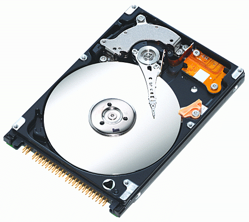
  
  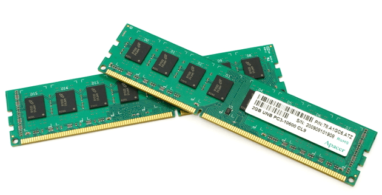
</div>

Notes:
What makes up a computer?

Hard drive: For storing all the data on our machine for long-term use.

CPU: Used for executing instructions that make up a computer program.

RAM: A form of computer memory used for accessing data in a faster way than a hard drive. It is ephemeral so will be wiped when you shut your machine down.

---

### Are any of these computers?

<div class="img-center-multiple">
  
  
  
</div>

Notes:
What does a computer do?
It is a digital electronic machine that can be programmed to carry out sequences of arithmetic or logical operations automatically

Laptop: Easy!

Server: Some people may not consider it a computer, but that's what it is under the hood

Wall-E: Debatable! It has computers inside of it, but is the whole thing a computer?

---

### What about these?

<div class="img-center-multiple">
  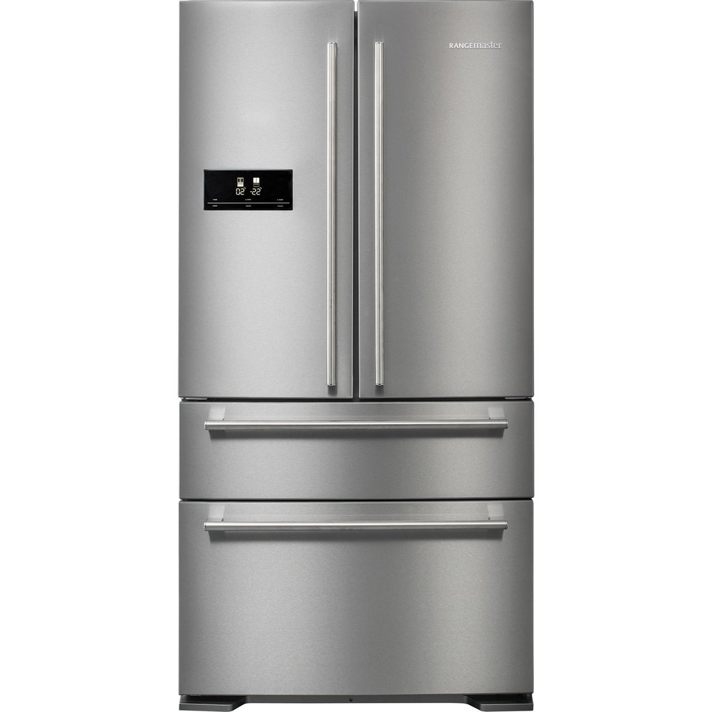
  
  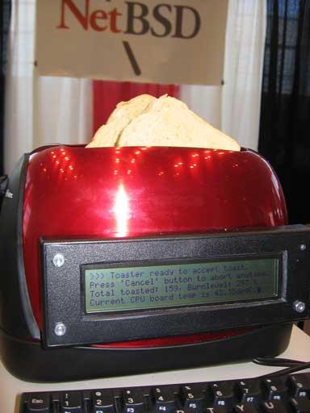
</div>

Notes:
Fridge: Again, it may be computerised but is it a computer?

Toaster: NO!

BSD Toaster: ... Probably! (Berkeley Software Distribution)

---

<!-- .slide: data-only="generation jlr sainsburys" -->
### What is data?

- Units of information, usually numerical, that is collected through observation
- A set of values of qualitative or quantitative variables about one or more persons or objects
- Used throughout humanity for science, business, finance, governance and more

Notes:
As a data engineer, our most valuable asset is data.

Data, on its own, is meaningless. When it’s analyzed and interpreted, it becomes meaningful information.

- **Quantitative data** is provided in numerical form, like the weight, volume, or cost of an item.
- **Qualitative data** is descriptive, but non-numerical, like the name, sex, or eye color of a person.

So what do we mean by data?

---

<!-- .slide: data-only="generation jlr sainsburys" -->
### What is computer data?

- Data that is represented using the **binary number system of ones (1) and zeros (0)**, as opposed to analog representation
- How we use this data is what this course is all about

Notes:
Analog data being tangible, measurable things like temperature, radio transmission, etc.

Computers convert electrical analog signals to digital. Transistors in a computer either have
current flowing throw them or they don't, hence binary

---

<!-- .slide: data-only="generation jlr sainsburys" -->
### A brief explanation of binary

[https://www.youtube.com/watch?v=Xpk67YzOn5w](https://www.youtube.com/watch?v=Xpk67YzOn5w)

Notes:
This is a brief video to demonstrate how binary works. It's important to have at least an introductory understanding.

---

<!-- .slide: data-only="generation jlr sainsburys" -->
### Quiz Time! 🤓

**What is the decimal representation for the binary value `1011`?**

1. `11`
1. `13`
1. `22`
1. `26`

Answer - `1: 1 + 2 + 0 + 8 = 11`<!-- .element: class="fragment" -->

---

### What is it to program?

- Computers are dumb, they need to be told explicitly how to do something, each and every time
- Programming is the act of instructing the computer how to perform a specific task as a sequence of logical steps in a language it understands
- How do we program? Well...

Notes:
Computers never learn... or do they?

To program is to use some kind of programming language to express what we wish the computer to do.

We will be using the Python programming language to achieve this.

---

<!-- .slide: data-only="generation jlr sainsburys" -->
### Event Driven vs Procedural

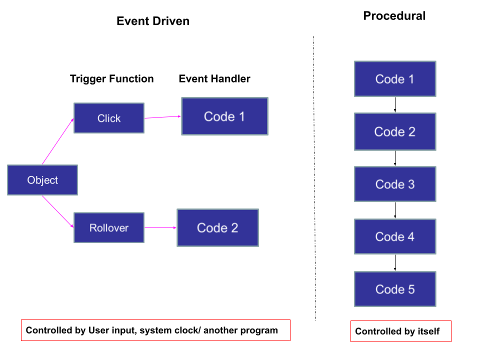<!-- .element: class="centered" -->

---

### What is a Program

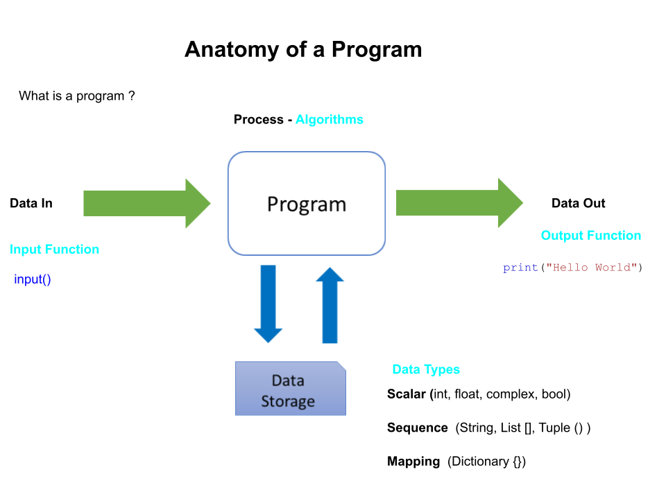<!-- .element: class="centered" -->

> A program is code we can run with inputs (like your name) and outputs (like a message in a terminal).

---

### Python

<!-- .element: class="centered" -->

---

### Python

> Why is it called Python?

"When he began implementing Python, Guido van Rossum was also reading the published scripts from “Monty Python’s Flying Circus”, a BBC comedy series from the 1970s. Van Rossum thought he needed a name that was short, unique, and slightly mysterious, so he decided to call the language Python."

From the [Python docs](https://docs.python.org/3/faq/general.html#why-is-it-called-python).

Notes:
We get this question every delivery, so put the (official) answer here!

---

### Preface

- Like learning any new skill, programming **will be difficult** at first. Stick with it and you will see results!
- This course will **not** turn you into a good programmer overnight, but will get you on the right track
- Practice, practice, practice

**Anything worth doing is difficult at first!**

---

<!-- .slide: data-only="schooloftech" -->
### Creating a place for our code to live

Let's open the VSCode terminal and create a place for our python code to live:

For Windows (Powershell), you can run these commands:

- `cd C:\` - change into the root of your main drive
- `mkdir sot-de-<month>-<year>`
    - create a directory, e.g. `sot-de-mar-2025`
- `cd sot-de-<month>-<year>`
    - change into the directory
    - e.g. `cd sot-de-mar-2025`

---

<!-- .slide: data-only="schooloftech" -->
### Downloading session material

> Download the Teams files for this session.

- Goto the Teams team for this cohort
- Click on the `General | Files` tab
- Open the `Sessions` folder
- Download the folder `python-1` (This will download as a zip file)
- Expand it into your `C:\sot-de-<month>-<year>` folder
- You should end up with `C:\sot-de-<month>-<year>\python-1` and other files inside there

---

<!-- .slide: data-only="schooloftech" -->
### Open your `C:\sot-de-<month>-<year>` folder in VSCode

- Open VSCode
- Use the `File | Open Folder` menu item
    - Select your whole `C:\sot-de-<month>-<year>` folder
- You should see the other folders in there too

---

<!-- .slide: data-only="schooloftech" -->
### Running a Python script

We now have everything we need to get up and running with python development in VSCode.

- In VSCode add a file called `hello.py` in the `C:\sot-de-<month>-<year>\python-1\exercises\` folder
- Add the following python code into it:
    - `print("Hello from School of Tech!")`
- Open a Powershell terminal in VSCode
    - It should open in the `C:\sot-de-<month>-<year>` folder
- Change directory with `cd python-1\exercises`
- Run `python3 hello.py`

The terminal should run the python script and output our print statement, and we are now ready to learn more about python programming!

---

### A Brief History

- Python was created by Guido van Rossum in 1991 (In software terms, that's a long time ago!)
- It is _free_ and _open source_
- It can run on (probably) any operating system
- The latest main version (3.x) was released in 2008
- Python 2 was discontinued in 2020 so make sure to use Python 3!

---

### Always use Python 3

You can check your Python version by typing the following into a terminal:

```sh
# Windows
$ python3 --version
```

**Note**: Don't include the `$` sign when copying commands from the slides. The `$` sign indicates that it is the command prompt, and we should copy the text directly after it.

Notes:
No one should be using Python 2, so ensure all learners are using one of the latest versions of Python 3.

If any learners are having issues with their version number, tell them to use the `python3` command instead of `python` on Mac, or `py` on Windows.

---

### Running Python Code

There are two ways to run Python code:

- Interactive mode
- Script mode

We'll see what both of these are, what the differences are, and how to use them.

Notes:
Reassure the learners that we will guide them along!

---

### Interactive Mode

- Provides a quick way of running lines of code
- Useful when you want to execute basic commands

To run in interactive mode, run the Python command:

```bash
# Windows
$ python3
```

You should see something like this:

```sh
Python 3.8.4 (v3.8.4:dfa645a65e, Jul 13 2020, 10:45:06)
[Clang 6.0 (clang-600.0.57)] on darwin
Type "help", "copyright", "credits" or "license" for more
>>>
```

Notes:
This is also known as the Interpreter.

Different operating systems will see different wording. This doesn't matter, as long as they enter the interpreter itself.

Once the command has run, we have temporarily switched away from the terminal into the Python interpreter.

---

### Interactive Mode - Example

Type this line of code and hit enter:

```py
1 + 2
```

What happened?

Notes:
The learners will see that it added the two numbers together and outputted the result, like a calculator would do.

All languages have a way of performing calculations. We will see more of this shortly.

---

### Exiting Interactive Mode

You can run the command `exit()` to exit the interpreter.

```sh
>>> exit() # currently inside the interpreter
$          # back to the original terminal
```

---

### Interactive Mode - Pros and Cons

|**Pros** | **Cons**|
|--------|------------|
| `+` Good for beginners.  | `-` You can't save the code you've written for long-term use. |
| `+` Helpful when we only have a few commands we want to run.  | `-` Not a good strategy for running code in the long run. |
|   |  `-` Tedious to run larger amounts of code.|

Notes:
Pros:

1. Useful to run some basic commands to allow you to understand what's going on.
2. Great to use when you want to execute one or two commands without creating a script for it.

Cons:

1. Anything you write and execute in the interpreter will be lost once you exit from it.
2. You can only really execute one command at a time and so running many lines of code becomes messy.
3. Once you need to write more than a handful of lines, it becomes impossible to use as a long-term solution, where you will probably want to store your code in scripts to use repeatedly.

---

### Script Mode

- Most of the time, code will be stored in script files
- Script files are ran top-to-bottom by Python
- Python filenames always ends in `.py`

Notes:

1. You can open these script folders in any text editor.
2. This means that each line of code you write in your file will be executed from the first line until the last line. (This isn't always the truth but it doesn't matter for now)
3. Otherwise known as the file extension name.

---

### Script Mode - Example

Open `VSCode`, create a new file called `hello.py` and type the following:

```py
# outputs 'Hello, World!' to the terminal
print ('Hello, world!')
```

Save the file.

Then run the program on the terminal:

```sh
# Mac/Unix
$ python3 hello.py
# or on Windows
$ py hello.py
```

What happened?

Notes:
Remind them not to copy the $ sign and use the correct python command for their OS.

Make sure to show the learners yourself how to open VSCode and create a new file, as well as saving it. You'd be surprised that some people may struggle even with this!

The learners should see that, when running the file, the text is outputted to the terminal.

---

### Script Mode - Output

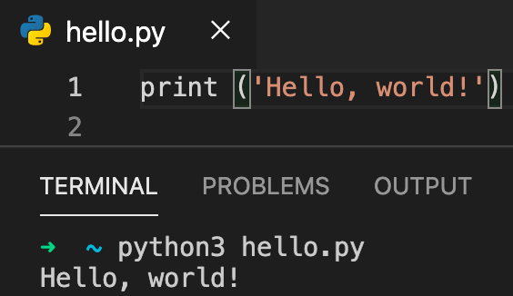<!-- .element: class="centered" -->

Notes:
We aren't going to discuss what this `print` thing is right now, or how it works, but inform the learners that it is used to output text to the terminal when you run a file.

We will be looking into inputs/outputs shortly.

---

### Emoji Check:

Do you feel you understand the uses of Interactive and Script mode? Say so if not!

1. 😢 Haven't a clue, please help!
2. 🙁 I'm starting to get it but need to go over some of it please
3. 😐 Ok. With a bit of help and practice, yes
4. 🙂 Yes, with team collaboration could try it
5. 😀 Yes, enough to start working on it collaboratively

Notes:
The phrasing is such that all answers invite collaborative effort, none require solo knowledge.

The 1-5 are looking at (a) understanding of content and (b) readiness to practice the thing being covered, so:

1. 😢 Haven't a clue what's being discussed, so I certainly can't start practising it (play MC Hammer song)
2. 🙁 I'm starting to get it but need more clarity before I'm ready to begin practising it with others
3. 😐 I understand enough to begin practising it with others in a really basic way
4. 🙂 I understand a majority of what's being discussed, and I feel ready to practice this with others and begin to deepen the practice
5. 😀 I understand all (or at the majority) of what's being discussed, and I feel ready to practice this in depth with others and explore more advanced areas of the content

---

### Numbers and Maths

- Programming languages are just like calculators, only more complex
- You can perform calculations with mathematical symbols and numbers
- Not all symbols match up to real life mathematics

---

### Arithmetic Operators

- Calculations can be performed in Python
- The output will be the result of the operation

```py
Operator    Name        Example
+           plus        x + y
-           minus       x - y
/           divide      x / y
*           multiply    x * y
**          exponent    x ** y
%           modulus     x % y
()          brackets    (x + y) * (y - x)
```

---

### PEDMAS

**Remember that order of operations still apply in Python! (PEDMAS)**<!-- .element: class="fragment" -->

```sh
>>> (5 * 10) - (20 + 10)
20
>>> 5 * 10 - 20 + 10
40
```

PEDMAS is an acronym for **Parentheses, Exponents, Division, Multiplication, Addition, and Subtraction**. It helps you to remember the order of mathematical operations.
<!-- .element: class="fragment" -->

Notes:
Give the class 5 minutes to have a play with this. It's really basic but enforces the idea that programming is basically just calculations one way or another.

"PEMDAS" is used in the USA, where as "PEDMAS" and "BODMAS" are used elsewhere.

Older folks may have learned "BODMAS" at school, "PEDMAS" is also common!

---

### Comparison Operators

- Comparison operators are used to compare two values
- The output will either be true or false

```sh
Operator    Name                    Example
==          is equal to             x == y
!=          is not equal to         x != y
>           greater than            x > y
<           less than               x < y
>=          greater than or equals  x >= y
<=          less than or equals     x <= y
```

```sh
>>> 10 == 10
True
>>> 10 == 11
False
```

Notes:
Again, ask the learners to try some of the operators for a few minutes.

---

### Quiz Time! 🤓

Q: What is the correct output for this Python command? Try and work it out in your head.

```py
>>> 10 + 20 / 4 * 10
```

1. `0.75`
1. `60`
1. `True`
1. `60.0`

Answer: `4` <!-- .element: class="fragment" -->

We will come onto this later...<!-- .element: class="fragment" -->

Notes:
This quiz is just for fun.

This is pre-emptively showing that decimal/float values are used when dividing.

---

### Variables

As of now we have only been dealing with _constant_ values, such as _20_.

We often want to **store** values somewhere when writing a program.

How do we do this? Why are they needed?

---

### What is a variable?

- A way of **storing** data in a program, such as text, numbers and much more
- Values are stored in computer memory (RAM)
- Variables always have names, to describe what they are storing

---

### Why do we need variables?

- Allows us to keep track of data we are using in the program
- Clearer and easier to understand code with labels

---

### How do I use a variable?

We use variables in real life. Here are some examples:

- My _age_ is _30_
- My _name_ is _John_
- I am an _adult_. This is _true_.

In Python, this would look like this:

```py
age = 30
name = 'John'
is_adult = True
```

---

### The anatomy of Variables

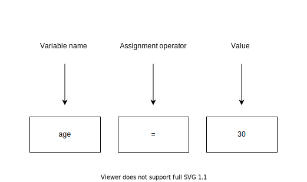<!-- .element: class="centered" -->

**Variable name** - The label of the data we wish to store.

**Assignment operator** - How we assign data to the variable.

**Value** - The data we are storing.

Notes:
Make sure to always label the data with a descriptive name. We will come to this topic again in programming practices.

We always use the equal sign to assign data to a variable.

---

### Watch out for = and ==

Always remember that:

- `=` **assigns** a value to a variable
- `==` **compares** data for equality

What would happen in the below examples?

```py
one = 1
two = 2
one = two
print(one)
```

```py
one = 1
two = 2
one == two
print(one)
```

Notes:
This first example shows that the value 2 gets assigned to the variable one. so print(one) will print 2.

This second example shows that we have checked if the variables one and two are equal, and False will be printed to stdout. ALso shows that we have not changed the value assigned to the variable one - so print(one) will still print 1.

---

### Modifying Variable Data

You can **change** the data stored in variables. For example:

```py
age = 30 # initial value for variable
print(age)
>>> 30

age = 40 # value has now changed
print(age)
>>> 40
```

Notes:
Variables are one of the most important constructs in programming. It's what allows us to hold information in a program and can manipulate it in many different ways.

Demonstrate this.

It's worth mentioning constants.

---

### Modifying variable data

You can also assign variables to variables.

This works by assigning the value stored in one variable, to another variable. Example:

```py
a = 1
b = 2

a = b
print(a)
```

What will be printed for variable `a`?

Answer: `2`<!-- .element: class="fragment" -->

---

### Assignment Operators

- These operators assign a new value
- They are commonly used with variables

```text
Operator   Example   Same As
=          x = 5     x = 5
+=         x += 3    x = x + 3
-=         x -= 3    x = x - 3
*=         x *= 3    x = x * 3
/=         x /= 3    x = x / 3
%=         x %= 3    x = x % 3
**=        x **= 3   x = x ** 3
```

---

### Assignment Operators

For example, we can do this with numeric values:

```py
number_apples = 6
number_apples += 4 # now number_apples = 10
number_apples -= 7  # now number_apples = 3
number_apples *= 2  # now number_apples = 6
```

Notes:

We can also use += with Strings; more on this later. The other operators are "unpredictable" with Strings!

---

### Naming Variables

All of the below are valid ways to name a variable...

```py
my_age = 21
myAge = 21
MyAge = 21
MYAGE = 21
```

...however in Python you should use the first example: `my_age = 21`, nicknamed "snake case".

This makes your code easier to read. For more information on naming variables, see [here](https://www.python.org/dev/peps/pep-0008/#function-and-variable-names).

We will see other concepts later in the course that use different naming standards.

---

### Quiz Time! 🤓

What will the value of these three variables be?

```py
a = 1
b = 2
c = 3

a = c
c = b
b = a
a = c
```

1. `a = 3, b = 2, c = 1`
1. `a = 1, b = 2, c = 3`
1. `a = 2, b = 3, c = 2`
1. `a = 3, b = 2, c = 3`

Answer: `3`<!-- .element: class="fragment" -->

---

### Emoji Check:

Do you feel you can use Variables now? Say so if not!

1. 😢 Haven't a clue, please help!
2. 🙁 I'm starting to get it but need to go over some of it please
3. 😐 Ok. With a bit of help and practice, yes
4. 🙂 Yes, with team collaboration could try it
5. 😀 Yes, enough to start working on it collaboratively

Notes:
The phrasing is such that all answers invite collaborative effort, none require solo knowledge.

The 1-5 are looking at (a) understanding of content and (b) readiness to practice the thing being covered, so:

1. 😢 Haven't a clue what's being discussed, so I certainly can't start practising it (play MC Hammer song)
2. 🙁 I'm starting to get it but need more clarity before I'm ready to begin practising it with others
3. 😐 I understand enough to begin practising it with others in a really basic way
4. 🙂 I understand a majority of what's being discussed, and I feel ready to practice this with others and begin to deepen the practice
5. 😀 I understand all (or at the majority) of what's being discussed, and I feel ready to practice this in depth with others and explore more advanced areas of the content

---

## Data Types

---

### Data Types

Variables can store data of different types:

**Basic Types**:

```py
a = 100 # Integer (int)

b = 2.5 # Decimal (float)

name = 'Bob' # String (str)

is_active = True # Boolean (bool)
```

Notes:
Python, like many languages have a handful of what we call built-in data types.

Each type represents a different way of storing data.

Numbers can be classified as either integers (whole numbers) or floats (decimal numbers)

Strings are just text but can contain numerical values.

Booleans dictate if something is true or false.

---

### Additional Types 1/2

```py
# List: Mutable, allows duplicates
colours_list = ["Cyan", "Yellow", "Magenta", "Black", "Yellow"]

# Dictionary (dict): Mutable, unique keys
data_dict = {
  "key": "value",
  "another_key": False,
  "some_items": [1, 2, 3]
}
```

We will explore all these individually later on.

Notes:
List is a collection which is ordered and changeable. Allows duplicate members.

Dictionary is a collection which is unordered and changeable. No duplicate members.

Mutable: You can change entries, add some, and delete some.

Demonstrate this.

---

### Additional Types 2/2

```py
 # Tuple: Immutable (you can't change it at all)
position = (12.33, -122.34)

# Set: An unordered collection or unique items, unchangeable, and unindexed.
numbers = {1, 2, 3, 4, 5, 6}
```

Notes:
Tuple is a collection which is ordered and unchangeable. Allows duplicate members.

Ordered - items have a defined order, and it will not change

Unchangeable - cannot change, add or remove items after the tuple has been created

Set is a collection which is unordered and un-indexed. No duplicate members. You can add and remove members.

Demonstrate this.

---

### Static Types

In some languages, you specify the type of the variable.

This is called a _static type_:

```java
// java
int age = 30
String name = "John"
Boolean is_happy = true
```

Notes:
The next 4 slides discuss the type system.
Talk about how the type system applied to programming in general,
different languages use a mix of static/dynamic and strong/weak.

Static is the process of verifying the type safety.
Ensuring/Guaranteeing that the variable has a set and final type.

---

### Dynamic Types

In Python, you don't need to specify the type, as it will work it out for you.

This is called _dynamic typing_.

```py
age = 30
name = 'John'
is_happy = True
```

Notes:
The next 4 slides discuss the type system.

Dynamic typing ensures the safety at runtime.

Data types associate with the value rather than the variable

allows for the type to change during the lifetime of the variable

- show example using python.

---

### Weak Typing

In some languages, you can perform operations with different types of data.

This is called _weak typing_ (example here is JavaScript).

```javascript
// javascript
myVariable = 1 + 'hello';

// output: "1hello"
```

Notes:
N/A

---

### Strong Typing

In Python, you are not allowed to do anything that's incompatible with the type of data you're working with. For instance, you can't add a string and integer together.

This is called **strong typing**:

```py
# Throws an error
my_variable = 1 + 'hello'

# TypeError: unsupported operand type(s) for +: 'int' and 'str'
```

Notes:
In simpler terms, once you've defined a variable, you can't then change the type of it at runtime, such as changing it from an integer to a string. There are ways to do it, but it's beyond the scope of this module.

Demonstrate this.

---

### Quiz Time! 🤓

Q: Python is...

1. Strongly and statically typed
1. Strongly and dynamically typed
1. Weakly and statically typed
1. Weakly and dynamically typed

Answer: `2`<!-- .element: class="fragment" -->

Notes:
Go back to that content if it wasn't clear.

---

## Working with Data

Notes:
In this section, we're going to be looking at how we use the data defined in our programs to help us achieve a task.

---

### Expressions

- An expression is something which can be evaluated to produce a result
- It's made up of operands and operators
    - Operands are values
    - Operators are arithmetic symbols (+ - \* / \*\* %)

Examples:

```py
4 + 7 / 2

my_first_value - my_second_value

'Hello' + ' World'
```

Notes:
Very much like in Mathematics, except this time our data can be more complex than just numbers.

---

### Comments

You may have noticed something in a previous slide:

```py
# Throws an error
my_variable = 1 + 'hello'
```

- The wording after the hash symbol is called a comment
- Comments can be used to help others (and yourself) understand the code you've written better
- Python will ignore comments and thus not run as executable code

---

### Strings

Strings in Python are just **text**.

Python strings are wrapped in single (`'`) or double (`"`) quotes:

```py
# Basic String
name = 'John'
```

A string can also span multiple lines if needed with three single (`'`) or double (`"`) quotes:

```py
# Multi-Line String
main_menu = '''
    Please choose from the following:

    [1]: View Balance
    [2]: View Account Details
'''
```

---

### String Manipulation

You can combine strings together:

```py
a = 'Hello,'
b = ' world!'
print(a + b)

>>> Hello, world!
```

---

### String Concatenation

You can _concatenate_ strings together to make a longer one:

```py
a = 'Hello,'
a = a + ' world'
print(a)

>>> Hello, world!
```

---

### String Concatenation

You can also use the `+=` operator to abbreviate `a = a + 'more'`:

```py
a = 'Hello,'
a += ' world'
print(a)

>>> Hello, world!
```

---

### String Interpolation

- Allows us to put variables inside strings. The variable names will be replaced with their value at runtime
- Prepend an `f` to the beginning of a string to use interpolation

Example:

```py
amount = 12.40
merchant = 'Amazon'
transaction_str = f'You spent £{amount} at {merchant}'
print(transaction_str)

>>> You spent £12.40 at Amazon
```

Try it out!

Notes:
Note that you can put a variable of any type into an interpolated string. Python will try to convert the value for you.

---

### Emoji Check:

Do you feel you can use Strings and Numbers now? Say so if not!

1. 😢 Haven't a clue, please help!
2. 🙁 I'm starting to get it but need to go over some of it please
3. 😐 Ok. With a bit of help and practice, yes
4. 🙂 Yes, with team collaboration could try it
5. 😀 Yes, enough to start working on it collaboratively

Notes:
The phrasing is such that all answers invite collaborative effort, none require solo knowledge.

The 1-5 are looking at (a) understanding of content and (b) readiness to practice the thing being covered, so:

1. 😢 Haven't a clue what's being discussed, so I certainly can't start practising it (play MC Hammer song)
2. 🙁 I'm starting to get it but need more clarity before I'm ready to begin practising it with others
3. 😐 I understand enough to begin practising it with others in a really basic way
4. 🙂 I understand a majority of what's being discussed, and I feel ready to practice this with others and begin to deepen the practice
5. 😀 I understand all (or at the majority) of what's being discussed, and I feel ready to practice this in depth with others and explore more advanced areas of the content

---

### Lists

Lists hold zero or more elements of _indexed_ data. This data can be of any type:

```py
empty_list = []

numbers = [1, 2, 3, 4, 5]

people = ["John", "Jane", "Janet"]

mixed = ["John", 2, "Jane", 3, False]
```

---

### List Indexing

Most programming languages start their indexing from 0 instead of 1, this is important to remember!

That is, the first element in a list starts at position 0:

```py
people = ["John", "Jane", "Janet"]

people[0] # John
people[1] # Jane
people[2] # Janet
```

Notes:
Some people may be confused by indexing starting at 0. It's a legacy thing which started decades ago. It's somewhat to do with the fact that binary starts with 0 too. Don't worry too much about it, just remember it.

---

### List Selection

You can select parts of a list by using the following syntax:

```py
people = ["John", "Sally", "Mark", "Lisa"]

# Get from index 1 up to but not including index 3.
people[1:3]
>>> ['Sally', 'Mark']

# Get last item
people[-1]
>>> 'Lisa'
```

---

### List Selection

```py
# Omitting left-hand side means "start from the beginning"
people[:-1]
>>> ['John', 'Sally', 'Mark']

# Get all items but the first
# Omitting right-hand side means "end of the list"
people[1:]
>>> ['Sally', 'Mark', 'Lisa']
```

---

### Emoji Check:

Do you feel you can use Lists now? Say so if not!

1. 😢 Haven't a clue, please help!
2. 🙁 I'm starting to get it but need to go over some of it please
3. 😐 Ok. With a bit of help and practice, yes
4. 🙂 Yes, with team collaboration could try it
5. 😀 Yes, enough to start working on it collaboratively

Notes:
The phrasing is such that all answers invite collaborative effort, none require solo knowledge.

The 1-5 are looking at (a) understanding of content and (b) readiness to practice the thing being covered, so:

1. 😢 Haven't a clue what's being discussed, so I certainly can't start practising it (play MC Hammer song)
2. 🙁 I'm starting to get it but need more clarity before I'm ready to begin practising it with others
3. 😐 I understand enough to begin practising it with others in a really basic way
4. 🙂 I understand a majority of what's being discussed, and I feel ready to practice this with others and begin to deepen the practice
5. 😀 I understand all (or at the majority) of what's being discussed, and I feel ready to practice this in depth with others and explore more advanced areas of the content

---

## Inputs and Outputs

---

### Standard Output

How can we display information to a user?

Python has an in-built `function` for outputting data:

```py
# Printing text
print('Hello World')

# Printing a variable
message = 'This is a message'
print(message)

#Printing a list
people = ['John', 'Sally', 'Mark', 'Lisa']
print(people)

```

Notes:
print can be used to display lots of different types of information. You can also format the text that is being displayed. Look at the less simple python program at the start of the course. What do you think it will show?

Note that the word function was used here. We haven't looked at functions yet. For now, explain that the print function is a way of calling something in Python that allows you to pass data to it, and it will output it to the terminal you run the program in.

---

### Standard Input

How can we collect data from a user?

Python has an in-built `function` for inputting data:

```py
#input with no prompt
text = input()
print("You entered:" + text)

#input with a prompt
name = input("What is your name? ")
print("Nice to meet you, " + name)
```

Notes:
input can be used to add user interaction into a program. This allows you to accept external data and react to it. Input only works with text, so if you want to use it in a different way, you will need to think a little further.

You can use input as many times as you want.

Try it out!

---

### Converting Input Values

`input()` will always return a string. What if we want the value to be a different type, such as integer or float?

If we want to convert it to an integer for instance, we can wrap `input()` in `int()`:

```py
num = int(input('Enter a number: '))
print(f'The square of this value is {num * num}')
```

```txt
Enter a number: 5
This square of this value is 25
```

---

### Quiz Time! 🤓

Q: Consider the Python list, what values will be printed?

```py
values = ['A', 'B', 'C', 'D', 'E', 'F']
print(values[1:4])
```

1. `A, B, C, D`
1. `B, C, D`
1. `B, C, D, E`
1. `All of them`

Answer: `2`<!-- .element: class="fragment" -->

---

### Exercise prep

> Instructor to give out the zip file of exercises for `python-1`
>
> Everyone please unzip the file

---

### Exercise time

> From the zip, you should have a file `exercises/python-1-exercises.md`
>
> Let's all do "Part 1", which includes Strings, Integers, Lists and Input

---

### Emoji Check:

How did the exercises go? Are Strings, Integers and Lists making more sense now?

1. 😢 Haven't a clue, please help!
2. 🙁 I'm starting to get it but need to go over some of it please
3. 😐 Ok. With a bit of help and practice, yes
4. 🙂 Yes, with team collaboration could try it
5. 😀 Yes, enough to start working on it collaboratively

Notes:
The phrasing is such that all answers invite collaborative effort, none require solo knowledge.

The 1-5 are looking at (a) understanding of content and (b) readiness to practice the thing being covered, so:

1. 😢 Haven't a clue what's being discussed, so I certainly can't start practising it (play MC Hammer song)
2. 🙁 I'm starting to get it but need more clarity before I'm ready to begin practising it with others
3. 😐 I understand enough to begin practising it with others in a really basic way
4. 🙂 I understand a majority of what's being discussed, and I feel ready to practice this with others and begin to deepen the practice
5. 😀 I understand all (or at the majority) of what's being discussed, and I feel ready to practice this in depth with others and explore more advanced areas of the content

---

## Making Decisions

> Or "conditional logic"

---

### Making Decisions

In programming, often we want to make certain decisions based on a **condition**.

Example: Suppose you are writing a game program. You may want to build these features:

- **IF** the user presses the up arrow, **THEN** the character will move forward.
- **IF** the user presses spacebar, **THEN** the character will jump.

So how do we do this in Python?

---

### Conditionals

We looked at comparison operators before. They are also known as conditionals.

Conditionals are expressions which return **True** or **False**.

These will help us make _decisions_ in our programs.

```py
'A' == 'B'  # False

100 > 5     # True

9 < 2       # False

a = 1
b = 2
a < b       # True
```

Notes:
This will become important and very apparent shortly when we introduce control flow.

Demonstrate this.

---

### Anatomy of a Decision

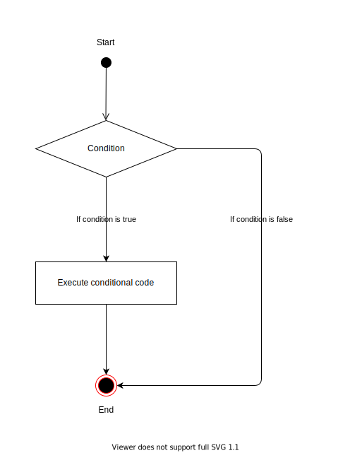<!-- .element: class="centered" -->

**Control Flow**: The order in which individual statements are executed

Notes:

1. We have some kind of condition expression, let's say '100 > 90'.
2. If the condition of this expression is true, we will execute some other code.
3. If it is false, then we will not execute the code.

---

### Example Decision

- Imagine we have given the value of 3 to `a`.
- If `a` is greater than 5, we will print that it is so.
- If `a` is less than 5, we will do nothing.

<!-- .element: class="centered" -->

---

### Decision Making in Python

Python uses `if` statements, which cause the program to branch out to a different part of the code, depending on some **condition**.

```py
a = 3

if a > 5:
    print("a is greater than 5")
```

**If** the condition is met, the indented statement(s) directly below it will execute.

Notes:
Demonstrate this.

You can execute as much conditional code as you need to. It doesn't have to be just one line of code.

---

### What about when the condition is false?

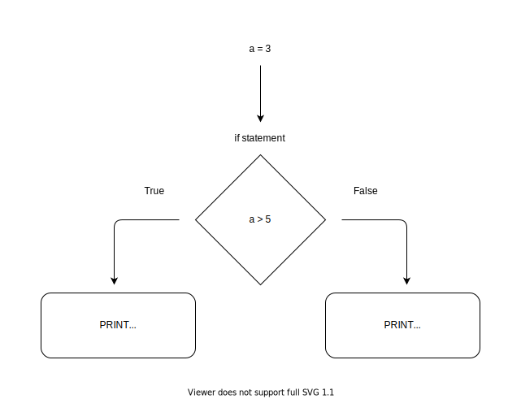<!-- .element: class="centered" -->

Notes:
Sometimes it's not just when conditions are true that we want to execute some code, what about when it is false?

---

### If / Else

In the previous example, `a` was less than `3`. What if we want to do something when a condition is false?

Python has this functionality, with the `else` statement.

```py
a = 3

if a > 5:
    print('a is greater than 5')
else:
    print('a is less than 5')
```

**Note**: You cannot use `else` without `if`, but you _can_ use `if` without `else`.
<!-- .element: class="fragment" -->

Notes:
Else is always used for the opposite outcome.

---

### If / Else If

You can evaluate multiple conditions with `if` / `else if`.

The `else if` keyword in Python is `elif`.

```py
a = 12

if a > 15:
    print('a is greater than 15')

elif a > 10:
    print('a is greater than 10')

elif a > 5:
    print('a is greater than 5')

elif a > 0:
    print('a is greater than 0')
```

What will be printed?

Notes:
If / Else If dictates that if the first if statement is false, we will move to the next conditional statement 'else if'. If that condition is false, we move to the next one, until we either have hit a condition that is satisfied as true, or there are no more left to evaluate.

You can have as many elif's as you desire.

You don't need to have an else statement at the end every time too. This is down to how you want to structure the flow of your condition. This will become more obvious as you learn more about Python.

Demonstrate this.

---

### Multiple If Statements

You can use multiple `if` statements one after the other.

The difference this time is that each `if` statement is evaluated, regardless of if the previous evaluated to true.

```py
a = 12

if a > 15:
    print('a is greater than 15')

if a > 10:
    print('a is greater than 10')

if a > 5:
    print('a is greater than 5')

if a > 0:
    print('a is greater than 0')
```

What will be printed?

---

### Nested If Statements

You can _nest_ `if` statements inside `if` statements:

```py
a = 10
b = 20

if a >= 10:
    if b >= 10:
        print ('a and b are greater than or equal to 10')
```

Notes:
You can have still use if/else and else statements no matter how many levels deep you get.

---

### Indentation Matters

- Indentation denotes the structure of your program
- If you've seen code in a "curly brace" language before, indentation is the Python equivalent of that
- Use the **tab button** to insert an indent

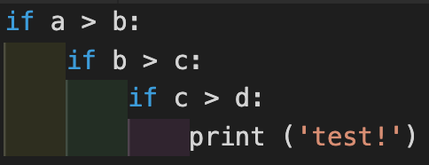<!-- .element: class="centered" -->

---

### Exercise time

> Let's do more from `exercises/python-1-exercises.md`
>
> Let's all do "Part 2", which includes Input and Numbers, and Temperature Conversion

---

### Emoji Check:

Did the Input exercises help you understand getting user inputs?

1. 😢 Haven't a clue, please help!
2. 🙁 I'm starting to get it but need to go over some of it please
3. 😐 Ok. With a bit of help and practice, yes
4. 🙂 Yes, with team collaboration could try it
5. 😀 Yes, enough to start working on it collaboratively

Notes:
The phrasing is such that all answers invite collaborative effort, none require solo knowledge.

The 1-5 are looking at (a) understanding of content and (b) readiness to practice the thing being covered, so:

1. 😢 Haven't a clue what's being discussed, so I certainly can't start practising it (play MC Hammer song)
2. 🙁 I'm starting to get it but need more clarity before I'm ready to begin practising it with others
3. 😐 I understand enough to begin practising it with others in a really basic way
4. 🙂 I understand a majority of what's being discussed, and I feel ready to practice this with others and begin to deepen the practice
5. 😀 I understand all (or at the majority) of what's being discussed, and I feel ready to practice this in depth with others and explore more advanced areas of the content

---

## Logical Operators

---

### Logical Operators

Logical operators are used to combine conditional statements:

```txt
Operator  Description             Example

and       true if both            x > 5 and x < 10
          statements are true

or        true if at least one    x > 5 or x < 10
          statement is true

not       reverse the result      not x
```

```py
# true if both statements are true
x > 5 and x < 10
# true if either or both statements are true
x > 5 or x < 10
# reverse of the result
not x
```

---

### Understanding How it Works

Logical operators become simple to understand once you see the maths behind it.

The next slide will demonstrate this using something called **binary truth tables**.

Truth tables can be used to describe logical expressions.

Notes:
The next three slides will demonstrate tables for AND, OR, NOT.

---

### Binary Truth Tables - AND

Imagine we have two conditions, `a` and `b`:

```py
# a         b
x > 5 and x < 10
```

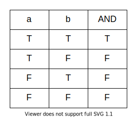<!-- .element: class="centered" -->

For this table, `T` is `true` and `F` is `false`.

Notes:
AND dictates that all conditions of an expression must be true, for the whole expression to be true.

If a AND b are both true, then the whole expression is true.
If either a or b, or both, are false, then whole expression is false.

---

### Binary Truth Tables - OR

```py
# a        b
x > 5 or y < 10
```

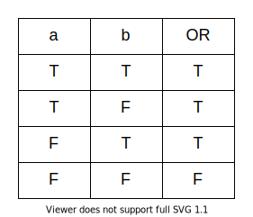<!-- .element: class="centered" -->

Notes:
OR dictates that as long as at least one condition is true, the whole expression is true.

If at least one of a or b is true, then the whole expression is true.
If both are false, then the whole expression is false.

---

### Binary Truth Tables - NOT

```py
# a
not x
```

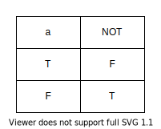<!-- .element: class="centered" -->

Notes:
NOT dictates that any value or condition will be inverted.

True becomes false, false becomes true.

---

### Example 1

You can integrate logical operators with `if` statements:

```py
age = 17
film_rating = 15

if (age < 18 and film_rating == 18):
  print("You're too young to watch this film")

else:
  print("You're old enough to watch this film")
```

Notes:
What will be printed?
Again, you can have as many condition checks for each statement.
Demonstrate this.

---

### Example 2

```py
age = 17
film_rating = 15

if  (age < 12 and film_rating == 12) or \
    (age < 15 and film_rating == 15) or \
    (age < 18 and film_rating == 18):
    print("You're too young to watch this film")
else:
  print("You're old enough to watch this film")
```

> This example is also using the python line continuation character `"\"` for clarity.

Notes:
The "\" is the python line continuation character, the same as it is in bash/unix.

---

### Quiz Time! 🤓

Q: Consider the following code snippet, what will the output be?

```py
x = -15
y = 10

if x > 0:
  if y > 0:
    print('both x and y are positive')      # 1
  else:
    print('x is positive, y is negative')   # 2

else:
  if y > 0:
    print('x is negative, y is positive')   # 3
  else:
    print('both x and y are negative')      # 4
```

Answer: `3`<!-- .element: class="fragment" -->

---

### Exercise time

> Let's do more from `exercises/python-1-exercises.md`
>
> Let's all do "Part 3", which has some questions and a "Bank Loan" program

---

### Emoji Check:

Have the exercises in Part 3 helped consolidate the use of conditional operators?

1. 😢 Haven't a clue, please help!
2. 🙁 I'm starting to get it but need to go over some of it please
3. 😐 Ok. With a bit of help and practice, yes
4. 🙂 Yes, with team collaboration could try it
5. 😀 Yes, enough to start working on it collaboratively

Notes:
The phrasing is such that all answers invite collaborative effort, none require solo knowledge.

The 1-5 are looking at (a) understanding of content and (b) readiness to practice the thing being covered, so:

1. 😢 Haven't a clue what's being discussed, so I certainly can't start practising it (play MC Hammer song)
2. 🙁 I'm starting to get it but need more clarity before I'm ready to begin practising it with others
3. 😐 I understand enough to begin practising it with others in a really basic way
4. 🙂 I understand a majority of what's being discussed, and I feel ready to practice this with others and begin to deepen the practice
5. 😀 I understand all (or at the majority) of what's being discussed, and I feel ready to practice this in depth with others and explore more advanced areas of the content

---

### Asking for help

Good and bad questioning practices are a skill.

> Asking for help from your colleagues is an extremely common and important task, but making sure that they can understand and troubleshoot what you give them isn't all that easy.

---

### Discussion - Asking For Help - 10m

> What might a "bad" question look like, or have in it, when you are asking for help?

and

> What might a "good" question look like, or have in it, like when you are asking for help?

Notes:
Get the learners to discuss, or put post on a whiteboard/jamboard

---

### Some bad examples

What does this error mean? `<20 lines of pasted error message>`

`<long pasted error message with no context>`

Hey my git isn't working, what should I do?

Notes:
Ask why they're not useful, and what they, were they to receive them, would have to do to solve them

---

### And a good one

I'm trying to run this merge statement into a delta table however I'm getting this error

```py
"pyspark.sql.utils.ParseException: mismatched input 'MERGE'"
```

```sql
MERGE INTO {table_name} AS stg
 USING tmp_cohort AS tmp
 ON stg.UNIQUE_REFERENCE = tmp.UNIQUE_REFERENCE and stg.FILE_NAME=tmp.FILE_NAME
 WHEN MATCHED THEN UPDATE SET *
 WHEN NOT MATCHED THEN INSERT *
```

---

### And a good one (continued)

When I run this insert everything is fine

```sql
INSERT INTO {table_name}
SELECT * FROM tmp_cohort
```

so the schemas are correct. I've been looking around online and was under the impression merge's may not be supported?

Notes:
Ask why this is better

---

### Another good one

I'm trying to run the following script: `grant_user_permissions.py` but whenever I run it logged in as the base user I get permission denied. I don't have admin permissions, but looking at the script I don't think I need them. Is there something I'm missing here?

Notes:
Ask why this is better. Tell them we assume the script was attached to the post.

---

### Some tips for good questioning

1. Be as specific you can be about what is going wrong and the environment it is going wrong in

1. Before asking the question, think about what you want out of the answer and be explicit about it

1. Make it clear that you have attempted to solve it, and the understanding that you currently have

1. Read your message before sending it, and identify what more information `you` would want if it was sent to you - then add it!

---

### Emoji Check:

Do you feel you could write a reasonable "please help me" message now?

1. 😢 Haven't a clue, please help!
2. 🙁 I'm starting to get it but need to go over some of it please
3. 😐 Ok. With a bit of help and practice, yes
4. 🙂 Yes, with team collaboration could try it
5. 😀 Yes, enough to start working on it collaboratively

Notes:
The phrasing is such that all answers invite collaborative effort, none require solo knowledge.

The 1-5 are looking at (a) understanding of content and (b) readiness to practice the thing being covered, so:

1. 😢 Haven't a clue what's being discussed, so I certainly can't start practising it (play MC Hammer song)
2. 🙁 I'm starting to get it but need more clarity before I'm ready to begin practising it with others
3. 😐 I understand enough to begin practising it with others in a really basic way
4. 🙂 I understand a majority of what's being discussed, and I feel ready to practice this with others and begin to deepen the practice
5. 😀 I understand all (or at the majority) of what's being discussed, and I feel ready to practice this in depth with others and explore more advanced areas of the content

---

### Terms and Definitions - recap

**Hard Drive**: For storing all of the data on our machine for long-term use

**CPU**: Used for executing instructions that make up a computer program

**RAM**: A form of computer memory used for accessing data in a faster way than a hard drive

**Binary**: A number expressed in the base-2 numeral system, which only uses 0 and 1

---

### Terms and Definitions - recap

**Static Typing**: Variables of a language must have their type defined before they are used

**Dynamic Typing**: Variables of a language do not need their type to be defined before they're used

**Weak Typing**: A value has a type but has the ability of changing

**Strong Typing**: A value has a type and cannot be changed

---

### Terms and Definitions - recap

**Interpreter** **(Interactive Mode)**: A program that directly executes instructions written in a programming language without requirement of compilation

**Control Flow**: The order in which individual statements are executed

---

### Further Reading

- [Truthy and Falsey values in Python](https://www.freecodecamp.org/news/truthy-and-falsy-values-in-python/)
- [The Hitchhiker's Guide to Python](https://docs.python-guide.org/intro/learning/)
- [Python Documentation](https://www.python.org/doc/)
- [Why Python is dynamic and also strongly typed](https://wiki.python.org/moin/Why%20is%20Python%20a%20dynamic%20language%20and%20also%20a%20strongly%20typed%20language)

---

### Overview - recap

- Basics of Computing
- The Python Programming Language
- Data Types
- Making Decisions
- Inputs and Outputs
- Logical Operators
- Questioning

---

### Learning Objectives - recap

- Describe how a computer is composed by its varying hardware.
- Know the difference between interactive mode and script mode in Python.
- Explain what a variable is.
- Identify the differences between logical operators and comparison operators.
- Write programs in Python using different data types, as well as input and output operations.
- Identify what makes a good question when asking for help

---

### Emoji Check:

On a high level, do you think you understand the main concepts of this session? Say so if not!

1. 😢 Haven't a clue, please help!
2. 🙁 I'm starting to get it but need to go over some of it please
3. 😐 Ok. With a bit of help and practice, yes
4. 🙂 Yes, with team collaboration could try it
5. 😀 Yes, enough to start working on it collaboratively

Notes:
The phrasing is such that all answers invite collaborative effort, none require solo knowledge.

The 1-5 are looking at (a) understanding of content and (b) readiness to practice the thing being covered, so:

1. 😢 Haven't a clue what's being discussed, so I certainly can't start practising it (play MC Hammer song)
2. 🙁 I'm starting to get it but need more clarity before I'm ready to begin practising it with others
3. 😐 I understand enough to begin practising it with others in a really basic way
4. 🙂 I understand a majority of what's being discussed, and I feel ready to practice this with others and begin to deepen the practice
5. 😀 I understand all (or at the majority) of what's being discussed, and I feel ready to practice this in depth with others and explore more advanced areas of the content
