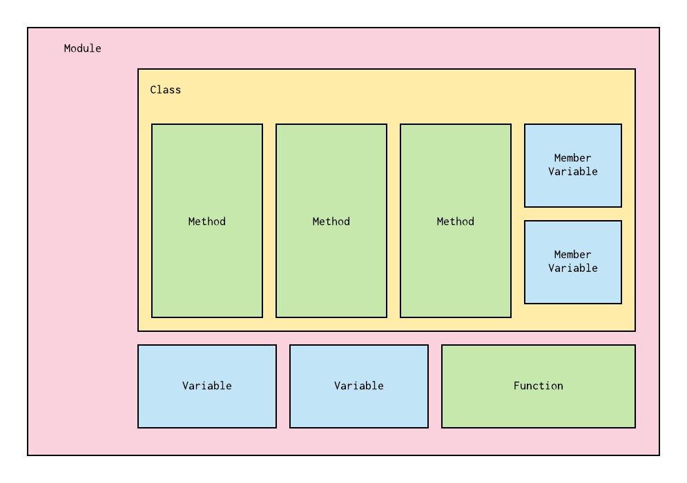
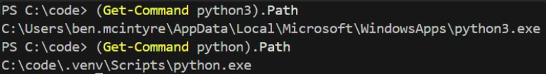

## The Python Ecosystem

---

### Overview

- Modules
- Namespaces
- Packages
- Virtual Environments

---

### Learning Objectives

- Detail the key features of modules
- Define how packages work
- Identify how scope and namespaces work
- Discover the value of libraries and how to install them
- Define virtual environments
- Implement a virtual environment

---

## Modules

<!-- .element: class="centered" height="300px" -->

---

### Modules

Currently you've been writing code inside one file.

As the amount of code in your python file gets longer, it may start to become unmaintainable.

To alleviate this, you can split the code into many files.

These files are called **modules**.

Notes:
Let the learners know that they've already been using modules without realising, as every python file is considered a module.

---

### Modules

A module is a self-contained collection of functions, variables and classes which are available under a **namespace**.

 <!-- .element: class="centered" -->

Notes:
Namespace is mentioned but not defined but will be further down.

Member variable: A variable that is associated with a specific object and accessible for all its methods (member functions).

Talk through the diagram.

---

### Example 1

Use the **import** keyword to use _module1_ inside _module2_:

```py
# module1.py
def print_name(name):
  print(name)
```

```py
#module2.py
import module1
module1.print_name("Jane")
```

Notes:
This is known as bringing it into scope.

---

### Example 2

We can also import only what we need from a module:

```py
# module1.py
def print_name(name):
  print(name)

def print_age(age):
  print(age)
```

```py
#module2.py
from module1 import print_age
print_age(32)
```

This time, the import statement has changed to:

```py
from module_name import <something>
```

Notes:
Let the learners see that you can import variables and classes as well as functions

---

### Referencing Modules

**Global**: Modules in the same directory, the standard library or 3rd party library.

They can be imported like so:

```py
import module_in_the_same_folder  # Same library / your code
import sys                        # Standard library
import numpy                      # 3rd party library
```

---

### Referencing Modules

**Absolute**: Module path always starts from the top of the directory where you are running python from.

They can be imported like so:

```sh
├── package1
│   ├── module1.py
│   └── module2.py
└── package2
    ├── module3.py
    └── subpackage1
        └── module5.py
```

```py
from package1 import module1
from package1.module2 import function1
from package2.subpackage1 import module5
```

Notes:
The imports are all different examples of how you could import into another module

Prior to Python version 3.3, an \_\_init\_\_.py file was required for the directory to be considered a package

However, this is no longer strictly necessary

---

### Referencing Modules

**Relative**: Module path is relative to the file doing the import. It isn't good practise to do this.

```py
from .some_module import some_class
from ..some_package import some_function
from . import some_class
```

- A single dot means the module/package referenced is in the same directory
- Two dots mean that is in the parent directory

> **Avoid doing this, it is bad practice!**

Notes:
See next slides!

---

### Why relative imports are a bad idea (1/2):

**Readability** - Use . or .. to refer to the current or parent packages, which can be confusing, especially in complex projects. It requires the reader to know the file's location relative to other modules.

**Maintainability** - Can break more easily if you move files around, as the relative paths may change, leading to ImportError.

**Ambiguity** - Can be ambiguous, especially in larger projects. It's not always immediately clear which module is being imported, leading to confusion and errors, particularly if there are similarly named modules in different parts of the package hierarchy.

---

### Why relative imports are a bad idea (1/2):

**Compatibility** - May not work correctly when running scripts directly from within submodules or when the script's entry point is not in the same directory as the module.

**Best practices** - PEP 8, Python’s style guide, recommends the use of absolute imports as they are usually more readable and tend to work better in most cases.

**Testing and execution issues** - Can cause problems when running tests or scripts directly from submodules. Depending on how the Python interpreter is invoked, relative imports may not work as expected, leading to import errors.

---

### Quiz Time! 🤓

---

**Given the below project structure, how would you import the function `my_func` from `module2` into `main.py`?**

```text
|── main.py
└── package1
    ├── module1.py
    └── subpackage2
        └── module2.py
```

1. `from module2 import my_func`
1. `import my_func from package1.subpackage2.module2`
1. `from package1.subpackage2.module2 import my_func`
1. `import my_func`

Answer: `3`<!-- .element: class="fragment" -->

Notes:
The correctness of this example is contingent on some context: If we run `module1.py` directly it will not know about `package1` as it won't be on the path.

Show worked example with main.py at same level as `package1` directory

---

### Emoji Check:

Do you feel you could import a module now?

1. 😢 Haven't a clue, please help!
2. 🙁 I'm starting to get it but need to go over some of it please
3. 😐 Ok. With a bit of help and practice, yes
4. 🙂 Yes, with team collaboration could try it
5. 😀 Yes, enough to start working on it collaboratively

Notes:
The phrasing is such that all answers invite collaborative effort, none require solo knowledge.

The 1-5 are looking at (a) understanding of content and (b) readiness to practice the thing being covered, so:

1. 😢 Haven't a clue what's being discussed, so I certainly can't start practising it (play MC Hammer song)
2. 🙁 I'm starting to get it but need more clarity before I'm ready to begin practising it with others
3. 😐 I understand enough to begin practising it with others in a really basic way
4. 🙂 I understand a majority of what's being discussed, and I feel ready to practice this with others and begin to deepen the practice
5. 😀 I understand all (or at the majority) of what's being discussed, and I feel ready to practice this in depth with others and explore more advanced areas of the content

---

### Namespace

A namespace is a system to make sure all of the names (variables, functions etc.) in a program are unique and can be used without conflict.

In Python, when you create a statement such as...

```py
x = 1
```

...a **symbolic name** is created that you can use to reference that object.

Notes:
A variable in Python is a symbolic name which is a pointer to the object. You can access the object through the variable, but the data itself still exists inside the original object.

You can have multiple different symbolic names that point to the same object.

---

### Examples

**Local Namespace**: Includes local names inside of a function. Created when the function is called and is destroyed when it returns.

**Global Namespace**: Includes names from various imported modules. Created when the module starts and is destroyed when it ends.

**Built-In Namespace**: Includes built-in functions and exception names.

---

### Variable Scope

A scope is a portion of a program where a namespace can be accessed

```py
def outer_function():
  b = 20
  def inner_func():
    c = 30

a = 10
```

- `a` is in the global namespace
- `b` is in the local namespace of `outer_function`
- `c` is in the local namespace of `inner_function`

---

### Variable Scope

```py
def outer_function():
  b = 20
  def inner_func():
    c = 30

a = 10
```

Inside `inner_function`, we can read and assign a new value to `c`, but we can only read `a` and `b`.

If we try to assign a value to `b`, it will create a new locally scoped variable which is different from the variable `b` in `outer_function`

Notes:
And likewise with outer_scope trying to assign to c.

---

### Quiz Time! 🤓

---

**What will the two print statements output?**

```py
x = 300

def myfunc():
  x = 200
  print(x) # 1

myfunc()
print(x) # 2
```

1. `200, 300`
1. `300, 200`
1. `200, 200`
1. `300, 300`

Answer: `1`<!-- .element: class="fragment" -->

Notes:
If we assign to a variable inside a function, it will create a NEW local-scoped variable and will no longer refer to the same underlying object. e.g:

This works as intuitively expected:

```py
a = ["A","B"]

def func():
    a.append("C")

print(a)
func()
print(a)
```

This doesn't work as intuition may expect:

```py
a = ["A","B"]

def func():
    a = ["A","B","C"]

print(a)
func()
print(a)
```

And further, we can show 'a' isn't even defined prior where we assign it, as the assignment re-scopes it to a totally separate variable:

```py
a = ["A","B"]

def func():
    print(a) # Error - Not yet defined at this point
    a = ["A","B","C"]

print(a)
func()
print(a)
```

The same applies when a variable is passed into a function. The variables refer to the same object, but reassigning inside the function only reassigns the local-scoped variable. The original variable in this case still points to the original object.

---

### Guidance on Best Practice:

- Avoid accessing outer scopes directly, and instead take input as parameters
- Consider`return`-ing a value rather than modifying a reference

Why return rather than modify?

- Software development standard practice.
- A function that returns something has intuitive and unambiguous behaviour which is clearly described by its inputs and outputs

For multiple return values from a function (if necessary) we can use a tuple, dict object or a class.

---

To modify passed parameters without affecting the original at all, we can use copy:

```py
import copy

new_list = copy.deepcopy(old_list)
```

Also there is a built-in: `list.copy()`

And also another built-in: `new_list = list(old_list)`

---

## Packages

 <!-- .element: class="centered" -->

---

### Packages

A collection of modules under one directory that are made available under a parent namespace.

```sh
├── package1
│   ├── module1.py
│   └── module2.py
└── package2
    ├── module3.py
    ├── module4.py
```

---

## Library

 <!-- .element: class="centered" -->

---

### Library

- A reusable collection of modules
- Distributed as packages and modules in Python
- Often built around a core goal such as data science, I/O, user interface etc.
- Examples include NumPy, TkInter, matplotlib

---

### Library

The Python standard libraries are pre-installed in every Python runtime, so they're always available to you:

```py
import random
# Print a random number between 0 and 100
print(random.randrange(100))
```

---

### Installing Libraries

We can install external libraries with Python's package manager, `pip`:

```sh
# Mac/Unix
$ python3 -m pip install requests
# or on Windows
$ py -m pip install requests
```

Notes:
Show demo with a simple app installing requests module so it can be used.

Q: Where do libraries come from?
A: https://pypi.org (most commonly)

Many programming languages have package indexes to make publishing and sharing libraries easier (e.g. nuget for .NET, NPM for Node)

The package index is not a core part of the language itself, but managed by the wider community.

---

### Installing Pip

Check if you have `pip` installed:

```sh
# Mac/Unix
$ python3 -m pip --version
# or on Windows
$ py -m pip --version
```

If your machine doesn't have it installed, you can install it [here](https://pip.pypa.io/en/stable/installation/)

Notes:
Stop to let learners try it out

---

### Exercise prep

Instructor to give out the zip file of exercises for `python-ecosystem`

Everyone please unzip the file

---

### Exercise time

From the zip, you should have a file `exercises/python-ecosystem.md`

Let's all do the exercise, which includes Modules and Variable Scope

---

### Emoji Check:

Did the exercises help you understand modules and variable scopes?

1. 😢 Haven't a clue, please help!
2. 🙁 I'm starting to get it but need to go over some of it please
3. 😐 Ok. With a bit of help and practice, yes
4. 🙂 Yes, with team collaboration could try it
5. 😀 Yes, enough to start working on it collaboratively

Notes:
The phrasing is such that all answers invite collaborative effort, none require solo knowledge.

The 1-5 are looking at (a) understanding of content and (b) readiness to practice the thing being covered, so:

1. 😢 Haven't a clue what's being discussed, so I certainly can't start practising it (play MC Hammer song)
2. 🙁 I'm starting to get it but need more clarity before I'm ready to begin practising it with others
3. 😐 I understand enough to begin practising it with others in a really basic way
4. 🙂 I understand a majority of what's being discussed, and I feel ready to practice this with others and begin to deepen the practice
5. 😀 I understand all (or at the majority) of what's being discussed, and I feel ready to practice this in depth with others and explore more advanced areas of the content

---

## Virtual Environments

 <!-- .element: class="centered" -->

---

### Problem

We will often have multiple Python projects on our machine, which may have the same packages installed but with different versions.

If project1 needs v1.0 of a library, and project2 needs v2.0, then the requirements are in conflict and installing either version will leave one project being unable to run.

How do we fix this? We use **virtual environments**.

---

### Virtual Environments

- Are often confused with _virtual machines_
- Are a self-contained directory that contains a Python installation for a particular version, along with additional packages
- Different applications can create and manage virtual environments (venv), but mostly you will do this manually
- Help us avoid having globally installed libraries that not all our projects need
- `.venv` is the standard name for the folder we create, purely by convention

Notes:
Virtual machines are a way of running a whole different computer inside your computer!

---

### Virtual Environments - usage

In production projects, we will often have separate venvs for each mini-project or thing we build.

On this course, the "proper" way to model that is with a venv _per session_.

However, if this slows down your machine or takes a lot of time due to poor internet connectivity, you can optionally create a single venv in a root folder where all your sessions live.

Notes:
We have found across many course deliveries that the latter option is best for anyone with a poor internet at home, or an underpowered machine.

---

<!-- .slide: data-only="schooloftech" -->
### Virtual Environments - usage

> If your machine is slow, we recommend creating a common folder e.g. `C:\sot-de-<month>-<year>` (Windows) or `/c/sot-de-<month>-<year>` (GitBash) and creating a single `venv` there and using it for every session following this one.

Notes:
We have found across many course deliveries that the latter option is best for anyone with a poor internet at home, or an underpowered machine.

---

### Virtual Env Installation

To create a virtual environment, we can run this:

```sh
# Mac/Unix or GitBash
$ python3 -m venv <path to virtual environment>
# or on Windows
$ py -m venv <path to virtual environment>
```

e.g:

```sh
# Mac/Unix or GitBash
$ python3 -m venv .venv
# or on Windows
$ py -m venv .venv
```

This will create a directory called `.venv` if it doesn't exist and creates directories containing a copy of Python, the standard library and other supporting files

Notes:
.venv is a usual name for the folder, purely by standard convention

If `python3` doesn't work then use `python`

Remember that `-m` is used to run a module as an executable script; venv in this case is a built-in module from the python installation which we can use.

---

### Task: Virtual Environments - creation

> Create a venv as per the previous slides.

---

### Virtual Env Activation

Once created, you need to **activate** it, like so:

```sh
$ .venv\Scripts\activate.bat # Windows (Powershell)
#or
$ .venv\Scripts\activate.ps1 # Windows (Powershell)

$ source .venv/bin/activate # Unix/MacOS

$ source .venv/Scripts/activate # GitBash
```

Notes:
It's important to note that the venv is only active during the lifetime of the shell. When you close the shell it is then terminated.

You can see the venv is activated as you'll have the name of the virtual env on your terminal prompt.

If you are on Windows, there is a chance VS Code will default to a PowerShell terminal which requires a different statement and altered permissions\
($ .venv\Scripts\activate.ps1)

---

### Task: Virtual Environments - activation

> Activate your venv as per the previous slides.

---

### Using your venv

Once a venv is activated, running your usual `python3` or `py` command will use the executables in your `.venv` folder, instead of your global one.

> Caveat: On Windows we have found that the `activate.[ps1|bat]` scripts only alias `python` and `pip`, and not `python3` or `pip3`, so you may need to use `python <commands>` instead of `python3 <commands>`, especially when using GitBash

Windows only: If you want to check what has been aliased into the venv in Powershell, you can run `(Get-Command python3).Path` (see below).



Notes:
.venv is a usual name for the folder, purely by standard convention

If `python3` doesn't work then use `python`

Remember that `-m` is used to run a module as an executable script; venv in this case is a built-in module from the python installation which we can use.

---

### Virtual Env Deactivation

When you need to deactivate the env, you can run:

```sh
$ deactivate
```

(The same command for Windows, MacOS/Unix, and GitBash.)

---

### Managing Packages in venv

When you install a package through pip inside a `venv` this will keep the installation local to the project.

We store the package dependencies in a file called `requirements.txt`. You can generate and store a list of the dependencies using:

```sh
# Mac/Unix
(.venv) $ python3 -m pip freeze > requirements.txt
# or on Windows
(.venv) $ py -m pip freeze > requirements.txt
# or on GitBash
(.venv) $ python -m pip freeze > requirements.txt
```

Then anyone else can use this file to install all required dependencies.

Notes:
requirements.txt serves two requirements:

- Allows dependencies for our project to be described
- Allows dependencies to be pinned at specific versions

Ask the class: Why may we want to pin versions?

- Avoid breaking changes
- Avoid security vulnerabilities (e.g. supply chain attack) in packages whose previous versions were fine.

---

### The requirements.txt file

The `requirements.txt` file created may look similar to this:

```sh
requests==2.7.0
novas==3.1.1.3
numpy==1.9.2
```

To install `requirements.txt` execute the code below in an active `venv`:

```sh
# Mac/Unix
(.venv) $ python3 -m pip install -r requirements.txt
# or on Windows
(.venv) $ py -m pip install -r requirements.txt
# or on GitBash
(.venv) $ python -m pip install -r requirements.txt
```

---

### Emoji Check:

Do you feel you could use a virtual environment for your project now?

1. 😢 Haven't a clue, please help!
2. 🙁 I'm starting to get it but need to go over some of it please
3. 😐 Ok. With a bit of help and practice, yes
4. 🙂 Yes, with team collaboration could try it
5. 😀 Yes, enough to start working on it collaboratively

Notes:
The phrasing is such that all answers invite collaborative effort, none require solo knowledge.

The 1-5 are looking at (a) understanding of content and (b) readiness to practice the thing being covered, so:

1. 😢 Haven't a clue what's being discussed, so I certainly can't start practising it (play MC Hammer song)
2. 🙁 I'm starting to get it but need more clarity before I'm ready to begin practising it with others
3. 😐 I understand enough to begin practising it with others in a really basic way
4. 🙂 I understand a majority of what's being discussed, and I feel ready to practice this with others and begin to deepen the practice
5. 😀 I understand all (or at the majority) of what's being discussed, and I feel ready to practice this in depth with others and explore more advanced areas of the content

---

### Useful pip Commands

Now we'll show you a few useful things you can do with `pip` 🙂

---

### Install a specific package version:

```sh
# Windows:
(.venv) $ py -m pip install requests==2.6.0

# Unix/MacOS:
(.venv) $ python3 -m pip install requests==2.6.0

# GitBash:
(.venv) $ python -m pip install requests==2.6.0
```

---

### Upgrade a package:

```sh
# Mac/Unix
(.venv) $ python3 -m pip install --upgrade requests

# or on Windows
(.venv) $ py -m pip install --upgrade requests

# GitBash:
(.venv) $ python -m pip install --upgrade requests
```

---

### Uninstall a package:

```sh
# Mac/Unix
(.venv) $ python3 -m pip uninstall requests

# or on Windows
(.venv) $ py -m pip uninstall requests

# GitBash:
(.venv) $ python -m pip uninstall requests
```

---

### List all packages installed in the virtual env:

```sh
# Mac/Unix
(.venv) $ python3 -m pip list

# or on Windows
(.venv) $ py -m pip list

# GitBash:
(.venv) $ python -m pip list
```

---

### Quiz Time! 🤓

---

**In Python, a virtual environment is a self-contained directory that contains...**

1. A Python installation for a particular version without installing additional packages
1. A Python installation for a particular version, along with additional packages
1. A Python installation for Python 3, along with additional packages
1. A Python package

Answer: `2`<!-- .element: class="fragment" -->

Notes:
The version of python inside the virtual environment will be the same as the version of python used to create it. To create a venv of a different version, you would need multiple python versions installed and can specify a specific binary.

  e.g. `someotherpythonbinary -m venv .venv`

---

### Why 'python3 -m'?

Technically, you can use pip directly:

```sh
$ pip install requests=2.6.0
```

However when working with virtual environments, multiple "versions" of python will be available on your computer.

Adding `python3 -m` (MacOS / Unix), `py -m` (Windows), or `python -m` (GitBash) to the beginning of the statement will ensure you use the pip tied to your active Python executable, and not the global one.

This is the same for other common modules seen throughout the course, such as `venv` or `pytest`.

---

### Exercise

1. Create a directory on your system
2. Follow the above slides to setup a virtual environment in that folder
3. Activate the `venv`
4. Try installing some packages and list them
5. Create a `requirements.txt` files from your `venv`
6. When you are done, deactivate

Notes:
Works well as a group breakout exercise

---

### Emoji Check:

How did the exercise go? Are virtual environments making more sense now?

1. 😢 Haven't a clue, please help!
2. 🙁 I'm starting to get it but need to go over some of it please
3. 😐 Ok. With a bit of help and practice, yes
4. 🙂 Yes, with team collaboration could try it
5. 😀 Yes, enough to start working on it collaboratively

Notes:
The phrasing is such that all answers invite collaborative effort, none require solo knowledge.

The 1-5 are looking at (a) understanding of content and (b) readiness to practice the thing being covered, so:

1. 😢 Haven't a clue what's being discussed, so I certainly can't start practising it (play MC Hammer song)
2. 🙁 I'm starting to get it but need more clarity before I'm ready to begin practising it with others
3. 😐 I understand enough to begin practising it with others in a really basic way
4. 🙂 I understand a majority of what's being discussed, and I feel ready to practice this with others and begin to deepen the practice
5. 😀 I understand all (or at the majority) of what's being discussed, and I feel ready to practice this in depth with others and explore more advanced areas of the content

---

### Terms and Definitions - recap

- **Module**: A file which contains a collection of functions, variables and classes, available under the same namespace
- **Namespace**: A system to make sure all names in a program are unique and can be used without conflict
- **Variable Scope**: A portion of a program where a namespace can be accessed

---

### Terms and Definitions - recap

- **Package**: A collection of modules under one directory
- **Library**: A reusable collection of modules, distributed as modules or packages
- **Virtual Environment**: A self-contained directory that contains a Python installation for a particular version, along with additional packages
- **Runtime Library**: A program library designed to implement functions built into a programming language

---

## Further Reading

[Namespaces Further Explained](https://www.programiz.com/python-programming/namespace)

[Virtual Environments](https://docs.python.org/3/tutorial/venv.html)

[Installing Packages](https://packaging.python.org/en/latest/tutorials/installing-packages/)

[The Python Package Index](https://pypi.org/)

---

### Overview - recap

- Modules
- Namespaces
- Packages
- Virtual Environments

---

### Learning Objectives - recap

- Detail the key features of modules
- Define how packages work
- Identify how scope and namespaces work
- Discover the value of libraries and how to install them
- Define virtual environments
- Implement a virtual environment

---

### Emoji Check:

On a high level, do you think you understand the main concepts of this session? Say so if not!

1. 😢 Haven't a clue, please help!
2. 🙁 I'm starting to get it but need to go over some of it please
3. 😐 Ok. With a bit of help and practice, yes
4. 🙂 Yes, with team collaboration could try it
5. 😀 Yes, enough to start working on it collaboratively

Notes:
The phrasing is such that all answers invite collaborative effort, none require solo knowledge.

The 1-5 are looking at (a) understanding of content and (b) readiness to practice the thing being covered, so:

1. 😢 Haven't a clue what's being discussed, so I certainly can't start practising it (play MC Hammer song)
2. 🙁 I'm starting to get it but need more clarity before I'm ready to begin practising it with others
3. 😐 I understand enough to begin practising it with others in a really basic way
4. 🙂 I understand a majority of what's being discussed, and I feel ready to practice this with others and begin to deepen the practice
5. 😀 I understand all (or at the majority) of what's being discussed, and I feel ready to practice this in depth with others and explore more advanced areas of the content
