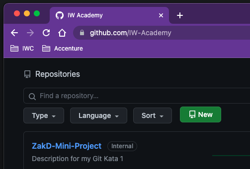
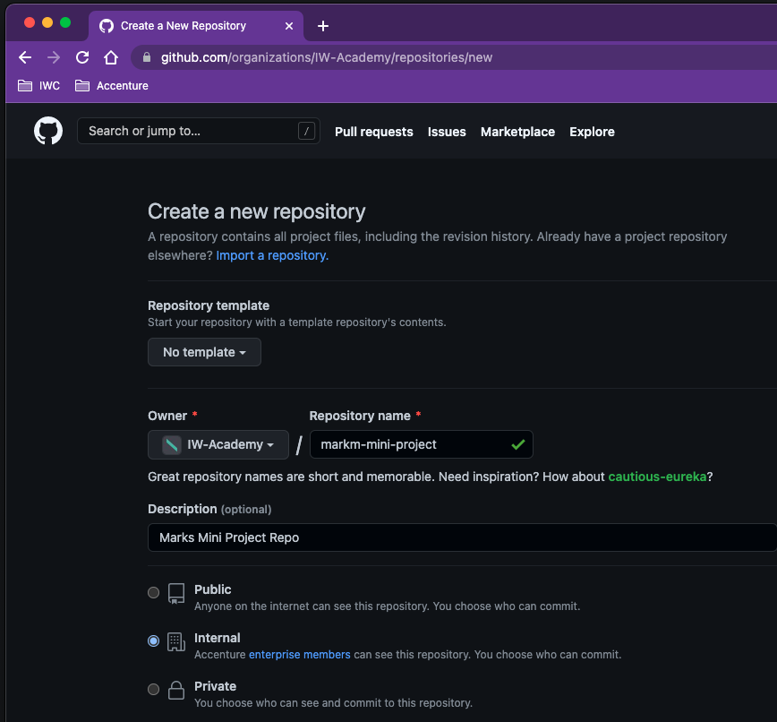
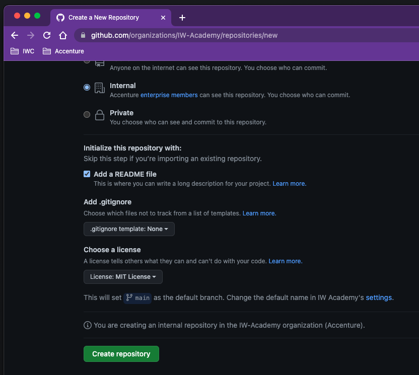
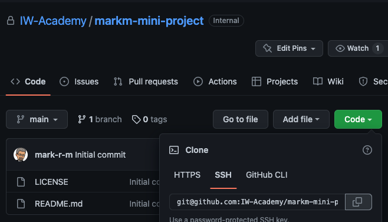

## Git Kata 1

### Create Repo

---

### Creating a repository

Today you will be creating a repository in GitHub for your mini-project.

The next slides recap the images from the Source Control session for you.

---

### Create a new Repo

---

### Create a new Repo

---

### Create a new Repo

---

### Create a new Repo

Clone using the SSH details

---

### Exercise - GitHub in browser

- Log in to GitHub in the browser on this link https://github.com/
- Navigate to the `Repositories` tab and click on the `New repository` button
- Set the name
- Add a description
- Set it to _private_
- Check the `Add a README file` option to initialise the repository with a README
- Click the `Create Repository` button at the bottom of the screen

Then

- Wait for the repo to be created and displayed
- Click on the green `Code` button, select the `SSH` tab and copy the link to clone your repository

_continue to next slide..._

---

### Exercise - in your machine

Clone this repository to your local machine:

- Open a terminal window and type `git clone <your_repository_link>`
- In the terminal or in finder (your choice!) move your mini-project files into the directory that has been created for your repository
- You can now open the project in VSCode (`code <your_project>`) and start work!
