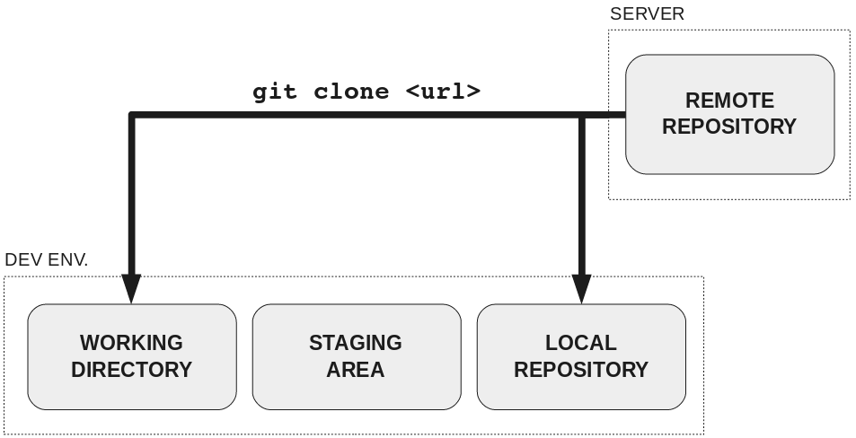

## Git Kata 6

### Clone

---

### Cloning a repository

If you haven't already done so, add, commit and push any changes from yesterday to your mini-project repository. Don't forget to use `git status`!

Today you will be revising the process to create and clone a new repository.

### Git clone - what does it do?

This "copies" the remote information into your machine:

---

### Exercise

- Open GitHub in your browser
- Navigate to your profile by clicking the icon in the top right of the page.
- In the `Repositories` tab, select the green `New` button and create a new repository.
    - This time, select your profile as the owner
    - Set the repository to private
    - As before, select the option to add a README and a .gitignore template
- Open your new GitHub repository in your browser.
- Click on the green `Code` button, select the `SSH` tab, and copy the SSH link.
- In your terminal, either in your root directory or another convenient place, clone the repository using `git clone <SSH_link>`.
- Open the project folder in VSCode.
- Make a change to one of the files or create a new one
- Add, commit and push your change to the remote repository.
- Go back to the GitHub repository in the browser and check that your change is there.
