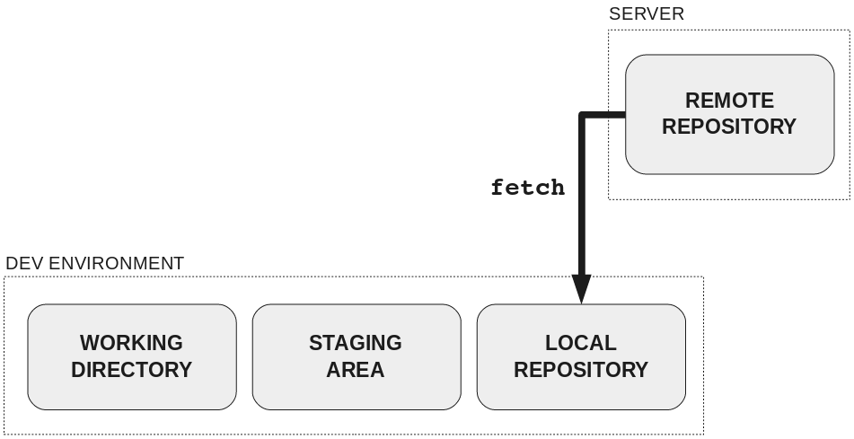

## Git Kata 9

### Fetch

---

### Fetching a branch

Push any changes from yesterday to your mini-project repository.

Today you will be working to fetch a new branch you have created in your remote repository.

---

### Local Updates - Fetch

- To get your local machine up to date with all the remote branch names, we use `git fetch`
- There is an extra `--prune` option to make sure our list of branches has old ones removed
- Because of the global setting we used previously, the `--prune` is now your default

---

### Exercise

- Open the repository for your mini project in GitHub
- Select the dropdown for `main` branch and select the button `View all branches`
- Select the green button `New branch` and create a new branch with `main` as the source
- Open the local repository in VSCode
- Try to use `git checkout` to switch to the branch you just created in GitHub
- Notice that this does not work!
- Use `git fetch` to add the branch to your local git
- Now try checking the branch out again
