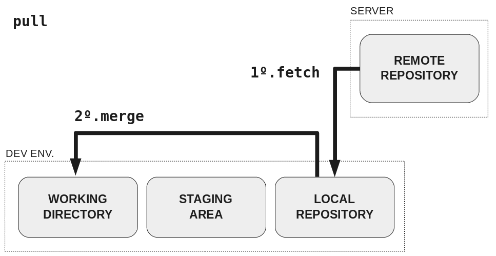

## Git Kata 10

### Pull

---

### Pulling changes to a branch

Push any changes from yesterday to your mini-project repository.

Today you will be working to pull changes that exist on the remote repository but not the local one.

---

### Local Updates - Pull

- To update the files locally you can use the `git pull` command to apply any changes to your local files that other people have made
    - This only updates your _current_ branch - more on this later

---

### Exercise

- Open the repository for your mini project in GitHub
- On the `main` branch, scroll down to the `README.md` section (below the files) and select the edit icon in the top right
- Add a new line of text to your `README.md` file and commit the changes with a message
    - This is not a recommended way to work - normally you will make your changes on a branch in your local repo then push and merge them into main. However, we are doing this to pretend that another person pushed a change to the `README.md` file from their local repo
- Open the local repository in VSCode
- Checkout the `main` branch if it isn't already
- Use `git pull` to pull the change you have just made on GitHub into your local version of the code

---

### Extension

Repeat the steps above, but this time try to make a change and push it before running `git pull`. Does git let you push your change?
