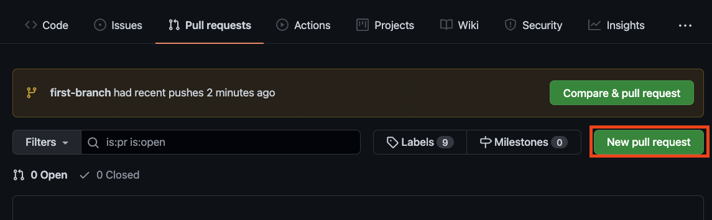
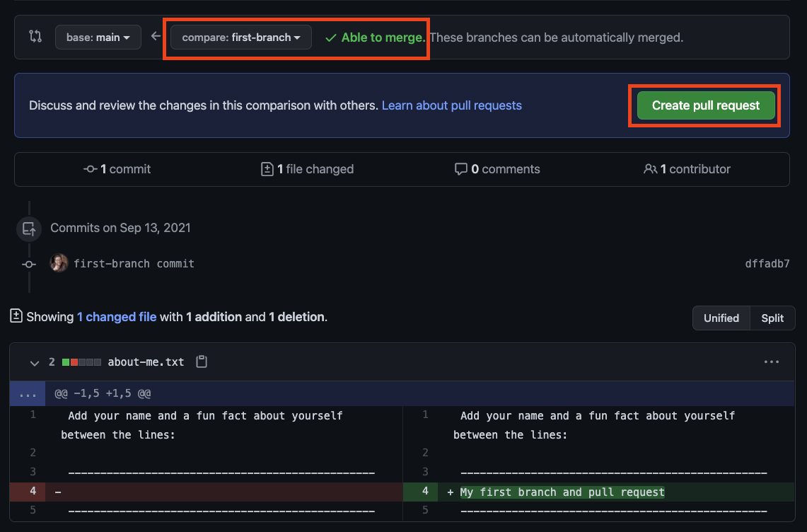
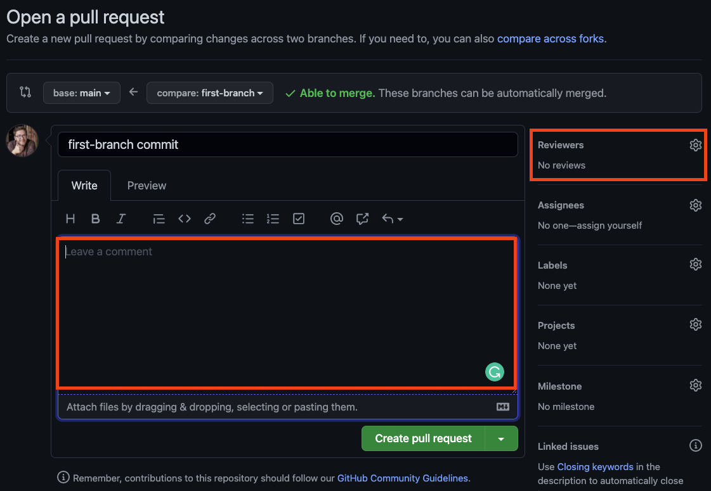
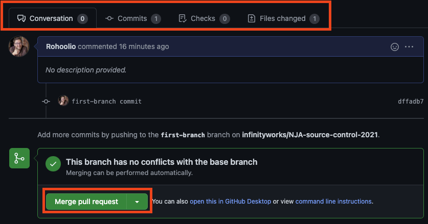

## Git Kata 12

### Pull request

---

### Raising a pull request

Today you will be practising to raise pull requests on a branch in your repository.

Don't forget to push any mini-project changes!

---

## Pull Requests

- Pull requests allow us to control changes going into our `main` branch
- They can be made to need passing test suites before they can be merged, creating a safety net for your code
- Provides an opportunity for review pairing and knowledge share

---

### Raising a Pull Request

- To raise a pull request head to the github page for the repository and select the pull requests tab

---

### Setting up a PR

- There's some important information you need to provide to create a pull request, such as specifying the branch you want to merge

---

### Setting up a PR

- As well as some useful additional information like the description and adding reviewers (these can still be changed after the pull request is made)

---

### Complete a PR

- When all the previous steps are done others can then view, comment and suggest changes to the code

---

### Exercise

- Open one of the repositories in VSCode in which you made a new branch in exercise 8
- Make a change to one of the files in a branch other than `main`, and push your change to the remote
- In the browser, navigate to the repository on GitHub
- Go to the `Pull requests` tab
- Click on the green `New pull request` button
- Choose your branch from the dropdown `compare` menu (it will probably start out showing `compare:main`)
- Click the green `Create pull request` button
- Go to your own repository, and into the `Pull requests` tab
- Select your open pull request
- Check that you are happy with the changes made, and then merge the request

Note: normally in this process, you would request a review from a colleague first. Only when their review was Approved would you proceed to merge the request.
