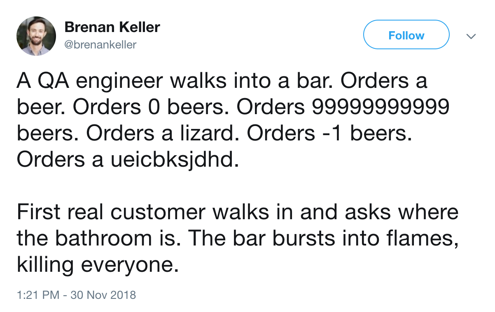
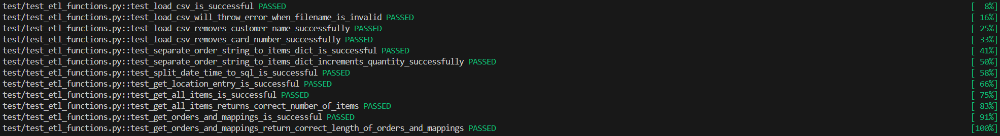

## Unit Testing 1

---

### Overview

- Introduction to Unit Testing
- Why and How We Unit Test
- Testing Pathways
- Test Cases
- Development and Testing
- Testing frameworks

---

### Learning Objectives

- Define unit testing
- Identify testing pathways
- Explore some test cases
- Compare TDD (test driven development) and Non-TDD
- Create a simple unit test
- Getting started with `pytest`

---

### What is a Unit?

A "unit" of code is considered to be the smallest testable chunk of software which performs a very specific job / task.

```python
def add_two_numbers(a, b):
    return a + b
```

---

### What is Unit Testing?

Unit Testing is then the process of executing this unit of code in isolation under certain conditions or scenarios to test its behaviour.

```python
add_two_numbers(1, 1) # Expected 2
add_two_numbers(-1, 0) # Expected -1
add_two_numbers(1.00234, 0.3456) # Expected 1.34794
add_two_numbers("test", 1) # Expected Error
add_two_numbers() # Expected Error
```

---

### Testing Pathways

When testing we refer to our test scenarios as following two distinct paths:

- The Happy Path
- The Unhappy Path

---

### Happy Path

We test successful scenarios:

```python
add_two_numbers(1, 1)
add_two_numbers(0, -10)
add_two_numbers(52130032132321321, 0.000000022330)
```

---

### Unhappy Path

We test unsuccessful scenarios:

```python
add_two_numbers("test", 1)
add_two_numbers(1)
add_two_numbers()
```

Notes:
A happy path is a default scenario featuring no exceptional or error conditions, so the unhappy path is all the other scenarios where exceptional or error conditions happen.

---

<!-- .element: class="centered" -->

---

### Test Cases

We can also define certain _test cases_ when we test:

- Common Case
- Edge Case
- Corner Case

---

### Common Case

This occurs at normal operating parameters:

```python
add_two_numbers(100, 100)
```

---

### Edge Case

This occurs at the extreme min / max parameter envelope:

```python
add_two_numbers(0, 10**10000)
```

---

### Corner Case

This occurs outside of normal operating parameters:

```python
add_two_numbers("text", 10**10000)
```

Notes:
Edge cases occur at an extreme (maximum or minimum) operating parameter. Corner cases occur outside of normal operating parameters, specifically when multiple environmental variables or conditions are simultaneously at extreme levels, even though each parameter is within the specified range for that parameter.

---

### Emoji Check:

Do you feel you understand a bit more about what unit testing is? Say so if not!

1. 😢 Haven't a clue, please help!
2. 🙁 I'm starting to get it but need to go over some of it please
3. 😐 Ok. With a bit of help and practice, yes
4. 🙂 Yes, with team collaboration could try it
5. 😀 Yes, enough to start working on it collaboratively

Notes:
The phrasing is such that all answers invite collaborative effort, none require solo knowledge.

The 1-5 are looking at (a) understanding of content and (b) readiness to practice the thing being covered, so:

1. 😢 Haven't a clue what's being discussed, so I certainly can't start practising it (play MC Hammer song)
2. 🙁 I'm starting to get it but need more clarity before I'm ready to begin practising it with others
3. 😐 I understand enough to begin practising it with others in a really basic way
4. 🙂 I understand a majority of what's being discussed, and I feel ready to practice this with others and begin to deepen the practice
5. 😀 I understand all (or at the majority) of what's being discussed, and I feel ready to practice this in depth with others and explore more advanced areas of the content

---

### Why do we care?

- A good testing strategy outlines the operational envelope of our software.
- Failing tests indicate where we need to improve our software.
- Passing tests are an indicator of software quality and robustness.

```python
robust_software == happy_users == happy_employer
```

Notes:

- Good testing basically outlines how well your software is going to run!
- If you test over a given set of parameters you can say with 100 percent confidence that this code is working fine within this conditions, and if someone comes and try to push it beyond its limitations then you can say that it's not the how this code supposed to work, and then you can decide how you want to handle that.

Could mention some different contexts in which software is run and the affects of untested software. I.e a bug in Aviation vs a bug in Social Media.

---

### Writing our first test

The Three A's:

|**Arrange** | **Act**| **Assert** |
|-----------|------------|--------|
| Create Test Data.  | Execute the unit we're testing and pass in the test data. | Verify the result matches our expectations.|
---

```python
def test_add_two_numbers():
    # Arrange
    a = 7
    b = 12
    expected = 19

    # Act
    result = add_two_numbers(a, b)

    # Assert
    assert result == expected

test_add_two_numbers()
```

Notes:
What is `assert`?

What path are we testing here? Happy / Unhappy?

What case are we testing? Common / Edge / Corner?

How can we make it other case types?

---

### Techniques for writing unit tests

Just as we write application code, we write test code in much the same way.

There are however two main approaches to writing unit-tests:

- Write the code then the tests (non TDD)
- Write the tests then the code (TDD)

---

### Non Test Driven Development

1. Read, understand, and process the feature or bug request.
1. Implement the code that fulfils the requirement.
1. Test the code works by writing a unit test.
1. Clean up your code by refactoring.
1. Rinse, lather and repeat.

---

### Example

1. Write the code and hope it works:

    ```py
    def add_two_numbers(a, b):
        return a + b
    ```

1. Write the test and hope it passes:

    ```py
    def test_add_two_numbers():
        expected = 10
        actual = add_two_numbers(5, 5)
        assert expected == actual
    ```

1. Fix the code if the tests fails

---

### Improving assertion output

We also have the option to display a message containing debug information when our assertion fails:

```py
def test_add_two_numbers():
    expected = 8
    actual = add_two_numbers(5, 5)
    assert expected == actual, \
        f"expected '{expected}' but got '{actual}'"
```

This outputs `AssertionError: expected '8' but got '10'`.

---

### Test Driven Development (TDD)

1. Read, understand, and process the feature or bug request.
1. Translate the requirement by writing a unit test.
1. Write the minimum amount of code to get the test to pass.
1. Rinse, lather and repeat.

---

#### Step 1 - Implement the minimal amount of code needed to pass the test

```py
# additions.py
def add_two_numbers(a, b):
    return 10
```

---

#### Step 2 - Run the test

```py
# test_add_two_numbers.py
from additions import add_two_numbers

def test_add_two_numbers():
    # Arrange
    a = 5
    b = 5
    expected = 10

    # Act
    actual = add_two_numbers(a, b)

    # Assert - pass
    assert expected == actual

test_add_two_numbers()
```

Notes:

do it as a real project

client:

```python
def add_two_numbers(a, b):
    pass
```

---

#### Step 3 - Fully implement function, get test to pass

```py
# additions.py
def add_two_numbers(a, b):
    return a + b
```

---

#### Step 4 - Run the test

```py
# test_add_two_numbers.py
from additions import add_two_numbers

def test_add_two_numbers():
    # Arrange
    a = 5
    b = 5
    expected = 10

    # Act
    actual = add_two_numbers(a, b)

    # Assert - pass
    assert expected == actual

test_add_two_numbers()
```

---

### Benefits of TDD

- Gets you into the dependency injection mindset, which will help your code to be more rigorous.
- Requires you to implement just enough code and prevents you predicting the future. It ensures requirements are understood and met explicitly. It saves time and improves velocity.
- Once you get a test to pass, you know that any refactoring of the code needs to work such that the test still passes. If it doesn't you've either implemented your functionality wrong, or the test was written incorrectly.

---

### Example [code-along] - part 1

We have been asked to write a python function named `price_updater` with the following requirements:

1. It should receive 2 arguments, prices (list[float]) and increase rate (float) and return the prices list with the same order and all values increased by the rate.
2. If the data type for any of the prices inside the price list is not `float`, return `Incorrect Price  Detected!` as a string.
3. Constraints:
    - 0 <= price <= 100,000
    - 0 <= increase_factor <= 1

Notes:
Example solution in Part 1 of file solutions/unit-testing-1-session-follow-along.md

Unit tests can be added one at a time followed by incremental updates to price_updater function to show TDD.

---

### Emoji Check:

Do you feel you understand what TDD is? Say so if not!

1. 😢 Haven't a clue, please help!
2. 🙁 I'm starting to get it but need to go over some of it please
3. 😐 Ok. With a bit of help and practice, yes
4. 🙂 Yes, with team collaboration could try it
5. 😀 Yes, enough to start working on it collaboratively

Notes:
The phrasing is such that all answers invite collaborative effort, none require solo knowledge.

The 1-5 are looking at (a) understanding of content and (b) readiness to practice the thing being covered, so:

1. 😢 Haven't a clue what's being discussed, so I certainly can't start practising it (play MC Hammer song)
2. 🙁 I'm starting to get it but need more clarity before I'm ready to begin practising it with others
3. 😐 I understand enough to begin practising it with others in a really basic way
4. 🙂 I understand a majority of what's being discussed, and I feel ready to practice this with others and begin to deepen the practice
5. 😀 I understand all (or at the majority) of what's being discussed, and I feel ready to practice this in depth with others and explore more advanced areas of the content

---

### Exercise prep

> Instructor to give out the zip file of exercises for `unit-testing-1`
>
> Everyone please unzip the file

---

### Exercise time

> From the zip, you should have a file `exercises/unit-testing-1-exercise-1.md`
>
> Let's all do the exercises included in this file

---

### Emoji Check:

How did the exercises go? Are unit tests making more sense now?

1. 😢 Haven't a clue, please help!
2. 🙁 I'm starting to get it but need to go over some of it please
3. 😐 Ok. With a bit of help and practice, yes
4. 🙂 Yes, with team collaboration could try it
5. 😀 Yes, enough to start working on it collaboratively

Notes:
The phrasing is such that all answers invite collaborative effort, none require solo knowledge.

The 1-5 are looking at (a) understanding of content and (b) readiness to practice the thing being covered, so:

1. 😢 Haven't a clue what's being discussed, so I certainly can't start practising it (play MC Hammer song)
2. 🙁 I'm starting to get it but need more clarity before I'm ready to begin practising it with others
3. 😐 I understand enough to begin practising it with others in a really basic way
4. 🙂 I understand a majority of what's being discussed, and I feel ready to practice this with others and begin to deepen the practice
5. 😀 I understand all (or at the majority) of what's being discussed, and I feel ready to practice this in depth with others and explore more advanced areas of the content

---

### Testing frameworks - `pytest` & `unittest`

- Provides a framework upon which to write and run our tests
- Includes helper objects and functions for versatile mocking, and **spying**
- Provides a test-runner for test detection and verbose results
- Includes additional assertions for diverse testing scenarios

Notes:
This is the first mention of spying and we'll cover this in later slides. Although can point out that spying allows us to record the behaviour of our mocks and it's parameters which we can use later to make better assertions.

---

### Installing `pytest`

You can install it globally with:

```sh
# Mac/Unix
$ python3 -m pip install pytest
# or on Windows
$ py -m pip install pytest
```

To check pytest is installed correctly, run the command `pytest --version`. You should see an output like "pytest 7.4.3"

Notes:
Can also mention installing via a `requirements.txt` file inside a virtual environment, and demonstrate doing this if useful.

---

### Running `pytest`

1. File names should begin or end with `test`, as in `test_example.py` or `example_test.py`.
1. Function names should begin with `test_`. So for instance: `test_example`.
1. If tests are defined as methods on a class, the class should start with `Test`, as in `TestExample`.
1. You can run `pytest` with `--collect-only` to see which tests `pytest` will discover, without running them.
1. Similar to pip, always add `python3 -m` (MacOS / Unix) `py -m` (Windows) at the start of the command when running `pytest`, e.g. `python3 -m pytest` (MacOS / Unix) `py -m pytest` (Windows)

Notes:
https://docs.pytest.org/en/reorganize-docs/new-docs/user/naming_conventions.html

Adding `python3 -m` (MacOS / Unix) `py -m` (Windows) will make sure imports between modules in the directory will function as expected with pytest.

---

### Example 1

```py
# additions.py
def add_two_numbers(a, b):
    print('The function started...')
    return a + b

# test_additions.py
from additions import add_two_numbers

def test_add_two_numbers():
    expected = 5
    actual = add_two_numbers(4, 1)
    assert expected == actual
```

---

### Example 1 continued

- Copy the code to a python file called `additions.py`
- Copy the testing code to a python file called `test_additions.py`
- In your terminal, run `python3 -m pytest` (MacOS / Unix) or `py -m pytest` (Windows)
- Watch the output

Notes:

Point out the differences with the same test found in `unit-testing-1`

- No need to _execute_ the test directly
- The use of `pytest` test runner

---

### Example 1 continued

- Hopefully you should see some information about 1 test passing!
<!-- .element: class="centered" -->

---

### Example 1 continued

- Add `-v -s` flags to the command: `python3 -m pytest -v -s` (MacOS / Unix) `py -m pytest -v -s` (Windows)
- Notice anything different?

Notes:

Explanations on next slide.

---

### `pytest` command line flags

- `-v`: Increases the verbosity to list results for all tests
- `-s`: Instructs pytest to display any terminal output for all tests (usually it swallows it)

Notes:

Run the example with the flags enabled one at a time and show the difference in output.

---

### Notes on running with Pytest

> When we started the session we added calls to our test functions in the test file directly.
>
> When using pytest, we do **not** [need to] do this, as pytest runs the files for us!

---

### Example 2 - Testing Exceptions

We can test any exceptions our code throws by using the `pytest.raises()` method, like so:

```py
# test_additions.py
import pytest

from additions import add_two_numbers

def test_exception_for_non_numeric_args():
    with pytest.raises(Exception):
        add_two_numbers('a', 10)
```

Notes:

You can be more specific about the exception type.

Add a ValueError test, requirement: does not accept negative numbers.

---

### Example 2 - Testing exceptions continued

In order to be stricter (and so more accurate) in our tests, we can also be more specific about the exception type, and test the message by giving a RegEx to match the message produced:

```py
# test_additions.py
import pytest
from additions import add_two_numbers

def test_exception_for_non_numeric_args():
    with pytest.raises(ValueError, match=r'not a number'):
        add_two_numbers('a', 10)
```

See [pytest how-to/assert](https://docs.pytest.org/en/7.1.x/how-to/assert.html#assertions-about-expected-exceptions) for more.

---

### Example [code-along] - part 2

Add the following requirements to the `price_updater` function:

<span style="color:yellow">[New Requirements]</span>

1. If value of increase rate has a non-numeric data type, it should throw `TypeError`.
2. If value of increase rate is outside the defined constraint, it should throw `ValueError`.

---

### Exercise time

> From the `unit-testing-1` zip, you should have a file `exercises/unit-testing-1-exercise-2.md`
>
> Let's all do the exercises included in this file

Notes:
There is also a bonus exercise file which involves running unit tests against a class with methods.

---

### Emoji Check:

How did the exercises go? Is the `pytest` framework making more sense now?

1. 😢 Haven't a clue, please help!
2. 🙁 I'm starting to get it but need to go over some of it please
3. 😐 Ok. With a bit of help and practice, yes
4. 🙂 Yes, with team collaboration could try it
5. 😀 Yes, enough to start working on it collaboratively

Notes:
The phrasing is such that all answers invite collaborative effort, none require solo knowledge.

The 1-5 are looking at (a) understanding of content and (b) readiness to practice the thing being covered, so:

1. 😢 Haven't a clue what's being discussed, so I certainly can't start practising it (play MC Hammer song)
2. 🙁 I'm starting to get it but need more clarity before I'm ready to begin practising it with others
3. 😐 I understand enough to begin practising it with others in a really basic way
4. 🙂 I understand a majority of what's being discussed, and I feel ready to practice this with others and begin to deepen the practice
5. 😀 I understand all (or at the majority) of what's being discussed, and I feel ready to practice this in depth with others and explore more advanced areas of the content

---

### Terms and Definitions - recap

- `Unit`: The smallest testable chunk of code.
- `TDD`: Test Driven Development. The process of writing tests first.
- `Happy Path`: Successful test scenarios.
- `Unhappy Path`: Unsuccessful test scenarios.
- `Corner Case`: Outside normal parameters.
- `Edge Case`: Extreme min/max parameters.

---

### Overview - recap

- Introduction to Unit Testing
- Why and How We Unit Test
- Testing Pathways
- Test Cases
- Development and Testing
- Testing frameworks

---

### Learning Objectives - recap

- Define unit testing
- Identify testing pathways
- Explore some test cases
- Compare TDD (test driven development) and Non-TDD
- Create a simple unit test
- Getting started with `pytest`

---

### Further Reading

- Unit Testing: [Best Practices](https://dzone.com/articles/unit-testing-best-practices-how-to-get-the-most-ou)
- Pytest: [Beginner Guide](https://medium.datadriveninvestor.com/pytest-a-beginner-guide-9ba84a18d3dd)

---

### Emoji Check:

On a high level, do you think you understand the main concepts of this session? Say so if not!

1. 😢 Haven't a clue, please help!
2. 🙁 I'm starting to get it but need to go over some of it please
3. 😐 Ok. With a bit of help and practice, yes
4. 🙂 Yes, with team collaboration could try it
5. 😀 Yes, enough to start working on it collaboratively

Notes:
The phrasing is such that all answers invite collaborative effort, none require solo knowledge.

The 1-5 are looking at (a) understanding of content and (b) readiness to practice the thing being covered, so:

1. 😢 Haven't a clue what's being discussed, so I certainly can't start practising it (play MC Hammer song)
2. 🙁 I'm starting to get it but need more clarity before I'm ready to begin practising it with others
3. 😐 I understand enough to begin practising it with others in a really basic way
4. 🙂 I understand a majority of what's being discussed, and I feel ready to practice this with others and begin to deepen the practice
5. 😀 I understand all (or at the majority) of what's being discussed, and I feel ready to practice this in depth with others and explore more advanced areas of the content
