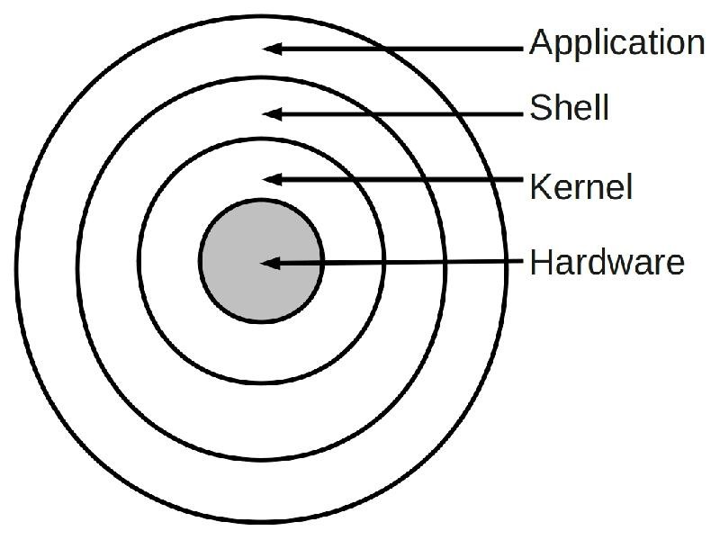
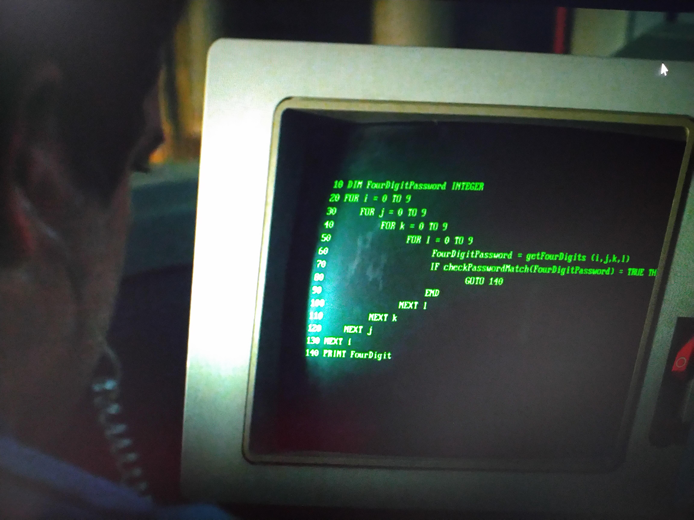
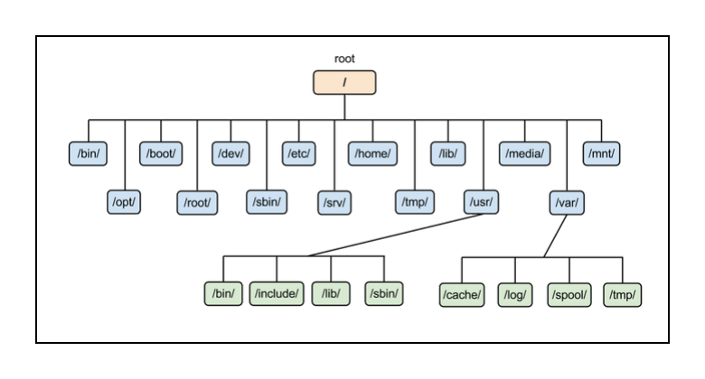
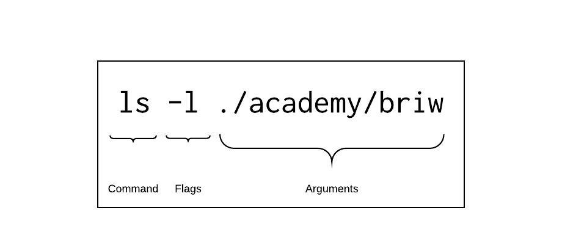
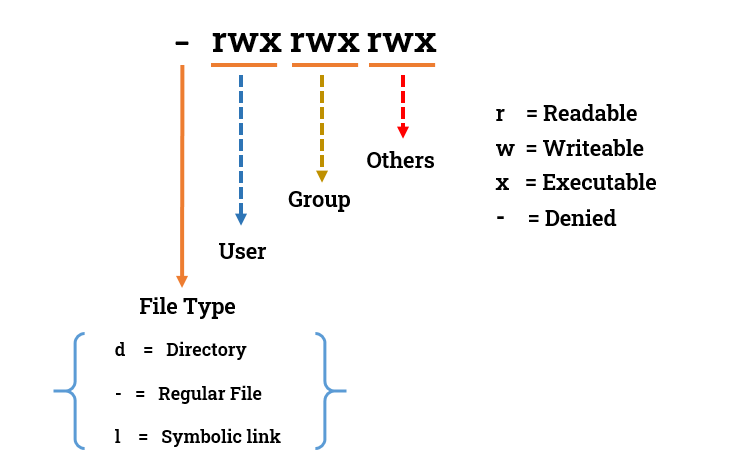
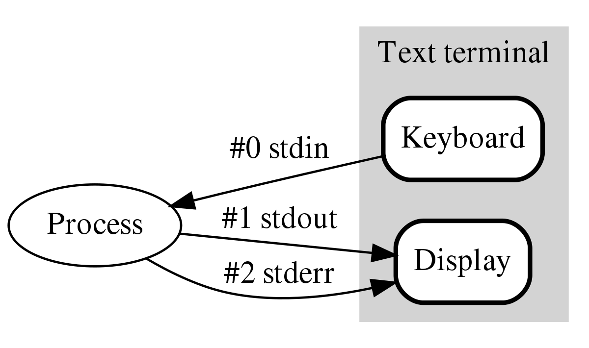
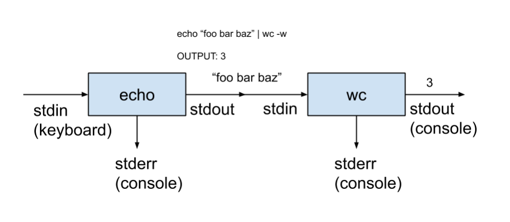

## The Unix Shell

---

### Overview

1. Shell, what/why?
1. Filesystem
1. The Unix Philosophy
1. Commands
1. Permissions
1. Streams & Pipelines
1. CLI Text Editors

---

### Learning Objectives

- List some common UNIX CLI tools
- Solve some simple problems using CLI tools
- Describe the UNIX philosophy

---

### What is a shell?

A shell is a text-based interface within your operating system.

A shell can do the same things your GUI environment does:

- Launch applications
- Open, edit and manage files and folders
- Send email
- Code
- Play Star Wars Episode IV

Notes:
A shell is a type of program called an interpreter that allows users to interact with the operating system.
A shell takes commands and gives them to the operating system to perform.

An interpreter program, in the context of computing, is a program that executes instructions written in a programming language without first compiling them into machine code

---

### The Shell

 <!-- .element: class="centered" -->

- Application = customers
- Shell = waiter
- Kernel = chefs
- Hardware = oven, hob, fryer, ...

Notes:
Clarify that this unix shell diagram is a simplified analogy, not 100% accurate to the letter

Think of the kernel as a restaurant's kitchen.

- The customer places an order to the waiter (app/user gives commands to shell)
- The shell is the waiter taking your order to the kitchen (shell).
- The kernel (kitchen) prepares the dish from the order using appliances like an oven (interacts with hardware to execute command).
- The waiter (shell) brings the final dish (output) back to you.

---

### The Terminal

 <!-- .element: class="centered" -->

Notes:
When we refer to the terminal, we are referring to the user interface between you and the shell

---

```sh
 _______________________________________
/ Welcome to the thrilling world of the \
\ Unix shell                            /
 ---------------------------------------
        \   ^__^
         \  (@@)\_______
            (__)\       )\/\
                ||----w |
                ||     ||
```

```sh
$ cowsay "Welcome to the thrilling world of the Unix shell"
```

---

### Shell vs Terminal

Although the terms Shell and Terminal are often used interchangeably there is a difference between them:

The Terminal is a user facing text-based GUI program that allows users to interact with the shell.

- Command cmd (Windows)
- GNOME Terminal (Linux)
- Terminal.app (MAC)

The Shell is the program that actually processes and executes commands.

- Powershell (Windows)
- Bash (Linux)
- zsh (MAC)

Notes:
The shell is like the translator between the user and operating system whereas the terminal is like the room the translator is met.

cmd is both a shell and terminal.

Similar to the difference between a web browser and a search engine where the web browser displays web pages and allows users to navigate between websites whereas the search engine is used to find websites. Web browser examples: Google Chrome, Arc, Safari, DuckDuckGo. Search engine examples: Google, Bing, DuckDuckGo. (DuckDuckGo is both a search engine and a browser.)

The terminal is like a container for the shell on machines. If the instructor is on mac this can be demonstrated by:

1. Open the terminal
1. Say that the terminal is currently using Z Shell (zsh) that is MAC default shell
1. Enter the command `exec bash` to use a bash shell
1. Mention that the command line prompt has changed to bash
1. Run `exec zsh` to return to Z shell
1. Mention that the command line prompt has changed back to zsh
1. Note that we've switched between two different shells on the same terminal

Can also be demonstrated by opening the Terminal in VSCode and clicking the arrow next to the + icon. A dropdown of available shells to open in the terminal will be shown.

---

Shells have been around almost since the dawn of computing.

ASCII Star Wars Episode IV:

- `telnet towel.blinkenlights.nl`

Also, you can play Tetris online:

- [`tetris`](https://github.com/samtay/tetris)

Notes:
Run the demos for both of these, show them working to the group.

---

### More about the shell

- Bash is the default shell in most Unix OSs
- MacOS now uses Zsh (used to use bash)
- Windows has `cmd` and Powershell
- Windows can also run `git bash`, as well as `WSL`
- Others exist but are less common
- Shells come pre-installed with each and every OS

Notes:
Next slide will show an image asking why we need a shell?

WSL: Windows Subsystem Linux

Bash: Bourne Again SHell

Zsh: Z Shell

---

 <!-- .element: class="centered" -->

---

### Reasons why you should use a shell

**Installed everywhere**: Desktops, servers, Raspberry Pis... GUI environments are not.

**Lightweight**: GUI environments have high resource demands (memory, CPU etc.)

**Lower bandwidth**: Uses much less than a GUI, hence are often the default when administering remote/cloud servers.

**Concise and powerful**: Designed for automation.

Notes:
(Remove before PR) - Read out points from slide then can elaborate with what's in the notes.

- **Universally Available**: Shells are pre-installed on almost all systems—desktops, servers, and embedded devices—while GUIs are not always accessible.
- **Resource-Efficient**: Unlike GUI environments that consume significant CPU and memory, shells run with minimal overhead.
- **Optimized for Remote Access**: Shells require far less bandwidth than GUIs, making them the preferred choice for managing remote and cloud servers.
- **Built for Automation**: Shells enable powerful, scriptable workflows that streamline tasks and increase productivity.

Automation example (if anyone asks):

- LOCAL: A shell script that organises Downloads folder file and moves all images to a Pictures folder, PDFs to Documents, etc. Script:

```sh
#!/bin/bash
mv ~/Downloads/*.jpg ~/Pictures/
mv ~/Downloads/*.png ~/Pictures/
mv ~/Downloads/*.pdf ~/Documents/
```

Can be scheduled to run frequently with cron jobs or task scheduler

- CLOUD/REMOTE: Create and manage cloud VMs, storage, networking with shell scripts automatically

---

## Getting Around

> Open your terminal and play along!
>
> Users on Windows should use WSL or GitBash, as this emulates Unix.

Notes:
If users are on Windows, ask them to use either WSL or git bash.

---

### Simple commands

`pwd`: print the current directory

`ls`: list the files in the current directory

`cd`: change the current directory

`cat`: print the contents of a file

Notes:
'cat' comes from the term 'concatenate'.

---

### Quiz Time! 🤓

---

**What is a shell?**

1. A graphical-based interface within your operation system
1. A text-based interface stored on your hard drive
1. A desktop environment within your operating system
1. A text-based interface within your operating system
1. Commonly found on the beach

Answer: `4`<!-- .element: class="fragment" -->

---

### Emoji Check:

On a high level, do you think you understand the main concepts of what a shell is and why we might want to use it? Say so if not!

1. 😢 Haven't a clue, please help!
2. 🙁 I'm starting to get it but need to go over some of it please
3. 😐 Ok. With a bit of help and practice, yes
4. 🙂 Yes, with team collaboration could try it
5. 😀 Yes, enough to start working on it collaboratively

Notes:
The phrasing is such that all answers invite collaborative effort, none require solo knowledge.

The 1-5 are looking at (a) understanding of content and (b) readiness to practice the thing being covered, so:

1. 😢 Haven't a clue what's being discussed, so I certainly can't start practising it (play MC Hammer song)
2. 🙁 I'm starting to get it but need more clarity before I'm ready to begin practising it with others
3. 😐 I understand enough to begin practising it with others in a really basic way
4. 🙂 I understand a majority of what's being discussed, and I feel ready to practice this with others and begin to deepen the practice
5. 😀 I understand all (or at the majority) of what's being discussed, and I feel ready to practice this in depth with others and explore more advanced areas of the content

---

### Filesystem Hierarchy

A filesystem is the system used by your OS to store and manage all of your files.

Filesystems are usually hierarchical.

In macOS and Linux, your filesystem is a tree and the top of the tree is known as the root directory, `/`.

---

## Unix Filesystem

 <!-- .element: class="centered" -->

Notes:
The filesystem has directories that often aren't needed to be accessed. Most of them have files pertaining to the system itself.

---

### Key Directories

- `/`: your filesystem starts here
- `/home`: personal files (will be `Users` on Mac / Windows)
- `/etc`: system config files
- `/bin`: applications

Notes:
Demonstrate where these are and how to access them with commands.

MAC Instructions:

- Access Root Directory - `cd /`
- Access Home/User Directory - `cd`
- Access etc folder - `cd etc` (from root directory)
- Access bin folder - `cd bin` (from root directory)

Bonus: `ls -a` will show all files & folders including hidden ones.

- **`/` (Root Directory)** – The starting point of everything on your system. All files and folders exist under this.
- **`/home` (Home Directory)** – Where users keep their personal files, documents, and settings. On Mac/Windows, this is like the "Users" folder.
- **`/etc` (Configuration Files)** – Stores system-wide settings and configuration files. Think of it as the "control center" for your system’s behavior.
- **`/bin` (Essential Applications)** – Contains basic programs (like `ls`, `cp`, `cat`) needed to use the system, even in recovery mode.

---

### Paths

The location of a file in your computer is given by its path.

Paths can be:

- Absolute: always start at the root directory, e.g. `/home/dennis/code/src/hello.txt`
- Relative: based on your current directory, e.g. (assuming I'm already at `/home/dennis`) `code/src/hello.txt`

Notes:
Demonstrate.

---

### Building Relative Paths

`.` points to the current directory

`..` points to the parent directory

You can chain them together too.

```sh
$ pwd
/home/dennis/code
$ ls .
$ cd ./src
$ cat ./hello.txt.py
$ ls ../../Pictures/cats
```

Notes:
Demonstrate.

---

### Exercise

- Launch a terminal
- Switch (change) to a directory where some of your python code is located
- Print the contents of a source code file to the screen

Notes:
Answer: use cat.

---

### Emoji Check:

On a high level, do you think you understand the main concepts of the Unix filesystem and paths? Say so if not!

1. 😢 Haven't a clue, please help!
2. 🙁 I'm starting to get it but need to go over some of it please
3. 😐 Ok. With a bit of help and practice, yes
4. 🙂 Yes, with team collaboration could try it
5. 😀 Yes, enough to start working on it collaboratively

Notes:
The phrasing is such that all answers invite collaborative effort, none require solo knowledge.

The 1-5 are looking at (a) understanding of content and (b) readiness to practice the thing being covered, so:

1. 😢 Haven't a clue what's being discussed, so I certainly can't start practising it (play MC Hammer song)
2. 🙁 I'm starting to get it but need more clarity before I'm ready to begin practising it with others
3. 😐 I understand enough to begin practising it with others in a really basic way
4. 🙂 I understand a majority of what's being discussed, and I feel ready to practice this with others and begin to deepen the practice
5. 😀 I understand all (or at the majority) of what's being discussed, and I feel ready to practice this in depth with others and explore more advanced areas of the content

---

### The Unix philosophy

The Unix philosophy was created by the original developers of Unix and its associated tools.

It was documented and published in 1978, but is still very relevant to how we want to be developing software today!

Notes:
The ‘Unix philosophy’ originated with Ken Thompson's early meditations on how to design a small but capable operating system with a clean service interface.

---

### The Unix philosophy - I

_Make each program do one thing well. To do a new job, build afresh rather than complicate old programs by adding new "features"._

Notes:
Programs like cat, ls, pwd all have one purpose respectively. Yes, these are programs ! When something like ls or cat is ran,  a binary executable file is being ran. This is a small program stored in the bin folder.

Executable can be viewed by running `file /bin/<command>` i.e. `file /bin/mkdir`

We call them commands because they can be invoked from the terminal.

---

### The Unix philosophy - II

_Expect the output of every program to become the input to another, as yet unknown, program._

_Don't clutter output with extraneous information._

_Avoid stringently columnar or binary input formats._

_Don't insist on interactive input._

Notes:

1. We will understand the first point more as we go through this module.
2. Keep outputted information minimal and relevant.
3. Best to allow input as text or accept a file. Human readable.
4. If input isn't needed, don't ask for it.

---

### The Unix philosophy - III

_Design and build software, even operating systems, to be tried early, ideally within weeks._

_Don't hesitate to throw away the clumsy parts and rebuild them._

Notes:

1. Catches failures early, and avoids over engineering (agile style)
2. It’s better to discard inefficient parts than to keep patching a flawed foundation.

---

### The Unix philosophy - IV

_Use tools in preference to unskilled help to lighten a programming task, even if you have to detour to build the tools and expect to throw some of them out after you've finished using them._

Notes:
This principle is a core part of the Unix mindset—small, well-crafted tools should be preferred over manual, repetitive labour. What this essentially means is that specialised tools should be used to solve problems rather the problem being handled manually, even if this means taking time out to create the tool. But once the tool is no longer useful it can be discarded.

---

### The Anatomy of a Shell Command

Shell commands can take any number of flags and arguments, or none at all:

 <!-- .element: class="centered" -->

---

### Example

```sh
$ ls -a -l /home/dennis/code
# Can be abbreviated as
$ ls -al /home/dennis/code
```

List the contents of the `/home/dennis/code` directory with details (-l), including hidden files (-a). Flags can be concatenated.

Notes:
Demonstrate.

---

### Where are all the flags, man?

`man` will display the help page for a command

For example, to see the help page for the `ls` command we just looked at:

```sh
$ man ls
```

Notes:
Demonstrate.

`man` Short for manual. RTM - Read the manual.

---

### Quiz Time! 🤓

---

**What does the `cd` command do?**

1. Print out the contents of a file
1. Print the current file path
1. Change to a different directory
1. Print the contents of a folder

Answer: `3`<!-- .element: class="fragment" -->

---

### Exercise

- List your directory sorted by timestamp

Remember to use the `man` page for the command to find out the arguments you need.

Notes:
man = manual.
Solution: Run `ls -t`. When running `man` it shows what the `-t` flag does, can also demo this.

---

### Filesystem Commands

`touch`: create an empty file

`mv`: move/rename a file or directory

`cp`: copy a file to a new location

`rm`: remove a file

`mkdir`: create a directory

---

### Examples

```sh
$ mkdir folder-one
$ mkdir folder-two
$ mkdir backups
$ touch folder-one/hello.txt
$ mv folder-one/hello.txt folder-two
$ cp folder-two/hello.txt backups/

# Deletes a single file
$ rm folder-two/hello.txt

# Deletes an entire folder and all its sub-folders and files
$ rm -rf folder-two
```

---

### More Useful Commands

`echo`: print some text to the screen

`history`: show list of previously run commands

`clear`: wipe the screen

`less`: show the contents of a file in a paginated way

`head`: display the first `n` lines of a file (10 by default)

`tail`: display the last `n` lines of a file (10 by default)

Notes:
The `-n` flag can be used to specify the amount of lines to look at.

---

### Exercise

Using terminal commands:

- Create a new "backups" directory
- Copy an entire directory containing code files into it

---

### Emoji Check:

On a high level, do you think you understand the main concepts of running commands and using flags? Say so if not!

1. 😢 Haven't a clue, please help!
2. 🙁 I'm starting to get it but need to go over some of it please
3. 😐 Ok. With a bit of help and practice, yes
4. 🙂 Yes, with team collaboration could try it
5. 😀 Yes, enough to start working on it collaboratively

Notes:
The phrasing is such that all answers invite collaborative effort, none require solo knowledge.

The 1-5 are looking at (a) understanding of content and (b) readiness to practice the thing being covered, so:

1. 😢 Haven't a clue what's being discussed, so I certainly can't start practising it (play MC Hammer song)
2. 🙁 I'm starting to get it but need more clarity before I'm ready to begin practising it with others
3. 😐 I understand enough to begin practising it with others in a really basic way
4. 🙂 I understand a majority of what's being discussed, and I feel ready to practice this with others and begin to deepen the practice
5. 😀 I understand all (or at the majority) of what's being discussed, and I feel ready to practice this in depth with others and explore more advanced areas of the content

---

## Searching

---

### Finding text

`grep`: search text in files. You can also use wildcards:

```sh
$ grep "print" ./folder/*.py
```

A couple of useful flags are `-i` (case-insensitive) and `-r` (recursive, to go into folders)

```sh
$ grep -ri "hello" ./folder/*.py
```

Notes:
Recursive - to repeat an action over and over, in this scenario, inside every directory execute the same search.

---

### Finding files

`find`: search for file(s) by name or other properties

```sh
$ find ./ -name "app.py"
# You can also use wildcards
$ find ./ -name "app*"
```

---

## Finding programs

Use `whereis` to get the location of a program:

```sh
$ whereis python3
```

GitBash users have the `where` app:

```sh
$ where python3
```

Notes:
This especially useful for finding different versions of apps, e.g `python`, `python2`, `python3`.

---

### Globbing (a.k.a. Wildcards)

**Globbing** allows you to refer to many files without the hassle of typing out their paths in full.

The question mark (`?`) matches any one character in a path:

```sh
$ ls ./Pictures/longcat.jp?g
longcat.jpeg
```

The asterisk (`*`), a.k.a. wildcard, matches zero or more letters in a path:

```sh
$ ls ./Pictures/longcat.jp*g
longcat.jpg longcat.jpeg
```

Notes:
The above example shows matching of either a letter in `longcat.jpeg` or no letter in `longcat.jpg`.

The difference is that `?` matches exactly one character. `*` matches zero or more characters.

```sh
$ ls ./Pictures/cats/*
longcat.jpg longcat.jpeg cat.jpg anothercat.png
```

---

Both wildcard characters can be put anywhere in a path, any number of times:

```sh
$ ls ./code/*/miniproject/*.py
app.py utils.py text.py

$ ls ./code/minipro?ect/app.*
app.py
```

---

### Quiz Time! 🤓

---

**What does `grep` do?**

1. Searches for the location of a file
1. Searches text in files
1. Searches for files in a file system
1. Searches for the location of a folder

Answer: `2`<!-- .element: class="fragment" -->

---

### Exercise

- Create a directory structure for a code project using the shell

Example:

```sh
codeproject
├── README.md
├── documentation
│   └── overview.md
├── source
│   ├── app.py
│   ├── coffee.py
│   └── tea.py
```

Notes:
Mention that this is just an example. Also for Python it's just a suggestion!

---

### Emoji Check:

On a high level, do you think you understand the main concepts of searching, globbing, creating directories and navigating them? Say so if not!

1. 😢 Haven't a clue, please help!
2. 🙁 I'm starting to get it but need to go over some of it please
3. 😐 Ok. With a bit of help and practice, yes
4. 🙂 Yes, with team collaboration could try it
5. 😀 Yes, enough to start working on it collaboratively

Notes:
The phrasing is such that all answers invite collaborative effort, none require solo knowledge.

The 1-5 are looking at (a) understanding of content and (b) readiness to practice the thing being covered, so:

1. 😢 Haven't a clue what's being discussed, so I certainly can't start practising it (play MC Hammer song)
2. 🙁 I'm starting to get it but need more clarity before I'm ready to begin practising it with others
3. 😐 I understand enough to begin practising it with others in a really basic way
4. 🙂 I understand a majority of what's being discussed, and I feel ready to practice this with others and begin to deepen the practice
5. 😀 I understand all (or at the majority) of what's being discussed, and I feel ready to practice this in depth with others and explore more advanced areas of the content

---

### Permissions

Unix-like systems allow you to control who has access to files in a computer and what they're allowed to do:

- Users
- Groups
- Everyone (All)

We can restrict a user's ability to read, write files or run programs.

---

For example if we ran the command `ls -la` we would see:

```sh
total 24
drwxrwxr-x.   3 jerry jerry  4096 Aug 24 17:29 .
drwxr-xr-x. 136 jerry jerry 12288 Aug 29 15:18 ..
drwxr-xr-x.   4 jerry devs   4096 Aug 19 14:43 academy-revealjs
-rw-r--r--.   1 jerry jerry    51 Aug 24 17:29 file.py
```

This is now showing us the parent folder `..` and showing us the permissions currently set on each file system object.

Notes:
The structure of the resource details is as follows:

- Permissions
- No. of hard links to resource (an additional name for a file that points directly to the same data on disk. It’s not a copy.)
- Owner
- Group (the group that owns the resource)
- Size (bytes)
- Last modified date
- Resource Name

drwxrwxr-x - We can talk through the following

d - Indicated if the resource is a directory.

rwx - In blocks of three, indicates the read/write/execute for a resource; 'file's owner', 'for the group to which the file belongs' & 'permissions for everyone else'

`-` - indicated missing permission.

---

### Permissions Breakdown

 <!-- .element: class="centered" -->

Notes:
The first character indicates the resource type. This can be a directory, file, or symbolic link (shortcut).

There's three blocks of permissions for a resource depending on the target. The first block of 3 letters being the permissions the owner of the resource has, the next block are the permissions the group the user belongs to has, the last block is the permissions for everyone else.

---

### Setting permissions with chmod

`chmod` stands for "change modes". We use it like this:

```sh
$ chmod <target><+/-><action>
```

```sh
# Add the read attribute to everyone (all)
$ chmod a+r hello.txt
# Allow the owner of the file to write to it
$ chmod u+w hello.txt
# Remove the read attribute for everyone
$ chmod a-r hello.txt
```

Notes:
Letters are explained on the next page

- Target - Who to apply permission change to (user, group, or all)
- +/- -Either add or remove the permission
- Action - What permission to be added/removed

---

Targets:

- u: owner
- g: group
- a: all (everyone)

Access types:

- r: read
- w: write
- x: execute

---

### Setting permissions the hard way

This is worth mentioning as you'll come across it many times in your career, so it's important to also understand how it works.
Permissions can be expressed as a three digit number like the following:

```sh
chmod 764 myfile
```

Each number controls the permissions for a target:

- The first number controls permissions for the owner
- The second number controls permissions for the group
- The third number controls permissions for others

The number itself (ranging from 0-7) represents the permission level.

_The table for the numbers is on the next slide..._

Notes:
Permissions can be expressed numerically too, as three groups of octets (0-7), one per target. Each octet represents the level of access given to the resource.

These are in the order Owner, Group and All, e.g. "764" is "Owner read write execute, Group read write, All read-only"

---

| #   | Permission           | rwx | Binary |
| --- | -------------------- | --- | ------ |
| 7   | read, write, execute | rwx | 111    |
| 6   | read, write          | rw- | 110    |
| 5   | read, execute        | r-x | 101    |
| 4   | read only            | r-- | 100    |
| 3   | write, execute       | -wx | 011    |
| 2   | write only           | -w- | 010    |
| 1   | execute only         | --x | 001    |
| 0   | none                 | --- | 000    |

Notes:
Not expecting people to memorise this. What's important is understanding how chmod works with numbers. That being, 3 numbers from 0-7 each representing permissions for a target.
May be a good idea to tell learners to open the cheatsheet to help them with the quiz later on.

---

### Examples

All permissions for everyone (Owner, Group and All):

```sh
$ chmod 777 file.py
```

Owner can do anything, no-one else has access to file:

```sh
$ chmod 700 file.py
```

Owner can read and write, group can read and no one else can access the file:

```sh
$ chmod 640 file.py
```

---

### Quiz Time! 🤓

---

**I want to set the following permissions for `file.py` - owner/user can do everything, group can read and execute, everyone else can read only - which is the correct command?**

1. `$ chmod 732 file.py`
1. `$ chmod 754 file.py`
1. `$ chmod 650 file.py`
1. `$ chmod 444 file.py`

Answer: `2`<!-- .element: class="fragment" -->

---

**I want to set the following permissions for `file.py` - owner/user and group should be able to read and execute, everyone else has no permissions - which is the correct command?**

1. `$ chmod 661 file.py`
1. `$ chmod 777 file.py`
1. `$ chmod 650 file.py`
1. `$ chmod 550 file.py`

Answer: `4`<!-- .element: class="fragment" -->

---

> Regular users cannot modify protected system resources such as external devices (/dev), system commands or system directories (any immediate children of the root directory, except /home and maybe /var, /tmp)

---

### The Root User

There are two types of users in a Unix-like environment:

- **Regular users**: can only create and modify files and programs they own or they've been given permission to
- **The superuser**: a.k.a. root, administrator, etc., has full control over the entire OS

---

### With great power comes great responsibility

You can log in as the root user by typing `su` in a terminal:

```sh
$ su
Password:
# echo "Congratulations, you're now root!"
```

We should avoid this as much as possible! However, sometimes we need to make changes for which we require elevated privilege.

---

### The sudo command

<!-- .element: class="centered" -->

---

### The sudo command

`sudo` allows regular users to become root temporarily so they can run privileged commands:

```sh
$ cp /bin/python3 /bin/python-three
cp: cannot create regular file 'python-three': \
  Permission denied
$ sudo cp /bin/python3 /bin/python-three
```

---

### sudo's and sudont's

The risk with running the root account, security aside, is that you may accidentally run a harmful command and end up destroying something important:

- Use root account as least as possible.
- Protect root account with a strong password
- Use sudo with caution

---

### Emoji Check:

On a high level, do you think you understand the main concepts of Unix permissions and the sudo command? Say so if not!

1. 😢 Haven't a clue, please help!
2. 🙁 I'm starting to get it but need to go over some of it please
3. 😐 Ok. With a bit of help and practice, yes
4. 🙂 Yes, with team collaboration could try it
5. 😀 Yes, enough to start working on it collaboratively

Notes:
The phrasing is such that all answers invite collaborative effort, none require solo knowledge.

The 1-5 are looking at (a) understanding of content and (b) readiness to practice the thing being covered, so:

1. 😢 Haven't a clue what's being discussed, so I certainly can't start practising it (play MC Hammer song)
2. 🙁 I'm starting to get it but need more clarity before I'm ready to begin practising it with others
3. 😐 I understand enough to begin practising it with others in a really basic way
4. 🙂 I understand a majority of what's being discussed, and I feel ready to practice this with others and begin to deepen the practice
5. 😀 I understand all (or at the majority) of what's being discussed, and I feel ready to practice this in depth with others and explore more advanced areas of the content

---

### Passing information along

Applications receive input data to work on and produce some output when they're done.

But where does the data come from and where does it go?

The shell provides 3 separate channels to enable data flow in and out of applications.

These channels are known as standard streams and they are connected to different things by default.

---

### Standard Streams

- Input: `stdin`
- Output: `stdout`
- Errors: `stderr`

---

<!-- .element: class="centered" -->

Notes:

- stdin (File Descriptor 0). This is the input stream for a program. By default, it comes from the keyboard, but it can be redirected from a file or another command.
- stdout (File Descriptor 1). This is the normal output stream where programs send their results. By default, it prints to the terminal.
- stderr (File Descriptor 2). This is used for error messages. By default, errors print to the terminal, but they can be redirected separately from stdout.

---

You can attach the standard streams to different things like files or peripherals.

For example, you can ask a program to send its output to a file instead of the screen with the redirect operator:

```sh
# Send today's fortune to a file instead of printing it to the screen
$ fortune > fortune-today.txt
```

---

### Unix Pipe

We've been doing this manually so far, but we can also get programs to talk to each other.

We can redirect the output from one program as input to another program with **pipes**:

 <!-- .element: class="centered" height="300px" -->

Notes:
The command first outputs "Hello World" from the input given to it which can be fed into the next `wc -w` command which counts words

---

### Pipelines

You can join up many Unix pipes to construct complex pipelines that filter down and transform your data before producing a final result, e.g.:

`sort colours.txt | uniq -c | sort -r | head -3`

 <!-- .element: class="centered" height="200px" -->

Create the `colours.txt` file first, then try it out!

Notes:

- The `sort` command sorts the colours in the file.
- `uniq -c` Removes duplicates. The c flag counts the amount of times word appears
- `sort -r` Reverse sorts the lines (now by number as number is the first character)
- `head -3` Outputs the first three lines of the file

---

### Package managers

**Package managers** let you install and keep track of software on your machine.

macOS uses homebrew.

Every version of Linux has its own package manager.

Ubuntu uses APT.

Notes:
Windows can use `Chocolatey`

---

### Ubuntu Package Manager

```sh
# If you don't know the name of a package, look it up
$ apt-cache search cowsay
# Update your package information
$ sudo apt update
# Install a package
$ sudo apt install cowsay
# Uninstall a package
$ sudo apt remove cowsay
# Update all installed packages
$ sudo apt upgrade
```

---

## macOS homebrew package manager

```sh
# If you don't know the name of a package, look it up
$ brew search cowsay
# Update your package information
$ brew update
# Install a package
$ brew install cowsay
# Uninstall a package
$ brew remove cowsay
# Update all installed packages
$ brew upgrade
```

---

### Exercise

- Install "fortune" and "cowsay" on your machine
- Have the cow say the "fortune" message by piping the commands together

Notes:
TODO: Check for Windows: Windows users should use chocolaty to get these, not GitBash.

---

### Emoji Check:

On a high level, do you think you understand the main concepts streaming and pipes? Say so if not!

1. 😢 Haven't a clue, please help!
2. 🙁 I'm starting to get it but need to go over some of it please
3. 😐 Ok. With a bit of help and practice, yes
4. 🙂 Yes, with team collaboration could try it
5. 😀 Yes, enough to start working on it collaboratively

Notes:
The phrasing is such that all answers invite collaborative effort, none require solo knowledge.

The 1-5 are looking at (a) understanding of content and (b) readiness to practice the thing being covered, so:

1. 😢 Haven't a clue what's being discussed, so I certainly can't start practising it (play MC Hammer song)
2. 🙁 I'm starting to get it but need more clarity before I'm ready to begin practising it with others
3. 😐 I understand enough to begin practising it with others in a really basic way
4. 🙂 I understand a majority of what's being discussed, and I feel ready to practice this with others and begin to deepen the practice
5. 😀 I understand all (or at the majority) of what's being discussed, and I feel ready to practice this in depth with others and explore more advanced areas of the content

---

### Text Editors

<!-- .element: class="centered" -->

---

### nano

Nano is a simple-ish and easy-ish to learn command-line text editor.

Try it out by running `nano` in your terminal.

---

### vim

Vim is powerful. Vim is everywhere. Vim is hard!

Try it out by running `vi` in your terminal.

If you **really** want to learn it, you can run `vimtutor` in your shell.

Figure out how to exit vim, it isn't easy!

---

### Things you can do in the shell

```sh
# Order a list of Python source files by line count,
# sorting them in descending order
find src -name "*.py" | xargs wc -l | sort -r
# Find and replace a string across any number of files
# and directories specified
grep -rli 'dog' * | xargs -i@ sed -e 's/dog/cat/g' @
```

Notes:
xargs (short for "extended arguments") is a command on Unix and most Unix-like operating systems used to build and execute commands from standard input. It converts input from standard input into arguments to a command.

`@` is a placeholder for each file passed in from grep command

---

### Automation in the Shell

Shell scripting allows you to write shell "programs" to automate complex tasks.

Shell scripts are written in the Bash scripting language.

The Bash scripting language contains all the basic building blocks you'd expect in a regular programming language.

Notes:
Basic building blocks being variables, loops, conditional statements, etc

---

### Example Bash File

> Instructor to talk through `handouts/example-shell-script.sh`

---

### Your shell config file

The only shell script you should care about for now is `.bashrc` (or `.zshrc`).

This is your shell config file, which is loaded every time you open a new terminal.

Your shell config file lives in your home directory, `/home/john` on Linux or `/User/john` on macOS.

You can define variables in this file and export them so that they're available in your shells.

---

### Environment Variables

These are like global variables, available in your shells:

```sh
# Print the value of an environment variable
echo $PATH

# Set an environment variable
export MYNEWVAR="hello"
```

---

### Exercise

- Locate your `~/.bashrc` or `~/.zshrc` file (as relevant for your system).
- Open it in an editor like Nano or VSCode
- Create a new environment variable like this:

    ```sh
    export EDITOR=nano
    ```

- Save and close the file

---

### Terms and Definitions - recap

**Shell**: A computer program which exposes an operating system's services to a human user or other program.

**Unix**: A family of multitasking, multi-user computer operating systems that derive from the original AT&T Unix, development starting in the 1970s at the Bell Labs research center.

**Glob**: Glob patterns specify sets of filenames with wildcard characters.

---

### Terms and Definitions - recap

**Wildcard**: A symbol used to replace or represent one or more characters.

**Standard Stream**: Interconnected input and output communication channels.

**Package Manager**: A collection of software tools that automates the process of installing, upgrading, configuring, and removing computer programs for a computer's operating system in a consistent manner.

---

### Overview - recap

1. Shell, what/why?
1. Filesystem
1. The Unix Philosophy
1. Commands
1. Permissions
1. Streams & Pipelines
1. CLI Text Editors

---

### Learning Objectives - recap

- List some common UNIX CLI tools
- Solve some simple problems using CLI tools
- Describe the UNIX philosophy

---

### Further Reading

- Text handling tools: sed, awk, cut, tr, uniq, sort, perl
- Archiving and compressing: tar, zip, gzip, bzip2
- [Great video of Unix being used in the 80s with interviews from it's primary developers](https://www.youtube.com/watch?v=tc4ROCJYbm0)

---

### Further Reference and Credits

- [Pipeline (pic)](http://www.rozmichelle.com/wp-content/uploads/pipefinal-1.png)
- [Pipe (pic)](https://camo.githubusercontent.com/1652e94dd89d73b1e5ad43feabe12d5aac7e033b/68747470733a2f2f646f63732e676f6f676c652e636f6d2f64726177696e67732f642f3161444b397a716163677572465a537a6a704c4d5653676f64306a462d4b4648576553565f53554c387668452f7075623f773d39313626683d333534)
- [Standard streams (pic)](https://upload.wikimedia.org/wikipedia/commons/thumb/7/70/Stdstreams-notitle.svg/1200px-Stdstreams-notitle.svg.png)

---

### Emoji Check:

On a high level, do you think you understand the main concepts of this session? Say so if not!

1. 😢 Haven't a clue, please help!
2. 🙁 I'm starting to get it but need to go over some of it please
3. 😐 Ok. With a bit of help and practice, yes
4. 🙂 Yes, with team collaboration could try it
5. 😀 Yes, enough to start working on it collaboratively

Notes:
The phrasing is such that all answers invite collaborative effort, none require solo knowledge.

The 1-5 are looking at (a) understanding of content and (b) readiness to practice the thing being covered, so:

1. 😢 Haven't a clue what's being discussed, so I certainly can't start practising it (play MC Hammer song)
2. 🙁 I'm starting to get it but need more clarity before I'm ready to begin practising it with others
3. 😐 I understand enough to begin practising it with others in a really basic way
4. 🙂 I understand a majority of what's being discussed, and I feel ready to practice this with others and begin to deepen the practice
5. 😀 I understand all (or at the majority) of what's being discussed, and I feel ready to practice this in depth with others and explore more advanced areas of the content
