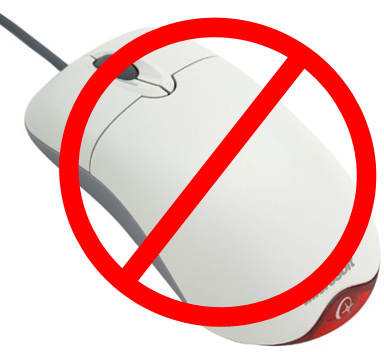
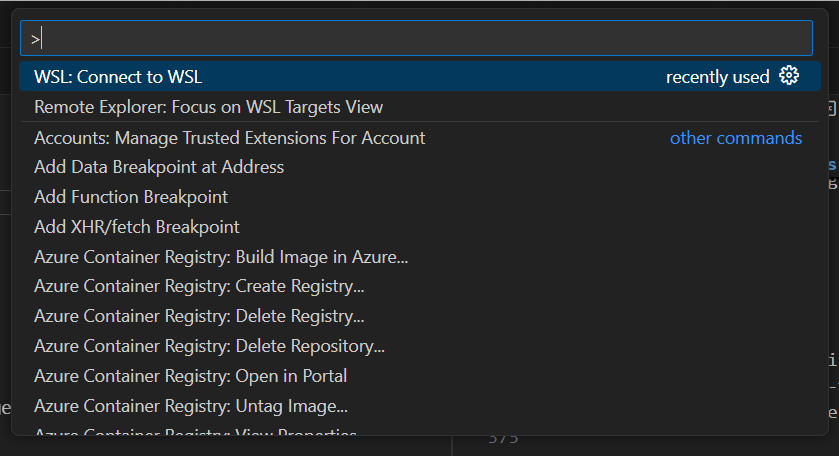
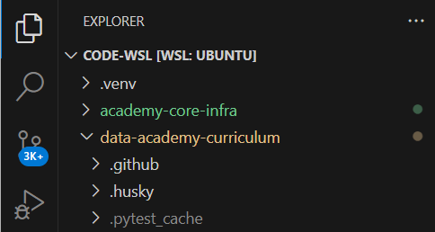
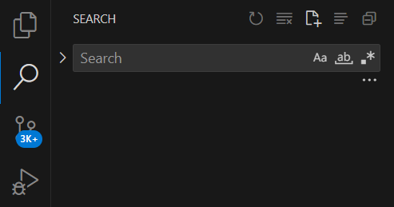
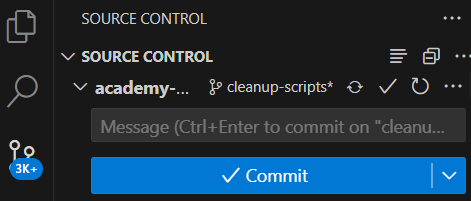

## VSCode Tips & Tricks

Useful features of VSCode and keyboard shortcut tips

Notes:
MacOS keyboard codes:

- Cmd         ⌘      Command, Cmd, Clover, (formerly) Apple
- &#8963;     ⌃      Control, Ctl, Ctrl
- &#8997;     ⌥      Option, Opt, (Windows) Alt
- &#8679;     ⇧      Shift
- &#8594;     →      Right arrow
- &#8592;     ←      Left arrow
- &#8593;     ↑      Up arrow
- &#8595;     ↓      Down arrow

---

### Overview

- An Introduction to VS Code
- Useful features of the editor
- Common Keyboard Shortcuts

---

### Learning Objectives

- Be aware of the capabilities of VS Code
- Move around the editor using keyboard shortcuts
- Perform common text manipulation with keyboard shortcuts
- Use multiple cursors to work more efficiently

Notes:

- We will show you a lot of keyboard shortcuts. We don't expect you to remember them all. But know that they exist and work on adding them to your muscle memory a few at a time over the coming weeks/months/years
- VSCode is a powerful tool, and like most powerful tools we need to understand how to use it efficiently

---

### What is VS Code?

<!-- .element: class="centered" -->

Notes:

- ask the learners
- NOT the same as visual studio
- VS Code == A fast, extensible code editor for various languages.
- Visual Studio == A full IDE for complex .NET and enterprise-level development.

---

- An Integrated Development Environment (IDE)
- Lightweight, fast, highly customizable, and supports a vast number of programming languages and frameworks
- A text editor on steroids

---

### Keyboard practice

- The less you use the mouse, the more productive you'll be
- The keyboard is like an instrument. It'll be frustrating at first, but when you know how to use it - you feel flow

<!-- .element: class="centered" -->

---

### Let's get started

<!-- .element: class="centered" -->

- Fire up VS Code and follow along!

---

### The command palette

Every function of VS Code can be accessed from the Command Palette.

**Ctrl + Shift + P**  or  **Cmd + &#8679; + P**

Type in what you're looking for.

It also shows the keyboard shortcuts if there is one.
<!-- .element: class="centered" -->

Notes:
Can do almost anything from the command palette, and can search in it to find what you need.

e.g:

- Format document
- Markdown preview to the side
- Save all
- Python select interpreter
- Install extension

---

### Editor Layout

We can affect the panels in our editor window with keyboard shortcuts.

---

### The Sidebar

- Show the file tree: **Ctrl + Shift + E**  or  **Cmd + &#8679; + E**

<!-- .element: class="centered" -->

---

### The Sidebar

- Show the file search: **Ctrl + Shift + F**  or  **Cmd + &#8679; + F**

<!-- .element: class="centered" -->

---

### The Sidebar

- Show the source control panel: **Ctrl + Shift + G**  or  **&#8963; + &#8679; + G**

<!-- .element: class="centered" -->

---

### The Sidebar

- Toggle sidebar visibility: **Ctrl + B**  or  **Cmd + B**

---

### The Terminal

- Create a new terminal tab: **Ctrl + Shift + &#96;**  or  **&#8963; + &#8679; + &#96;**
- Show (or hide) the terminal: **Ctrl + &#96;**  or  **&#8963; + &#96;**

There isn't a default shortcut for moving between terminals (`focus next terminal` in command palette)

You can also move the terminal to the side (`move panel right` in command palette)

---

### Split Editor

- Split the editor in two: **Ctrl + &#92;**  or  **Cmd + &#92;**
- Change split direction: **Shift + Alt + 0**  or  **&#8997; + Cmd + 0**

---

### Full screen

- Full Screen: **F11**  or  **&#8963; + Cmd + F**
- Zen mode: **Ctrl + K, Z**  or  **Cmd + K, Z**

---

## Managing Files

---

### Opening Files

- Open file: **Ctrl + O**  or  **Cmd + O**
- Open folder: **Ctrl + K, Ctrl + O**  or  **Cmd + O**
- Quick open: **Ctrl + P**  or  **Cmd + P**

Notes:
Ask for a volunteer so they can demo in Windows (easier if you are on a different OS to the learner)

---

### Other File Stuff

- Cycle through open files: **Ctrl + Tab**  or  **&#8963; + &#8677;**
- Save file: **Ctrl + S**  or  **Cmd + S**
- Save all files: **Ctrl + K, S**  or  **&#8997; + Cmd + S**
- Close file: **Ctrl + W**  or  **Cmd + W**
- Reopen last closed file: **Ctrl + Shift + T**  or  **&#8679; + Cmd + T**

---

### Editing Text

We spend a lot of time writing code. Let's make it easier.

Notes:
Ask for a volunteer so they can demo in Windows (easier if you are on a different OS to the learner)

---

### Moving Text Around

- Move line (or selected lines) up or down: **Alt + &#8595;, Alt + &#8593;**  or  **&#8997; + &#8595;, &#8997; + &#8593;**
- Indent / Outdent line: **Ctrl + ], Ctrl + [**  or  **Cmd + [**

---

### Deleting Text

- Delete line: **Ctrl + Shift + K**  or  **&#8679; + Cmd + K**
- Cut line: **Ctrl + X**  or  **Cmd + X**
- Toggle line comment: **Ctrl + /**  or  **Cmd + /**

---

### Duplicating Text

- Copy line: **Ctrl + C**  or  **Cmd + C**
- Duplicate line below/above: **Shift + Alt + &#8595;, &#8593;**  or  **&#8679; + &#8997; + &#8595;, &#8593;**

---

### Navigating Around Text

- Move left/right one word: **Ctrl + &#8592;/&#8594;**  or  **&#8997; + &#8592;/&#8594;**
- Go to start/end of line: **Home / End**  or  **Cmd + &#8592;/&#8594;**
- Go to matching bracket: **Ctrl + Shift + &#92;**  or  **&#8679; + Cmd + &#92;**
- Go to line: **Ctrl + G**  or  **&#8963; + G**
- Go to symbol: **Ctrl + Shift + 0**  or  **Cmd + &#8679; + O**
- Go to definition: **F12**  or  **fn + F12**
- Go back to where you were previously: **Alt + &#8592;**  or  **&#8963; + -**

---

### Selecting Text

- Select text: **Shift + &#8592;, &#8593;, &#8595;, &#8594;**
- Expand/shrink selection: **Shift + Alt + &#8594;/&#8592;**  or  **&#8963; &#8679; Cmd &#8594;/&#8592;**

---

### Multiple Cursors

- Add cursor below: **Ctrl + Alt + &#8595;, Shift + Alt + &#8595;**  or  **&#8679; + &#8997; + Cmd + &#8595;**
- Undo last cursor: **Ctrl + U**  or  **Cmd + U**

Notes:
Can also add cursor above with &#8595;

Press Esc to get out of multiple cursor mode and back to normal

---

You will find out which of these functions you can make most use of and which are worthwhile to learn the shortcuts for.

We would recommend starting off with:

1. Moving code around
2. Multiple cursors

---

### Change a symbol

- We can rename a symbol (variable, function, class)
- In your editor, select the name of the item you want to rename
- Change symbol: Press **F2**
- Type in the new name
- Hit **Enter** to apply change

Notes:
Useful if you decide you want to change a variable / function/ class/ Object name across your whole codebase

---

### Useful Cheat Sheets

[macOS](https://code.visualstudio.com/shortcuts/keyboard-shortcuts-macos.pdf)

[Windows](https://code.visualstudio.com/shortcuts/keyboard-shortcuts-windows.pdf)

---

### Exercises

Let's do some exercises to get familiar with these!

> Open the `exercises/keyboard-shortcut-practice.py` file and try and complete the tasks in it.

---

### Overview - recap

- An Introduction to VS Code
- Useful features of the editor
- Common Keyboard Shortcuts

---

### Learning Objectives - recap

- Be aware of the capabilities of VS Code
- Move around the editor using keyboard shortcuts
- Perform common text manipulation with keyboard shortcuts
- Use multiple cursors to work more efficiently

Notes:
Remind the students that you don't expect them to remember them all the keyboard shortcuts right away. Work on adding them to your muscle memory a few at a time over the coming weeks/months/years.

---

### Emoji Check:

On a high level, do you think you understand the main concepts of this session? Say so if not!

1. 😢 Haven't a clue, please help!
2. 🙁 I'm starting to get it but need to go over some of it please
3. 😐 Ok. With a bit of help and practice, yes
4. 🙂 Yes, with team collaboration could try it
5. 😀 Yes, enough to start working on it collaboratively

Notes:
The phrasing is such that all answers invite collaborative effort, none require solo knowledge.

The 1-5 are looking at (a) understanding of content and (b) readiness to practice the thing being covered, so:

1. 😢 Haven't a clue what's being discussed, so I certainly can't start practising it (play MC Hammer song)
2. 🙁 I'm starting to get it but need more clarity before I'm ready to begin practising it with others
3. 😐 I understand enough to begin practising it with others in a really basic way
4. 🙂 I understand a majority of what's being discussed, and I feel ready to practice this with others and begin to deepen the practice
5. 😀 I understand all (or at the majority) of what's being discussed, and I feel ready to practice this in depth with others and explore more advanced areas of the content
